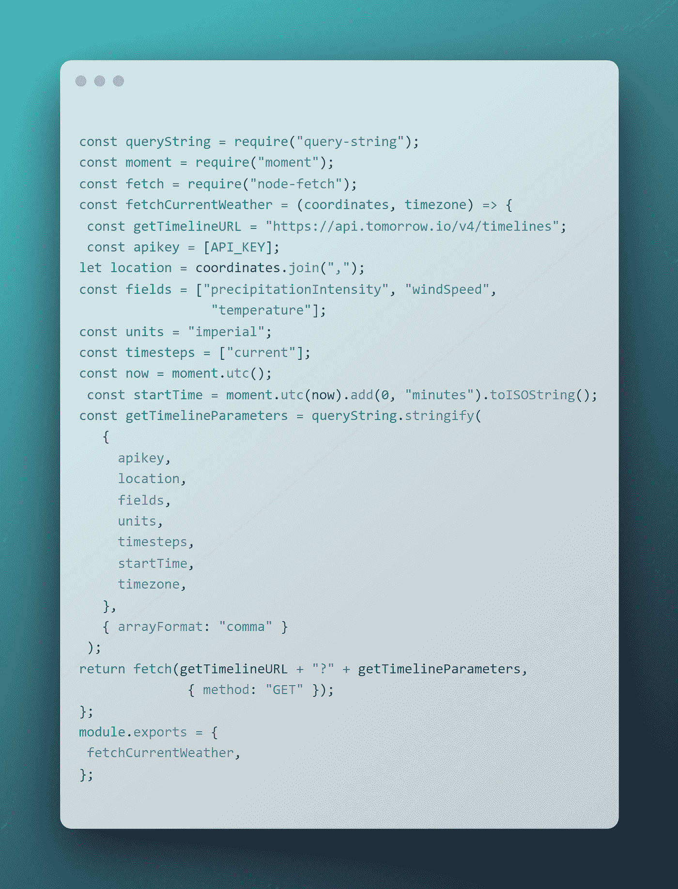
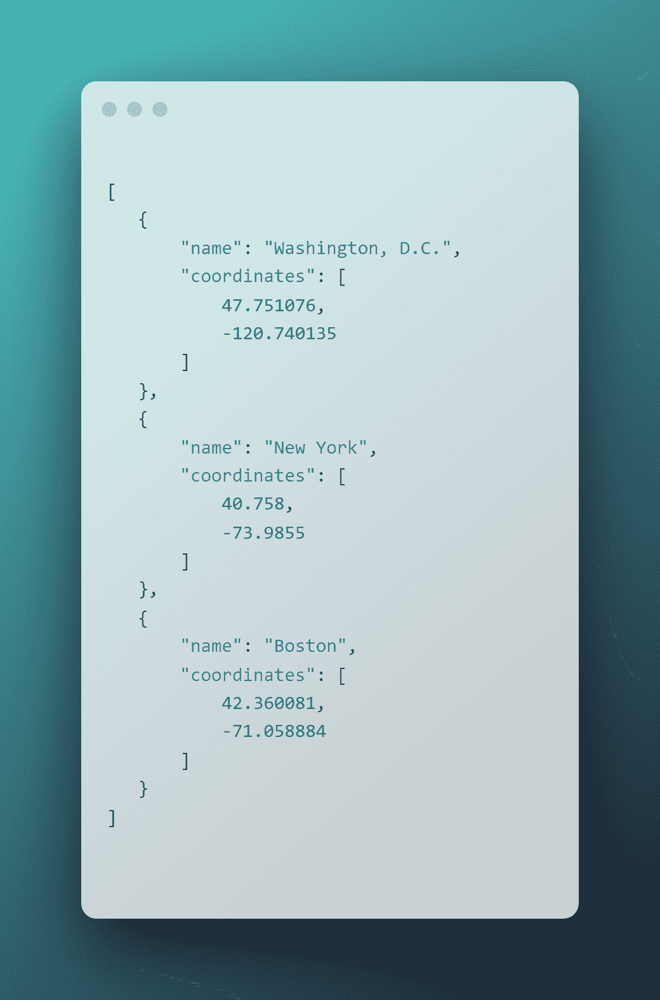
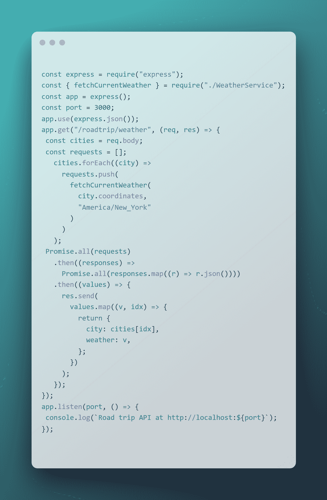

# 天气预报如何影响旅游业

> 原文：<https://levelup.gitconnected.com/how-weather-forecasts-can-impact-tourism-and-travel-1788d81e576c>

## 使用 Node.js 通过天气分析规划更好的公路旅行

[图片](https://unsplash.com/photos/A5rCN8626Ck)由[迪诺·瑞奇穆斯](https://unsplash.com/@dinoreichmuth)拍摄

# 介绍

你有没有尝试过计划一次公路旅行，想知道沿途的天气如何，突然的天气变化是否会毁了你的假期？

在本文中，我们将了解天气分析如何帮助您规划公路旅行，并降低在恶劣天气条件下穿越城市时浪费假期的风险。我们将使用 Express 创建一个 [Node.js](https://nodejs.org/en/) API，从外部来源收集天气数据，并提供一个端点来进行多个位置的天气分析。但首先，让我们看看公路旅行的初步计划。

# 天气和公路旅行

当计划一次公路旅行时，有一个关键因素你应该考虑到:天气。在公路旅行中，天气会影响你的快乐程度。在一个小空间里共度所有时光——好天气可以让它变得很棒，而一路上的坏天气会毁了你期待已久的假期。

旅行时，准确的天气预报对绘制最佳路线非常有帮助。您可以在旅行时使用天气预报 API 来获取您将经过的城市的最新天气情况。

在本教程中，我们将使用 [Tomorrow.io 天气 API](https://www.tomorrow.io/weather-api/) 来获取天气数据。也就是说，在我们开始构建自己的公路旅行 API 之前，让我们先看一下 API。

# 使用天气 API 构建

首先，让我们看看将提供我们在 API 中使用的天气分析的数据源。我们将首先构建一个简单的示例来获取一个位置的当前天气。

📝*这个例子需要一个开发者账户来访问 Tomorrow.io 天气 API 和相应的 API 密钥。*

有了 API 键，让我们开始创建获取天气分析数据的请求。

[*来源*](https://ray.so/?title=++++++&theme=midnight&spacing=64&background=true&darkMode=false&code=Y29uc3QgcXVlcnlTdHJpbmcgPSByZXF1aXJlKCJxdWVyeS1zdHJpbmciKTsKY29uc3QgbW9tZW50ID0gcmVxdWlyZSgibW9tZW50Iik7CmNvbnN0IGZldGNoID0gcmVxdWlyZSgibm9kZS1mZXRjaCIpOwpjb25zdCBmZXRjaEN1cnJlbnRXZWF0aGVyID0gKGNvb3JkaW5hdGVzLCB0aW1lem9uZSkgPT4gewogY29uc3QgZ2V0VGltZWxpbmVVUkwgPSAiaHR0cHM6Ly9hcGkudG9tb3Jyb3cuaW8vdjQvdGltZWxpbmVzIjsKIGNvbnN0IGFwaWtleSA9IFtBUElfS0VZXTsKbGV0IGxvY2F0aW9uID0gY29vcmRpbmF0ZXMuam9pbigiLCIpOwpjb25zdCBmaWVsZHMgPSBbInByZWNpcGl0YXRpb25JbnRlbnNpdHkiLCAid2luZFNwZWVkIiwgICAgICAgCiAgICAgICAgICAgICAgICAgInRlbXBlcmF0dXJlIl07CmNvbnN0IHVuaXRzID0gImltcGVyaWFsIjsKY29uc3QgdGltZXN0ZXBzID0gWyJjdXJyZW50Il07CmNvbnN0IG5vdyA9IG1vbWVudC51dGMoKTsKIGNvbnN0IHN0YXJ0VGltZSA9IG1vbWVudC51dGMobm93KS5hZGQoMCwgIm1pbnV0ZXMiKS50b0lTT1N0cmluZygpOwpjb25zdCBnZXRUaW1lbGluZVBhcmFtZXRlcnMgPSBxdWVyeVN0cmluZy5zdHJpbmdpZnkoCiAgIHsKICAgICBhcGlrZXksCiAgICAgbG9jYXRpb24sCiAgICAgZmllbGRzLAogICAgIHVuaXRzLAogICAgIHRpbWVzdGVwcywKICAgICBzdGFydFRpbWUsCiAgICAgdGltZXpvbmUsCiAgIH0sCiAgIHsgYXJyYXlGb3JtYXQ6ICJjb21tYSIgfQogKTsKcmV0dXJuIGZldGNoKGdldFRpbWVsaW5lVVJMICsgIj8iICsgZ2V0VGltZWxpbmVQYXJhbWV0ZXJzLAogICAgICAgICAgICAgIHsgbWV0aG9kOiAiR0VUIiB9KTsKfTsKbW9kdWxlLmV4cG9ydHMgPSB7CiBmZXRjaEN1cnJlbnRXZWF0aGVyLAp9Owo&language=javascript)

上面的代码将请求输入的坐标和时区的天气数据。请求的数据将包含以下天气字段:温度、风速和降水强度，这些字段将使用英制进行测量。

在下一节中，我们将看到如何在 Node.js API 中导出和使用 fetchCurrentWeather 函数。

# Node.js 公路旅行 API

现在我们已经准备好了请求函数，让我们来看看 Node.js API，它将为您将在公路旅行中访问的多个位置发出请求。

让我们以下面的城市为例。

[*来源*](https://ray.so/?title=++++++&theme=midnight&spacing=64&background=true&darkMode=false&code=WwogICB7CiAgICAgICAibmFtZSI6ICJXYXNoaW5ndG9uLCBELkMuIiwKICAgICAgICJjb29yZGluYXRlcyI6IFsKICAgICAgICAgICA0Ny43NTEwNzYsCiAgICAgICAgICAgLTEyMC43NDAxMzUKICAgICAgIF0KICAgfSwKICAgewogICAgICAgIm5hbWUiOiAiTmV3IFlvcmsiLAogICAgICAgImNvb3JkaW5hdGVzIjogWwogICAgICAgICAgIDQwLjc1OCwKICAgICAgICAgICAtNzMuOTg1NQogICAgICAgXQogICB9LAogICB7CiAgICAgICAibmFtZSI6ICJCb3N0b24iLAogICAgICAgImNvb3JkaW5hdGVzIjogWwogICAgICAgICAgIDQyLjM2MDA4MSwKICAgICAgICAgICAtNzEuMDU4ODg0CiAgICAgICBdCiAgIH0KXQoK&language=json)

下面的代码将使用 fetchCurrentWeather 函数来获取城市数组中每个城市的天气数据。

[*来源*](https://ray.so/?title=++++++&theme=midnight&spacing=64&background=true&darkMode=false&code=Y29uc3QgZXhwcmVzcyA9IHJlcXVpcmUoImV4cHJlc3MiKTsKY29uc3QgeyBmZXRjaEN1cnJlbnRXZWF0aGVyIH0gPSByZXF1aXJlKCIuL1dlYXRoZXJTZXJ2aWNlIik7CmNvbnN0IGFwcCA9IGV4cHJlc3MoKTsKY29uc3QgcG9ydCA9IDMwMDA7CmFwcC51c2UoZXhwcmVzcy5qc29uKCkpOwphcHAuZ2V0KCIvcm9hZHRyaXAvd2VhdGhlciIsIChyZXEsIHJlcykgPT4gewogY29uc3QgY2l0aWVzID0gcmVxLmJvZHk7CiBjb25zdCByZXF1ZXN0cyA9IFtdOwogICBjaXRpZXMuZm9yRWFjaCgoY2l0eSkgPT4KICAgICByZXF1ZXN0cy5wdXNoKAogICAgICAgZmV0Y2hDdXJyZW50V2VhdGhlcigKICAgICAgICAgY2l0eS5jb29yZGluYXRlcywKICAgICAgICAgIkFtZXJpY2EvTmV3X1lvcmsiCiAgICAgICApCiAgICAgKQogICApOwogUHJvbWlzZS5hbGwocmVxdWVzdHMpCiAgIC50aGVuKChyZXNwb25zZXMpID0-CiAgICAgUHJvbWlzZS5hbGwocmVzcG9uc2VzLm1hcCgocikgPT4gci5qc29uKCkpKSkKICAgLnRoZW4oKHZhbHVlcykgPT4gewogICAgIHJlcy5zZW5kKAogICAgICAgdmFsdWVzLm1hcCgodiwgaWR4KSA9PiB7CiAgICAgICAgIHJldHVybiB7CiAgICAgICAgICAgY2l0eTogY2l0aWVzW2lkeF0sCiAgICAgICAgICAgd2VhdGhlcjogdiwKICAgICAgICAgfTsKICAgICAgIH0pCiAgICAgKTsKICAgfSk7Cn0pOwphcHAubGlzdGVuKHBvcnQsICgpID0-IHsKIGNvbnNvbGUubG9nKGBSb2FkIHRyaXAgQVBJIGF0IGh0dHA6Ly9sb2NhbGhvc3Q6JHtwb3J0fWApOwp9KTsKCg&language=coffeescript)

API 调用公路旅行/天气端点后，结果将包含一个数组，每个位置包含一个带有城市和当前天气的对象。weather 对象保存相应城市的当前温度、降雨强度和风速。

[*来源*](https://ray.so/?title=++++++&theme=midnight&spacing=64&background=true&darkMode=false&code=WwogICB7CiAgICAgICAiY2l0eSI6IHsKICAgICAgICAgICAibmFtZSI6ICJXYXNoaW5ndG9uLCBELkMuIiwKICAgICAgICAgICAiY29vcmRpbmF0ZXMiOiBbCiAgICAgICAgICAgICAgIDQ3Ljc1MTA3NiwKICAgICAgICAgICAgICAgLTEyMC43NDAxMzUKICAgICAgICAgICBdCiAgICAgICB9LAogICAgICAgIndlYXRoZXIiOiB7CiAgICAgICAgICAgImRhdGEiOiB7CiAgICAgICAgICAgICAgICJ0aW1lbGluZXMiOiBbCiAgICAgICAgICAgICAgICAgICB7CiAgICAgICAgICAgICAgICAgICAgICAgInRpbWVzdGVwIjogImN1cnJlbnQiLAogICAgICAgICAgICAgICAgICAgICAgICJzdGFydFRpbWUiOiAiMjAyMS0wNi0yNlQwMzoxMDowMC0wNDowMCIsCiAgICAgICAgICAgICAgICAgICAgICAgImVuZFRpbWUiOiAiMjAyMS0wNi0yNlQwMzoxMDowMC0wNDowMCIsCiAgICAgICAgICAgICAgICAgICAgICAgImludGVydmFscyI6IFsKICAgICAgICAgICAgICAgICAgICAgICAgICAgewogICAgICAgICAgICAgICAgICAgICAgICAgICAgICAgInN0YXJ0VGltZSI6ICIyMDIxLTA2LTI2VDAzOjEwOjAwLTA0OjAwIiwKICAgICAgICAgICAgICAgICAgICAgICAgICAgICAgICJ2YWx1ZXMiOiB7CiAgICAgICAgICAgICAgICAgICAgICAgICAgICAgICAgICAgInByZWNpcGl0YXRpb25JbnRlbnNpdHkiOiAwLAogICAgICAgICAgICAgICAgICAgICAgICAgICAgICAgICAgICJ3aW5kU3BlZWQiOiAyLjkzLAogICAgICAgICAgICAgICAgICAgICAgICAgICAgICAgICAgICJ0ZW1wZXJhdHVyZSI6IDc2LjMyCiAgICAgICAgICAgICAgICAgICAgICAgICAgICAgICB9CiAgICAgICAgICAgICAgICAgICAgICAgICAgIH0KICAgICAgICAgICAgICAgICAgICAgICBdCiAgICAgICAgICAgICAgICAgICB9CiAgICAgICAgICAgICAgIF0KICAgICAgICAgICB9CiAgICAgICB9CiAgIH0sCiAgIHsKICAgICAgICJjaXR5IjogewogICAgICAgICAgICJuYW1lIjogIk5ldyBZb3JrIiwKICAgICAgICAgICAiY29vcmRpbmF0ZXMiOiBbCiAgICAgICAgICAgICAgIDQwLjc1OCwKICAgICAgICAgICAgICAgLTczLjk4NTUKICAgICAgICAgICBdCiAgICAgICB9LAogICAgICAgIndlYXRoZXIiOiB7CiAgICAgICAgICAgImRhdGEiOiB7CiAgICAgICAgICAgICAgICJ0aW1lbGluZXMiOiBbCiAgICAgICAgICAgICAgICAgICB7CiAgICAgICAgICAgICAgICAgICAgICAgInRpbWVzdGVwIjogImN1cnJlbnQiLAogICAgICAgICAgICAgICAgICAgICAgICJzdGFydFRpbWUiOiAiMjAyMS0wNi0yNlQwMzoxMDowMC0wNDowMCIsCiAgICAgICAgICAgICAgICAgICAgICAgImVuZFRpbWUiOiAiMjAyMS0wNi0yNlQwMzoxMDowMC0wNDowMCIsCiAgICAgICAgICAgICAgICAgICAgICAgImludGVydmFscyI6IFsKICAgICAgICAgICAgICAgICAgICAgICAgICAgewogICAgICAgICAgICAgICAgICAgICAgICAgICAgICAgInN0YXJ0VGltZSI6ICIyMDIxLTA2LTI2VDAzOjEwOjAwLTA0OjAwIiwKICAgICAgICAgICAgICAgICAgICAgICAgICAgICAgICJ2YWx1ZXMiOiB7CiAgICAgICAgICAgICAgICAgICAgICAgICAgICAgICAgICAgInByZWNpcGl0YXRpb25JbnRlbnNpdHkiOiAwLAogICAgICAgICAgICAgICAgICAgICAgICAgICAgICAgICAgICJ3aW5kU3BlZWQiOiA1Ljg2LAogICAgICAgICAgICAgICAgICAgICAgICAgICAgICAgICAgICJ0ZW1wZXJhdHVyZSI6IDY4LjY3CiAgICAgICAgICAgICAgICAgICAgICAgICAgICAgICB9CiAgICAgICAgICAgICAgICAgICAgICAgICAgIH0KICAgICAgICAgICAgICAgICAgICAgICBdCiAgICAgICAgICAgICAgICAgICB9CiAgICAgICAgICAgICAgIF0KICAgICAgICAgICB9CiAgICAgICB9CiAgIH0sCiAgIHsKICAgICAgICJjaXR5IjogewogICAgICAgICAgICJuYW1lIjogIkJvc3RvbiIsCiAgICAgICAgICAgImNvb3JkaW5hdGVzIjogWwogICAgICAgICAgICAgICA0Mi4zNjAwODEsCiAgICAgICAgICAgICAgIC03MS4wNTg4ODQKICAgICAgICAgICBdCiAgICAgICB9LAogICAgICAgIndlYXRoZXIiOiB7CiAgICAgICAgICAgImRhdGEiOiB7CiAgICAgICAgICAgICAgICJ0aW1lbGluZXMiOiBbCiAgICAgICAgICAgICAgICAgICB7CiAgICAgICAgICAgICAgICAgICAgICAgInRpbWVzdGVwIjogImN1cnJlbnQiLAogICAgICAgICAgICAgICAgICAgICAgICJzdGFydFRpbWUiOiAiMjAyMS0wNi0yNlQwMzoxMDowMC0wNDowMCIsCiAgICAgICAgICAgICAgICAgICAgICAgImVuZFRpbWUiOiAiMjAyMS0wNi0yNlQwMzoxMDowMC0wNDowMCIsCiAgICAgICAgICAgICAgICAgICAgICAgImludGVydmFscyI6IFsKICAgICAgICAgICAgICAgICAgICAgICAgICAgewogICAgICAgICAgICAgICAgICAgICAgICAgICAgICAgInN0YXJ0VGltZSI6ICIyMDIxLTA2LTI2VDAzOjEwOjAwLTA0OjAwIiwKICAgICAgICAgICAgICAgICAgICAgICAgICAgICAgICJ2YWx1ZXMiOiB7CiAgICAgICAgICAgICAgICAgICAgICAgICAgICAgICAgICAgInByZWNpcGl0YXRpb25JbnRlbnNpdHkiOiAwLAogICAgICAgICAgICAgICAgICAgICAgICAgICAgICAgICAgICJ3aW5kU3BlZWQiOiAyLjY0LAogICAgICAgICAgICAgICAgICAgICAgICAgICAgICAgICAgICJ0ZW1wZXJhdHVyZSI6IDYzLjI3CiAgICAgICAgICAgICAgICAgICAgICAgICAgICAgICB9CiAgICAgICAgICAgICAgICAgICAgICAgICAgIH0KICAgICAgICAgICAgICAgICAgICAgICBdCiAgICAgICAgICAgICAgICAgICB9CiAgICAgICAgICAgICAgIF0KICAgICAgICAgICB9CiAgICAgICB9CiAgIH0KXQoK&language=json)

准备好 API 后，接下来的问题就是将它集成到您的应用程序中并使用它。

# 包扎

上面的例子只是一个简单的例子，展示了使用天气 API 的潜力。它可以用于一个宠物项目，在这个项目中，您可以开发自己的 API 供个人使用，或者开发一个更健壮、更专业的应用程序，用于旅游业中的业务。

当前 API 的可能扩展包括其他天气数据功能，如:

*   事件—您可以在其中监控和接收一组特定位置的事件更新
*   地图-在地图上查看天气状况
*   路线-检查特定路线的天气情况

通过添加新的端点来检索每个用例的数据，可以将上述特性集成到 road trip API 中。

公路旅行 API 可用于多种产品:

*   使用[的前端 web 应用反应](https://reactjs.org/)、[角度](https://angular.io/)或 [Vue.js](https://vuejs.org/)
*   移动应用
*   其他后端 web 应用或微服务

编码快乐！

# 分级编码

感谢您成为我们社区的一员！更多内容请参见[升级编码出版物](https://levelup.gitconnected.com/)。
跟随:[推特](https://twitter.com/gitconnected)，[领英](https://www.linkedin.com/company/gitconnected)，[通迅](https://newsletter.levelup.dev/)
**升一级正在改造理工大招聘➡️** [**加入我们的人才集体**](https://jobs.levelup.dev/talent/welcome?referral=true)