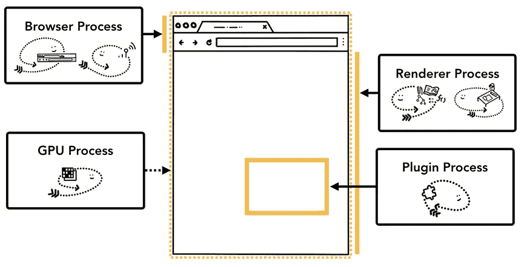
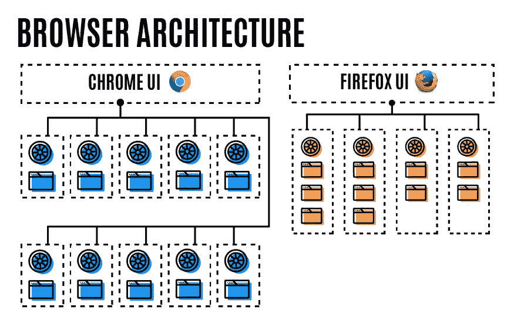
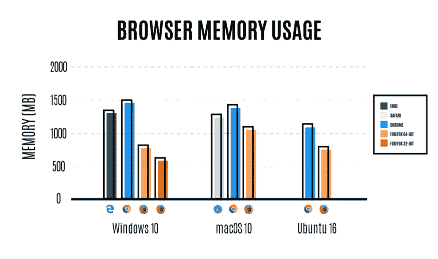

# web 浏览器如何使用进程和线程

> 原文：<https://levelup.gitconnected.com/how-web-browsers-use-processes-and-threads-9f8f8fa23371>

进程可以描述为一个应用程序的执行程序。线程存在于进程中，执行进程程序的任何部分。启动应用程序时，会创建一个进程。程序可能会创建线程来帮助它工作，但这是可选的。

一个进程可以要求操作系统启动另一个进程来运行不同的任务。当这种情况发生时，内存的不同部分被分配给新的进程。如果两个进程需要对话，它们可以通过使用**I**enter**P**process**C**communication(**IPC**)来进行。许多应用程序都是以这种方式工作的，这样，如果一个工作进程没有响应，它可以在不停止运行应用程序不同部分的其他进程的情况下重新启动。

## 哪个过程控制什么？

**浏览器:**控制应用程序，包括地址栏、书签、后退和前进按钮。还处理 web 浏览器中不可见的特权部分，如网络请求和文件访问。

**渲染器:**控制显示网站的标签中的任何内容。

**插件:**控制网站使用的任何插件，例如 flash。

**GPU:** 独立于其他进程处理 GPU 任务。它被分成不同的进程，因为 GPU 处理来自多个应用程序的请求，并将它们绘制在同一个表面上。

不同的进程指向浏览器 UI 的不同部分

# google chrome 如何使用进程和线程

Chrome 有一个多进程架构，每个进程都是多线程的。主要目标是保持主线程(浏览器进程中的“UI”线程)和 IO 线程(每个进程用于处理 IPC 的线程)的响应性。这意味着将任何阻塞 I/O 或其他昂贵的操作卸载到其他线程。

## 线

每个铬工艺都有，

*一个主线程*

*   在浏览器进程中(BrowserThread::UI):更新用户界面
*   在渲染器进程中(闪烁主线程):运行大部分闪烁

一个 IO 线程

*   在浏览器进程中(BrowserThread::IO):处理 IPC 和网络请求
*   在渲染器进程中:处理 IPC。

*多几根专用线。*

*和一个通用线程池。*

# Firefox 如何使用进程和线程

几年前，Mozilla 对 Firefox 开发的未来做出了一个重大决定，这使得在现有浏览器中集成多处理变得更加困难。大约 10 年前，Firefox 与 Internet Explorer 的主要区别在于它对插件和扩展的支持。但是，使浏览器流行的附加功能也使得增加多处理器支持变得困难。因此，Mozilla 致力于从其旧的附加模型过渡到多浏览器 web 扩展支持，同时启动电解项目以创建支持多处理架构的新浏览器版本。

# 比较 Chrome 和 Firefox

Chrome 和 Firefox 现在都支持多线程，但它们支持的方式不同。在 Chrome 中，你打开的每一个标签都有自己的内容处理过程。十个标签，十个流程。一百个标签，一百个流程。这种方法最大限度地提高了性能，但是在内存消耗和电池寿命方面付出了巨大代价。Firefox 没有采用这种方法来解决这个问题，而是默认旋转多达四个内容处理线程。在 Firefox 中，前 4 个标签使用这 4 个进程，其他标签使用这些进程中的线程。流程中的多个选项卡共享内存中已有的浏览器引擎，而不是各自创建自己的引擎。

Chrome 为每个网站实例使用单独的内容进程和引擎，但 Firefox 重用进程和引擎来限制内存使用

Mozilla 声称 Firefox 使用的内存也比其他竞争浏览器少得多，Chrome 在 64 位模式下使用的内存是 Firefox 的 1.77 倍，在 32 位模式下是 2.44 倍。

Firefox 比其他浏览器使用更少的内存

## 为什么 Chrome 变得过热，而 Firefox 却没有

虽然 Firefox 和 Chrome 现在都使用多个进程运行，但 Firefox 做了一些不同的事情，以避免耗尽电脑有限的内存。

默认情况下，Chrome 会为你访问的每个站点创建一个单独的内容流程。在 Chrome 中打开 10 个不同的标签和 10 个网站，你会有 10 个不同的流程。每个进程都有自己的内存——有自己的浏览器引擎实例。Chrome 中一个打开的标签页通常会占用数百兆的内存。Chrome 创建进程的自由方法会导致非常高的内存使用率。

另一方面，Firefox 使用进程的方式更保守，这往往导致 Firefox 使用的内存比 Chrome 少。默认情况下，Firefox 现在为网页内容创建多达 4 个独立的进程。因此，您的前 4 个选项卡都使用这 4 个进程，其他选项卡使用这些进程中的线程运行。流程中的多个选项卡共享内存中已有的浏览器引擎，而不是各自创建自己的引擎。