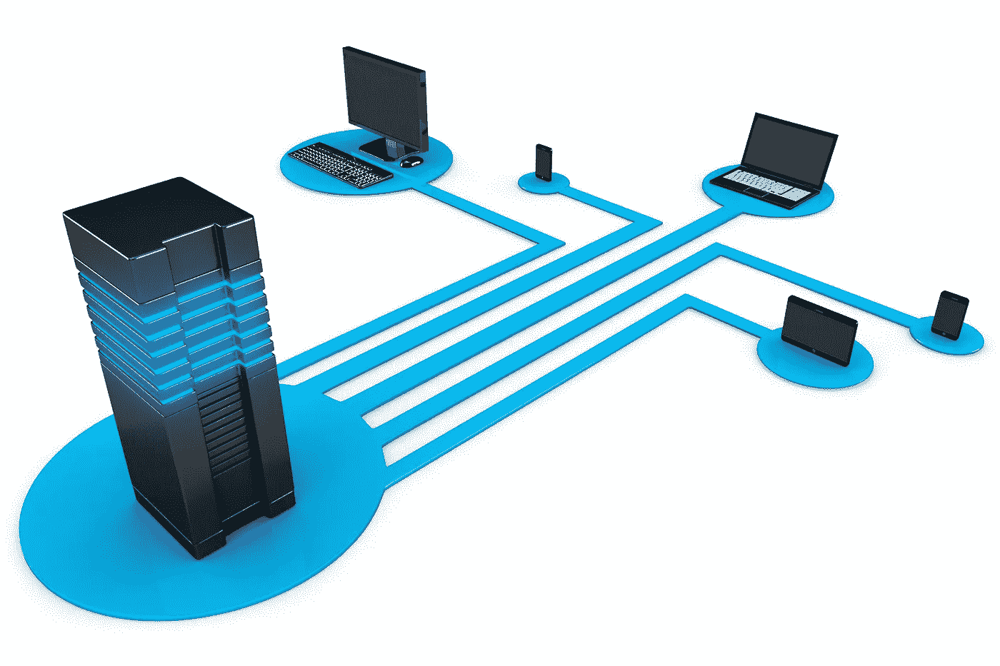

# WhatsApp Messenger 是如何工作的！

> 原文：<https://levelup.gitconnected.com/how-whatsapp-messenger-works-82fc2d2188f8>

资料来源:WhatsApp.com

WhatsApp messenger 在全球拥有超过 20 亿用户，已经成为一个家喻户晓的名字，也是许多人的首选通讯应用。

这些令人印象深刻的数字引出了一个问题:“WhatsApp messenger 是如何工作的？”

# 背景

在一个小网络中，我们可以很容易地互相发送消息，一个完美的例子就是我给我的朋友迪迪发消息。这个过程非常简单，因为我们在同一个网络上，我的设备知道 Dee 设备的 IP 地址。

当我也想给 Luvo，Langa，Fani，Bongi 和 Mampshika 发送同样的消息时，问题就出现了。我们使用不同的网络服务，由于信任问题，他们不会共享他们的 IP 地址。

这些问题和其他没有提到的问题导致了互联网和服务器技术的产生。使用服务器并将其连接到互联网，使我们可以在不在同一个网络上的情况下共享消息，并且服务器处理 IP 地址问题。

资料来源:Sideteam.net

当 Luvo 想要发送消息给 Bongi 时，他的设备通过知道 Bongi 的设备的 IP 地址的服务器来完成，并且只是将消息转发给她。

我们都可以毫不费力地通过服务器相互发送消息，但 WhatsApp 的情况并不那么简单，一些技术问题需要解决。

在 WhatsApp 的场景中，我们都连接到多个横向扩展的消息服务器。

来源:StackOverflow

横向扩展的多个服务器不足以处理 WhatsApp 用户的负载，因此添加了一个负载平衡器。

负载平衡器负责根据各种参数(如服务器上的负载以及用户和服务器的会话)将请求卸载和重定向到不同的服务器。

除了我们需要存储数据的负载，WhatsApp 使用 MnesiaDB 作为其数据库管理系统，Mnesia 非常有利于其在运行时可重新配置的能力。

# 信息流

来源:Twilio.com

该系统以双工连接系统为中心，这意味着消息是双向的。有不同类型的连接，即 TCP，UDP，网络套接字，但最常见的是 TCP。

回到我朋友的例子；Langa 想要向 Fani 发送一条消息，只要 Langa 连接到系统，就会创建一个具有相应进程 id 和[的进程和队列](https://www.programiz.com/dsa/queue)。

图解说明所创建的不同流程

Fani 还连接了一个具有相应进程 ID 的进程，并创建了一个队列。

当这两个过程完成时，条目被输入数据库，显示在 Langa 的设备中发生了什么过程，在 Fani 的设备中发生了什么。

说明流程和设备 ID 的表格

# 如果其中一个设备离线，会发生什么

Fani 收到了来自 Langa 的消息，并立即想将它转发给正在睡觉并且关机的 Mampshika。

已经为 Langa 和 Fani 创建了一个流程，因为它们已连接到系统，但还没有为 Mampshika 创建流程。当 Fani 将消息转发给 Mampshika 时，负责处理 Fani 请求的进程在表中搜索处理 Mampshika 请求的进程，但什么也没有找到。

然后将消息保存在数据库的附加表中。

图示了待处理消息的附加表。

6 个小时后，Mampshika 醒来，连接到 WhatsApp messenger，只要他连接一个具有相应进程 ID 的进程，就会为他创建一个队列，处理他的所有请求。

一旦创建了这个过程，它就开始检查数据库中是否有任何针对 Mampshika 的消息，一旦找到它们，它们就被转发到 Mampshika 的设备。

# 消息确认功能

在整个消息传递马拉松中，我们作为用户看到了三种不同类型的刻度。

*   一次滴答

显示以一个刻度发送的消息的图表

*   灰色的两个勾号

图示通过两个灰色勾号传递的信息

*   蓝色的两个刻度

图示用两个蓝色勾号表示的消息

其中一个消息服务器将为我们的设备寻找合适的连接，消息被发送到相应的设备，这用一个灰色勾号表示。

一旦我们上线，并且为我们的单个设备创建了一个流程，消息由该流程传递，那么这由两个灰色勾号指示。

一旦我们中的任何人阅读了我们的消息，就会向消息服务器发送一个响应，以表示来自该设备的确认。

# 媒体

Mampshika 读了这条消息，懒得回 Fani，决定发一条语音留言。

语音笔记是 mp3 文件的形式，这是非常大的文件，会给我们的消息服务器带来压力。HTTP 服务器用于处理媒体文件请求，如 mp3、mp4、jpg 或任何其他媒体文件。

HTTP 服务器有一个 CDN 或数据库作为它的合作者来处理这项繁重的工作。Mampshika 的设备将忽略已经为轻量级消息请求建立的现有连接，并将媒体文件上传到 HTTP 服务器。

一旦语音提示被上传到 HTTP 服务器，服务器就将一个唯一的散列作为具有媒体类型的消息返回给 Mampshika 的设备。该消息然后通过消息服务器被发送到 Fani 的设备，当 Fani 的设备接收到该消息时，它使用该散列从 HTTP 服务器下载媒体文件。

# 此外，请查看:

 [## Whatsapp 系统设计和聊天消息架构(第 1 部分)

### 在本教程中，我们将讨论 Whatsapp 应用程序的设计。Whatsapp 是一款基于聊天的应用。一旦你…

blog.usejournal.com](https://blog.usejournal.com/whatsapp-system-design-and-chat-messaging-architecture-part-1-29fb4f0d14af)