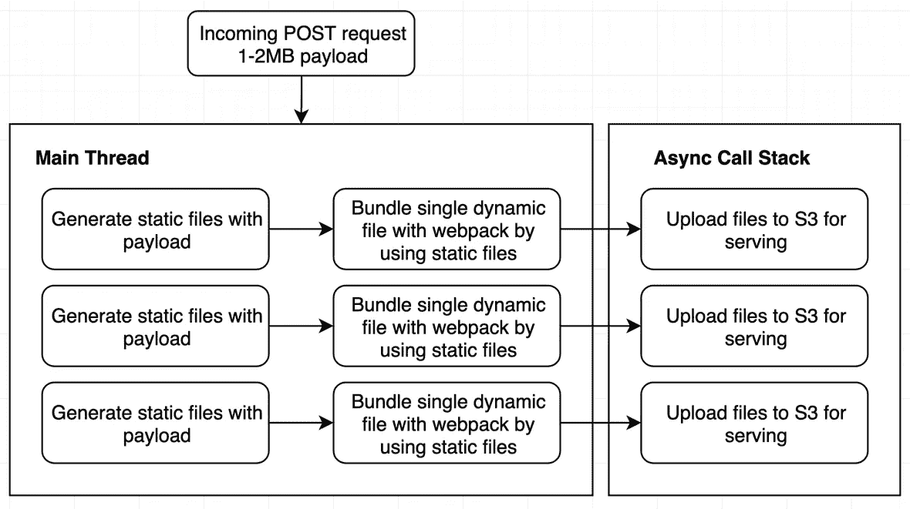
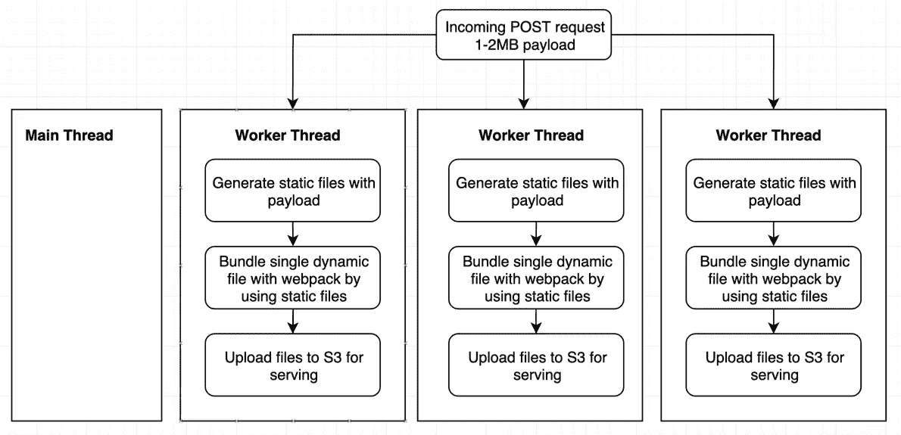
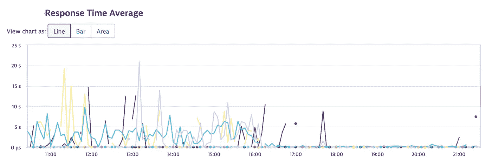

# 工作线程如何提升我的节点应用程序

> 原文：<https://levelup.gitconnected.com/how-worker-threads-boosted-my-node-application-9ff23abb8927>

**worker_threads** 模块用 Node.js **v10.x LTS** 发布，用 **v13.x** 稳定。它支持在 **parallel** 中使用执行 Javascript 的线程(注意，并行性和并发性是相近但不同的概念)*。*当操作需要消耗 **CPU** 时非常有用。

在我的应用程序中，我用动态参数为每个请求生成动态脚本。为了生成脚本，我正在运行一个 npm 命令，带有[**execSync**](https://nodejs.org/api/child_process.html#child_process_child_process_execsync_command_options)**命令**。**我无法使用 async [**exec**](https://nodejs.org/api/child_process.html#child_process_child_process_execsync_command_options) 命令，因为该命令需要遵循创建动态脚本的顺序。**

**让我展示一下变化之前的情况:**

****

**draw.io**

**每当一个请求从其他微服务(AWS Lambda，Node.js)到达我们这边时，上面的过程就会发生。整个过程是同步的，直到第三步，只有上传是异步的。所以最后一步不是线程拦截器。**

**每分钟对生成器服务的传入请求量约为 30。这意味着对于即时生成过程，单个过程应该最多在 2 秒内完成，但我的过程大约是 5-6 秒。因此，应用程序会锁定主线程，直到活动操作结束。这有时会将传入的生成过程延迟 1 分钟。**

**那么，在**工作线程**实现之后有什么变化呢？**

****

**draw.io**

**在代码中，工作线程的示例如下所示。**

**在`index.js`文件中:**

```
// index.js
const { Worker } = require('worker_threads');const workerData = {                
  write: { fileName: 'write.txt', filePath: './' },
  read: { fileName: 'read.json', filePath: './' },
  hash: Math.random(),            
};new Worker('./worker.js', { workerData });
```

**在我们的`worker.js`文件中:**

```
// worker.js
const { readFileSync, appendFileSync, unlinkSync, existsSync } = require('fs');
const { resolve } = require('path');
const { workerData: { read, write, hash } } = require('worker_threads');console.log('Process triggered.');
console.time('Execution time');/**
 * @return {Promise}
 */
const sleep = async function () {
    return new Promise(resolve => {
        setTimeout(resolve, Math.floor(Math.random() * 5000) + 999);
    });
};(async () => {
    // Act like process takes time
    await sleep(); const writePath = resolve(write.filePath, write.fileName + '-' + hash);
    const readPath = resolve(read.filePath, read.fileName);
    const json = JSON.parse(readFileSync(readPath).toString('utf-8')); // Remove the file before writing
    if (existsSync(writePath)) {
        unlinkSync(writePath);
    } json.forEach(item => {
        appendFileSync(writePath, JSON.stringify(item) + '\n\n\n');
    }); console.log('Process end.');
    console.timeEnd('Execution time');
})();
```

**有了上面的实现，应用程序的主线程不再忙于生成过程。每个进程都是独立的，不会成为传入进程的阻塞程序。这极大地减少了生成过程中的延迟，但是 CPU 的使用保持不变，因为工人也消耗了大量的 CPU。**

**因为它使生成速度更快，它还为我提供了其他好处:**

*   *****读写文件的过程快了很多*** 🚀**

**因为主线程总是很忙，所以传入的读/写请求被延迟，直到它可以在执行队列中找到一个空位置。但是现在，它马上就发生了。**

*   *****反应时间急剧下降*** 📉**

**对于通过 express 提供的静态文件，应用程序的响应时间大约为 3-5 秒，有时需要 10 秒钟才能被缓存。我花了很长时间才意识到那里发生了什么。用 **express** 服务静态文件真的很快，除非你有一个消耗 CPU 和非常繁忙的线程消耗的系统。静态文件由节点的[***readFile***](https://nodejs.org/api/fs.html#fs_fs_readfilesync_path_options)功能提供。**

****

**来自 dynatrace 的指标**

**指标显示响应时间在 16:00 之后减少了(在部署新版本之后)。现在，大约是**100-200 毫秒**，这是完美的。**

**我喜欢实现 **worker_threads** 并看到完美的结果🕺.**

**我创建了一个示例应用程序来模拟它在代码上的样子。**

**[](https://github.com/tugayilik/node-worker-threads) [## tugayilik/节点-工作线程

### 节点的 worker_threads 模块的示例。为 tugayilik/node-worker-threads 开发做出贡献，创建一个…

github.com](https://github.com/tugayilik/node-worker-threads) 

希望你读的时候喜欢！✊

> 请随时在 linkedin 上联系我。**