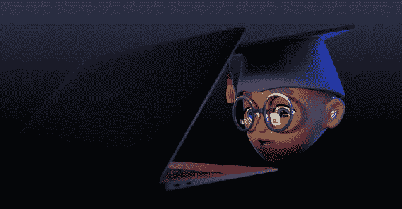

# 如何参加 2021 年 WWDC 苹果 Swift 编程挑战赛

> 原文：<https://levelup.gitconnected.com/how-you-can-enter-apples-swift-programming-challenge-at-wwdc-2021-ddc11aea9ab4>

## Swift 学生挑战赛在 WWDC 2021 再次举行。你怎么能进去？为什么还要费神进去呢？

苹果全球开发者大会是苹果公司每年在圣何塞举办的开发者科技大会。去年，由于疫情，苹果在网上举办了这个活动。今年的活动也将在网上举行。

在 [Unsplash](https://unsplash.com?utm_source=medium&utm_medium=referral) 上由[米米·蒂安](https://unsplash.com/@mimithian?utm_source=medium&utm_medium=referral)拍摄的照片

在这次活动中，苹果推出了许多软件，无论是 iOS、iPadOS 还是 macOS。活动中也有很多挑战和比赛，其中之一是为正在学习 swift 的学生举办的 Swift 学生挑战赛。你是一个敏捷的学生吗？现在，也许是你参加活动并赢得一些奖品的时候了。请注意，此次活动的主要收获不是奖品，而是学习。

一个学生的记忆。信用:[苹果](https://developer.apple.com/wwdc21/swift-student-challenge/)

# 您如何加入 Swift 学生挑战赛

这项挑战只针对学习 Swift 编程语言的学生。

学生必须使用 Swift 语言创建一个互动场景。场景一定要在三分钟内体验完。候选人还需要回答一些问题，并写关于他们的软件的文档。苹果鼓励学生发挥创造力，开发自己喜欢的应用。

照片由[JESHOOTS.COM](https://unsplash.com/@jeshoots?utm_source=medium&utm_medium=referral)在 [Unsplash](https://unsplash.com?utm_source=medium&utm_medium=referral) 上拍摄

获胜者可以赢得一份苹果赠品、一套定制的 pin 码，以及一年的苹果开发者计划会员资格。

# 谁可以申请？

如果你想申请挑战，你必须满足以下要求:

*   年满 13 岁或 13 岁以上，或相关司法管辖区的同等最低年龄，例如欧盟为 16 岁。
*   免费在苹果注册成为苹果开发者或者成为苹果开发者计划的成员；和

此外，想要申请的学生必须满足以下条件之一:

*   在经认可的学术机构或官方的同等家庭学校注册；
*   参加 STEM 组织的教育课程；
*   加入苹果开发者学院；或者
*   在过去 6 个月内高中毕业或同等学历，正在等待被认可的学术机构录取或已被认可的学术机构录取。

# 你能创造什么？

如前所述，学生需要使用 Swift 语言创建一个互动场景。该应用程序必须是交互式的，学生可以使用 Swift playground 应用程序中的模板并对其进行修改。他们可以将音频、图形和声音添加到模板中，使其成为自己的模板。

照片由 [Unsplash](https://unsplash.com?utm_source=medium&utm_medium=referral) 上的 [Niclas Illg](https://unsplash.com/@nicklbaert?utm_source=medium&utm_medium=referral)

你可以包含第三方代码，但是你需要解释为什么在你的文档中使用它。

苹果表示，所有学生必须确保他们的应用程序运行在以下平台上:

*   [ipad OS 14 . 4 . 2 上的 Swift Playgrounds 3.4.1](https://apps.apple.com/us/app/swift-playgrounds/id908519492)
*   macOS 11.2.3 上的 Swift Playgrounds 3.4.1
*   [MAC OS 11 . 2 . 3 上的 Xcode 12.4](https://apps.apple.com/us/app/xcode/id497799835?mt=12)
*   如果它在 iPad 上运行，它必须针对他们的显示器进行优化。

此外，学生必须用英语制作所有内容。最终的应用程序或软件必须是 zip 格式，大小不超过 25 兆字节。

最后，学生必须确保他们的应用程序离线运行。

# 日期。

在 [Unsplash](https://unsplash.com?utm_source=medium&utm_medium=referral) 上由 [Waldemar Brandt](https://unsplash.com/@waldemarbrandt67w?utm_source=medium&utm_medium=referral) 拍摄的照片

当我写这篇文章的时候，投稿已经开放了。它开始于 3 月 30 日星期二。

提交的截止日期将是太平洋时间 4 月 18 日星期日晚上 11:59。

申请人可以在 2021 年 6 月 1 日(星期二)下班前查看他们的状态。

# 我为什么要以 Swift 学生的身份参加这个活动？

好吧，这个挑战不是给使用 Unity 的游戏开发者的，我本来可以参加的。

挑战让我们像人类一样学习。把我们自己从舒适区推出去做一些我们从未梦想过的事情是我们学习的地方。

照片由[Olav Ahrens rtne](https://unsplash.com/@olav_ahrens?utm_source=medium&utm_medium=referral)在 [Unsplash](https://unsplash.com?utm_source=medium&utm_medium=referral) 上拍摄

作为开发人员，学习是我们不变的职责。作为一名开发人员，参加这个挑战将有助于你，它将使你的学习过程更加困难，但从长远来看，它将使你受益。

我想我听到你说:“但我只是一个新手”。

其他高级程序员都是从新手开始的。你有没有想过，如果当他们学完了所有的基础知识，看完了地球上的每一个教程，他们都决定不再构建项目，那会怎么样？

我打赌他们都还是新手。编程的基础是压倒性的，在你开始构建项目之前，你不需要知道所有的基础。你需要的只是一两个基础，然后开始构建。当我们构建项目时，我们是主动学习，而不是看教程时被动学习。

我鼓励每一位符合要求的 Swift 学生加入这项挑战。虽然你可能不会赢，但这并不是世界末日。作为人类，我们从失败中吸取教训。实际上，去年我也在一次非洲运动会上失败了。我从失败中学到了很多东西，但那是以后的事了。

马丁·马格纳米尔在 [Unsplash](https://unsplash.com?utm_source=medium&utm_medium=referral) 上的照片

> “我没有失败。我刚刚发现了一万种行不通的方法。”
> 
> ―托马斯·A·爱迪生

所以不要担心，Hakuna Matata，不管你去学习的结果如何。

只要以开发者的身份加入挑战，你会学到很多东西。

如果你想了解更多关于 WWDC 2021 苹果 Swift 挑战赛的信息，请点击这里访问他们的页面 [**。**](https://developer.apple.com/wwdc21/swift-student-challenge/)

如果你喜欢这篇文章，你可以给我 50 次掌声👏👏👏，如果你对技术和软件开发感兴趣，也可以关注我的 [***媒体***](https://konaduakwasiakuoko.medium.com/) 和社交媒体。您可以关注我的[***Twitter***](https://twitter.com/akuoko_konadu)因为我们将讨论编码和一般的技术世界，所以我的 DM 一直是开放的。加入我的[***YouTube***](https://www.youtube.com/channel/UCYKFy3oPn2b6gbjAzmgNgJg)让我们一起做一些编码。祝你有愉快的一天。下一次快乐编码。

如果你希望有人为你写科技文章，我很乐意为你写一篇低至**[**5 RR**](https://www.fiverr.com/share/8Kq9Br)**5 美元**的文章。******

****如果你喜欢这篇文章，你可以看看我的其他文章，****

1.  ****如果所有这些关于 M1 MacBook 的传言都是真的，那么其他笔记本电脑就惨了。****
2.  ****[开源和 Linux 进入太空，推动了人类想象力的极限。](/open-source-and-linux-makes-it-to-space-pushing-the-limits-of-human-imagination-a05e032aa884)****
3.  ****[程序员，不要呆在你的舒适区里。](/programmers-dont-stay-in-your-comfort-zone-1b10e465b8cb)****
4.  ****[激动人心的功能。如何在 Unity 中创建相机抖动效果？](https://konaduakwasiakuoko.medium.com/how-to-create-a-camera-shake-effect-in-unity-e676e974a8f1)****
5.  ****[苹果，怎么这么久。重新设计的 14 英寸和 16 英寸 MacBook Pro，2021 年。](/apple-what-took-you-so-long-rumors-of-redesigned-14-inch-and-16-inch-macbook-pros-2021-59b8e89ff53f)****