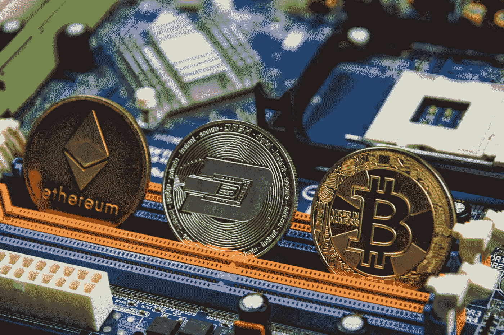

# 你如何从使用 NFTs 来管理你的职业中获益

> 原文：<https://levelup.gitconnected.com/how-you-could-benefit-from-using-nfts-to-manage-your-career-e7cf0f8a6372>

## 使用区块链技术促进您的工作和教育

照片由 Unsplash 上的 this engineering RAEng 拍摄

和大多数人一样，我喜欢看电视上《辛普森一家》的旧集——这部卡通片把我带回了我的青少年时代，即使在今天，它仍然像以前一样有趣和有先见之明。

毫无疑问，我最喜欢的场景发生在这一集，荷马去了小丑学院，并试图在小丑克鲁斯蒂的指导下[骑一辆小自行车](https://youtu.be/opzaBVwHy_I)。如果你需要笑声，我强烈建议你看看这个短片。

出于某种原因，1995 年发生的一件更令人心酸的事情留在了我的记忆中；巴特出卖灵魂的那部。

最近，当我对区块链技术，尤其是 NFT 的扩散产生兴趣时，我想到了这个问题。2021 年 2 月，当艺术家 Beeple 在克里斯蒂拍卖行以 6900 万美元的价格出售他的 [NFT 时——这是一个代表 5000 幅图像的数字拼贴画的象征——许多创作者和愤世嫉俗的公众成员开始对 NFTs 感兴趣。大多数人都在试图找出它们是什么。其他人则好奇它们是如何被创造和货币化的。](/what-makes-a-digital-image-file-worth-69-million-4d49a9eabcb7)

我想了解更多，并决定最好的方法是铸造我自己的 NFT 并出售。鉴于 NFT 本质上是一个独一无二且不可改变的数字代币，代表着某人想要拥有的其他东西，我考虑铸造一个代币，在概念上代表我自己的灵魂。我会把它卖给出价最高的人——这似乎是艺术表达的一种适当的前卫姿态。

经过进一步的思考，在巴特把“巴特的灵魂”写在一张纸上并以 5 美元的价格卖给他的朋友米尔豪斯之后，我反思了他的经历，决定不把我的灵魂作为 NFT 卖掉。

相反，我创造了一个代表数码照片的 NFT。不那么激动人心，也不那么好卖(至少到目前为止)。

# NFTs——不仅仅是一种时尚，不仅仅是一个泡沫

在 Beeple 出售后不久，杰克·多西的第一条推文以 290 万美元的价格作为 NFT 售出。对 [NBA TopShot](https://nbatopshot.com) (基于职业篮球瞬间的 NFT 视频收藏品)的兴趣帮助它在 202 年 2 月达到超过[10 亿美元的市值](https://sports.yahoo.com/nba-top-shot-wild-1-095529854.html) 1。这些数字表明投资者(或投机者)已经涌入。

与此同时(这并不奇怪),现存的非正规金融机构的数量也在增加。《福布斯》最近报道称，随着名人和业余爱好者都争相创建和销售自己的 NFT，NFT 的总价值在 2021 年增长了 1785%。

许多人认为，这些数字和行为是 NFTs 存在投资泡沫的明显迹象。

在我继续深入理解非功能性翻译的过程中，我一直热衷于探索除了在艺术环境中如何使用它们。看起来似乎有许多潜在的应用程序为那些创造它们的人和购买它们的人提供了真正的好处，而不仅仅是投机性地赚点小钱。下面我就分享其中的一些。

我没有深入讨论技术细节，因为在许多情况下，这些概念仍在区块链社区中讨论。显而易见的是，未来我们中的许多人都可以利用 NFT 来获得实实在在的好处。

# 技术基础

已经承认技术细节超出了本文的范围，对 NFTs 的基本理解将是有用的。以下是基本原则:

1.  NFT(代表不可替换令牌)是一种独特的、不可变的数字化和加密令牌，它是使用数字区块链技术创建(铸造)和存储的。
2.  令牌可以代表各种数字媒体，包括音频、图像、文本或视频文件以及在区块链本身上执行的计算机代码。
3.  代币可以通过经常使用加密货币处理的交易进行买卖(例如区块链以太坊[上的 ETH，那里有许多 NFT，包括我自己的)。](https://podcasts.apple.com/gb/podcast/504-vitalik-buterin-creator-ethereum-on-understanding/id863897795?i=1000512237199)
4.  令牌存储在所有者的数字钱包中，它没有物理形式。

NFT 是一种在 NFT 的创建者和其后的所有者之间建立和执行“智能合同”的手段。这些合同以代码的形式存在于区块链，并使某些合同条款能够自动执行。

这种合同是去中心化自治组织([称为 DAO](https://www.investopedia.com/tech/what-dao/) )运作的组成部分——实际上是一种商业关系，其完整性通过代码自动实施，无需监管机构或当局的参与。

一个简单的例子可能有所帮助:

让我们假设我卖给你一幅 NFT，它代表了我创作并拥有的一幅数字图像。作为 NFT 的一部分，存在包含许多条款的智能合同:

*   当你同意从我这里买下它，商定的价格从你的加密钱包转移到我的，NFT 从我的移动到你的。
*   除了你购买 NFT，在完成销售后，我提供你一个图像的数字副本，以供你使用，分发和复制你认为合适的。
*   每次我使用源图像创建一个打印，你作为所有者从我这里收到 1 美元的佣金。
*   每次 NFT 被出售并转让给新的所有者(在你之后)，我将从销售收入中获得 5%的版税。

智能合约在 NFT 铸造时创建，并将由区块链上的计算机代码自动执行。作为创作者，我不需要跟踪它的未来所有权来索取我的版税。你没有必要向我索要佣金，因为它们也是自动结算的。

像以太坊一样，智能合约和 Dao 是区块链提供的众多好处之一。它们内置的条款(通过区块链的计算机代码自动执行和实施)允许在没有任何集中监督或控制的情况下应用潜在的复杂业务逻辑。

这里有几个非功能性翻译在未来可能的应用方式，让我们在工作和更广泛的生活中受益，而不仅仅是在艺术领域。

# 销售与你未来职业和收入相对应的 NFT

*如果你可以出售自己未来职业生涯的股份，向“投资者”提供你潜在成功的股份作为前期投资，怎么样？*

理论上，无论是在你职业生涯的开始，还是在一个新项目的启动阶段，都可以铸造一个 NFT，向买家(或多个非功能性金融工具的买家)提供你未来收入的一定比例，作为他们投资的回报。作为 NFT 的创造者，你可以有效地从那些购买你的 NFT 的人那里提前筹集种子资金，这可以实现项目的启动成本。

一份聪明的合同将强制执行与 NFT 相关的条款，确保你的 NFT 持有者在你的努力得到回报时得到报酬。如果你的职业生涯在以后几年里蒸蒸日上，你的 NFT 的价值可能会增加，这意味着它可以溢价卖给新的买家。

从概念上讲，这种 NFT 模式类似于出售自己的股票，基于未来收益的前景，就像一家公司从风险资本家那里寻求资金或在股票交易所上市一样。智能合同为买方提供了结构和保证。使用 NFT 有助于创作者根据他们未来的潜力或他们项目的潜力推销自己，而不是诉诸模糊或空洞的承诺。

这种模式将为创始人提供一种融资方式，而不必求助于众筹或 kickstarter 模式。代表个人未来或项目的 NFT 类似于根据他们的潜力发行期货合约。

这一想法似乎特别为有才华的人提供了巨大的潜力，这些人在职业生涯开始时，经验很少，因此在获得资金或有人给他们工作方面缺乏可信度。通过提供 NFT，它为他们提供了一种将自己作为商业机会的方式——智能合约使投资者对从投资中获得回报的可能性感到放心。

照片由 Unsplash 网站上的 Muhammad Raufan Yusup 拍摄

# NFT 证明你的创作或想法的所有权

*如果你可以证明自己是一个想法或技术概念的创始人，而不必经历冗长、昂贵和耗时的版权申请或知识产权注册过程，会怎么样？*

可以铸造一个 NFT 来无可辩驳地记录和记录时间中的瞬间，并附上与该瞬间相关的证据，永久保存在区块链中。这就是前面提到的[杰克·多西的推特](https://twitter.com/jack/status/20?s=20)所实现的基本目标。推文本身的内容没有它所代表的内容重要——一个新的社交媒体平台诞生的时刻，它是如何被使用的，由谁使用的。

区块链记录是不可变的——它们不能被更改，分布式节点维护彼此的确证记录，以保持网络的完整性。我想，随着时间的推移，我们将见证第一批来自区块链的数字证据能够伸张正义的法律案件，毫无疑问地证明发生了什么，什么时候发生的。

在网上创建和发布内容，以及在互联网上自由分享信息和想法从未像现在这样容易。不可避免的是，同样的基础设施也使得想法容易被窃取，内容容易被剽窃、篡改和操纵。区块链允许有价值的信息被铸造成 NFT，并使其价值得到保护和存储，无论其意义是技术、文化还是与时间敏感相关。

# 非金融交易和智能合约可能会彻底改变我们的薪酬方式

我们大多数人都在某个时候签署了一份标准的雇佣合同或为客户提供服务的条款。这类合同规定了雇佣的基本条款以及我们将如何获得报酬。正如我们在职业生涯早期所了解到的，不是所有团队成员都对项目的成功做出了同等的贡献，即使大多数人做着相似的工作，获得了相似的报酬。

如果一份智能合同根据可衡量的标准、表现和效果来决定你的薪酬，会怎么样？

*   工程师可以根据他们编写的最终产品代码行数获得报酬。
*   营销人员可以根据他们在社交媒体上发布的吸引最多参与的帖子或根据他们制作的引发最多销售的广告获得报酬。
*   产品设计师可以根据他们构思和设计的吸引最积极反馈的功能获得报酬。

在最近的一次[播客采访](https://podcasts.apple.com/gb/podcast/future-of-cities-work-and-office-space-with-dror-poleg/id1498802610?i=1000517221750)中， [Scott Galloway](https://medium.com/u/a76508074bec?source=post_page-----e7cf0f8a6372--------------------------------) 和他的嘉宾 Dror Poleg 讨论了这个概念。

基于绩效的薪酬不一定适用于所有员工或所有工作。这将需要深思熟虑的设计，使其公平和实用——但它可以成为激励更多角色表现的一种手段。这将通过每个员工的 NFT 在其智能合同中自动奖励他们模范和可衡量的表现来实现。

销售人员通常获得基本工资，大部分收入作为销售佣金支付——基于他们的工作表现——销售。在一个竞争越来越激烈的世界里，人们应该有机会通过应用适用于其他工作的相同原则来提升自己，这似乎是合乎逻辑的——NFTs 可能是实现这一点的一种手段。

Unsplash 上的 [Bermix 工作室](https://unsplash.com/@bermixstudio?utm_source=unsplash&utm_medium=referral&utm_content=creditCopyText)拍摄的照片

# 能够奖励好主意的非功能性测试

如果机器算法可以用来记录会议和分析讨论，以便将来与业务成果进行比较，会怎么样？这些算法可以(从理论上)注意到谁负责产生收入或削减成本的具体想法。

通过将想法与每个贡献者拥有的 NFT 联系起来，这将有可能奖励那些想法导致成功结果的人，鼓励人们为会议做出深思熟虑的贡献，而不是浪费时间。

这看起来像是奥威尔乌托邦中的一个想法，设想对话被监听和分析。鉴于这种情况已经在 Alexa、Siri 和许多其他自主代理中发生，这些代理正在监听我们的对话并利用语音数据，这似乎是一种重新平衡和利用现有技术为我们造福的好方法。

NFTs 可能是我们作为个人从语音数据和分析中受益的方式，就像亚马逊和苹果这样的公司已经做的那样。

# NFTs 促进受教育机会

当我进入工作的世界时，我天真而又有些固执地认为我已经完成了正规教育，不需要再学习任何东西。

许多人遵循类似的教育路线——我们从 5 岁左右开始，积累通用技能，并逐渐专业化，直到成年。然后，拿着学位、文凭和证书，我们开始在世界上寻找一个角色，这个角色将为我们赌上的专业技能买单。

脱离传统教育的趋势似乎越来越明显——新冠肺炎强调，对于学习各种科目的人来说，在线学习是一种可行的替代方式。它为分布式学习和认证提供了便利。它为更多的人提供了更有效的学习途径。此外，这种模式可以更快地灵活调整，跟上新技术发展和技能缺口出现的速度。

*如果我们不承诺进行为期四年的专业学习来获得学位，而是能够购买一个 NFT，让我们无限制地访问一个或多个世界上最伟大的教育机构提供的在线课程，会怎么样？*

这种访问可以通过 NFT 进行管理，当不再需要令牌时，可以将其出售给另一个需要的人。可以发行由剑桥大学、斯坦福大学或普林斯顿大学发行的 NFT，使得代币持有者能够进入由他们的教授给他们的课程。学习者可以获得他们需要的教育，以满足他们的学习目标并促进他们选择的职业。当不再需要 NFT 时，它可以被卖掉。

教学质量和所传授知识的适用性也可能对其他人愿意为代币支付的价格产生积极影响。这将激励大学和其他教育提供者提高他们提供的质量，因为他们最终将从 NFT 价格的上涨中受益。反过来，学习者将从更好的教学和相应的 NFT 教育市场中受益。

# 关键外卖

如此多的关于 NFTs 的媒体报道集中在为高姿态代币支付的钱上。这反映了媒体对比特币等加密货币的报道，在这些报道中，同样的陈词滥调被一遍又一遍地重复，重点是其波动性和能源使用。

因此，在这两种情况下，许多不积极参与 crypto 或 NFT 的人对它们持怀疑或困惑的态度也就不足为奇了。

虽然我上面分享的许多想法在这个阶段还没有被证实，但它们是 NFTs 改变我们生活和工作方式的合法和现实的潜在用例。

保护知识产权、支付员工薪酬或促进受教育机会的传统方式不一定会被使用 NFTs 取代，就像美元不会被比特币取代一样(至少不会马上被取代)。

如果我们认为 NFTs 纯粹是炒作，是短期投资泡沫，或者只是被古怪的艺术家以虚高的价格出售其作品所利用的技术时尚，那么我们就有可能否认自己获得了一些真正的好处。

时间会告诉我们这些用途会有多广泛，但至少可以说潜力是耐人寻味的。

如果你喜欢阅读这样的故事，并且愿意支持 Medium 上的作家，考虑注册成为 Medium 会员。一个月 5 美元，给你无限的故事。如果你注册使用我的链接，我会赚一小笔佣金。

 [## 阅读托比·黑兹伍德(以及媒体上成千上万的其他作家)的每一个故事

### 作为一个媒体会员，你的会员费的一部分会给你阅读的作家，你可以完全接触到每一个故事…

tobyhazlewood.medium.com](https://tobyhazlewood.medium.com/membership) 

注:*本文仅供参考。不应将其视为财务或法律建议。在做任何重大财务决定之前，先咨询财务专家。*

## [如果你喜欢这篇文章，我希望你能加入我的电子邮件列表。](http://bit.ly/TobyHazlewoodList)