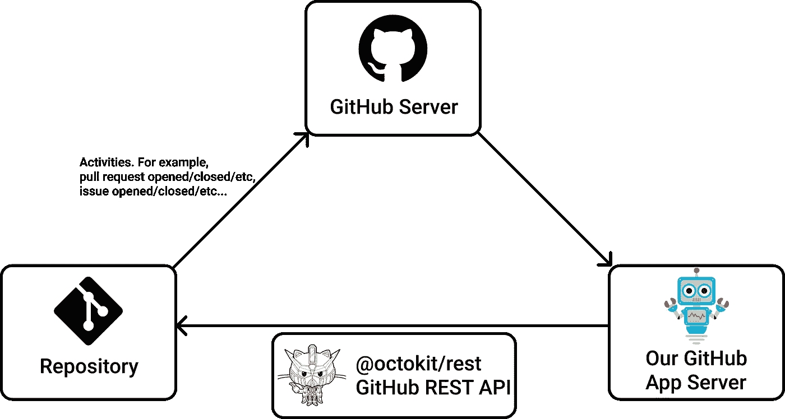
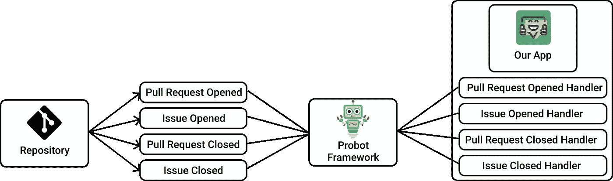
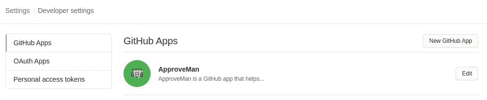
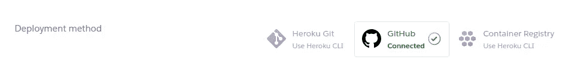
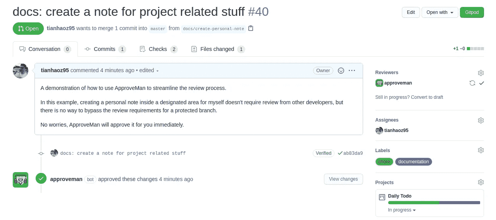

# 如何构建 GitHub 应用程序来简化您的工作流程

> 原文：<https://levelup.gitconnected.com/howto-build-a-github-app-to-streamline-your-workflow-edc88d0bb99e>

## 使您的存储库端到端自动化

马克-奥利维尔·乔多因在 [Unsplash](https://unsplash.com/s/photos/fast?utm_source=unsplash&utm_medium=referral&utm_content=creditCopyText) 上的照片

# GitHub 自动化基础设施正在升级

最近几个月，GitHub 推出了许多自动化工具。

比如自动化依赖管理工具 Dependabot(通过收购)，GitHub 的原生 CI/CD 平台 GitHub Action，漏洞发现自动化工具 code scanning。

这对独立的开源贡献者来说是非常好的，因为我们大多数人都负担不起 DevOps 团队来维护附带项目。

# 我们仍然需要填补通用工具无法覆盖的空白

然而，每个项目都有不同的形式，所以通用工具只能覆盖工作流的一部分。

幸运的是，我们开发人员不会让股票解决方案限制我们。

如果没有符合需求的自动化，那么就构建一个。

# 构建 GitHub 自动化应用程序的步骤

我将通过构建一个 GitHub 应用程序来演示如何自动化您的工作流，我构建了一个 GitHub 应用程序来自动化我的工作流。

以下是我开发这款应用的背景故事:

我是[受保护分支模式](https://docs.github.com/en/github/administering-a-repository/about-protected-branches)的粉丝，这是 GitHub 的一个特性，它允许存储库所有者定义硬拉请求合并策略。

我将我的存储库定义为，只有当所有持续集成测试都通过，并且至少有一个评审者批准时，才允许拉请求合并。

然而，当开发人员不得不要求其他开发人员批准实验项目或面向内部的文档中琐碎的/与生产无关的更改时，这变得很痛苦，所以我想要一个应用程序，让我定义什么类型的拉请求应该被自动批准并批准它。

例如，我可以定义任何看起来像`playground/${github_username}/**`的变化都是微不足道的。定义这个规则后，我在`playground/tianhaoz95`中的所有更改都将被自动批准，因为我的 GitHub 用户名是`tianhaoz95`。

我们将使用上面提到的自动化作为一个例子来说明如何构建您的自动化。

## 第 0 步:GitHub 应用程序 101

要开始构建 GitHub 应用程序，我们首先需要了解 GitHub 应用程序的高级机制。

GitHub 应用程序通过 Webhooks 监听一组存储库活动(要了解关于 Webhooks 的更多信息，请参见[文档](https://developer.github.com/webhooks/))，并根据偏好使用 GitHub REST 或 GraphQL APIs 对活动做出反应，如下图所示:

贷方:[审批人知识库](https://github.com/tianhaoz95/approveman)

如果我们将想要构建的应用程序放入上图中，存储库活动将是任何拉式请求创建操作，包括“打开”和“重新打开”，反应将是扫描修改的文件，并在适用的情况下发布批准的审核。

## 步骤 1:初始化 Probot 应用程序

使用普通的 Webhooks 可能会很复杂，但幸运的是，一群优秀的人构建了一个框架 Probot，为我们抽象出从 Webhook 事件到处理程序的映射。

下面是 Probot 工作方式的一个过于简化的版本:

信用:[审批人仓库](https://github.com/tianhaoz95/approveman)

Probot 让我们定义一组要监听的事件和一组当这些事件发生时应该执行的处理程序。

## 第二步:注册一个 GitHub 应用

GitHub app 的工作方式类似于普通的 GitHub 帐户，只是它只拥有用户在安装时授予的权限。

我们的应用程序执行的所有操作/自动化都将在这个 GitHub 应用程序帐户的名下。

Probot 提供了一个简洁的功能:guided GitHub registration，它可以检测你是否已经注册了一个 GitHub 应用程序，如果没有，它会引导你完成注册。

完成应用程序注册后，您应该会在 GitHub 开发者设置中看到这样一个应用程序:

信用:[审批人知识库](https://github.com/tianhaoz95/approveman)

## 步骤 3:开始监听存储库活动

如上所述，Probot 帮助我们将 Webhook 事件映射到处理程序，因此我们需要注册我们想要订阅的事件，并为 Problot 提供事件处理程序:

在上面的代码片段中，`pull_request.opened`、`pull_request.reopened`和`pull_request.synchronize`是我们想要订阅的事件(顾名思义，它们对应于打开、重新打开和更新拉请求的时间)。

函数`maybeApproveChange`是我们的事件和输入的处理程序，`context`是一个方便的接口 Probot 抽象，它包含有用的信息，如从事件有效负载中提取的身份验证、范围和 API 端点(所有 Webhook 事件都包含一个事件类型和一个有效负载。有关详细信息，请参见[文档](https://developer.github.com/webhooks/#events)。

关于这个函数，`maybeApproveChange`:因为它的实现细节对于这篇文章来说并不重要，为了避免混淆，我只简单地描述一下。它扫描启动 Webhook 事件的 pull 请求中列出的文件，如果所有文件都是无关紧要的，就批准 pull 请求(所有这些都是用`context`中的 API 执行的)。

将这些片段放在一起，上面的代码片段将扫描每一个新的 pull 请求，如果它修改的所有文件都是无关紧要的，就批准它。

## 步骤 4:用 GitHub APIs 对存储库活动做出反应

由于这篇文章不是关于如何使用 GitHub API，我将用“批准拉取请求”动作作为例子来演示我们的 GitHub 应用程序如何与 GitHub 存储库交互:

在上面的示例片段中，我们可以使用 Probot 为我们生成的`context`接口来访问底层 GitHub API，并利用它来创建带有`createReview`的审批审核。

如果您想知道这与最后一步有什么关系，此功能由`maybeApproveChange`在适用时用于批准。

## 步骤 5:部署应用程序

部署 GitHub 应用程序最简单的方法是通过 Heroku。将存储库链接到 Heroku 项目就可以了，任何登记到主分支的东西都将被部署:

贷方:[审批人知识库](https://github.com/tianhaoz95/approveman)

或者，您可以在任何支持使用`npm run build`和`npm start`运行节点服务器的平台上部署应用程序。

## 步骤 6:在存储库中进行尝试

将应用程序安装到其中一个存储库后，当我打开一个符合条件的 pull 请求时，应用程序将接收到 Webhook 事件并自动批准它，如下所示:

贷方:[审批人知识库](https://github.com/tianhaoz95/approveman)

现在我们有了一个工作流程，开发者可以在实验项目上快速迭代，新的贡献者也可以在不打扰其他开发者的情况下熟悉资源库！

感谢您的阅读，祝您的下一个自动化项目进展顺利！

如果您对我在演示中使用的应用程序感兴趣(因为它是通用的)，可以在 GitHub Marketplace 中找到它:

 [## ApproveMan - GitHub 市场

### 为了将代码签入受保护的分支，通常需要进行审查。然而，为了允许早期阶段的快速迭代…

github.com](https://github.com/marketplace/approveman) 

此应用程序的存储库在这里:

 [## 天昊 95/批准人

### ApproveMan 是一个 GitHub 应用程序，帮助批准安全更改的拉请求。为了维护存储库的健康…

github.com](https://github.com/tianhaoz95/approveman) 

# 分级编码

感谢您成为我们社区的一员！ [**订阅我们的 YouTube 频道**](https://www.youtube.com/channel/UC3v9kBR_ab4UHXXdknz8Fbg?sub_confirmation=1) 或者加入 [**Skilled.dev 编码面试课程**](https://skilled.dev/) 。

 [## 编写面试问题

### 掌握编码面试的过程

技术开发](https://skilled.dev)