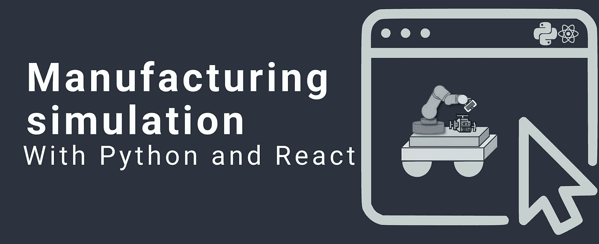
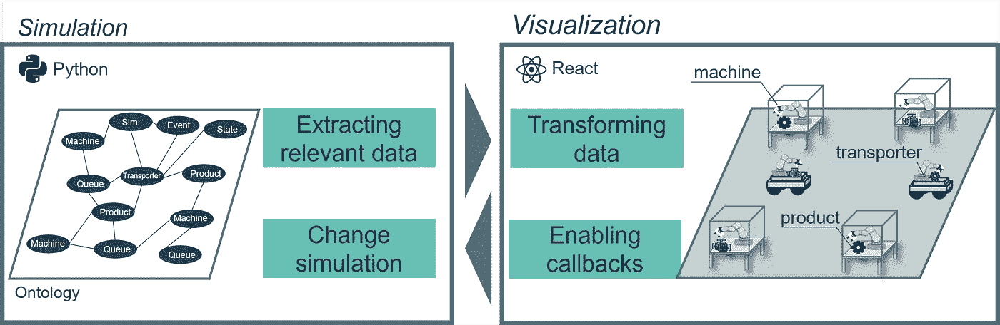
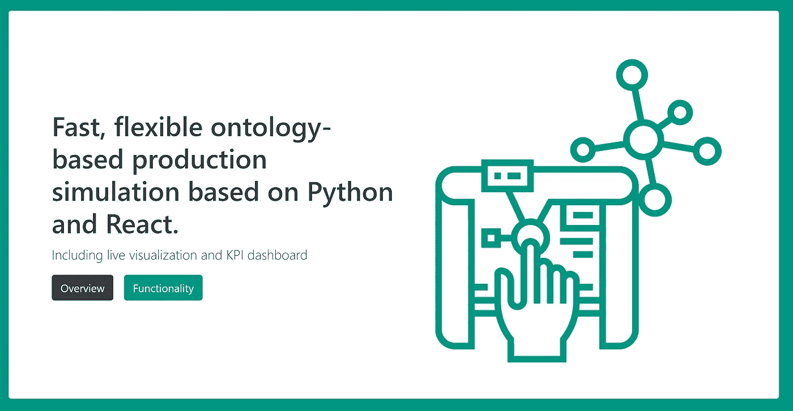
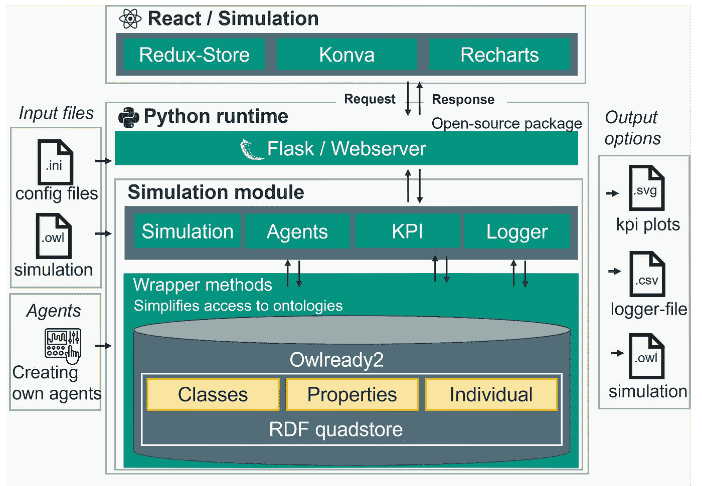
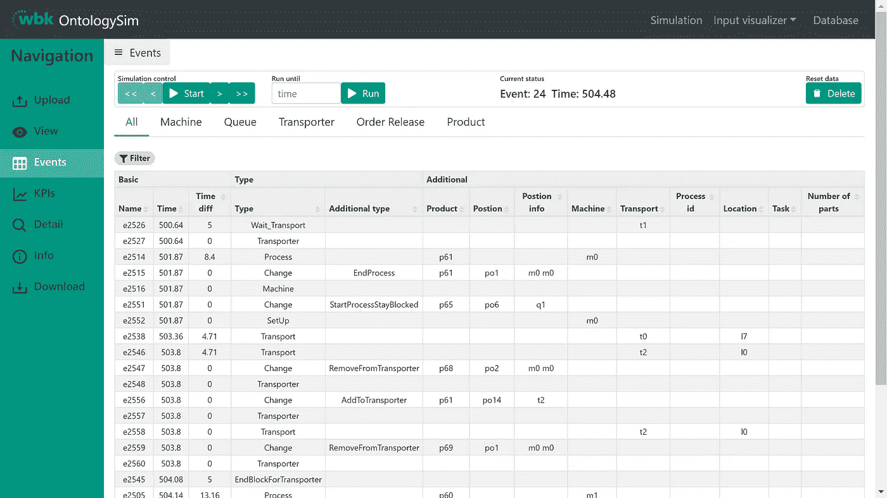
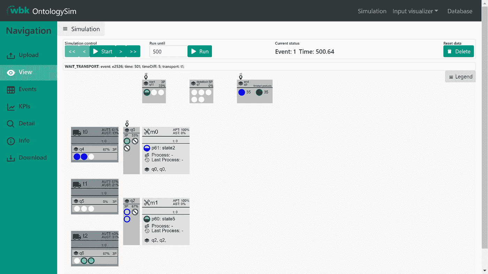
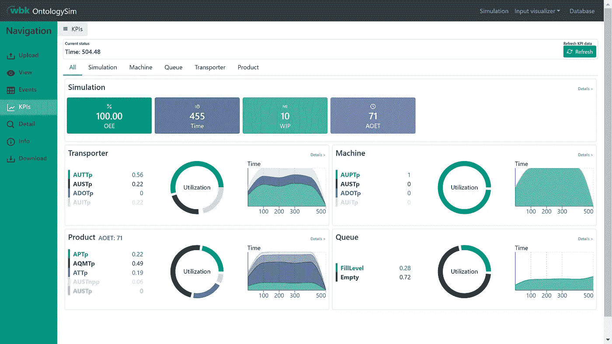

# HowTo:使用 Python 和 React 开发全栈生产模拟

> 原文：<https://levelup.gitconnected.com/howto-developing-a-full-stack-production-simulation-with-python-and-react-c8daaf464556>

# 基于 React、Flask 和本体论的生产仿真



来源:作者图片

# 想法

使用 Python 等构建的制造模拟的一个挑战是缺乏图形可视化。当开发出新的策略、方法和算法时，这一点尤其重要。对决策的理解对于快速开发算法(如调度、分派、生产控制)至关重要。到目前为止，与大型商业模拟(如 AnyLogic、PlantSim)相比，用 Python 编写的开源模拟缺乏生成漂亮、流畅和可用的图形可视化的能力。

# 内容

*   在基于 Python 的制造模拟中显示和比较图形可视化选项
*   将图形模拟用于 OntolgySim 的示例

# 选项 1:使用 Tkinter 的离线应用程序

Tkinter 是一个 2D 绘图表面库，因此可以显示简单的形状。

所有相关的数据，应该是可视化的，像机器，产品，必须在每个时间步创建，以产生一个静态图片。由于静态表示，有几个缺点，特别限制了用户友好性:

*   拖放元素:例如，如果创建了模拟
*   选择元素:显示更多信息，例如产品
*   像缩放窗格这样的选项:对于大型模拟，可见表面的动态调整
    此外，在没有图形界面的服务器上运行程序是不可能的。

# 选项 2:使用 JavaScript 进行可视化

这个想法是利用 JavaScript 的强大功能来实现图形化。要连接 Python 和 JavaScript，需要一个 web 服务器。Python 和 Flask 包支持通过 API 进行数据传输。作为一个 JavaScirpt 框架，使用 React。

概念过程如下:

*   React 用于图形化实现，向 Python 发送 API 请求以获取最新的模拟状态
*   下一步，提取、处理所有相关数据，并通过 AJAX 调用发送回 React。
*   随后，可以基于当前模拟数据构建可视化。例如，对于可视化，React Konva 是合适的。对象的创建类似于 Python，最大的优势是通过动态渲染的机会，如缩放、拖放，元素点击变得很容易。
*   动态可视化允许通过回调对模拟进行更改，也允许通过单击显示附加数据。

然而，由于 web 服务器的设置，在开始时需要更多的编程工作。



使用 JavaScript 进行可视化的概念，来源:作者图片

作为全栈应用实现的另一大优势是可以为仿真建立一个完整的仪表板。因此，在这种情况下，事件数据、KPI 可以快速可视化，并增加进一步的图形建模。

# 带有本体论的全栈应用示例

以开源仿真包 OntologySim 和 React 的扩展实现为例，展示了具体的实现。模拟和图形可视化的安装如下所示。



来源:作者图片

# 履行

仿真的实现基于 React 和 Flask 的全栈应用。仿真的基础是一个本体，它存储所有的状态并允许很大的灵活性。为了通过图形用户界面访问本体，所有访问操作符都被包装在 Python 中独立的包装器方法中，并作为 API 接口提供。通过 AJAX 调用，前端应用程序链接到后端。应该注意的是，Ajax 调用不是无状态 API，因为模拟状态存储在服务器上。该图显示了使用的库和自定义编程的库。



本体论结构，来源:作者图片[1]

# 可能性

总之，React、Flask 和 OntologySim 的组合实现了以下功能:

*   生产布局的图形可视化，KPI
*   通过图形界面启动和导出模拟
*   查看模拟步骤，包括返回的可能性
*   事件的过滤、分类和显示

# 装置

为了设置模拟，必须安装前端和后端。对于安装，您需要 node -v 16.13.1 和 python>3.6。

**1)安装前端** 仿真可通过 GitHub 获得

```
git clone [https://github.com/larsKiefer/ontologysim_react](https://github.com/larsKiefer/ontologysim_react)
cd ontologysim_react
```

有两种安装方式。第一种选择是通过 Docker 和 Docker compose 进行安装

```
docker-compose up — build
```

第二种选择是通过 npm 进行安装。

```
npm install
npm start
```

安装成功后，应该可以从 **localhost:3000** 调用。

**2)安装后端**

对于后端的安装，可以通过 pip 下载

```
pip install ontologysim
```

然后请用下面两行创建一个 python 文件。

下一步，您需要在命令中运行新创建的文件。之后，可以在浏览器中输入以下内容来测试安装

```
localhost:5000/test
```

# 模拟分析

模拟的图形显示允许对模拟进行具体分析。事件日志和 KPI 都可用于此目的。由于本体在后台，所以可以来回遍历事件步骤。这意味着单个步骤可以重复几次。

**1)上传仿真配置** 第一步是在“上传”选项卡下加载配置。配置类型可以在这里找到:[https://ontologysim.readthedocs.io/en/latest/](https://ontologysim.readthedocs.io/en/latest/)，但也有可能使用一个样本模拟。加载模拟后，以下分析选项可用:

**2)事件日志** 该软件允许您跟踪所有事件，并有可能对数据进行排序和过滤。



模拟的事件记录器，来源:作者提供的图片[1]

**3)仿真可视化** 在视图选项卡下，控制器的决策以图形方式可视化。有可能倒退到更好地分析决策。



更多信息，来源:作者图片[1]

**4 ) KPI 存储**
在模拟进行之后，KPI 可以显示在图表中。此外，还可以导出 KPI 结果。



模拟运行的 KPI 仪表板，来源:作者图片[1]

# **结论**

感谢阅读。如果你有什么要补充的，欢迎随时留言评论！

关于本体论的技术解释、基础知识和文献综述，可以在这里找到:[https://doi.org/10.3390/app12031608](https://doi.org/10.3390/app12031608)

**参考:**

[](https://github.com/larsKiefer/ontologysim_react) [## GitHub-larsKiefer/ontology sim _ react

### Ontologysim React 用于可视化用 Ontologysim 创建的模拟运行。本体论反应仅用作…

github.com](https://github.com/larsKiefer/ontologysim_react) [](https://github.com/larsKiefer/ontologysim) [## GitHub-larsKiefer/本体论

### Ontologysim 是一个开源的深度生产模拟框架，重点是模块化的灵活库…

github.com](https://github.com/larsKiefer/ontologysim) 

感谢这项工作的支持者:马文·卡尔·梅、安德烈亚斯·库恩勒和吉塞拉·兰扎

这项研究工作是在 DIGIMAN4.0 项目的背景下进行的(“DIG- 565 零缺陷工业 4.0 生产的数字化制造技术”，[http://www . digi man 4-](http://www.digiman4-)566 0 . MEK . dtu . dk/)。DIGIMAN4.0 是一个由 Horizon 2020 支持的欧洲培训网络，Horizon 2020 是欧盟 567 研究和创新框架计划(项目 ID: 814225)

# **来源**

[1]: May MC，Kiefer L，Kuhnle A，Lanza G .基于本体的生产模拟与本体主义。*应用科学*。2022;12(3):1608.[https://doi.org/10.3390/app12031608](https://doi.org/10.3390/app12031608)