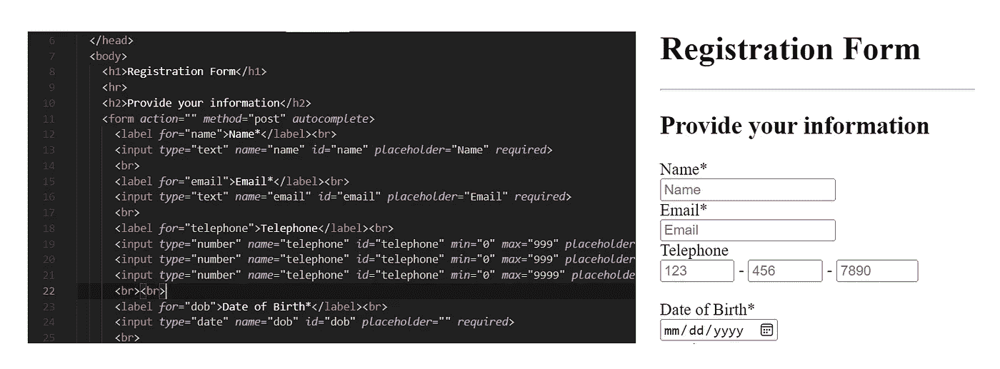

# HTML 基础-表单、标签和输入

> 原文：<https://levelup.gitconnected.com/html-basics-forms-labels-and-inputs-52a4450ea137>

除了 web 文档的结构之外，这是 HTML 在当今工作中最重要的用途。很重要，系好安全带。

表单代码和结果

**<表单>** 元素环绕各种输入信息的元素，并以</表单>标签结束。所有表单元素都有两个主要属性。**名称**和 **id** 属性给输入一个提交名称、特定标识符和显示类型。

一旦提交了数据，名称就作为数据的参考，在 JavaScript 中也是如此。重要的是，*只有指定的输入*能够提交它们的数据。

id 将输入链接到相应命名的标签，就像与样式表和 JavaScript 相关的其他元素的 id 一样。

表单可以包含九种不同的元素。 **< textarea >** 和 **< select >** 很常见，分别代表大文本框和下拉菜单。

**<输入>** 元素是最重要的，几乎有二十几种类型。以下是一些比较受欢迎的

**type="text"** 接受任何输入，包括数字和符号，是默认的输入类型

type="number" 只接受数字。在大多数浏览器上，它还在字段中添加了递增的上下箭头按钮

**type="checkbox"** 显示一个方形的复选框，可以随意勾选或取消勾选

**type="radio"** 与复选框不同，同一组只能选择一个单选按钮，一旦选择就不能取消选择

**type="submit"** 使用表单将其他字段中可用的所有信息提交到后端，通常是附加到网页的服务器或主机文件系统

**type="button"** 通常不用于 HTML 中的<按钮>标签或 CSS 中的样式化链接

最后，我们有 **<标签>** 。标签特定于表单元素，但在其他方面与其他文本元素非常相似。区别在于他们的特殊关系。如果放置在表单元素之前或之后，标签将分别出现在表单元素的前面或后面。希望将标签放在自己的行上的用户只需使用< br > break 标签。

正如每个输入标签应该有一个 id 一样，每个标签也应该有一个用于属性的**。无论相关元素的 id 是什么，这个值都应该是相同的，这样标签就可以绑定到它。**

试试这个吧，挺有娱乐性的。永远记得查看[文档](https://developer.mozilla.org/en-US/)或网站开发[库](http://www.w3schools.com)来扩展你基础知识之外的知识。