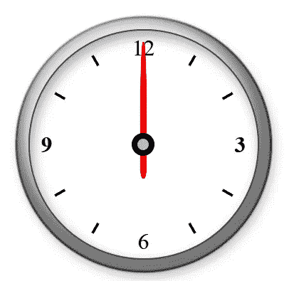

# HTML/CSS“模拟时钟”,使用最少的 Javascript

> 原文：<https://levelup.gitconnected.com/html-css-analog-clock-with-minimal-javascript-9dcf9a16e079>


在 DigitalPoint 上，有人问是否可以只用 HTML 和 CSS 制作一个钟面。虽然我在一次路过式的回答中尽可能干净利落地回答了他们的问题，但我认为一篇更精致、更健壮的文章会是一篇好文章。

我经常看到的一件事是，有多少实现倾向于使用大量的 JavaScript，而没有脚本化的优雅降级计划。仿佛

然而最大的缺陷是人们总是在最不容易接近的度量标准——像素上工作。这意味着它不能像 EM 那样根据用户偏好进行缩放，而且它也很难调整大小。如果我们在 EM 中做所有的事情，我们只需要在最外层的容器中使用 font-size 就可以像这样调整元素的大小！

HTML 和 CSS 本身可以创造奇迹，但是也要小心，不要在标记中放入“仅脚本化”的元素，因为它们会使屏幕阅读器、盲文阅读器等用户感到困惑。

# 基本标记

即使我们要在最终版本的脚本中生成内部标记，先编写一个标记元素的基本示例也会有所帮助，这样我们就可以确保所有的事情都在一行中。

使用生成的内容，我们可以插入我们的各种片段，但是我们仍然需要在标记中加入大量额外的容器来挂钩我们的 before:after to。

```
<div id="clock"> <!-- 12 and 6 -->
  <b></b>       <!-- 3 and 9 -->
  <span></span> <!-- 30deg 60deg 210deg 240deg markers -->
  <span></span> <!-- 120deg 150deg 300deg 330deg markers -->
  <i></i>       <!-- hour hand -->
  <i></i>       <!-- minute hand -->
  <i></i>       <!-- second hand -->
<!-- .clockFace --></div>
```

# 样式表

首先，让我们用一个漂亮的盒子阴影生成的边界来设计外部容器的样式。

```
#clock {
  position:relative;
  width:10em;
  height:10em;
  line-height:1.5em;
  margin:1em auto;
  border:0.0625em solid #444;
  border-radius:50%;
  box-shadow:
    inset 0.125em 0.25em 0.5em #0005,
    -0.25em -0.5em 0.5em #FFFC,
    0 0 0.0625em 0.5em #777,
    0 0 0.0625em 0.5625em #000,
    0.125em 0.25em 0.5em 0.5em #0004;
}
```


再次注意，大部分测量单位都是 EM，这样可以方便地调整时钟。你想让它变大或变小，只需改变#clock 上的字体大小，里面的一切都会随之改变。这也意味着我们不必像做“左:50%”那样玩“百分比游戏”；最高:50%；”+负边距技巧。

行高将与我们在数字上的固定宽度相同，以方便和一致的对齐。

```
#clock *,
#clock *:before,
#clock *:after {
  box-sizing:border-box;
  background-clip:padding-box;
}
```

每当你有共享行为时，试着浓缩你的选择器。在这种情况下，我们#clock 中的所有东西都需要这些属性。框尺寸:border-box 将边框放在宽度/高度内，这是一个我们可以用来使刻度和指针变短的技巧。我们将容器设置为所有刻度和指针的最大尺寸，然后我们可以使用透明边框使它们变小！为此，我们需要将 background-clip 设置为 padding-box，因为默认的边框行为实际上会在边框下绘制背景。*(哪个 IMHO 真傻逼..HTML/CSS 中有很多非常愚蠢的默认设置)*

```
#clock:before,
#clock:after,
#clock b:before,
#clock b:after {
  position:absolute;
  width:1.5em;
  text-align:center;
}
```

#clock 和**生成的内容都以相同的大小/宽度绝对定位。这将是我们的四个号码。**

```
#clock b {
  position:absolute;
  top:4.25em;
  width:100%;
}
```

我们将**——它将容纳 9 和 3——向下滑动一半减去一半行高。我们可以尝试更花哨的技巧，如 flex 或 grid，但当你有一堆重叠的元素时，就像我们在这里做的一样，它们实际上更难。**

```
#clock:before,
#clock:after {
  left:4.25em;
}
```

#clock 生成的内容也进行了一半。

```
#clock:before {
  content:"12";
  top:0;
}#clock:after {
  content:"6";
  bottom:0;
}#clock b:before {
  left:0;
  content:"9";
}#clock b:after {
  right:0;
  content:"3";
}
```


非常清楚，插入我们的数字，并适当地定位它们。

这是我们的数字，那么每 12 个小时的刻度呢？

```
#clock span {
 position:absolute;
 top:0;
 left:4.9375em;
 width:0.125em;
 height:100%;
}
```

span 本身只是我们生成的内容的包装器，我们把它做成全高，然后把它们滑到中间，再次计算从#clock 宽度的一半减去我们想要的宽度的一半。

一个有趣的技巧是，我们可以生成 30 度和 60 度的:before 和:after，然后:

```
#clock span + span {
  transform:rotate(90deg);
}
```

将它旋转 90 度，得到 120 度和 150 度。生成的内容将绘制相对的两边。

```
#clock i,
#clock span:before,
#clock span:after {
  position:absolute;
  top:0.5em;
  left:0;
  width:100%;
  height:9em;
}
```

指针和刻度也得到绝对定位。我们缩小它们的尺寸，这样它们就不会跑到钟面的边缘，并相应地调整顶部位置。

```
#clock span:before,
#clock span:after {
  content:"";
  border-style:solid;
  border-color:#000;
  border-width:0.5em 0;
  transform:rotate(30deg);
}
```

我们的 span:before 和 after 中的每一个都有一个黑色的边框，它们的中心保持透明。这是魔术，边界顶部和底部是我们的刻度线，从那里我们只需将它们旋转 30 度。一个接一个:

```
#clock span:after {
  transform:rotate(60deg);
}
```

取而代之的是 60 度旋转。基本上，跨度上的:before 和:after 中的每一个都在表面上做两个相对的记号，然后我们只需将它们旋转到我们想要的位置。

总共给了我们:


您可能会对此感到困惑，让我们在 span:before 和 span:after 上设置一个背景色来说明实际发生的情况。如果我们加上`background-color:#0F0;`,我们得到:


双手没什么不同:

```
#clock i {
  z-index:2;
  left:4.85em;
  width:0.3em;
  background-color:#000;
  border:solid transparent;
  border-width:0 0 3em;
  border-radius:40%;
}
```

*注意，我们必须说背景色，就像你使用简写的背景:属性，你将覆盖背景剪辑。*

这些需要一个 z-index，所以它们将对 6 进行深度排序，这是作为#clock:after 附加的。这些元素再次以父元素宽度的一半减去元素宽度的一半为中心。

颜色与我们做刻度线的方式相反。我们给它一个背景颜色，然后使边界透明。这让我们可以通过设置边框宽度来设置手的每个“茎”的大小。在这种情况下，我们设置底部宽度，使一边更短。

```
#clock i:first-of-type {
  border-width:1.5em 0 3em;
}
```

因为我们的第一个是时针，我们通过增加顶部边框来缩短它。

```
#clock i:last-of-type {
  background-color:#F00;
}
```

最后一个是秒针，我们把它做成红色吧。

现在，为了让它更漂亮，让我们在中间添加几个同心圆来代表它们通常连接的环和茎。我们可以把它们挂在秒针上，因为作为圆圈，它们在旋转时不会有任何不同。

```
#clock i:last-of-type:before,
#clock i:last-of-type:after {
  content:"";
  position:absolute;
  border-radius:50%;
}#clock i:last-of-type:before {
  top:4em;
  left:-0.375em;
  width:1em;
  height:1em;
  background:#000;
}#clock i:last-of-type:after {
  top:4.25em;
  left:-0.125em;
  width:0.5em;
  height:0.5em;
  background:#ABC;
}
```

计算左上时，你不仅要考虑戒指的大小，还要考虑它们与秒针位置的关系。

这就是我们的风格，现在看起来像这样:



自然，我们看不到所有的手，因为它们是一层一层地叠在一起的。请注意，50%的边界半径实际上是如何让我们一端“尖”而另一端更圆的。记住，在这些上，边界是透明的，背景是颜色。

这就是我们所有的标记和风格…现在让它做点什么。

# 脚本

首先，我总是把我的脚本放在客户端工作的生活中。当然，我们有新的东西，如 type="module "或@import with classes，但坦率地说，我发现这些东西在客户端部署方面没有给我带来通用性。

尤其是像将“文档”或“窗口”作为“d”和“w”传递给生活这样的技巧，省去了我不停地到处键入它们的麻烦。如果对谷歌来说足够好，对我来说也足够好！

所以，我们从:

```
(function(d) {
})(document);
```

现在，正如我之前提到的，我们希望避免在标记中出现垃圾脚本，所以我们希望将 HTML 简化为:

```
<div id="clock">
  <noscript>
    <p>
      The page clock requires JavaScript to function, please revisit in a scripting capable browser.
    </p>
  </noscript>
<!-- .clockFace --></div>
```

然后让我们的脚本插入这些值。因为我们使用斜体标记来表示手，并且我们希望将这些标记用于脚本，所以我们可以在构建它们时将它们放入数组中。

```
var clockElements = makeClockElements(
  'b', 'span', 'span', 'i', 'i', 'i'
);function makeClockElements(tags) {
  var
    clock = d.getElementById('clock'),
    result = [];
  for (var i = 0; tagName = arguments[i]; i++) {
    var element = clock.appendChild(d.createElement(tagName));
    if (tagName === 'i') result.push(element);
  }
  return result;
}
```

拥有这些类型的“make”函数通常是很方便的，这样可以避免使用 innerHTML 破坏 DOM 以及所有常见的令人痛苦的问题。(比如触发解析器比上面慢 30 倍)。

现在我们有了这些斜体标签的钩子，我们可以:

```
function clockUpdate() {
  var now = new Date();
  clockElements[0].style.transform = 'rotate(' + (
    now.getHours() * 30 + (Math.floor(now.getMinutes() / 12) * 6)
  ) + 'deg)';
  clockElements[1].style.transform = 'rotate(' + (
    now.getMinutes() * 6
  ) + 'deg)';
  clockElements[2].style.transform = 'rotate(' + (
    now.getSeconds() * 6
  ) + 'deg)';
}clockUpdate();
setInterval(clockUpdate, 1000);
```

您可能想知道为什么小时计算得到分钟。这是因为与其让它一下子跳 30 度，不如让它像其他指针一样更新 6 度。“真正的”模拟时钟——尤其是老式的——通常是 60 进制的“数字”时钟，甚至是机械钟。他们不会每一秒都降档，因为那样会浪费钟摆/弹簧的能量，而是只在必要时“降档”。

但这就是脚本更新时钟所要做的全部工作，就是设置旋转。以度计。我经常看到一些人在这方面使用的边界微积分，对此我感到非常惊讶…人们并没有那么复杂。*但是我知道什么？我使用 atan2 而不是除以 z 来做 3d 投影*

自然，我们希望在加载时绘制当前时间，然后设置 1 秒更新。

上面的脚本应该包含在

# 现场演示

和我的大部分代码一样，这里有一个演示:

 [## 时钟演示

### 编辑描述

cutcodedown.com](https://cutcodedown.com/for_others/medium_articles/clock/clock.html) 

目录:
[https://cutcodedown.com/for_others/medium_articles/clock/](https://cutcodedown.com/for_others/medium_articles/clock/)

是完全开放的，很容易接触到黏糊糊的东西，我也把整个事情的一个 rar 文件放在那里。

我知道有些人更喜欢钢笔，所以给你:

# 结论

使用 HTML 和 CSS 来完成我们的大部分时钟生成，使我们能够动态扩展它，并且看起来就像大多数人浪费图像或过多脚本(如 canvas)一样好。你想让它变大或变小，只要在#clock 上改变字体大小就行了。

这可以让 JavaScript 专注于插入所需的 HTML——避免只编写元素脚本在非脚本环境中可能导致的问题——并且除了在手上设置“transform:rotate”之外，什么也不做。

要是所有的事情都这么简单就好了。

## 信用

特别感谢 DigitalPoint 上的“iago111”和“qwikad”；前者是因为这个想法，后者是因为建议我把它作为一篇文章发表出来。