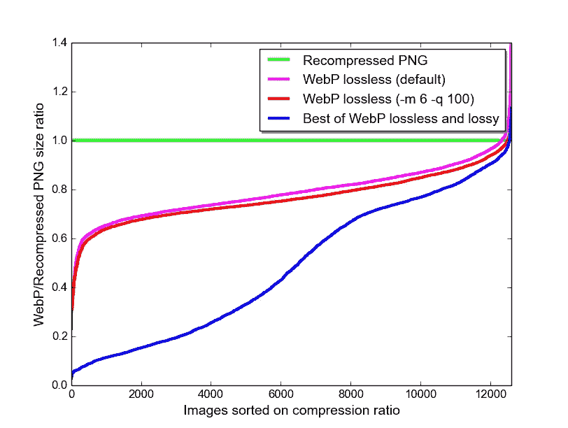
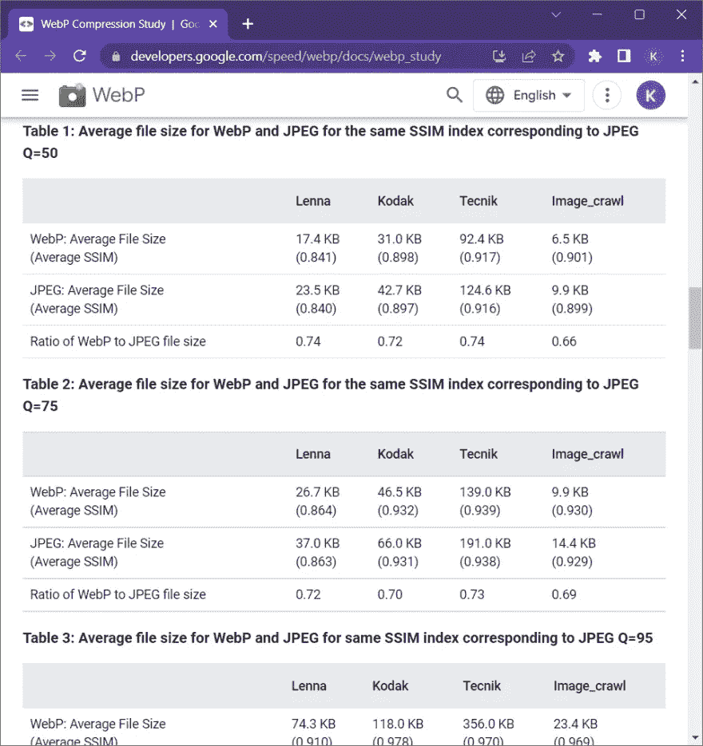

# HTML 和 CSS 特性，将页面加载速度提高 10 倍的技巧

> 原文：<https://levelup.gitconnected.com/html-css-features-tips-for-a-10x-fast-page-loading-speed-5fb6c2d88df8>

我们都讨厌页面加载如此缓慢，对吗？😔


> *事实上，加载时间每增加一秒(0-5 秒之间)，网站转化率平均下降 4.42%。页面加载时间的前五秒对转化率的影响最大。(*[](https://www.portent.com/blog/analytics/research-site-speed-hurting-everyones-revenue.htm#:~:text=The%20first%205%20seconds%20of,(between%20seconds%200%2D5))**，2019)**

**

*但是你可以通过改变你的 HTML 和 CSS 文件来提高你的网站的页面加载速度，而不需要以最困难的方式提供最好的主机服务！跟着读…*

**

**(在这篇文章中，我们只关注使用 HTML 和 CSS 文件来提高页面速度。)**

# *1.惰性装载*

*惰性加载是一种缩短[关键渲染路径](https://developer.mozilla.org/en-US/docs/Web/Performance/Critical_rendering_path)长度的策略，这转化为 ***减少页面加载次数*** 。*

# *a)拆分 CSS 文件*

*CSS 必须**薄**，尽可能快地交付，并建议使用媒体类型和查询取消阻止渲染。我说的思考是什么意思？- *分割你的 CSS 文件，这样整个 CSS 就不会在所有屏幕上执行*。*

```
*<!-- Loading and parsing styles.css is render-blocking -->
<link rel="stylesheet" href="styles.css" />*
```

*📌对于**打印**介质使用-*

```
*<!-- Loading and parsing print.css is not render-blocking -->
<link rel="stylesheet" href="print.css" media="print" />*
```

*📌对于**移动**屏幕，使用-*

```
*<!-- Loading and parsing mobile.css is not render-blocking on large screens -->
<link
  rel="stylesheet"
  href="mobile.css"
  media="screen and (max-width: 480px)" />*
```

*📌对于**平板电脑**屏幕，使用-*

```
*<!-- Loading and parsing tablet.css is not render-blocking on large screens -->
<link
  rel="stylesheet"
  href="tablet.css"
  media="screen and (max-width: 1080px)" />*
```

*📌对于不同**方向的移动屏幕**使用不同的 CSS 文件*

```
*<!-- Loading and parsing portrait.css is not render-blocking on landscape screens -->
<link href="portrait.css" rel="stylesheet" media="(orientation:portrait)" />*
```

*通过将 CSS 分成多个文件，主呈现阻塞文件(在本例中为 styles.css)变得更小，减少了呈现被阻塞的时间，从而大大提高了页面加载速度。*

# *b)`font-display`CSS 的属性*

*应用于`@font-face`规则的`font-display`属性定义了浏览器如何加载和显示字体文件，当字体加载或加载失败时，允许文本以`**fallback**`字体显示。这通过使文本可见而不是有一个空白屏幕来提高性能，代价是无样式文本的闪烁。*

```
*@font-face {
  font-family: "nunito", sans-serif;
  font-weight: 400;
  font-style: normal;
  font-display: fallback;
}*
```

# *HTML 文件中的图像*

*用户在第一秒只能看到(需要看到)顶部的图像。那为什么要让他们在最后等待图像加载呢？使用`loading="lazy"`,这样图像只在需要的时候加载。这大大降低了页面加载速度。*

```
**
```

# *2.选择正确的图像格式*

*在 [***中制作您的图像。webp***](https://developers.google.com/speed/webp) 格式。它被推荐为 web 的图像格式标准。*

***与 png 相比，WebP** 无损图像的尺寸[比](https://developers.google.com/speed/webp/docs/webp_lossless_alpha_study#results)小 26%。在同等的 [SSIM](https://en.wikipedia.org/wiki/Structural_similarity) 质量指数下，WebP 有损图像比 JPEG 图像小[25–34%](https://developers.google.com/speed/webp/docs/webp_study)。与 GIF 和 APNG 相比，动画 WebP 图像支持有损、无损和透明，可以提供更小的尺寸。*

# *WebP 与 PNG 图像格式*

**

# *WebP 与 JPEG 图像格式*

**

> **所有这些测试证明，即使在有损之后，webp 图像的压缩程度也更高，因此大大降低了页面加载速度！**

**您还可以查看图像格式* [*。avif*](https://en.m.wikipedia.org/wiki/AVIF) *哪个在少数情况下比。但它是市场上的新产品(2019 年发布)，所以没有多少浏览器支持。avif 格式呢！**

# *📌对图像使用`<picture>`元素*

*a)用于裁剪或修改不同`media`条件下的图像(例如，在较小的显示器上加载具有过多细节的图像的简单版本)。
b)为不支持 webp 格式的情况提供替代图像格式。
c)通过加载最适合查看者显示器的图像，节省带宽并加快页面加载速度。*

*如果为高 DPI(视网膜)显示器提供更高密度版本的图像，请使用``元素上的`srcset`。这允许浏览器在数据保存模式下选择低密度版本，并且你不必写明确的`media`条件。*

```
*<picture>
  <source srcset="my-logo-wide.webp" type="image/webp" media="(min-width: 600px)" />
  <source srcset="my-logo-wide.jpeg" type="image/jpeg" type="image/jpeg" media="(min-width: 600px)" />
  <source srcset="my-logo-narrow.webp" type="image/webp" /> 
  
</picture>*
```

# *3.渲染图像*

*由于图像是异步**加载的**，并且在第一次绘制后继续加载，如果在加载前没有定义它们的尺寸，它们会导致页面内容回流。例如，当文本被图像加载推下页面时。因此，设置`width`和`height`属性非常重要，这样浏览器就可以在布局中为它们保留空间。
对于任何`**background-image**`，设置一个`background-color`值是很重要的，这样任何覆盖的内容在图像下载之前仍然可读。*

# *4.缩小 HTML 和 CSS 文件*

*缩小是从代码中删除所有不必要的字符，以减小代码的大小。不需要的空白字符，如*空格、换行符、制表符*等。并且注释被移除。*

*使用缩小工具，如[code 美化](https://codebeautify.org/minify-html)、 [CSS Minifier](https://css-minifier.com/) 等，来缩小你的 HTML 和 CSS 文件。这些将有助于给你的网站一个更好的页面加载速度。*

*我们是*

**

**这个变化一定会让你的网站现在的页面加载速度快 10 倍！**

> **快乐编码！😃与需要它的人分享吧！💚
> 关注更多⚡**