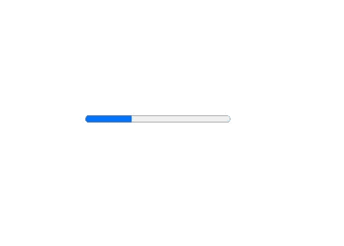
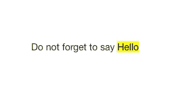
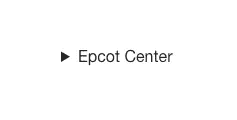
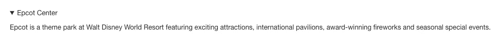
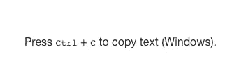
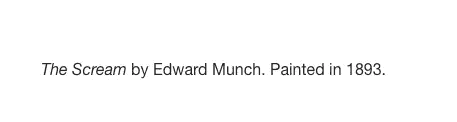
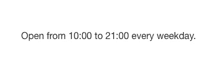

# 你从未听说过的 HTML 元素

> 原文：<https://levelup.gitconnected.com/html-element-youve-never-heard-of-aa6a301d6bc1>


由 [Wolfgang Hasselmann](https://unsplash.com/@wolfgang_hasselmann?utm_source=medium&utm_medium=referral) 在 [Unsplash](https://unsplash.com?utm_source=medium&utm_medium=referral) 上拍摄的照片

有了现代前端框架所提供的能力，很容易忽略旧 HTML 所提供的东西。很容易认为这只是更酷选项的起点。真正懂 HTML 的开发者越来越少，与此同时，提高产品可访问性和性能的需求比以往任何时候都大。

除了“酷”的因素之外，HTML 是一个伟大的动态工具，非常活跃，并且在不断发展。事实上，开发人员已经从各种前端项目中吸取了经验教训，并在此基础上改进了 HTML 本身，以释放其全部潜力。

让我们来看看一些语义 HTML 元素，它们将帮助你创建一个更好的网站。如果你以前用过这些元素，那太好了。网络需要像你这样的人。如果这些元素对您来说是新的，那么请考虑学习更多关于 HTML 的能力。

HTML 元素显示一个指示器，显示任务的完成进度，通常显示为一个进度条。



`<mark>` [HTML](https://developer.mozilla.org/en-US/docs/Web/HTML) 元素表示由于所标记的段落在封闭上下文中的相关性而被标记或突出显示以供参考或标注的文本。



# <details></details>

HTML 元素

<details>用于显示隐藏的(附加的)信息。reveal widget 通常使用一个小三角形显示在屏幕上，该三角形旋转以显示打开/关闭状态，三角形旁边有一个标签。如果<details>元素的第一个子元素是<summary>，那么<summary>元素的内容将被用作扩展小部件的标签。</summary></summary></details></details>

HTML 键盘输入元素(`)表示元素内的文本描述了来自键盘的用户输入、语音输入或使用任何其他类型的文本输入设备的输入。按照惯例，默认情况下，用户代理使用等宽字体显示`元素的内容，尽管 HTML 标准没有明确规定。`可与<samp>(示例输出)元素结合使用，以显示各种形式的键盘输入或基于视觉提示的输入。</samp>```



HTML 元素(来自英语引文)是一个到引文来源的链接。它必须包括作品的标题或 URL，可以根据用于添加引用元数据的规则进行缩写。



# :(日期)时间元素

HTML 元素代表一个特定的时间段。它可能包括将日期转换成机器可读格式的`datetime`属性，从而允许更好的搜索引擎结果或定制功能，如提醒。

它可能代表以下内容之一:

*   24 小时制的时间。
*   [公历](https://en.wikipedia.org/wiki/Gregorian_calendar)中的精确日期(带有可选的时间和时区信息)。
*   [有效持续时间](https://html.spec.whatwg.org/multipage/common-microsyntaxes.html#valid-duration-string)。



# **结论**

这些只是在你的代码中如何应用语义 HTML 的几个例子。理解 HTML 的工作原理及其功能有助于开发人员创建前端应用程序，为尽可能多的用户提供良好的服务。所以不要忘了 HTML。几年后，当利用 HTML 和普通 JavaScript 的简单项目胜过 React 应用程序时，你可能会后悔。