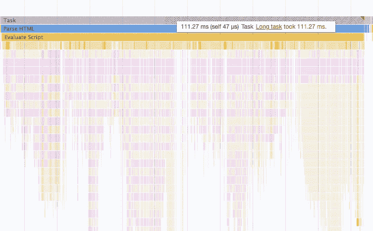
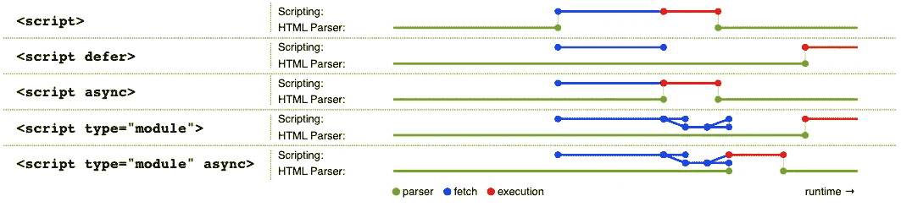

# HTML 脚本元素属性:async vs. defer vs. type='module '

> 原文：<https://levelup.gitconnected.com/html-script-element-attributes-async-vs-defer-vs-type-module-610b50a79dbd>

## 脚本元素如何影响页面加载？

照片由[迈克·范登博斯](https://unsplash.com/@mike_van_den_bos?utm_source=medium&utm_medium=referral)在 [Unsplash](https://unsplash.com?utm_source=medium&utm_medium=referral) 上拍摄

相信你对 HTML 中的脚本元素并不陌生。它有一些属性，如异步，延迟等。你知道它们是做什么的，它们之间有什么区别吗？

如果脚本元素没有添加任何属性，那么当浏览器遇到脚本时，它将被立即加载并执行。在等待执行完成后，它将继续解析下面的标签。这个阶段被称为解析 HTML。

而且如果脚本很大或者执行起来很耗时，页面会很长时间是空白的。就像上面的截图一样。这在一些 [SPA](https://en.wikipedia.org/wiki/Single-page_application) 前端项目中尤为常见。

所以对于这种情况，我们可以给脚本元素添加属性来优化。接下来，我将脚本元素分为三类分别解释:

# 经典剧本

当我们省略脚本元素的`type`属性或者配置为 [JavaScript MIME 类型](https://developer.mozilla.org/en-US/docs/Web/HTTP/Basics_of_HTTP/MIME_types#textjavascript)(当前唯一的有效值`text/javascript`)时，该脚本就是经典脚本。

`****`

当为经典脚本配置 async 属性时，会立即获取脚本，但不会阻止解析 HTML。**一旦 fetch 完成**，就会立即执行，如果此时 HTML 没有解析，就会被阻塞。

`****`

为经典脚本配置 defer 属性时，会立即提取脚本，但不会阻止解析 HTML。它直到 HTML 被解析后才被执行，但是它阻塞了`[DOMContentLoaded](https://developer.mozilla.org/en-US/docs/Web/API/Document/DOMContentLoaded_event)`事件。

应该注意，如果这个经典脚本不使用 src 属性，即内联脚本，defer 属性将不起作用。

# 模块脚本

当我们为一个脚本元素配置`type="module"`时，那么这个脚本就是一个模块脚本。

`****`

[ESM](https://developer.mozilla.org/en-US/docs/Web/JavaScript/Guide/Modules) 可以在一个模块脚本内部使用，即使多次加载同一个模块脚本，该脚本也只会执行一次。

在加载机制中，**其作用与经典脚本的 defer 相同。**

值得注意的是，如果模块脚本配置了`src`属性，那么与经典脚本(允许跨域)不同，这个模块脚本需要使用 CORS 协议进行跨域取数。

`****`

当为模块脚本配置 async 属性时，其加载机制与用 async 配置的经典脚本相同。

`****`

当为模块脚本配置了 defer 属性时，该属性不起作用。因为默认情况下，模块脚本是“延迟”的。

# 其他的

当脚本元素的 type 属性值不是上述两个有效值时。那么这个脚本元素中的内容(包括 src)会被浏览器丢弃，不会被下载执行。

# 结论

下面的截图清楚地显示了这些类型之间的区别:

图片来自 [WHATWG](https://html.spec.whatwg.org/multipage/scripting.html)

*今天就到这里。我是 Zachary，我将继续输出与 web 开发相关的故事。如果你喜欢这样的故事，想支持我，请考虑成为* [*中会员*](https://medium.com/@islizeqiang/membership) *。每月 5 美元，你可以无限制地访问媒体内容。如果你通过* [*我的链接*](https://medium.com/@islizeqiang/membership) *报名，我会得到一点佣金。*

你的支持对我很重要——谢谢。