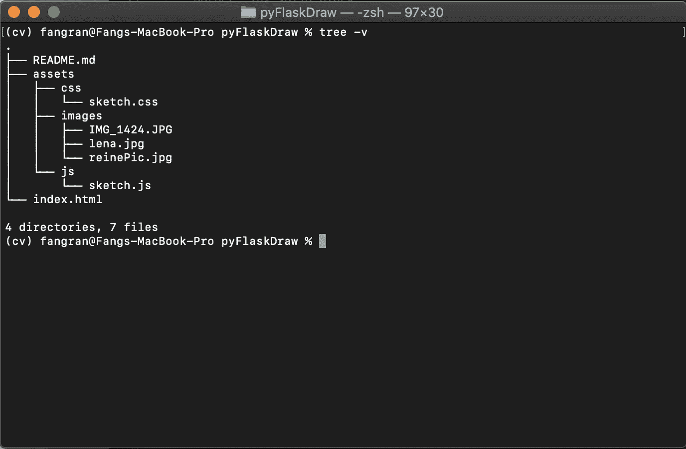

# Github 页面上的 HTML5 画布绘制应用程序(初学者友好教程)

> 原文：<https://levelup.gitconnected.com/html5-canvas-drawing-application-on-github-pages-beginner-friendly-tutorial-5d50b99adb6a>


这是我们将要建造的

你好，朋友们，在这一部分，我通常会试着想一些讽刺的/有趣的话来说(作为一种轻松的方式来开始一个潜在的痛苦的教程)。但是在凌晨 4 点 25 分思考了五分钟后，我决定继续做下去。因为已经很晚了——也因为这个教程不会很痛苦(耶)。

我一直试图找出如何在网上部署我的一些图像处理代码——在我的大学时代，我的大部分代码都是离线的(又名 python 脚本，嗯……我也学过其他语言，但我的重点领域是计算机视觉和一些 ML/AI 东西，所以这是我的借口)。无论如何，我只是想说这个教程是我正在努力的一个更大项目的一部分，但是我想既然这可以是一个独立的项目，为什么不呢？

让我们开始吧！

我们将在 Github 页面上托管这个简单的绘图应用程序。我真的不推荐它是一个静态网站托管服务。这意味着你不能发出 AJAX 请求之类的东西。但是对于一个基本的画布绘制应用程序来说，这是一种快速而肮脏的方式，直接从 GitHub 上的存储库中获取 HTML、CSS 和 JavaScript 文件，并在线托管它们。这是我第一次试用 GitHub 页面时提到的[链接](https://www.thinkful.com/learn/a-guide-to-using-github-pages/)。只要记得确保你的 html 文件没有嵌套在一个目录中，因为我听说如果你嵌套了它，GitHub 页面可能找不到它。



目录结构

***注意:我将这个目录命名为 pyFlaskDraw，因为我最初打算在这个应用程序中使用 python 和 Flask。但是我发现我不能用 GitHub 页面轻松地做到这一点，所以请原谅我糟糕的 dir 命名。可能会在 Heroku 什么的上继续这个项目。***

在 body 标签中，我们只严格需要

<canvas>标签。此外，我们希望包含 javascript 文件(第 15 行)和样式表(第 9 行)。</canvas>


index.html

让我们从编写一个将图像绘制到画布上的函数开始。将您的图像存储在资产/图像目录中。我使用的是 assets/images/reinePic.jpg。在这个函数中，我调整了我上传的图像的大小，然后使用这个方法代替默认的 HTML canvas drawImage()方法。

```
function drawImageToScale(img, ctx){
    const img_width = 650;
    const scaleFactor = img_width / img.width;
    const img_height = img.height * scaleFactor;
    ctx.drawImage(img, 0, 0,img_width,img_height);
    return [img_width,img_height];
}
```

好了，现在让我们在我们的

```
window.addEventListener(“load”, () => {}
```

那么在上面的监听器中，我们的{}里面放了什么呢？我们必须首先正确地加载我们的图像和画布，然后在画布上绘制我们的 Img。

```
window.addEventListener("load", () => {
    const canvas = document.querySelector("#canvas");
    const ctx = canvas.getContext('2d'); const img = new Image();
    img.src = "assets/images/reinePic.jpg"; img.onload = () => {
        const [img_scaled_width, img_scaled_height] =   drawImageToScale(img, ctx);
        canvas.width = img_scaled_width;
        canvas.height = img_scaled_height;
        window.addEventListener('resize', drawImageToScale(img,ctx));}
```

现在是绘画部分。我们应该考虑三种鼠标事件——鼠标按下、鼠标抬起和鼠标移动。我们使用 addEventListeners 来检测鼠标事件。所以让我们把这些加进去:

```
// eventListeners
 canvas.addEventListener("mousedown", startPosition);
 canvas.addEventListener("mouseup", finishedPosition);
 canvas.addEventListener("mousemove", draw)
```

我们需要一个标志变量来告诉我们什么时候应该在图像上绘制像素，什么时候不应该。让我们称这个字母变量为 painting，并将其初始化为 false:

```
let painting = false;
```

beginPath()方法开始一个路径，或者重置当前路径。我们需要两个函数…根据鼠标按下(startPosition)或鼠标抬起(finishedPosition)来做事情

```
function startPosition(e){
    painting = true;
    draw(e);
 }function finishedPosition(){
    painting = false;
    ctx.beginPath();
 }
```

现在是绘制函数:

```
function draw(e){
    if (!painting)
        return;
    ctx.lineWidth = 3;
    ctx.lineCap = 'round';
    ctx.lineTo(e.clientX, e.clientY);
    ctx.stroke();
    ctx.beginPath();
    ctx.moveTo(e.clientX, e.clientY);
 }
```

请注意，笔画的默认颜色是黑色。如果你想更详细地了解这个绘图工具是如何工作的，可以参考这个[链接](https://www.youtube.com/watch?v=3GqUM4mEYKA)。

就是这样！

以下是 sketch.js 的完整代码:

[https://gist . github . com/reine 0017/52349 a 63 EB 3234 e 316 a 1a C4 a5 D1 ce ad 2](https://gist.github.com/Reine0017/52349a63eb3234e316a1ac4a5d1cead2)

sketch.css 只是:

```
*{
 margin:0;
 padding:0;
 box-sizing: border-box;
}#canvas {
 border: 1px solid black;
}
```

# 第二部分

好了，现在让我们添加控件！上面的应用程序只是简单的绘图，没有按钮来擦除或改变颜色。让我们添加三个按钮——透明画布，将绘图“笔”的颜色改为黑色或白色。

在我们的 html 中，我在一个绘图组件 div 中嵌套了

<canvas>和一些控制按钮。</canvas>

[https://gist . github . com/reine 0017/c 47203 b 991 a 163 a 02 a 46 f 4 a 4d 8 e 76d 13](https://gist.github.com/Reine0017/c47203b991a163a02a46f4a4d8e76d13)

就像我们在画布上所做的一样，我们使用 document.querySelector 来创建按钮常量，这样我们就可以在这些按钮被按下时注册 onClick 事件。

```
const clearButton = document.querySelector('#clear');
const blackButton = document.querySelector('#blackColour');
const whiteButton = document.querySelector('#whiteColour');
```

对于 eventListeners:

```
clearButton.addEventListener('click', () => clearCanvas(img, ctx, canvas.width, canvas.height));
blackButton.addEventListener('click', () => ctx.strokeStyle = "#000000");
whiteButton.addEventListener('click', () => ctx.strokeStyle = "#ffffff");
```

clearCanvas 函数还没写。但是我们可以在“加载”窗口 eventListener 之外编写一个函数:

```
function clearCanvas(img,ctx,img_scaled_width,img_scaled_height){
    ctx.clearRect(0,0, img_scaled_width, img_scaled_height);
    drawImageToScale(img, ctx);
}
```

完整的情况是这样的:

[https://gist . github . com/reine 0017/be 7403 b 8df 860 aa 469424443017 c7f 99](https://gist.github.com/Reine0017/be7403b8df860aa469424443017c7f99)

最后，对于 css，它更多的是一个个人偏好的东西，所以我不会在这里详细阐述。如果您有任何其他问题，请联系我！

[https://gist . github . com/reine 0017/16e 927 e 4 fbea 45 de a 388 E0 c 34d 8 b 7c 17](https://gist.github.com/Reine0017/16e927e4fbea45dea388e0c34d8b7c17)

就是这样！感谢大家阅读我的教程:)

如果有些部分解释得不太清楚，我可以理解。但是在一篇文章中，我在媒体上解释事情的能力是有限的。我会尽快创建并上传一个 YouTube 视频，然后在这里更新:)

更新:这是 YouTube 的链接:[https://youtu.be/KZAb2Ikr_YQ](https://youtu.be/KZAb2Ikr_YQ)

画图快乐！