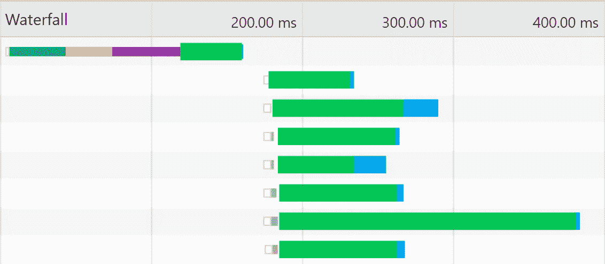
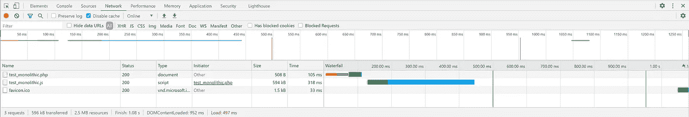
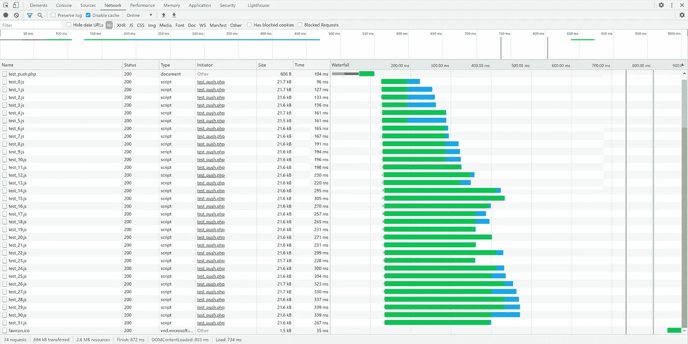
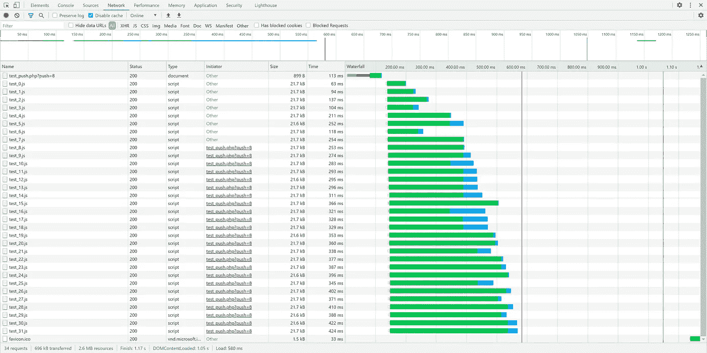
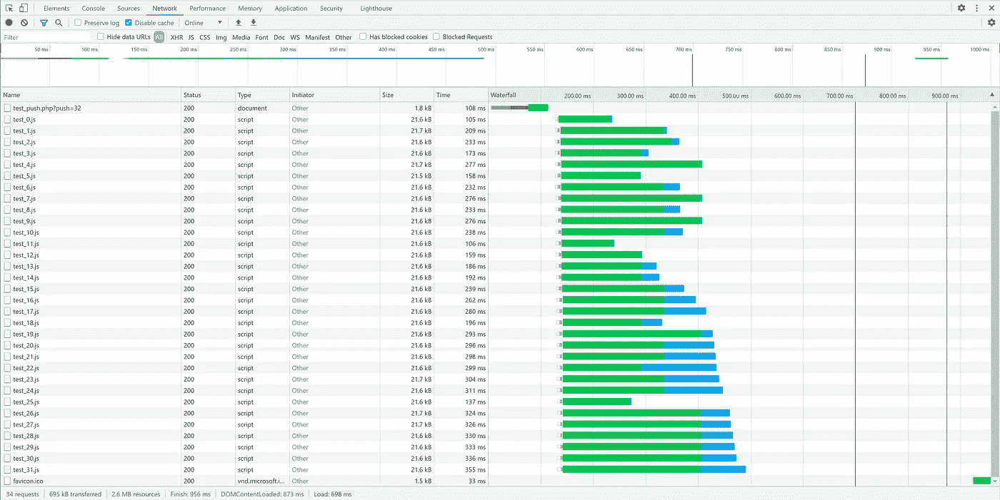
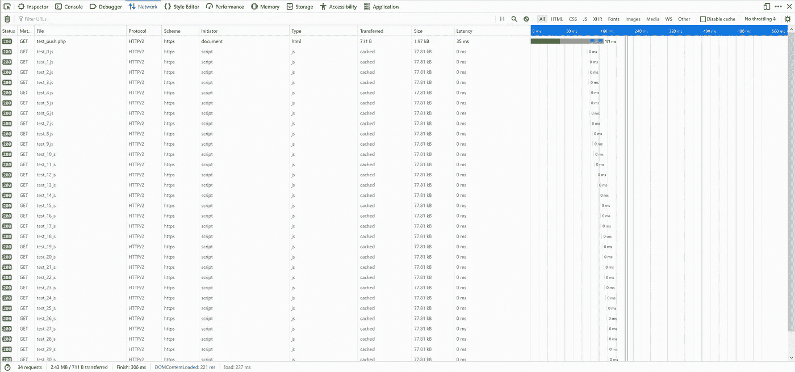
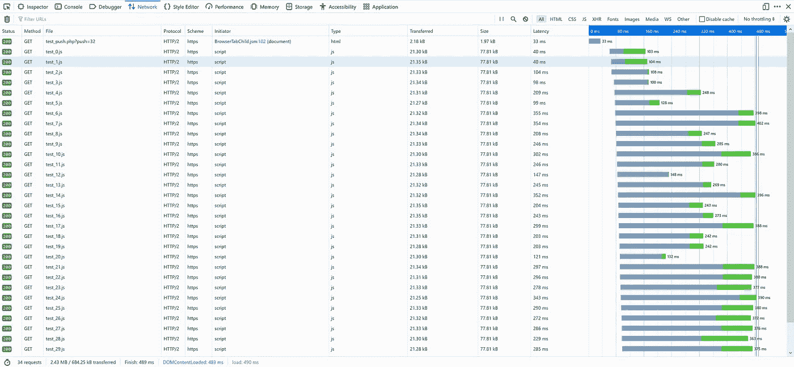

# HTTP 2 推送:事实？虚构？安慰剂？

> 原文：<https://levelup.gitconnected.com/http-2-push-fact-fiction-placebo-746cee7e3bdf>



我目前正在为一个潜在的新客户做一份工作提案/合同，他们现有的网站不仅存在可访问性问题，而且速度太慢，许多访问者甚至不想使用。我们说的是宽带缓存上 50 秒以上的页面负载——只有六张图片，这些图片都不是特别大*(尽管我可能会通过添加 webm 和优化 png 回退来将它们减半)*。

我认为我所发现的——以及诊断我所遇到的问题的错误途径之一——可能会帮助其他人。*或者至少可以开怀大笑！*

他们现有的员工已经尝试了很多“诡计”，试图让网站更快:CDN 云；AMP 将折叠样式扩展到标记中；当然还有实现 HTTP 2 推送*(又名艺术家原名 SPDY)* 。


甚至“超级士兵血清”都是不健身的借口。

你听过这个笑话吗:

***“美国人为了减肥会做任何事，任何事！！！嗯，除了正确饮食和锻炼。”***

他们的网站是一个尽一切努力让它更快的例子，**除了**使用更少的代码，更少的独立文件，并利用缓存。事实上，他们试图用来提高速度的许多技巧似乎让速度变慢了。

据我所见，这似乎包括了弊大于利的 HTTP 2 push？！？丹麦的某些东西已经腐烂了，这不应该引起问题。

# 什么是 HTTP 2 Push？

通过这种方式，同一个服务器的“连接”可以用于服务多个文件。每个单独的文件通常是对服务器的一个单独的连接和请求。在这个连接上，我们称之为“握手”的过程用于请求和发送文件。正常过程可以总结为:

1.  嘿，服务器，你有这个文件吗？它比我已经得到的副本新吗？*如有。*
2.  是的，我有那个文件，是的，它是新的。
3.  好的，发给我。
4.  好吧，来了。

> *这太简单了，不太正确。但是为了这里的目的，它必须这样做，因为我没有时间向你解释。*

这些步骤中的每一步都需要时间，通常大约是您对服务器的“ping 时间”。“ping”是一个测试请求，用于查看消息到达服务器并做出响应需要多长时间。经验法则是每次握手平均 200 毫秒左右。

考虑到一个包含 48 个文件的页面不需要 9.6 秒的加载时间，这听起来可能有点高，但这是平均值。事实是，由于能够一次打开大约 8 个到服务器的连接，这些请求通常会重叠，从而减少了它们的总体损失。请求也可以排队，而不是立即处理，这又将开销减少了一半。

对于速度较慢但仍然是宽带连接的大多数页面，一个很好的“猜测”是:

200 毫秒(初始文件)+前八个附加文件 200 毫秒+前九个文件之后的每个附加文件 100 毫秒。

因此，举例来说，如果你有一个包含两个 CSS <link>，八个图片和五个<scripts>的 HTML 文件，那么对于不在你的服务器上的“普通用户”来说，“握手开销”将会/应该在 1100 毫秒左右。(1.1 秒)。</scripts>

问题是，最坏的情况下，ping 时间可以达到一秒或更长。突然之间，16 个文件站点的 1.1 秒变成了 5.5 秒。文件越多，情况越糟。你有一个由 85 个独立文件组成的页面，平均开销是 4 秒，但是在糟糕的一天或者连接中断的时候，开销会达到 42 秒。与此同时，如果您的 ping 非常低，服务器流量很低，或者只有几公吨的服务器可用，或者您只是运气好，对于同样的 85 个文件，可能只有半秒钟的时间！

我见过很多用户的握手开销超过一分钟的网站！不管两端的连接速度有多快。

你是否曾经通过 FTP 上传了一吨的文件，并注意到上传一百个 10k 的文件比上传一个 1mb 的文件要多花很多倍的时间？那是握手开销。FTP 的握手比 HTTP 差得多，这就是为什么很多小文件比一个大文件慢，但是不管怎样 HTTP 也会发生同样的情况。您可能拥有千兆位的吞吐量，并在实际传输文件时达到饱和，但随后通过握手降低了整体速度…地理、距离、其他网络流量和许多其他因素都可能会干扰这种情况。


说真的，“但它对我来说很快”是这种令人难以置信的令人麻木的愚蠢程度。这种心态的核心是自恋型反社会，这让情况变得更糟。

作为一名开发人员，您必须停止考虑 ping 时间对您来说是什么样的，而是关注它对您的大多数用户来说可能是什么样的。这就是为什么你依赖数学，而不是“但是我的页面加载速度很快”

我经常听到这样的话，“但是对我来说很快！”——**好吧，为你干杯！**就像戴着面具一样，这**与你无关！**

总之，“HTTP 2 Push”的设计是通过让服务器说“您请求了这个文件，但是您也将需要这些文件”来避开握手开销。双方不必建立单独的请求，而是可以在一个事务中建立一大堆请求，从而降低握手开销。

这听起来是一个很好的解决方案。当你请求你的 HTML 时，服务器会说“你也需要这些”，然后浏览器会说“好的，谢谢，我都要了！"

您只需在 http 头中添加如下内容:

```
Link: </scripts/startup.js>; rel=preload; as=script
```

…然后，客户将能够通过更少的握手在同一连接上获得该文件。

关于这个主题的更详细的文章，而不是我的粗略概括，我建议斯蒂芬瓦格纳的文章“粉碎杂志”

[https://www . smashingmagazine . com/2017/04/guide-http 2-server-push/](https://www.smashingmagazine.com/2017/04/guide-http2-server-push/)

# 问题

我对任何客户端做的第一件事就是在 Chrome 和 Firefox 中调出瀑布/网络列表*(他们的开发工具显示的信息略有不同)*并查看原始文件数。他们在一个页面上有 117 个文件，我可能不会完成超过 12 个文件。 ***嗯这就有你的问题了。***


JS 是免费的，你的脚本也是免费的。没用的，你不能这么做。让我告诉你，这些家伙是哑巴。

当我向他们现有的开发人员询问所有这些无休止的无意义的独立脚本时，他说“*当我们可以推送所有这些脚本时，我们为什么要担心呢！*”。

这是那种让我拉响狗屁警报的总括声明；最近我从 JavaScript 爱好者那里听到了很多。

## 我客户的服务器只是偶尔推送？

很奇怪，大部分时间就像推力不存在一样，但时不时地它会工作。

然后我看到了。他们使用清漆…一个非常恰当命名的工具，因为它基本上是倾倒一罐虫胶在一堆。再怎么打磨也不过是马粪上的虫屎。

Varnish 是一个网站缓存工具，因此当相同的请求发送给用户时，它只是发送相同的静态文件，而不是再次运行服务器端代码和所有 SQL 查询。

…它拦截东西的方式，不是发送他们用来创建推送的 PHP 头()。如果他们的 PHP 实际运行，推送头就在那里。当清漆发挥它的“魔力”时，没有推头。哎哟。

我不怪 varnish，他们在 PHP 中声明了 push，而不是他们的 httpd.conf 或其他虚拟主机文件。这很容易解决。但是…

当 Varnish 的服务器端缓存工作而客户端缓存为空时，子文件的加载速度比 PHP 运行和推送工作时更快！

## 即使推“工作”,它还是慢了！

我盯着 FF 和 Chrome 的瀑布说“我真不敢相信”。我真的相信“推”是一个好东西，它提供了速度优势。我开始怀疑我是否像那些认为前端框架“更容易”的乡巴佬一样，被宣传和彻头彻尾的谎言欺骗了！

因为我刚刚做了一个网站评估/提案，甚至还没有得到报酬，所以我决定做一个在我自己的服务器上运行的测试案例，因为如果“推送”被证明是胡说八道，我需要知道对于我自己和我自己的网站来说，我已经实现了它。

## 所以我们来做个测试吧！

我认为一个不错的基准是将 32 个单独的脚本加载到一个页面中。使用一个 PHP 文件作为主文件，我可以使用$_GET 来设置要推送的脚本数量。我还制作了一个“单片”脚本，将所有 32 个脚本合并到一个文件中，以制作另一个测试用例。然后，我可以测试“只创建一个文件”与“不要麻烦”与“推送一些文件”以及“全部推送”的对比。"

为了简单地表示半真实的负载，我想我应该让它们每个都包含一个生命，以防止名称空间冲突，并允许我用一个简单的`cat *.js > monolithic.js`将它们合并到一个文件中

*吸那个“模块”…*

每个文件在一个字符串数组中包含 128 段随机生成的 lorem ipsum:

```
(function(d) {
  var testData = [
    "Cras viverra diam pellentesque, finibus metus non, vulputate augue. Aenean nec dictum arcu, eget luctus nibh. Maecenas lobortis, eros vitae commodo faucibus, magna nisl venenatis nisi, eu lobortis metus augue quis ipsum. Nullam iaculis est eget leo suscipit, id vulputate turpis sodales. Praesent augue dolor, consectetur ut laoreet eu, fringilla non arcu. Curabitur pretium mi eget odio faucibus, non tincidunt diam dignissim. Quisque ac lectus velit.",
    "Donec ornare sit amet metus sit amet lobortis. Nulla imperdiet, ligula a maximus luctus, arcu nibh bibendum ligula, eu ultrices sapien urna id risus. Donec felis nunc, commodo euismod rutrum at, finibus nec diam. Nullam ultrices velit nec dui elementum cursus. Suspendisse potenti. Mauris at faucibus neque, a dictum nunc. Nullam in odio id ipsum viverra lobortis a sit amet augue. Morbi blandit ligula in sem vulputate finibus. Donec aliquet purus dolor, et vulputate massa viverra vel. Ut faucibus magna id est luctus, sit amet commodo lorem volutpat.",
// etc, etc, etc...
  ];
```

然后在 onload 时插入到文档中。

```
 window.addEventListener("load", function() {
    for (var line of testData) {
      d.body.appendChild(
        d.createElement("p")
      ).appendChild(d.createTextNode(line));
    }
  }, false);

})(document);
```

我认为这已经足够接近我们合成测试的真实工作负载了。在 32 个文件中，总共有 2.45 兆字节的脚本，大致相当于我的潜在客户目前的无能的火车残骸。

有兴趣看完整测试的可以在这里下载一份:
[https://cutcodedown . com/for _ others/medium _ articles/http 2 push/http 2 push . rar](https://cutcodedown.com/for_others/medium_articles/http2Push/http2Push.rar)

结果…不是我所期望的。在我的 Chrome“非公共访问”测试服务器上测试，瀑布式的变化…很有趣。

**铁板一块，一个单一的大文件**



正如我们所看到的，大文件在加载时间不到 450 毫秒时就出现了。这通常是我认为非推送网站的最佳选择，也是我“传统”的处理方式。

并行性实际上有可能使单独的文件运行得更快。所以…

**32 个独立文件，无推送**



我们实际上并没有受到很大的冲击。最后一个文件在 475 毫秒左右完成…在多次测试中，平均保持 25 到 50 毫秒的差异。我认为在误差范围内，重复测试(20 倍)会导致平均差慢 28 毫秒。伍佩迪·DOO！尽管握手已经是几十年前众所周知的事实，但这是否让握手问题成为谎言？

**32 个单独的文件，推第 8 个。**



我们可以看到推送正在工作，因为“启动器”更改为“其他”，而不是文件。我们看到的非常有趣，在大约七个文件深度处，我们看不到等待时间的改善…但是当我们到达底部时，它实际上花费了更长时间，好像我们的推送正在延迟非推送文件。*实际上哪种说法有道理……*

最后一个文件在 570 毫秒左右加载。事实上，我们的速度更慢了……尽管误差小于 150 毫秒，人们不得不质疑这是否在我们的误差范围内，更不用说这是否重要了。同样，在多次测试中，差异似乎是一致的。

由于推送的工作方式，我们所做的是占用单个连接的带宽，这就是实际传输时间更长的原因。如果你有一个高流量的服务器，这实际上会减少所有连接的可用带宽！这也意味着这些文件都必须等待更长时间，尤其是那些更久的文件。

虽然我们减少了前几个文件的等待时间，但其余的文件需要更长时间。我们能像我的客户所做的那样，通过推动一切来纠正这一点吗？

**32 个独立文件，全部推送！**



最后一个文件在 495 毫秒完成，所以比只推 8 好，但不如根本不推！

你可以看到等待时间和装货订单到处都是。这种页面负载的“一致不一致”表明，我的主机(在纽约)和我(在新罕布什尔)之间的网络流量很可能是造成问题的原因之一…但浏览器和/或服务器也不知道何时/如何处理事情。

有了这些结果——至少是干净利落的发球——推和不推的区别就不一样了！

这是在我们谈论房间里的大象之前。是的，复数。他们有两个人！

## **1)除了最近的类似 Chrome 的东西，推送不会被缓存**

如果我们在 Chrome 中关闭缓存，它们会被缓存*(这是最近的变化)*，但是在 Firefox 中不会。让我们看看那个。

**无推送，缓存启用，火狐**



缓存正在工作，因为我们没有推送…但我们添加了推送？

**全部推送，缓存启用，火狐**



看，它没有被缓存。起初我认为这可能是“当＄_ GET 被设置时 FF 不在 F5 上缓存”的错误——人们仍然声称不存在并被删除，就好像每次有人提起它时它都没有被发布到 bugzilla 一样——但我运行了一个静态版本来确定。

人们试图使用许多“技巧”来绕过忽略缓存的推送，通常涉及一个额外的 cookie…但这很脆弱，更多的代码会延迟每个请求，并且通常涉及 cookie 的时间错过缓存时间，如果用户的缓存反正是空的，就会导致以传统方式发送文件。这是不值得做的，因为在这一点上，你只是把好的代码扔在坏的代码后面。

## 2)推送不能利用静态服务器/ CDN！

因为“推送”依赖于初始 HTML 文件的头来设置值，并使用相同的连接，所以它不能用于对来自单独的服务器/域的文件进行排队。

为静态文件准备一个单独的服务器有很多好处。页面的 cookies 开销不会添加到每个文件请求中。静态服务器软件的响应速度更快，因为它不需要像 htaccess 或服务器端语言这样的挂钩。为此，像 lightppd 这样的服务器软件，或者在一个单独的域或子域上的 CDN 可以真正地加速你的页面。

而且不能从单独的域推送文件！

这就是喜剧开始的地方，在这种情况下，我的客户为 CDN 付费，上面有他们所有的静态图像和视频…但他们的 it 人员被骗了，认为推送会比静态服务更快，所以他将所有的 CSS 和脚本移回他们的常规主机，这样他们就可以被推送，取消了他们仍然在付费的昂贵的优化。

# 这仍然不足以解释客户的问题

全推和不推之间的区别远低于握手应该持续的时间——在不推的情况下——似乎让我认为 HTTP2

1.  不是客户的问题吗
2.  对他们来说是浪费时间
3.  总的来说是浪费时间。

我将不得不在我自己的网站上进行更多的测试，三四年前我在很多地方实现了它…如果这真的是假的呢？那么，它被接受到 HTTP 规范中真的很可悲。

要么是我做事的方式，要么是我编写解决方案的方式太精益了，这意味着它不适用于我做的事情或我做的方式。

**对于那些用不完善的方法编写臃肿代码的人来说,“推”真的只是又一个热门时髦的废话吗？！？我希望不是，但越来越像了。**

*不可否认，它来自谷歌，如今我奶奶能写出比他们吐出来的垃圾更好的代码……她已经在地下呆了三十二个冬天了。*

# 所以 HTTP 2 Push 不是问题

虽然它在人工测试中并没有带来显著的差异，但我们可以感受到正在发生的事情。首先，超过 7 次推送似乎会出错，所以如果我要推送，我会将其限制在 6 个文件。(给一个额外的回旋余地)。如果您有大量静态文件，推送会延迟它们，所以组合成一个整体文件，这样只需要推送一两个脚本、一两个样式表等等，您仍然会看到好处。*这可能就是为什么我在我现有的一些网站上添加了 push，看起来确实有所不同。*

它不是解决问题的万能答案，而且有可能奏效。问题是，它似乎很脆弱，需要大量的现场测试才能接入，并且它不应该成为在不需要的时候将几十个单独的文件放入一个页面的“借口”。

必要时，我会把它作为最后的手段，但这是在我竭尽全力在没有它的情况下尽可能快地完成它之前。

# 客户的真正问题！

简单地说，他们真正的问题不是清漆，或推，或 CDN 的；他们的问题也不能通过在页面上抛出越来越多这样的技巧来解决。

因此，我概述他们问题的草稿是这样的:

> 你的网站充斥着一堆试图让坏代码变得更快的技巧。HTTP 2 push、CDN、Varnish、将“折叠之上”的 CSS 移入标记、将大部分脚本移入标记、推迟脚本加载、后加载引入更多文件、延迟加载……如果代码本身比需要的大几十倍甚至几百倍，这些都是毫无意义的技巧。
> 
> 你的主页有 280k 的 HTML，653k 的 CSS 在 6 个独立的文件中，2.4 兆的 JavaScript 在 71 个文件中，提供 12.3k 的明文和 6 个内容图像，基本上比一个压缩页面多一点。这还不到一个文件中 20k 的 HTML，48k 的 CSS 我甚至不确定它是否需要 JavaScript，如果它确实需要，我怀疑它会/应该在一个文件中占用超过 16k 的 JavaScript。
> 
> 总的来说，媒体文件在 89 个独立的文件中有 4.1 兆字节，在 9 到 12 个文件中，我编码为大约 250k 或更少。当然慢！向它扔更多的代码或服务器交付技巧不是解决办法。
> 
> 这似乎是你的 it 主管不想听到的。构建页面的方法——无知的前端框架，如果我们忽略门户，那么网站上基本上只有一个真实页面的 SPA 方法，垃圾后端框架，缺乏语义标记，未能保持关注点的分离，以及其他类似的糟糕做法——是您的网站既慢又充满可访问性问题的原因。
> 
> 尽可能简单明了地说，不管是谁写了这个网站，他都没有资格建设或设计网站，再多的创可贴、泡泡糖和铁丝网也无法解决这个问题。它是用一堆流行的现成框架和糟糕的实践拙劣地拼凑起来的，散发着某人从《福布斯》或《彭博》中获取技术建议的味道！
> 
> 这在技术上相当于从“大众机械师”或“家庭和花园”那里获得财务建议。

所以实际上在这种情况下，**推送并不一定会造成伤害**，但也不会带来任何好处。如果有什么不同的话，它只是加剧了一个糟糕的网站的问题。我仍然不相信它不起作用，**只是在这个客户的案例和我的测试中，它没有做任何值得一提的事情。**

鉴于他们目前的流量水平，我敢打赌，如果它是按照“我的方式”建造的，它可以轻松地托管在一个 10 美元/月的 VPS 上，并有空间、带宽和 CPU 备用…这就是为什么他们正在扼杀一个 6 核超线程至强处理器，专用于 32g 内存，尽管有所有这些技巧来“帮助”… *当他们当前的流量在高峰访问时间每小时仅超过 100 次访问时，这是一个笑话。*

我的意思是 land 的缘故，它是一个压缩页面，一个联系表单处理程序，一个登录/注册，以及一个供成员查看他们的数据/统计和记录“来自现场”的信息的门户，这些信息在后端被编译成统计和/或显示在主页上。这不应该是每次访问下载 500 万字节，并分布在几十个主页文件上，更不应该是他们在后端运行的半千兆字节的代码！ *因为拉腊维尔、自作聪明等等等等……*

这是另一个惊人的例子，说明把所有数据都扔进垃圾桶并从头开始比试图保存现有数据更快。更可悲的是，显然他们花了 8 个多月才拼凑出这个烂摊子，而我认为这是大约 60 个工时的劳动来从头开始重建。

# 结论

正如开始所说，**人们会做任何事情让他们的网站更快**，除了在不需要的地方停止使用 JavaScript，停止使用臃肿的前端框架，比如 bootstrap 或 tailwind，让事情更难处理、开发或修复，等等，等等。

当你在过程的后面看到一些错误的东西时——比如所有这些让事情“更快”的技巧——就很容易把问题归咎于它们，就像我准备用“推”做的那样。事实是，你经常只看到直接深入骨髓的腐败的表面症状。

在解决实际问题之前，也很容易欺骗自己添加这些工具/优化。尤其是当人们声称某些错误的选择是多么“容易”时，这是有缺陷的，甚至是完全虚构的。*再次参见*中的“框架”


"排毒'我的屁股…享受你的"清洗"哎呦我拉裤子。

对于 ySlow、Google PageSpeed、Lighthouse、Pingdom 等工具来说更是如此，把 push、CDN 和[之类的东西放在它们的建议的前面和中心。它们最终充其量不过是掩盖了实际问题，或者在最坏的情况下，是基于安慰剂的骗局，类似于排毒、有机食品和漂白灌肠剂。](/putting-above-the-fold-css-in-the-markup-makes-your-page-load-faster-at-best-a-half-truth-4103f9150128)

*真正令人难过的是，考虑到目前的情况，他们现有的员工如何在提供信息或解释他们的选择方面与我对抗，在建议的改变方面与我对抗，等等……我有点想减少损失并逃跑。不管我们决定什么样的价格，这个都不值得我们头疼。我认为自己很幸运，能在一个财政上有选择余地的地方。*