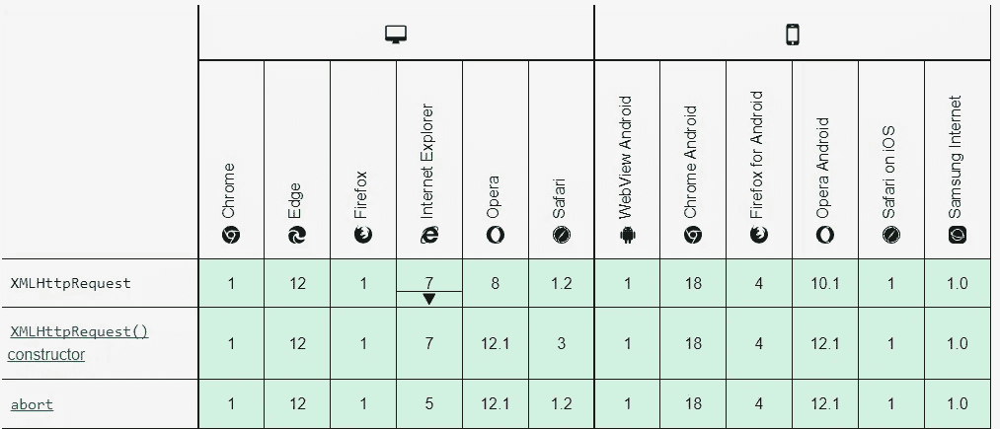

# HTTP 调用比较:获取 API 与 Axios

> 原文：<https://levelup.gitconnected.com/http-call-comparison-fetch-api-vs-axios-f8b3a7db3e85>

亨特·哈里特在 [Unsplash](https://unsplash.com?utm_source=medium&utm_medium=referral) 上的照片

当我开始一个新的前端项目时，我总是争论的一件事是:我应该使用 fetch API 吗？还是应该用 Axios？在这里，我将描述每种工具之间的区别，以便您可以做出使用哪种工具的明智决定。

让我们先回顾一下每个工具的基础知识，从 Fetch 开始。 [Fetch API](https://developer.mozilla.org/en-US/docs/Web/API/Fetch_API) 是一个内置的浏览器 API，用于从服务器获取数据。如果你有使用 [XMLHttpRequest](https://developer.mozilla.org/en-US/docs/Web/API/XMLHttpRequest) 的经验，那么这个 API 基本上就是它的简单版本。下面是这个 API 的示例代码。

[MDN 网络文档](https://developer.mozilla.org/en-US/docs/Web/API/Fetch_API/Using_Fetch)

[https://axios-http.com/](https://axios-http.com/)

现在来说说 Axios。像 Fetch API 一样， [Axios](https://axios-http.com/docs/intro) 是一个用于从服务器获取数据的 NPM 库。如果 Fetch API 只能用在浏览器端，那么 Axios 可以用在浏览器端和服务器端。这是因为每一侧获取数据的方法不同。在浏览器端，它使用 **XMLHttpRequest** 。而在服务器端，它使用[**http**](https://nodejs.org/api/http.html)**模块。下面是这个 API 的示例代码。**

**[Axios 文档](https://axios-http.com/docs/example)**

**注意，Axios 需要使用单个承诺来获取数据体，而 Fetch API 使用双承诺风格。这是因为一旦接收到响应的读取器，Fetch API 就会返回。然后 API 需要等待直到主体被加载，因此出现了双承诺风格。**

**现在，让我们来谈谈这两种工具在各个方面的区别。下面是我们将要讨论的方面的列表:**

*   **一般**
*   **错误处理**
*   **和睦相处**
*   **超时**
*   **截击机**

# **一般**

**好的，让我们从一般的区别开始。我们之前讨论过 Fetch API 使用双承诺，而 Axios 只是单承诺。Axios 的 single promise 让它对于机身不是那么大的用例来说更加方便。如果您的用例只是交换简单的 JSON 数据，那么 Axios 可能对您更方便。但是如果你要发送一个像图像这样的大数据，那么你可以试试 Fetch API，看看它是否适合你。**

**我们还可以聚合填充 Fetch API，使它像 Axios 一样是一个单一的 promise 风格。下面的代码是 Fetch API 的单承诺风格。**

**[StackOverflow](https://stackoverflow.com/a/32731381/17814122)**

**另一个值得一提的是 Fetch API 是内置的，而 Axios 是一个额外的依赖。如果您想让您的应用程序更轻便，那么 Fetch API 可能更适合您。**

# **错误处理**

**获取数据时，总有可能会引发一些错误。诸如无效凭证、找不到 URL 或者甚至服务器错误之类的错误是必须处理的错误可能性。在 Fetch API 中，为了检查请求是否无效，我们可以通过查看 [Response.ok](https://developer.mozilla.org/en-US/docs/Web/API/Response/ok) 属性来进行检查。如果响应在 200–299 的范围内，该属性将返回`true` ，否则返回`false` 。**

**[MDN 网络文档](https://developer.mozilla.org/en-US/docs/Web/API/Response/ok)**

**而对于 Axios，它的错误处理类似于其他基于承诺的对象:使用`catch`处理程序。所有失败的请求都将被拒绝，并且可以使用该处理程序进行匹配。以下示例是来自 [Axios docs](https://axios-http.com/docs/handling_errors) 的官方示例。我们可以看到，在示例中，错误处理可以分为 3 类:**

*   **响应错误:状态代码超出 200–299 范围。**
*   **请求出错:已发出请求，但未收到响应。**
*   **其他类型的错误:无法发送请求。**

**[Axios 文档](https://axios-http.com/docs/handling_errors)**

# **和睦相处**

**接下来，我们来讨论一下浏览器的兼容性。与[获取 API 兼容性](https://developer.mozilla.org/en-US/docs/Web/API/Fetch_API#browser_compatibility)相比，Axios 与浏览器的早期版本更加兼容。这是因为，在浏览器端，Axios 利用了 XMLHttpRequest。如果你在 [XMLHttpRequest 文档](https://developer.mozilla.org/en-US/docs/Web/API/XMLHttpRequest)上看到，这个功能与早期的浏览器版本兼容。这意味着当您使用 Fetch API 时，您必须了解它可能无法在某些早期版本上运行。在大多数情况下，这应该没有问题，因为没有多少人不更新他们的浏览器。**

****

**[XMLHttpRequest 浏览器兼容性](https://developer.mozilla.org/en-US/docs/Web/API/XMLHttpRequest)**

# **超时**

**当您的请求意外地花了很长时间来处理时，您可能希望早点结束它，这样用户就可以知道有什么地方出错了。为了实现这一点，我们在使用的获取工具中需要超时功能。在 Axios 中，这个功能已经存在。这就像在请求配置中添加`timeout`属性一样简单。**

**而对于 Fetch API，没有内置的功能。但在较新的浏览器版本中，有一个我们可以使用的名为[abort controller](https://developer.mozilla.org/en-US/docs/Web/API/AbortController)的接口。简单地说，AbortController 是一个接口，我们可以用它来中止仍在运行的获取请求。该接口的使用示例如下所示。**

# **截击机**

**Axios 具有广泛的功能。在我看来，最重要的功能之一是拦截器功能。该功能将在运行之前拦截您的请求和响应。这可以用于很多事情，比如日志记录、钩子调用或添加头。拦截器的样本代码可以在下面看到，摘自 [Axios 官方文档](https://axios-http.com/docs/interceptors)。**

**[Axios 文档](https://axios-http.com/docs/interceptors)**

# **关闭**

**所以对比就这样了。总的来说，我个人更喜欢在我的项目中使用 Axios，以防我需要它们的额外功能。但是如果您有一个特定的用例，您认为您需要使用 Fetch API，那么就继续使用它。它们都是成熟的工具，当你有关于它们的问题时，你可以问很多人，所以选择任何一种工具都不会错。**

**大家好，我是 Adyaksa，我写的是软件开发和我的语言学习经历。我计划每周发布一篇博客，内容是我在做兼职项目时发现的一些有趣的事情。如果你感兴趣，你可以关注我来了解它的最新情况！**

****资源:****

*   **[https://blog . log rocket . com/axios-vs-fetch-best-http-requests/](https://blog.logrocket.com/axios-vs-fetch-best-http-requests/)**
*   **[https://stack overflow . com/questions/32721850/why-the-response-object-from-JavaScript-fetch-API-a-promise](https://stackoverflow.com/questions/32721850/why-is-the-response-object-from-javascript-fetch-api-a-promise)**
*   **[https://stack overflow . com/questions/46946380/fetch-API-request-time out](https://stackoverflow.com/questions/46946380/fetch-api-request-timeout)**