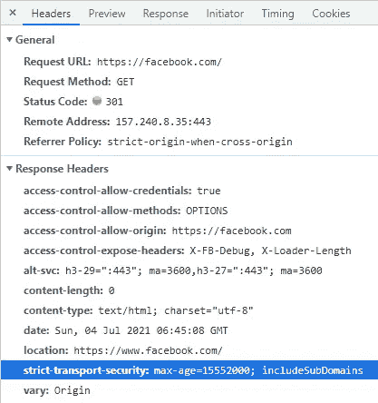
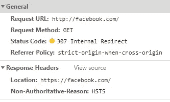

# HTTP 严格传输安全常见问题

> 原文：<https://levelup.gitconnected.com/http-strict-transport-security-faqs-844e00ac385c>

## 关于 HSTS 和预载的一些问答


亚历山德罗·萨基在 [Unsplash](https://unsplash.com/photos/NUFnfYd09iI) 上的照片

以下是我在学习 HSTS 时想到的一些问题，以及相应的答案。

## 什么是 HSTS？

严格传输安全标头如下所示:



它在网站的响应中返回，让浏览器知道从现在开始它应该只尝试使用 HTTPS 访问网站。

在你的浏览器接收到 HSTS 报头后，下次你去 http://facebook.com 的[，](http://facebook.com,)时，你的浏览器不会真的发出请求，它会做一个“内部重定向”(HTTP 307)，而是请求[https://facebook.com](https://facebook.com)。



浏览器只知道使用 HTTPS，并相应地重定向

这和你在浏览器的地址栏中输入[https://facebook.com](https://facebook.com)的效果是一样的。

## HSTS 有什么意义？

想象一下，你在机场，一名黑客从他们的笔记本电脑上设置了一个公共 Wi-Fi，并托管了一个假版本的 http://facebook.com。你去[http://facebook.com](http://facebook.com)，黑客得到你的用户名/密码。

多亏了 HSTS，如果你已经访问过 https://facebook.com，你的浏览器应该已经收到了 HSTS 的标题，并且知道从那时起使用 HTTPS 的版本。

但是如果你还没有访问过 HTTPS 版本呢？

## 事先装好

如果用户第一次通过黑客的公共 Wi-Fi 访问[http://facebook.com](http://facebook.com)，浏览器不知道要重定向到 HTTPS，用户的账户就会受到威胁。

这就是[预载](https://hstspreload.org/)发挥作用的地方。谷歌维护着一个硬编码到 Chrome 和其他浏览器中的域名列表。当你第一次使用 HTTP 进入这些域之一时，浏览器将把你重定向到 HTTPS 版本，即使你的浏览器还没有收到 HSTS 报头。

这解决了前面提到的公共 Wi-Fi 的安全风险。

## 预载要求

预载有[要求](https://hstspreload.org/)，你可以阅读相关内容。预载的有效 HSTS 标头示例如下:

`Strict-Transport-Security:` `max-age=63072000; includeSubDomains; preload`

有一点要注意的是，你只能注册域名，即。没有子域。

## 为什么不能注册子域？

HSTS 预加载列表以二进制形式发送到全球数十亿个浏览器客户端，这使得控制该列表的大小变得非常重要。

为了使该列表尽可能小，并确保列表中的每个条目为用户提供最广泛的价值，HSTS 预加载列表的政策是预加载 TLD 和可注册域名，通常称为 eTLD + 1(其中 eTLD 由[公共后缀列表](https://publicsuffix.org/)确定，而+ 1 意味着加上一个额外的标签)。

预加载子域名仍然允许将来预加载其他子域名(或可注册域名本身)，这应该通过预加载可注册域名并对其下的域名授予 HTTPS 强制执行权限来处理。

## 错误:HTTP 首先重定向到 www

我在检查我的网站的资格时发现了这个错误:

```
Error: HTTP redirects to www firsthttp://website1.com (HTTP) should immediately redirect to https://website1.com (HTTPS) before adding the www subdomain.Right now, the first redirect is to https://www.website1.com/.
The extra redirect is required to ensure that any browser which supports HSTS will record the HSTS entry for the top level domain, not just the subdomain.
```

为什么[http://website1.com](http://website1.com)不能直接使用预加载重定向到[https://website1.com](http://website1.com)，而不管它当前重定向到[https://www.website1.com](https://www.website1.com/)的事实？

要回答这个问题，想想如果你有另一个子域，[http://sub.website1.com，](http://sub.website1.com,)只使用 HTTP 运行会发生什么。

如果谷歌让你预装[http://website1.com](http://website1.com/)，那么所有的子域名都会被内部重定向到 HTTPS 版本，这将导致[http://sub.website1.com](http://sub.website1.com,)不再工作，因为用户会被重定向到[https://sub.website1.com](http://sub.website1.com,)。

谷歌强迫你自己先发现这些问题(在你的网站开启半永久预加载功能之前)，强迫你将用户重定向到[https://website1.com](https://website1.com/)，这样当 HSTS 的标题返回时，浏览器就知道使用 HTTPS 作为顶级域名和所有子域。

这个想法是，你会发现 HTTP 子域的问题，并在预加载设置之前修复它们，这是[一旦到位](https://bugs.chromium.org/p/chromium/issues/detail?id=527947)很难删除的。

## 如果我从 HTTP 网站返回 HSTS 头会发生什么？

如果从使用 HTTP 的网站返回，浏览器将忽略 HSTS 头。

这是因为浏览器没有办法知道网站是否真实。你可能在一个恶意的公共 Wi-Fi 上，就像我们之前描述的那样。

黑客可以插入或删除 HSTS 报头，所以浏览器没有必要关注它。

如果一个网站没有设置 HTTPS，并且浏览器没有忽略 HTTP 上的 HSTS，那么黑客可以通过 HTTP 返回 HSTS 报头，给网站的用户造成问题。当用户下一次通过家里的 Wi-Fi 访问该网站时，浏览器会将 HTTPS 用于专为 HTTP 设计的网站，这将导致 404 未找到。

## 摘要

HSTS 是一个很好的安全特性，但是你真的需要考虑预加载的含义，以及以后可能必须移除它的风险，这是很困难的，是否值得为这种特殊情况提供额外的安全层。

除非你运营一个知名网站，否则你的某个用户第一次通过公共 Wi-Fi 访问你的网站，以及有黑客运行该 Wi-Fi 的可能性非常小。