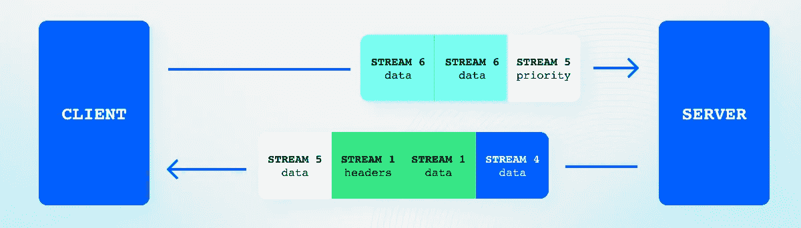

# HTTP、WebSocket、gRPC 或 WebRTC:哪种通信协议最适合你的 App？

> 原文：<https://levelup.gitconnected.com/http-websocket-grpc-or-webrtc-which-communication-protocol-is-best-for-your-app-1cc5a0786c86>


HTTP vs WebSocket vs gRPC vs WebRTC:应该使用哪种通信协议

为应用选择通信协议时，有许多不同的选项。在本帖中，我们将看看四种流行的解决方案: **HTTP** 、 **WebSocket** 、 **gRPC** 和 **WebRTC** 。我们将通过研究每种协议背后的技术、它的最佳用途以及它的优缺点来探究每种协议

我们的交流方式在不断改进:变得更快、更方便、更可靠。我们的交流已经从使用信鸽发送信息发展到邮政邮件，到座机的发明，再到通过一个可以放在我们口袋里的小设备发送电子邮件和短信。

未来我们甚至可能会把会议和生日聚会过渡到 VR 上(希望这只是个玩笑！).但是最好的交流方式总是取决于具体情况。

一条简短的短信有时比一封长邮件更好。其他时候，与团队进行视频通话是交流信息的最佳方式。相比之下，重要的保险文件必须通过普通邮件发送，并交付硬拷贝。

我们使用的网络技术和协议也是如此。不同的应用程序有不同的通信需求。

# 概观

在本文中，我们将介绍一些开发人员可以使用的流行的**通信协议**，并探讨不同选项的优缺点。没有一个解决方案比另一个更好，只有一些解决方案更适合特定的应用或问题。

一些应用程序需要一个[点对点](https://getstream.io/blog/peer-to-peer-video-conferencing/)连接，具有低延迟和高数据传输，并且可以接受一些数据包(信息)丢失。其他应用程序可以根据需要轮询服务器，而不需要接收来自不同对等方的通信。其他应用要求实时通信和数据可靠性。

在线多人游戏、消息应用程序、博客网站、媒体画廊应用程序和[视频会议软件](https://getstream.io/blog/best-video-calling-apis/)都有不同级别的通信和数据需求。

如果您正在构建一个视频流解决方案，那么还有其他考虑因素，请参见我们关于[视频流协议](https://getstream.io/blog/streaming-protocols/)的文章，了解关于选择正确协议的更多信息。

# 什么是通信协议？

在计算机网络中，协议是控制设备之间如何交换数据的一组规则。该协议定义了通信的规则、语法、语义和同步以及可能的错误恢复方法。

本文中讨论的协议定义了应用层软件如何相互交互。不同的协议遵循不同的规则，了解每种协议的优势和局限性是非常重要的。在本文中，您将了解以下协议:


通信协议时间线

HTTP(超文本传输协议)是一种用于分布式、协作式和超媒体信息系统的应用协议。HTTP 是万维网数据通信的基础。超文本是在包含文本的节点之间使用逻辑链接(超链接)的结构化文本。HTTP 是交换或传输超文本的协议。

**HTTP/2** 旨在解决原始 HTTP 协议的缺点并提高性能。HTTP/2 比 HTTP/1.1 更快更有效，它支持多路复用，允许多个请求和响应在单个连接上进行[多路复用](https://en.wikipedia.org/wiki/Multiplexing)。其他值得注意的功能包括头压缩和服务器推送。它逐渐成为网络流量的默认协议。

WebSocket 是一种允许客户端和服务器之间双向通信的协议。这是处理实时数据的应用程序的流行选择，如聊天应用程序、[在线游戏](https://getstream.io/blog/womens-online-gaming-community/)和[实时数据流](https://getstream.io/blog/how-to-live-stream/)。

gRPC 是一个现代的开源 RPC 框架，使用 HTTP/2 进行传输。对于需要进行大量小型快速 API 调用的应用程序来说，这是一个很好的选择。gRPC 为许多语言生成跨平台的客户机和服务器绑定，使得客户机应用程序可以直接调用不同机器上的服务器应用程序上的方法，就像它是一个本地对象一样。

**WebRTC** 是一种允许客户端之间进行实时通信的技术，可以建立直接的点对点连接。它用于视频、聊天、文件共享和实时视频流应用。

# 了解 TCP 和 UDP

在深入研究上面提到的[应用层](https://en.wikipedia.org/wiki/Application_layer)之前，有必要对 TCP 和 UDP 有一个基本的了解，这两个底层[传输层](https://en.wikipedia.org/wiki/Transport_layer)以完全不同的方式促进数据传输。

**TCP(传输控制协议)**是定义如何通过互联网建立和维持网络会话的标准。TCP 是互联网和任何面向连接的网络中最常用的协议。当您浏览 web 时，您的计算机将 TCP 数据包发送到 web 服务器。web 服务器通过将 TCP 数据包发送回您的计算机来做出响应。在交换任何数据之前，首先在两个设备之间建立连接，TCP 使用纠错来确保所有数据包都被成功传送。如果数据包丢失或损坏，TCP 会尝试重新发送。

**UDP(用户数据报协议)**是一种无连接、不可靠的传输层协议。它不需要建立或维护连接，也不保证消息会按顺序传递。这意味着如果一个包没有被发送或者被损坏，可能会有一些数据丢失。UDP 通常用于流媒体或实时应用程序，在这些应用程序中，丢包比确保传输更容易。

# HTTP/1

重要的是要对所有基于互联网的通信和应用层数据传输的基础有一个基本的了解——HTTP(超文本传输协议)[。](https://developer.mozilla.org/en-US/docs/Web/HTTP)

理解 HTTP/1 及其局限性也很重要，在此之前，我们可以更详细地研究其他协议，并充分理解它们所提供的功能。

使用 HTTP，客户端和服务器通过交换单独的消息进行通信。客户端发送的消息称为请求，服务器发送的消息称为响应。这些消息通过 TCP 连接作为常规文本消息发送。它们也可以使用 [TLS](https://www.cloudflare.com/en-gb/learning/ssl/transport-layer-security-tls/) 加密，并使用 HTTPS 协议发送。

客户端通常是运行在用户手机或电脑上的网页浏览器或应用程序，但从技术上讲，它也可以是任何东西，例如，一个抓取网站的脚本。

HTTP 请求只能单向流动，从客户端到服务器。服务器无法启动与客户端的通信；它只能响应请求。


HTTP —请求/响应示例

HTTP 非常适合传统的 web 和客户端应用程序，在这些应用程序中，信息是根据需要获取的。例如，您刷新一个页面，然后请求服务器获取最新的信息。

然而，这个协议以一种出乎意料的方式扩展了。在下面几节中，我们将探索 HTTP/1 的一些限制。

# HTTP/1 实时

当消息需要从客户机实时发送到服务器时，HTTP/1 效率很低，反之亦然。例如，如果服务器上有需要与客户端共享的新信息，则只有当客户端发起请求时，该事务才会发生。

有解决这个问题的方法，使用称为 HTTP 短期和长期轮询的技术，以及服务器发送的事件。

## 短期投票

HTTP 短轮询是一种技术，在这种技术中，客户机反复向服务器发送请求，直到它用新数据作出响应。一旦接收到数据，它就再次开始这个过程，并反复询问，直到有其他可用的数据。


HTTP 短轮询示例

这是一种低效的实时通信策略，因为它通过连续传输和解析 HTTP 请求/响应来浪费大量资源。

## 长轮询

使用 HTTP 长轮询，客户端发出一个请求，然后服务器保持连接打开，直到有新的数据可用并可以发送响应。客户端收到响应后，会立即再次建立新的连接。


HTTP 长轮询示例

长轮询比短轮询更有效，但不是实时通信的最佳解决方案。

## 服务器发送的事件(SSE)

[服务器发送的事件](https://developer.mozilla.org/en-US/docs/Web/API/Server-sent_events/Using_server-sent_events)允许客户端保持连接打开并实时接收来自服务器的更新(推送消息),而无需不断轮询服务器以获取新数据。这是一个单向连接，所以您不能从客户端向服务器发送事件。

SSE 是一种标准，描述一旦建立了初始客户端连接，服务器如何向客户端发起数据传输。

# HTTP/1 的性能问题

> *大多数 HTTP 数据流由小的、突发的数据传输组成，而 TCP 针对长期连接和批量数据传输进行了优化。在大多数情况下，网络往返时间是 TCP 吞吐量和性能的限制因素。因此，延迟是性能瓶颈，大多数 web 应用程序都克服了这个瓶颈。*

上面的意思是，HTTP 使用的 TCP 是为了处理长期连接和传输大量数据而构建的。另一方面，HTTP/1 会打开一堆短命的 TCP 连接，通常只发送小块数据。

## 行首阻塞

HTTP/1.0 的一个性能问题是您必须为每个请求/响应打开一个新的 TCP 连接。这对于最初发明 HTTP 的目的来说不是问题——获取超文本文档。文档部分很重要，因为 HTTP 不是为“超媒体”设计的。

随着 web 的发展，为每个请求打开一个新的 TCP 连接成了一个问题。我们开始构建完整的应用程序，而不是简单的网页，浏览器需要检索的媒体和文件变得越来越多。假设一个典型的 web 应用程序需要一个 HTML、CSS 和 JavaScript 文件，以及各种图像和其他资产。对于每个文件，必须建立一个新的连接。

随之而来的是 HTTP/1.1，它具有持久连接，这定义了我们可以在同一个 TCP 连接上有多个请求或响应。

这种解决方案无疑是一种改进，但是它不允许服务器同时响应多个响应。这是一个序列化的协议，您必须发送一个请求并等待响应，然后发送第二个请求，依此类推。这就是所谓的[线头阻塞](https://en.wikipedia.org/wiki/Head-of-line_blocking)。

然而，实现一些并行是可能的，因为浏览器可以打开多达六个到同一来源的 TCP 连接——其中“来源”被定义为**主机**和**端口号**的唯一组合。

例如，如果您有一个需要加载 12 幅图像的照片库应用程序，那么将发出六个请求来加载前六幅图像，每个请求将打开一个新的 TCP 连接。其他六个图像将被阻塞，直到收到响应，其中一个打开的连接可用于加载下一个图像。到同一来源的最初六个打开的 TCP 连接在变得可用时将被重用，但是您被限制为六个活动连接。

自然地，程序员找到了一个简单的解决方法——改变原点。不是在同一个原点上托管所有资源，而是在一个原点上托管六个图像，而在另一个原点上托管其余的图像。现在，您可以同时拥有 12 个请求(或打开 TCP 连接)。这被称为“分片”。

*   图像**1–6**托管在`1.images.com`上
*   图像**7–12**托管在`2.images.com`上

但是，您可以这样做的次数是有限制的，并且很难确定最佳的碎片数量。在某种程度上，添加更多的碎片会增加复杂性，增加开销，并可能导致链路拥塞和数据包丢失。

还存在其他问题，因为每个 TCP 连接都会给服务器增加不必要的开销。连接会相互竞争，每次 TCP 和 TLS 握手都会增加不必要的成本，并且必须使用其他服务器/代理资源来维护活动连接。HTTP/1 使用底层 TCP 连接的方式有一个明显的限制。

## 标题和 Cookies 膨胀

另一个问题是，随着 HTTP 规范的发展，规范中增加了更多的报头。开发人员还可以选择将 cookiess 添加到标题中，这些 cookie 可以任意大。这增加了很多麻烦，因为每个请求和响应都需要传输所有这些文本信息，而且 HTTP/1.1 不包括压缩头和元数据的机制。

如果您需要高性能的 RPC 协议，这种开销会迅速增加，HTTP 不再是最佳解决方案。

## 优化

在 HTTP/1.1 中，浏览器通过在客户机上保持一个优先级队列并对如何最好地利用可用的 TCP 连接进行有根据的猜测来“区分”资源的优先级。浏览器嵌入了判断哪些资源比其他资源更有价值的启发式方法。

例如，加载 CSS 将比加载图像具有更高的优先级。

问题是，作为开发人员，您没有办法区分一个请求的优先级，或者改变正在进行的消息的优先级。首先加载什么内容是由浏览器决定的，并且您对优先级方案没有发言权。

# HTTP/2

[HTTP/2](https://web.dev/performance-http2/) 是 HTTP 协议的改进版本，解决了 HTTP/1 的所有性能问题，并在不改变任何语义(动词、标题等)的情况下增加了其他增强功能。

HTTP/2 中最显著的变化是使用多路复用通过一个**单一 TCP 连接**同时发送和接收多个 HTTP 请求和响应。所有 HTTP/2 连接都是持久的，每个源只需要一个连接。这样可以更有效地利用网络资源，并显著提高应用程序的性能。

HTTP/2 的一些其他好处:

*   使用标头压缩来减小标头的大小，这样可以避免反复发送相同的纯文本标头。这大大减少了请求/响应的开销和发送的数据量。
*   启用优先级，允许客户端(开发人员)指定其所需资源的优先级。还可以更新正在进行的请求的优先级——例如，在滚动时，如果图像不再可见，优先级可以改变。
*   在客户端请求数据之前，使用服务器推送向客户端发送数据。这可以通过消除客户端发出多个请求的需要来缩短加载时间。

# HTTP/2 是如何工作的？

HTTP/2 中的基本协议单元是一个**帧**。这种新的二进制成帧机制改变了客户机和服务器之间的数据交换方式。

该标准定义了十种不同的帧类型，每一种都有不同的用途。例如，报头和数据帧构成了 HTTP 请求和响应的基础:


HTTP/1.1 与 HTTP/2 消息

一个**帧**是携带特定类型数据的最小通信单位。

其他一些框架示例包括:

*   设置:在连接开始时或连接过程中交换设置信息。
*   优先级:重新分配消息的优先级。
*   PUSH_PROMISE:允许服务器向您推送数据——这相当于对服务器将发送的内容的承诺。例如，如果您请求`index.html`，服务器可以创建一个 PUSH_PROMISE，承诺推送`app.js`和`styles.css`，这意味着客户端不需要请求这些资源。

帧组合成一个**消息**，例如上图中的报头和数据帧。这等同于正常的请求或响应。

最后，一系列**消息**可以是**流**的一部分。这允许客户机和服务器之间的双向数据流以及完全的请求和响应多路复用。


HTTP/2 多个流

上图有点误导，给人的印象是客户端和服务器之间有多个连接打开。但这是一个单一的 TCP 连接，数据以非阻塞的方式在客户机和服务器之间自由流动。



HTTP/2 多路复用流

新的二进制成帧层允许客户机和服务器将 HTTP 消息分解成独立的帧，交织它们，然后在另一端重新组合它们。

这只是对 HTTP/2.0 工作原理的总结。如果您想了解更多并探索优先级、服务器推送和头压缩，请参见[深度文章](https://web.dev/performance-http2/)中的内容。要了解 HTTP/1 问题的历史以及 HTTP/2 如何解决这些问题，请观看这个[视频](https://www.youtube.com/watch?v=ouIK1S0KdJE)。

# HTTP/2 双向数据流

来自 [HTTP/2 规范](https://datatracker.ietf.org/doc/html/rfc7540#section-5):

> *“流”是在 HTTP/2 连接中在客户端和服务器之间交换的独立的双向帧序列。溪流有几个重要的特征:*
> 
> -单个 HTTP/2 连接可以包含多个并发打开的流，任一端点可以从多个流中交错帧。
> 
> -流可以单方面建立和使用，也可以由客户端或服务器共享。
> 
> -流可以由任一端点关闭。

关于[服务器推送](https://en.wikipedia.org/wiki/HTTP/2_Server_Push)功能有很多误解，它允许服务器通过 HTTP/2 主动发送它认为你可能需要的资源，例如`.js`和`.css`文件，而无需客户端请求。这与双向流无关，只是一种针对可缓存资源的 web 优化技术。

真实的情况是，使用 HTTP/2，服务器无法启动**流**。但是一旦客户端通过发送请求打开了一个流，双方都可以在任何时候通过持久套接字发送数据帧。gRPC 就是一个很好的例子，我们将在后面讨论。

有了 HTTP/2，就有可能实现双向数据流，你可以[认为](https://stackoverflow.com/questions/28582935/does-http-2-make-websockets-obsolete)它是比 WebSockets 更好的解决方案，或者你可以认为它不是。我们将在 WebSocket 部分对此进行更详细的讨论。

# WebSockets

来自 [WebSocket 协议规范](https://www.rfc-editor.org/rfc/rfc6455):

> *该技术的目标是为基于浏览器的应用程序提供一种机制，该应用程序需要与不依赖于打开多个 HTTP 连接的服务器进行双向通信(例如，使用 XMLHttpRequest 或 iframes 和长轮询)。*

发明 WebSockets 是为了实现客户端和服务器之间的全双工通信，这允许数据通过一个开放的连接立即双向传输。

一旦建立了 WebSocket 连接，客户端就不需要向服务器轮询更新。相反，交流是双向的。与 HTTP/1 最初的长轮询和短轮询相比，这提高了速度和实时能力。WebSocket 没有符合的格式。您可以发送任何数据、文本或字节——这种灵活性是 WebSockets 流行的原因之一。

对于我们在 HTTP/2 一节中讨论的内容，其中一些可能听起来很熟悉，但重要的是要注意，WebSockets 早在 HTTP/2 之前就被发明了。稍后我们将对它们进行更多的比较。

# WebSockets 如何工作

WebSockets 有效地作为 TCP 上的传输层运行。

要建立 WebSocket 连接，客户端和服务器首先需要通过正常的 HTTP/1.1 连接执行握手。这种握手是从 HTTP 到 WebSockets 的桥梁。


WebSocket 升级请求

下面是一个客户端握手请求的例子。客户端可以使用称为升级头的 HTTP/1.1 机制将它们的连接从 HTTP 切换到 WebSockets:

```
GET /chat HTTP/1.1
Host: example.com:8000
Upgrade: websocket
Connection: Upgrade
Sec-WebSocket-Key: dGhlIHNhbXBsZSBub25jZQ==
Sec-WebSocket-Version: 13
```

然后，服务器将通过一个特殊的响应来结束握手，该响应指示协议将从 HTTP 更改为 WebSocket:

```
HTTP/1.1 101 Switching Protocols
Upgrade: websocket
Connection: Upgrade
Sec-WebSocket-Accept: s3pPLMBiTxaQ9kYGzzhZRbK+xOo=
```

WebSockets 需要一个具有`ws://`或`wss://`方案的统一资源标识符(URI)。`ws://`方案用于未加密的连接，`wss://`方案用于加密的连接，类似于 HTTP URLs 如何使用`http://`或`https://`方案。

一旦建立了双向通信通道，客户端和服务器就可以来回发送消息。这些消息可以是从二进制数据到文本的任何内容。WebSocket 连接将保持打开状态，直到客户端或服务器断开连接。

# WebSocket 多路复用

在撰写本文时，WebSocket 协议不支持内置多路复用。我们在 HTTP/2 一节中讨论了多路复用，我们了解到这是 HTTP/2 的一个内置特性，在同一个连接上多路复用多个流是可能的。每个流都有一个唯一的标识符，所有发送的帧都有一个与相应流相关联的 ID。

不支持多路复用意味着 WebSocket 协议要求每个 WebSocket 连接都有一个新的传输连接。例如，在同一浏览器的不同选项卡中运行的多个客户端将导致单独的连接。要在 WebSockets 上实现多路复用，通常需要开发人员来实现，或者依赖第三方插件或库。

# WebSocket vs HTTP/2

那么，HTTP/2 已经取代 WebSockets 了吗？简短的回答是否定的。更长的回答是 HTTP/2 使双向流成为可能，因此，WebSockets 不是唯一/最好的选择。与 WebSockets 相比，HTTP/2 作为一个规范为您做了更多的工作。它有内置的多路复用，在大多数情况下，会导致到源的开放 TCP 连接减少。另一方面，WebSockets 提供了很大的自由度，一旦建立了连接，就不会限制客户机和服务器之间如何发送数据。然而，您将需要自己管理重新连接(或者依靠库为您做这件事)。

哪一个最终更好，哪一个会起作用，哪一个不会，这是有待讨论的问题，本文并没有提供一个固执己见的答案。WebSockets 提供了很大的灵活性，并且作为一个已建立的标准，它完全受所有现代浏览器的支持，围绕客户端和服务器库的生态系统是健壮的。

有关更详细、更有见解的讨论，请参见以下堆栈溢出问题:

*   [HTTP/2 会让 WebSocket 过时吗](https://stackoverflow.com/questions/28582935/does-http-2-make-websockets-obsolete)
*   [用于低延迟客户端到服务器消息的 HTTP/2 或 Websockets】](https://stackoverflow.com/questions/50956757/http-2-or-websockets-for-low-latency-client-to-server-messages/59690386#59690386)
*   [用于双向消息流的 HTTP/2 vs web-sockets](https://stackoverflow.com/questions/59867473/http-2-vs-web-sockets-for-bidirectional-message-streaming)

还有一个 [RFC](https://www.rfc-editor.org/rfc/rfc8441) 允许在 HTTP/2 连接的单个流上运行 WebSocket 协议的机制。

> 能够从 HTTP/2 引导 WebSockets 允许两个协议共享一个 TCP 连接，并将 HTTP/2 对网络的更有效使用扩展到 WebSockets。

这已经在 [Chrome](https://chromestatus.com/feature/6251293127475200) 和 [Firefox](https://bugzilla.mozilla.org/show_bug.cgi?id=1434137) 中实现。你可以在这里阅读 Chrome 的设计文档和动机[。](https://docs.google.com/document/d/1ZxaHz4j2BDMa1aI5CQHMjtFI3UxGT459pjYv4To9rFY/edit)

# 什么时候应该使用 WebSockets？

Websockets 最适合需要实时双向通信的应用程序，以及需要快速传输小块数据的应用程序，例如:

*   聊天应用程序
*   多人游戏
*   协作编辑应用程序
*   直播体育节目
*   股票交易申请
*   实时活动订阅源

巧合的是，这是我们团队有丰富经验的领域。我们广泛使用 WebSockets 为我们的[聊天](https://getstream.io/chat/)和[活动提要](https://getstream.io/activity-feeds/)基础设施提供动力。

对 WebSockets 的支持很好，长期以来一直得到各大浏览器和客户端的支持，而且也是有据可查，易于使用。但是，不应过度使用 WebSockets 取决于你想要什么，可能有更好的选择。

例如，[服务器发送事件(SSE)](https://developer.mozilla.org/en-US/docs/Web/API/Server-sent_events/Using_server-sent_events#event_stream_format) 比 HTTP/2 效率高，使用简单。SSE 不是双向通信系统；服务器单方将数据推送到客户端。但是，如果您需要的只是一种让服务器向客户机发送数据的方法，这可能是比增加 WebSockets 开销更好的选择。当 HTTP/2 不可用时，SSE 也回退到 HTTP/1.1。此外，客户端(或浏览器)为您管理连接，并支持自动重新连接。

如果 WebSockets 上的连接丢失，则没有包含负载平衡或重新连接的机制。这必须手动实现或由第三方库实现。

# gRPC

> [*gRPC*](https://grpc.io/) *是一个现代开源的高性能远程过程调用(RPC)框架，可以在任何环境下运行。它可以通过对负载平衡、跟踪、运行状况检查和身份验证的可插拔支持，高效地连接数据中心内和跨数据中心的服务。它也适用于分布式计算的最后一英里，将设备、移动应用程序和浏览器连接到后端服务。*

gRPC 是一个开源的、基于合同的 RPC 系统，最初由 Google 开发。gRPC 使应用程序能够透明地通信，并简化连接系统的构建。

它为许多语言生成跨平台的客户端和服务器绑定，使客户端应用程序能够直接调用不同机器上的服务器应用程序上的方法，就像它是本地对象一样。

gRPC 构建于 HTTP/2 之上，利用了双向流和内置传输层安全性(TLS)等特性。

# gRPC 动机

深入了解 gRPC 背后的动机以及为什么要发明它来理解它的好处是很重要的。为什么不使用我们已经拥有的现有技术:例如 HTTP/2 和 WebSockets？为什么我们需要在现有的基础上再增加一个抽象层呢？

有多种方式可以在互联网上构建和发送数据。一些流行的例子是 SOAP、REST 和 GraphQL。如果愿意，您甚至可以创建自己的协议，通过原始 TCP 发送数据，并自己处理实现。

但是无论您选择什么作为您的通信协议，问题是您需要确保客户端和服务器在协议上达成一致。例如，如果您正在构建一个 REST API，那么您需要用来发送 REST 数据的客户端库就是 HTTP 库。默认情况下，HTTP 库内置于浏览器中，浏览器会为您处理一切:

*   它与服务器建立通信。
*   它处理 HTTP/2 并回退到 HTTP/1。并且将来需要支持 HTTP/3。
*   它处理 TLS 并协商协议。
*   它处理头、流和其他所有东西。

但是如果你不在浏览器上呢？如果你是一个运行在某个服务器上的 Python 应用程序，一个 GoLang CLI，或者一个运行在 iOS 上的 Flutter 应用程序呢？所有这些客户端都需要自己的 HTTP 库，该库理解您正在与之通信的协议。

幸运的是，许多专注的人正在为所有这些语言和框架开发各种 HTTP 库。有些语言甚至有多个不同特性的 HTTP 库。然而，所有这些都是有代价的，那就是维护。

例如，如果您使用的 GoLang 库支持 HTTP/2，那么这个成本可能会影响您将服务器升级到 HTTP/2。但是，在您的前端 Python 客户机上，对等的 HTTP 库还没有实现 HTTP/2，或者可能不再被维护。其他语言的不同 HTTP 库不能 1:1 比较。

随着 HTTP 规范的发展，这些库必须跟上技术进步、安全问题、新特性和其他补丁。HTTP 只是一个例子，对于 WebSocket 协议或任何其他协议也是如此。有些东西可能在主流浏览器中实现得很好，但是这些功能必须移植到多种不同的语言和框架中。

## gRPC 有什么不同？

gRPC 试图通过维护[流行语言](https://grpc.io/docs/languages/)本身的库来解决这个问题，这意味着所有这些语言都将支持添加的新特性。

在幕后，gRPC 使用 HTTP/2 作为它的协议，但是，这个实现对您是隐藏的。将来，gRPC 的维护者可以很容易地用 HTTP/3 替换 HTTP/2，您将立即从这一变化中受益。

gRPC 还使用协议缓冲区作为接口定义语言(IDL)及其底层的消息交换格式。这种格式是语言中立的，使得不同编程语言之间的交流变得容易。我们将在下一节更深入地探讨这个概念。


gRPC 服务器/客户端通信

# 什么是协议缓冲区？

> *协议缓冲区是 Google 的语言中立、平台中立、可扩展的机制，用于序列化结构化数据——想想 XML，但是更小、更快、更简单。您只需定义一次数据的结构化方式。然后，您可以使用特殊生成的源代码，使用各种语言轻松地将结构化数据写入各种数据流，并从这些数据流中读取结构化数据。*

传统上，对于 API，您没有由协议本身定义的契约。例如，如果您正在使用 REST，那么您通常只是发送带有键/值对的 JSON 消息，直到消息到达接收端才进行检查。该消息通常可以是任何内容，由您来确保定义了正确的结构。

看看下面的 JSON 有效负载:

```
'id': 123,
'name': 'Gordon',
'email': 'gordon@somewhere.io'
```

一旦在客户机/服务器上接收到该数据，就可以将其反序列化为一个对象，例如:

```
class Person { 
    int id;
    String name;
    String email
}
```

然而，作为开发人员，实现上述有效负载的正确序列化和反序列化逻辑取决于您——这可能涉及手动编写`toJson`和`fromJson`方法，依赖于代码生成，或者它可能是您正在使用的语言的内置特性。

无论您如何序列化这些数据，在模式发生变化的情况下，潜在地在多个环境中，底层代码都需要手动更新。

使用协议缓冲区，您可以创建一个模式来定义字段的对象类型，并指定哪些是必需的，哪些是可选的:

```
// The request message containing the person’s information
Message Person {
    optional int32 id = 1;
    required string name = 2;
    optional string email = 3;
}

// The response message containing the greetings
message HelloReply {
  string message = 1;
}
```

然后，您可以指定要公开的过程。

```
// The greeting service definition.
service Greeter {
  // Sends a greeting
  rpc SayHello (Person) returns (HelloReply) {}
}
```

一旦指定了数据结构和模式，就可以使用协议缓冲编译器`protoc`从原型定义中以您喜欢的语言生成数据访问类。

这些将是描述 proto 文件中概述的对象的接口，带有每个字段的访问器，以及将整个结构序列化/解析为原始字节的方法。

# gRPC 模式

gRPC 上有四种运输方式。这四种模式复制了我们之前讨论的行为，例如，普通的请求/响应、SSE 和 WebSockets。

## 一元 RPC

一元 RPC 是一个简单的请求和响应，类似于调用函数。客户端请求一些数据，服务器进行一些处理并返回这些数据。

## 服务器流 RPC

服务器流 RPC，其中客户端向服务器发送单个请求，并期望多个或一个响应流。客户端从返回的流中读取，直到不再有消息。

视频流就是一个例子，你请求加载一个视频，服务器用视频流来响应。

## 客户端流 RPC

客户端流 RPC，其中客户端编写一系列消息并将其发送到服务器，同样使用提供的流。一旦客户端写完消息，它就等待服务器读取消息并返回响应。

一个例子是将一个大文件上传到服务器，一旦所有的数据都被发送，客户端可以发送一个最终消息来表明上传完成，服务器可以选择响应。

## 双向流 RPC

客户端和服务器流的组合。聊天应用程序或多人视频游戏就是一个例子，其中数据需要在客户机和服务器之间自由流动。

> *双向流 RPC，其中双方使用读写流发送一系列消息。这两个流独立运行，因此客户端和服务器可以按照他们喜欢的任何顺序进行读写。*

在双向流 RPC 中，调用由调用方法的客户端发起。客户端和服务器端的流处理是特定于应用的。因为这两个流是独立的，所以客户端和服务器可以以任何顺序读取和写入消息。

# 微服务

gRPC 强大之处的一个很好的例子是在微服务领域。


gRPC 微服务通信

在这个例子中，我们有用 Python、Java 和 GoLang 编写的微服务。这些需要在它们之间发送数据。

使用 HTTP/1.1 和 JSON 将需要您为每种语言实现 HTTP 连接和序列化。您还需要确保针对每种语言正确实现模式，如果 API 发生变化，所有服务都需要手动更新。

另一方面，gRPC 为我们处理 HTTP/2.0 协议的实现。只需编写一个模式，就可以为所有使用的语言生成相应的代码。这种模式可以被视为所有语言都需要遵守的契约，使得这些服务之间的通信更加容易和可靠。

# gRPC 性能

gRPC 速度更快，并且通常比 REST 等效物的性能高得多:

*   协议缓冲区被序列化，并通过线路作为**二进制文件发送，这比普通的 JSON 消息要小得多。**
*   gRPC 使用 HTTP/2.0 来提供进一步的改进

gRPC 有效压缩发送的数据具有显著的优势，因为传输的数据负载越小，所需的 TCP 往返次数就越少。[最大传输单位(MTU)](https://www.cloudflare.com/en-gb/learning/network-layer/what-is-mtu/) 是一个度量单位，代表联网设备可以接受的最大数据包，为 1500 字节。

压缩是为您处理的，您只需使用 gRPC 即可受益。作为替代，在通过常规 HTTP 发送之前，可以使用类似 GZIP 的东西来压缩 JSON 消息。然而，这可能是不方便的，并且增加了复杂性。不同的语言和环境对 GZIP 和其他等效压缩工具的支持程度也可能不同。对于您使用的每种语言，您都需要自己重新实现正确的压缩和通信逻辑。这是一个类似于我们讨论的 HTTP 库的问题。

# 什么时候应该使用 gRPC？

如果您正在使用多种不同的编程语言，这些语言需要彼此紧密集成，并且需要快速和频繁的通信来发送大量数据，那么 gRPC 将是完美的选择。

优点:

*   借助 gRPC 流，可以轻松确定上传/下载进度，而无需发出任何不必要的更新请求。
*   可以取消请求。
*   HTTP/2 的所有好处。
*   如果 gRPC 支持你的语言，你就不用担心外部库了。

缺点:

*   gRPC 不支持所有语言。
*   该模式可能会让人觉得有限制性和繁琐。
*   与 WebSockets 相比，它的设置可能比较复杂。
*   仍然年轻，错误可能难以调试。
*   与 gRPC 的通信不能在 web 浏览器中开箱即用。你需要使用 [gRPC-Web 库](https://github.com/grpc/grpc-web)。

# WebRTC

[WebRTC](https://webrtc.org/) 是一个免费的开源项目，为基于开放标准的应用程序提供实时通信(RTC)功能。它支持对等体之间发送的视频、语音和通用数据。

这项技术可以作为一组适用于所有主流浏览器的 JavaScript APIs 和一个适用于 Android 和 iOS 应用程序等本地客户端的库来使用。

WebRTC 与 WebSockets 和 gRPC 有一个根本的区别，那就是一旦建立了连接，数据就可以(在某些情况下)直接在浏览器和设备之间实时传输，而无需接触服务器。

这减少了延迟，并使 WebRTC 非常适合音频、视频或屏幕共享——在这种情况下，低延迟非常重要，并且需要发送大量数据。

# WebRTC 动机

WebRTC 旨在标准化媒体(如音频和视频)在网络上的通信方式，并通过一个简单易用的 API 方便地实现这一点。

其他解决方案，如 WebSockets，确实使得在两个对等体之间传输任何数据成为可能；但是，这些数据需要通过代理或服务器传输。依赖另一台服务器会增加延迟，因为通过它发送的所有内容都需要被查看、处理和解密。两个贵族之间有一个中间人。对于视频流甚至实时聊天，这种延迟是不可取的。

现在的浏览器也比几年前更强大了。浏览器可以访问网络摄像头和麦克风，这需要一个内置的 API 和一种简单的方式来传输这些丰富的信息。WebRTC 旨在简化整个过程，并提供一个易于使用的浏览器自带的 API。

## WebRTC 的问题是

动机是明确的，看起来 WebRTC 是一个神奇的解决方案，允许两个对等体之间更快的通信。但不幸的是有几个问题。

第一个问题是建立点对点连接并不简单——互联网很复杂，在加利福尼亚的 Alice 和南非的 Ben 之间有大量的路由器、代理和防火墙。并且在某些情况下，在两个对等体之间不可能有直接的线路。两个对等体之间的连接可能需要绕过阻止开放连接的防火墙，您可能没有公共 IP 地址，或者路由器可能不允许对等体之间的直接连接。

第二个问题是，需要有一种方法让两个对等体发现彼此，并确定可以进行通信的最佳路由。这需要在两个客户端之间共享某些信息，然后它们才能知道如何最好地相互通信——共享这些信息的常见方式是使用 WebSockets。

这有点好笑。一个 **HTTP** 连接升级为一个 **WebSocket** 连接，只是为了共享信息建立一个 **WebRTC** 连接。

如果您真的想了解 WebRTC 的功能及其复杂性，您将需要熟悉一些可能不熟悉的术语:NAT、STUN、TURN、ICE、SDP 和信令。

# WebRTC 是如何工作的？

在上面的概述中，我们描述了 WebRTC 的动机，它描述了它如何工作的基本思想。这一节将深入一些您需要理解的底层主题，以便完全掌握 WebRTC。

## 网络地址转换(NAT)

理解什么是 NAT 以及它是如何工作的，对于理解 WebRTC 是必不可少的。

NAT 用于为您的设备(笔记本电脑或手机)提供一个公共 IP 地址；这很重要，因为我们希望在两个可能都位于路由器后面的对等体之间建立连接。路由器有一个公共 IP 地址，连接到路由器的每台设备都有一个私有 IP 地址。

这些设备不会直接暴露在互联网上。相反，所有流量都通过路由器，路由器与外界通信。当您从远程服务器请求资源时，路由器负责将请求从您的本地机器“路由”到该服务器，并将响应从服务器路由回您的本地机器。

这些请求从设备的私有 IP 地址转换为路由器的公共 IP 地址，并带有唯一的端口，然后存储在 NAT 表中。这样，本地网络中的每台设备就没有必要拥有唯一的公共 IP。


NAT 表示例

上图是一个简单的 NAT 表的例子。假设本地设备的私有 IP 为 **192.168.1.50** ，它向公共地址**82.88.31.26:80**请求一些数据。

这是通过本地设备首先向路由器发送请求来实现的，路由器将请求路由到远程设备。然后，路由器告诉远程设备使用唯一的端口将响应发送到其外部 IP 地址，在本例中是**86.88.71.25:8830**。

这个唯一的端口非常重要，因为它允许路由器确定是哪个本地设备发出的请求。所有这些信息都存储在 NAT 表中。一旦路由器收到响应，它就可以执行查找并决定将响应转发到哪个本地设备。

当我们有一个普通的请求/响应对——一个设备和一个服务器时，这很容易理解。但是，如果另一台具有完全不同 IP 地址的外部设备决定在之前使用的同一端口上向路由器的外部 IP 地址发送数据包，会发生什么情况呢？路由器是否应该将其转发到映射到该端口号的本地设备？

该决定取决于路由器使用的 NAT 转换，并最终决定是否可以建立对等连接。根据您使用的路由器，它将实现不同的 NAT 转换。有四种不同的 NAT 转换方法:

*   一对一 NAT
*   地址受限 NAT
*   端口受限 NAT
*   对称 NAT

**一对一 NAT** :将一个外部 IP 地址和端口(通常是公有的)映射到一个内部 IP 地址和端口(通常是私有的)。在上面的例子中，如果路由器在端口 **8830** 和外部 IP**86.88.71.25**上收到响应，它会将其转发到本地设备 **192.168.1.50** ，因为这是发出请求的本地设备(从 NAT 表中检索的信息)。路由器不关心目的 IP 或响应的来源。如果它在一个特定的外部端口上，它就会转到那个本地设备。

**地址受限 NAT** :只有本地设备之前已经向远程 IP 地址发送了数据包，远程设备才能向本地设备发送数据包。综上所述，我们只允许在之前与该主机进行过沟通的情况下使用。在上面的例子中，只允许来自 86.88.71.25 的数据包。

**端口受限 NAT** :同地址受限 NAT，但限制也包括端口号。如果内部设备之前已经向 IP 地址 X 和端口 p 发送了数据包，则远程设备只能向内部设备发送数据包。在上述示例中，仅允许来自**86.88.71.25**和端口 **80** 的数据包。

**对称 NAT** :限制性最强。为此，**外部 IP** 、**外部端口**、**目的 IP** 和**目的端口**都必须与 NAT 表中的内容相匹配。这意味着，如果本地设备是请求目的 IP 和端口的设备，则数据包只能发送到该设备的特定端口。

WebRTC 不能在对称 NAT 上工作，为了理解为什么我们需要理解什么是 STUN 服务器。

## NAT 的会话遍历实用程序(STUN)

STUN 是一种协议，它通过 NAT 告诉您您的公共 IP 地址/端口，并确定您的路由器中会阻止与对等方直接连接的任何限制。STUN 服务器是一种机制，让客户端发现 NAT 的存在以及 NAT 的类型，并确定 NAT 的外部 IP 地址和端口映射。

STUN 请求的目的是确定您的公共存在，以便该公共存在可以与其他人进行交流，以便他们可以与您联系—这种交流被称为信号，我们将在稍后进行更多讨论。

适用于**一对一**、**地址受限**、**端口受限 NAT** 。但是对于**对称 NAT** 无效。因为当您向 STUN 服务器请求您的公共信息时，这个通信对是专门为发出请求的客户机创建的。使用对称 NAT 不可能涉及另一个对等体——本地设备端口上的通信仅限于 STUN 服务器。

STUN 服务器是轻量级的，维护起来也很便宜。有公共的 STUN 服务器可以免费查询。

下图说明了 STUN 何时工作以及何时可以建立对等连接。


眩晕服务器:当它工作的时候

另一方面，如果无法建立对等连接，例如，当对等体位于对称 NAT 之后时，那么第三步中的最后一个连接将不被允许。因为初始连接是与 STUN 服务器建立的，没有其他对等体可以使用该连接信息。

在这种无法建立直接连接的情况下，我们需要使用 TURN 服务器。

## 使用中继绕过 NAT (TURN)

TURN 是一种协议，用于在两个对等体之间无法建立直接连接时中继网络流量。例如，如果一个对等体位于对称 NAT 之后，则需要一个专用服务器来中继对等体之间的流量。在这种情况下，您将创建一个与 TURN 服务器的连接，并告诉所有对等方向服务器发送数据包，然后这些数据包将被转发给您。

这带来了开销，维护和运行 TURN 服务器的成本会很高。

下图说明了如何使用 TURN 服务器在两个或多个对等方之间中继消息。


转向服务器示例

## 交互式连接建立

ICE 结合使用 STUN 和 TURN 协议，为主机发现彼此的公共 IP 地址并建立直接连接提供了一种机制。如果无法直接连接，ICE 将使用 TURN 在两台主机之间建立中继连接。

所有这些潜在建立连接的可能方式被称为 ICE 候选。所有收集到的地址都通过 SDP 发送到远程对等体，我们将在接下来探讨这一点。WebRTC 在每个客户机上使用这些信息来确定连接到另一个对等点的最佳方式。可能是两个对等体都在同一个 NAT 上，可以建立本地连接，也可能是两个对等体都在对称 NAT 之后，需要使用 TURN 服务器进行中继。

## 会话描述协议(SDP)

SDP 本质上是一种数据格式，用于描述会话公告、会话邀请和其他形式的会话发起的媒体会话。它是描述连接的多媒体内容的标准，如分辨率、格式、编解码器和加密。

重要的是，它还被用来描述 ICE 候选人和其他网络选项。当对等体 A 想要连接到对等体 B 时，它们需要共享 SDP 信息来进行连接。如何共享 SDP 完全取决于——这被称为信令，我们将在接下来探讨。

# 信令—建立连接

> *信令是在两个设备之间发送控制信息的过程，以确定通信协议、信道、媒体编解码器和格式、数据传输方法以及任何所需的路由信息。关于 WebRTC 的信令过程，需要知道的最重要的事情是:它没有在规范中定义。*

对等连接处理不同计算机上的两个应用程序的连接。连接是通过称为信令的发现和协商过程建立的。

一个重要的警告是，WebRTC 没有将信令作为规范的一部分内置，因为两个设备不可能直接相互联系，这一点我们在前面已经详细探讨过了。对于使用 WebRTC 连接的两个对等体，它们需要彼此的 SDP 数据。

因此，作为开发人员，您有责任为两个设备建立一种共享这些信息的方式。一个流行的选择是 WebSockets，或者信令信息可以通过电子邮件来回发送，或者步行传递，然后手动输入以建立连接。

一旦共享了这些信息，您就拥有了两个对等体建立 WebRTC 连接所需的一切，它可能是直接连接，也可能是通过 TURN 服务器。

# 什么时候应该使用 WebRTC？

你甚至可能会问:我为什么要用 WebRTC？理解起来似乎很复杂，设置起来更复杂。

设置起来很复杂，但是有很多好处:

*   该 API 易于使用，可以直接在您的浏览器中获得。
*   它具有良好的性能，可以传输高带宽内容，如视频或音频。
*   更高级的功能，如屏幕共享和文件共享可以很容易地实现。
*   支持对等连接，减少了延迟。
*   免费开源。

缺点:

*   没有内置信号。
*   你需要维护眩晕和转身服务器。
*   对于群组连接(例如群组视频通话)，可能需要一个 [SFU](https://getstream.io/blog/what-is-a-selective-forwarding-unit-in-webrtc/) 。
*   设置和理解起来很复杂。

# 你应该选择哪个？

您选择的协议将取决于您的具体需求。

**HTTP** :通过 HTTP/2，现在可以在客户机和服务器之间进行双向通信。根据您的应用，您可能不需要全双工通信，像 SSE 这样的东西就足够了。我们在本文中还发现，WebSockets 和 gRPC 依赖于 HTTP，而 WebRTC 需要一些其他的信号通道。在深入研究这些其他协议之前，首先探索一下 HTTP 是否能解决您的应用程序需求是值得的。

**WebSockets** 最适合需要双向通信的实时应用，比如聊天应用。它们也相对容易设置和使用。但是，WebSockets 的效率不如 gRPC 或 WebRTC，不太适合需要发送大量数据的应用程序。

gRPC 是一个比 WebSockets 更高效的协议，它更适合需要发送大量数据的应用程序。然而，gRPC 的设置和使用比 WebSockets 更复杂。如果需要进行很多小的 API 调用，gRPC 是一个不错的选择。或者说，当你用各种编程语言实现需要通信的微服务时，那么 gRPC 的序列化结构化数据和代码生成会为你节省很多时间。同样值得注意的是，你不能轻易地从浏览器使用 gRPC。为此，您需要在后端使用一个专门的代理来翻译调用——参见 [grpc-web](https://github.com/grpc/grpc-web) 。

**WebRTC** 是浏览器和设备之间低延迟实时通信最高效的协议，非常适合需要发送大量数据的应用。WebRTC 还提供了一个易于使用的 API，可以直接在浏览器中使用，从而可以轻松地共享您的相机、音频、屏幕或其他文件。然而，WebRTC 的设置和使用可能会很复杂，因为它需要您执行信令和维护 TURN 和 STUN 服务器。

# 结论

未来将会看到更多的协议、变化和进一步的改进。HTTP/3 已经发布，还有一个新的通信协议叫做 [WebTransport](https://web.dev/webtransport/) ，有可能取代 WebSockets。

我们希望这篇文章对你有用，并能帮助你做出明智的决定。如果你想继续讨论，请通过 [Twitter](https://twitter.com/getstream_io) 或 [LinkedIn](https://www.linkedin.com/company/getstream) 联系我们。

*最初发布于*[*https://getstream . io*](https://getstream.io/blog/communication-protocols/)*。*

# 分级编码

感谢您成为我们社区的一员！在你离开之前:

*   👏为故事鼓掌，跟着作者走👉
*   📰查看[升级编码出版物](https://levelup.gitconnected.com/?utm_source=pub&utm_medium=post)中的更多内容
*   🔔关注我们:[Twitter](https://twitter.com/gitconnected)|[LinkedIn](https://www.linkedin.com/company/gitconnected)|[时事通讯](https://newsletter.levelup.dev)

🚀👉 [**将像你这样的开发人员安置在顶级初创公司和科技公司**](https://jobs.levelup.dev/talent/welcome?referral=true)