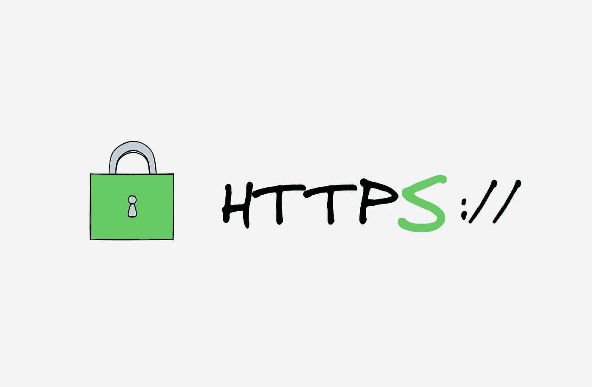
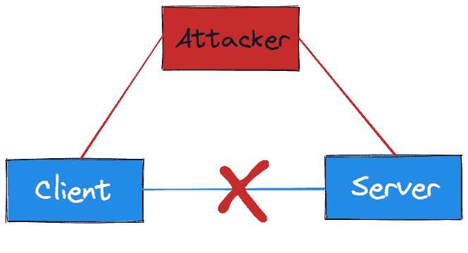
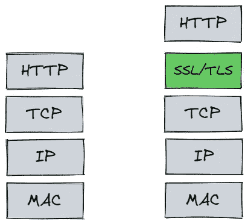
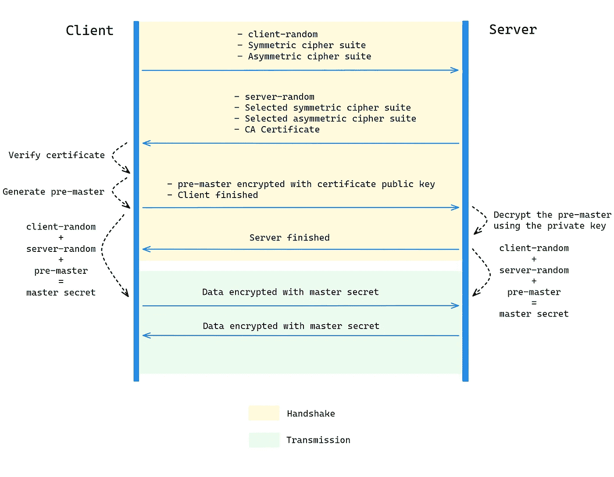
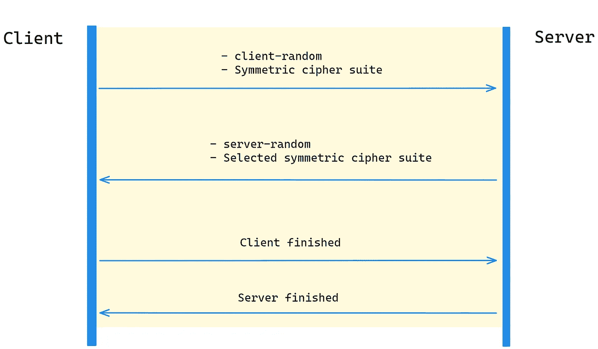

# HTTPS 每个程序员都应该知道

> 原文：<https://levelup.gitconnected.com/https-every-programmer-should-know-7b6d03033873>

## 让我们看看你对 HTTPS 的不了解

作者图片

超文本传输协议(HTTP)是用于传输超媒体文档(如 HTML)的应用层协议。它最初是为 web 浏览器和 web 服务器之间的通信而设计的，但随着后来的发展，它的应用并不局限于此，成熟的软硬件环境使它成为了互联网的基础设施。我相信你一定接触过它，它就像软件开发中的水或空气一样，太普通了。

但作为程序员，我们可能会因为其共性而忽略很多关键信息，导致日常工作开发中出现一些问题，不知道如何解决。然后，本文将向您介绍其中一个关键信息— HTTPS。

# 为什么是 HTTPS？

为什么会出现？它似乎能解决什么问题？

要回答以上问题，我们需要先分析一下 HTTP 的特点。

HTTP 的特点是简单、灵活、易于扩展，但同时又是无状态的(可以使用 Cookie 技术实现“有状态”)，而且是明文传输，也就是说它的数据是完全可见的，容易被窃听或伪造。

同时，HTTP 应用广泛，因此网上支付等高安全要求的场景需要相应的安全措施，于是 HTTPS 出现了。

# 什么是 HTTPS？

HTTPS 的 RFC 文档内容非常少。它指定了一个新的协议名“HTTPS”，默认端口号为 443，这是为了在 TCP 和 HTTP 之间插入一个“安全层”。

作者图片

顾名思义，这个安全层对发送的数据进行加密，对接收的数据进行解密，这样中间人就无法窃取信息。
那么只要你理解了这个安全层，你也就理解了 HTTPS。

SSL 是安全套接字层，位于 [OSI 模型](https://en.wikipedia.org/wiki/OSI_model)的第 6 层(表示层)。它是网景公司在 1994 年发明的。有两个版本，v2 和 v3，v1 因为有瑕疵一直没有公开。

SSL 发展到 v3 的时候，证明了自己是一个非常好的安全通信协议，于是互联网工程组 IETF 在 1999 年将其改名为 TLS(传输层安全)，并正式标准化，从 1.0 开始重新计算版本号，所以 TLS1.0 实际上就是 SSL 3.1。

目前 TLS 已经开发了三个版本，分别是 2006 年的 1.1，2008 年的 1.2，2018 年的 1.3，每个新版本都在不断增强安全性和性能。目前应用最广泛的 TLS 1.2，那么我们来揭开 TLS 1.2 的秘密吧！

# HTTPS (TLS 1.2)秘密

作者图片

我先解释一下上图:

握手阶段:

1.  客户端生成一个客户端随机密码，然后将其支持的对称密码套件和非对称密码套件传递给服务器。
2.  在服务器收到它之后，它将从加密套件中选择要使用的加密算法，生成一个服务器随机数，并将服务证书传递给客户端。
3.  客户端收到后，会先验证证书。如果证书有效，它会生成一个预主随机数，用证书中的公钥和选择的**非对称加密算法**加密，然后传给服务器。它还会附带一条客户端完成确认消息。
4.  服务器接收加密的预主控，并可以使用私钥对其进行解密。然后，服务器完成的确认消息将被传递给客户端。

转移阶段:

在握手阶段之后，两端已经有了客户端随机、服务器随机和 pre-master。将它们混合生成最终的主秘密，使用之前选择的**对称加密算法**对需要传输的数据进行加密和解密。

天啊，我就是想发数据就这么麻烦吗？我第一次看的时候也是这么想的。

让我们耐心点，仔细看看，其实没那么难。

# 什么是对称加密和非对称加密？

我们先来解释一下上面提到的对称加密和非对称加密。

对称加密意味着加密和解密使用相同的密钥。非对称加密有 A 和 B 两个密钥，如果用 A 密钥加密，只能用 B 密钥解密；反过来，如果要 B 密钥加密，只能用 A 密钥解密。

在 HTTPS 的握手阶段，我们使用非对称加密，为什么？假设我们使用对称加密:

作者图片

从上图可以看出，传入的 client-random 和 service-random 和 symmetric 加密套件都是明文的，这就导致了如果黑客得到了数据，他们可以生成相同的密钥，可以是被破解的数据。

如果我们使用非对称加密，客户端加密的预主只能解密服务器存储的密钥。

# 什么是 CA 证书？为什么要在握手阶段添加 CA 证书？

因为一旦黑客使用 DNS 劫持，用黑客的 IP 地址替换用户想要访问的 IP 地址，请求就会直接发送到黑客的服务。他在自己的服务上实现了公钥和私钥，客户端完全不知道！

所以我们需要 CA (Certificate Authority)认证机构来帮助我们证明这个服务是我们想要访问的服务！

# 如何检查 CA 证书的有效性？

客户端将按照以下流程进行验证:

1.  检查证书是否已过期
2.  检查是否被 CA 吊销
3.  检查证书是否由 CA 颁发机构颁发。我们将使用原始证书信息计算消息摘要，使用 CA 公钥解密证书中的数字签名，然后将消息摘要与数字签名进行比较。
4.  证明 CA 组织的合法性。CA 认证链是一个树形结构，根 CA 证书是一步一步找到的。根 CA 证书(自签名证书)内置于系统中。要求很严格。如果根 CA 证书有效，也证明该证书有效。但是如果恶意软件将非法的根 CA 证书注入用户的系统，那就没有办法了。

# 为什么传输相位是对称加密？

这是因为对称加密算法通常使用比特运算，而非对称加密主要是 RSA 中一些大数乘法的计算，所以非对称加密的效率很低，会严重影响传输速度，让用户体验很差。并且我们在握手阶段生成的主秘密足够安全，所以我们可以在传输阶段使用对称加密。

今天就到这里。我是 Zachary，我会继续输出与 web 开发相关的故事，如果你喜欢这样的故事并想支持我，请考虑成为 [*中级会员*](https://medium.com/@islizeqiang/membership) *。每月 5 美元，你可以无限制地访问媒体内容。如果你通过* [*我的链接*](https://medium.com/@islizeqiang/membership) *报名，我会得到一点佣金。*

你的支持对我来说非常重要——谢谢。