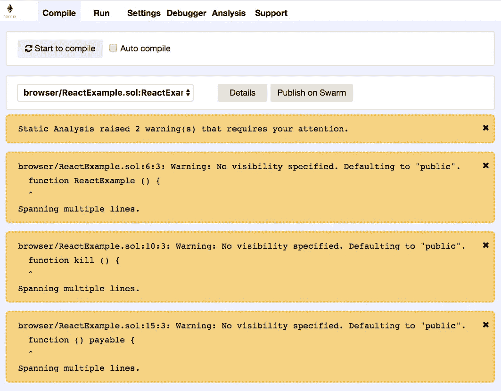
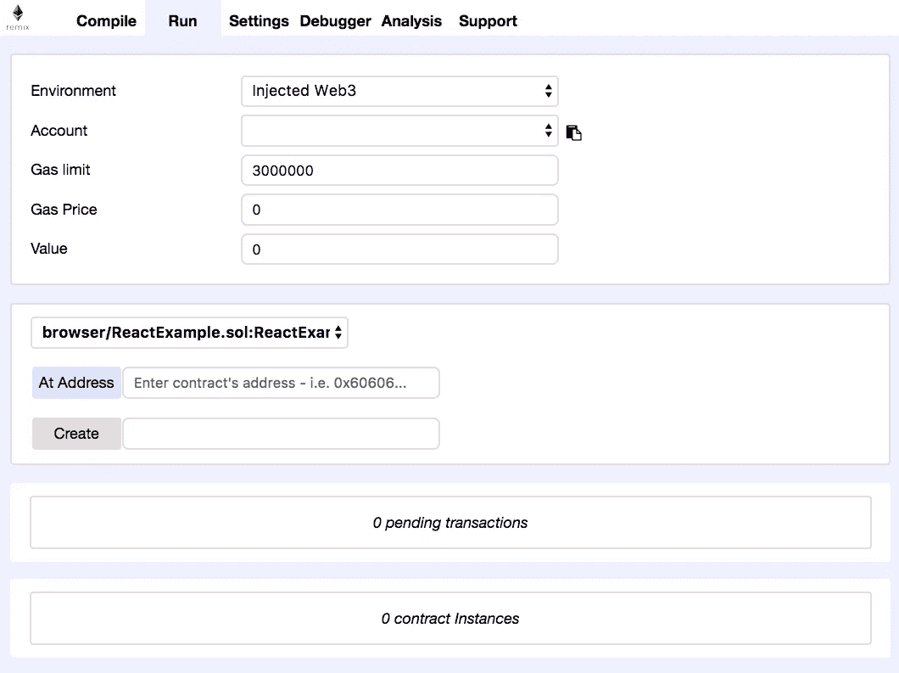
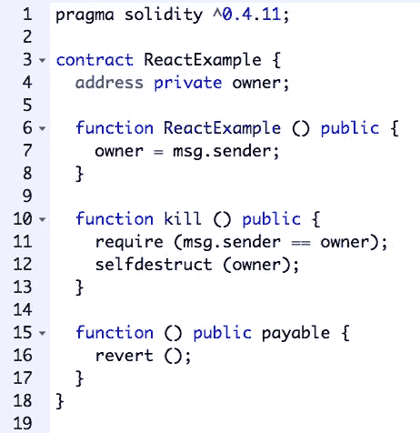
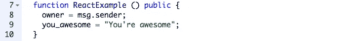
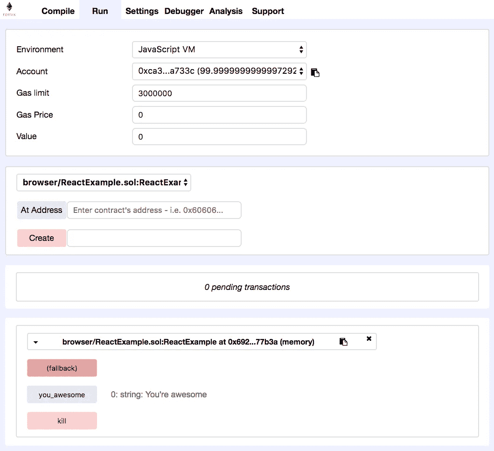

# React & Ethereum:从所需的最少工具集开始—第 1 部分，共 4 部分

> 原文：<https://levelup.gitconnected.com/https-medium-com-zubairnahmed-react-ethereum-getting-started-with-the-minimum-toolset-required-part-1-of-4-9562efa23d18>

了解如何使用所需的最少工具集创建智能合约并将其部署到以太坊区块链:Remix、Metamask 和任何文本编辑器。

***第一部分***[*第二部分*](https://medium.com/@zubairnahmed/react-ethereum-getting-started-with-the-minimum-toolset-required-part-2-of-4-ad4d258ebe53)[*第三部分*](https://medium.com/@zubairnahmed/react-ethereum-getting-started-with-the-minimum-toolset-required-part-3-of-4-6f8c55c751f5)[*第四部分*](https://medium.com/@zubairnahmed/react-ethereum-getting-started-with-the-minimum-toolset-required-part-4-of-4-478be958c16f)

******

***Pixabay 图像，在[知识共享 CC0](https://creativecommons.org/publicdomain/zero/1.0/deed.en) 下发布。***

*****更新**:此博客系列不再维护。***

# ***介绍***

***这篇文章的本质是展示 React 如何与以太坊区块链对话。只会用到三个工具，所以学习曲线会很短。这个项目将被分成五个阶段，以便于跟踪。***

***目标受众:学生/初学者/中级初学者，以及任何有好奇心的人。***

****先决条件*:基本熟悉 JavaScript、React、npm 和命令行。乙醚和气体的简单知识。***

***[可靠性](http://solidity.readthedocs.io/en/latest/index.html)将用于编写我们的[智能合同](http://solidity.readthedocs.io/en/latest/introduction-to-smart-contracts.html#)，尽管不需要熟悉它。我会尽力解释发生了什么，我会将相关关键词链接到 [Solidity 文档](http://solidity.readthedocs.io/en/latest)以便于参考。***

****设计说明*:我将这篇文章设计成一次学习经历，旨在提供对所用工具集和 Solidity 编程语言的简单而详细的理解。练习、凭记忆回忆、遵循过程是这种体验的一部分。***

***[*GitHub 仓库*](https://github.com/zubairnahmed/react_ethereum_blockchain) :如果你愿意，你可以和我的仓库一起编码。我添加了一些评论作为指导。***

****个人过程注释*:我想提一下，尽管这些帖子看起来是线性的，但我学习和编写这个例子的过程远非如此。它是非线性的，有点像螺旋。我应用了我在斯坦福大学学习的快速原型/快速迭代过程，在这个过程中，我尝试一些小的东西，调试它，再尝试，再调试，重复，直到我达到我的目标。在沮丧的时候，我会散步休息，理清思绪，查阅谷歌搜索，然后再试一次。我觉得这个过程在编写代码的领域是普遍的。这一点我肯定是错的，尽管我在许多同龄人身上看到过这种情况。我已经学会热爱这个过程，并从中获得乐趣。***

## ***成套工具***

***对于这个项目，我们将使用:***

*   *****Remix IDE** :以太坊开发团队提供的 Solidity 开发环境。在网上可以买到[这里](https://remix.ethereum.org)。在我们学习的过程中，请保持开放。***
*   *****Metamask** :一个铬合金扩展，用来连接以太坊区块链。请[安装它](https://chrome.google.com/webstore/detail/metamask/nkbihfbeogaeaoehlefnkodbefgpgknn)并设置您的帐户。我们将用它来连接以太坊 Ropsten 测试网。***
*   *****文本编辑器**:你选择的任何文本编辑器都会很好用。我们将从第 2 阶段开始使用编辑器，通过 Metamask 将 React 与 Ropsten Testnet Etherium 区块链连接起来。***

## ***阶段概述***

***每个阶段都旨在展示具体的知识金块。它们是独立的，并且建立在彼此的基础上，就像第 2 阶段建立在第 1 阶段的基础上一样。***

*   *****第 0 期** : *熟悉 Remix，打造智能合约脚手架。****
*   *****第一阶段** : *创建一个公共变量，在 JavaScript VM 上部署智能合约，在 Remix 中与之交互。****
*   *****第二阶段** : *创建私有变量，将智能合约部署到以太坊 Ropsten Testnet，使用 Metamask 作为中介，在 React 前端与私有变量进行交互。****
*   *****阶段 3** : *从 React 操作智能合约的状态。****
*   *****第 4 阶段** : *签订一份有条件的智能合同，并探讨其含义。****

# ***阶段 0:重新组合 IDE 和智能合约框架***

***我们将打开 [Remix IDE](https://remix.ethereum.org) ，开始熟悉它的布局，特别是右边的栏。我们从那里开始。***

******

***在**编译**选项卡打开的情况下，重新混合 IDE 的右栏***

*****编译**标签[编译【Remix 加载时编辑器中的源代码。编译后，Remix 提供了一个](http://remix.readthedocs.io/en/latest/compile_tab.html) [*静态分析*](http://remix.readthedocs.io/en/latest/analysis_tab.html) ，它提供了警告和错误，我们可以用它们来编辑我们的代码。我们现在可以安全地忽略警告。***

***默认情况下，顶部附近的“*自动编译”*框处于选中状态。我个人更喜欢取消选中它，这样编译器就不会随着我在编辑器中所做的每一个改变而触发。然后每次需要编译源代码时，手动点击“*开始编译”*按钮。***

***接下来，让我们看看**运行**选项卡。***

******

***打开**运行**选项卡的 Remix IDE 右栏***

***我们从**运行**选项卡部署智能合同。请注意*环境*下拉菜单和浅红色*创建*按钮。首先，我们选择*环境*来声明我们部署的上下文，然后我们单击*创建*来创建智能契约。***

***在*环境*菜单下，我们将使用这些选项:***

*   ***JavaScript VM:在我们的浏览器上部署和使用我们的智能合约。***
*   *****注入 Web3** :在以太坊 Ropsten 测试网或以太坊主网上通过 Metamask 部署我们的智能合约。***

***我们将在这个项目中频繁使用**编译**和**运行**选项卡。***

***Remix 中的左栏是文件浏览器，中间一栏包含代码编辑器和控制台。我认为这些是不言自明的。***

## ***智能合约脚手架***

***Remix 通常附带一些代码。请删除这段代码，并将左侧选项卡上的文件名改为 *ReactExample.sol* 。然后我们将在中间一栏的编辑器中输入我们的代码。***

******

***Solidity Smart 合同的初始框架***

***注意:我提供了一张图片，这样人们可以练习打字，而不是复制/粘贴。这将有助于建立记忆，也是更好的学习体验。***

***因为没有假设你熟悉可靠性，所以我将试着解释代码的每一部分。***

****第 1 行*:告诉 Solidity 编译器源代码是 0.4.11 版本写的。支持更高版本，但不包括版本 0.5.0。我随意选择了 0.4.11 版本——在现实项目中，选择一个版本将是一个权衡利弊的技术决策。***

****第 4 行*:声明一个 ***类型的状态变量地址*** ，命名为 ***拥有者*** 。它被声明为[***private***](http://solidity.readthedocs.io/en/latest/contracts.html?highlight=private#visibility-and-getters)，所以它的值在我们的契约之外是不可见的。一个 [***地址***](http://solidity.readthedocs.io/en/latest/types.html#address)类型保存一个 160 位的值，大小相当于一个以太坊地址。状态变量存储在智能合约的 [***存储器***](http://solidity.readthedocs.io/en/latest/introduction-to-smart-contracts.html#storage-memory-and-the-stack) 中，这是一个永久存储区。***

****第 6 行*:提供了一个 [***构造函数***](http://solidity.readthedocs.io/en/latest/contracts.html?highlight=constructor#creating-contracts) ，创建智能合约时运行一次。它的可见性设置为[***public***](http://solidity.readthedocs.io/en/latest/miscellaneous.html?highlight=public#function-visibility-specifiers)，这意味着它对所有人都可见。我们契约中的所有函数都是 *public* ，如果没有指定的话，这是默认的可见性修饰符。构造函数的名称必须与契约的名称相同，在我们的例子中是 ReactExample。***

****第 7 行*:将 ***所有者*** 初始化为创建合同者的 ***地址*** 。创建者的地址包含在 [*msg.sender*](http://solidity.readthedocs.io/en/latest/units-and-global-variables.html?highlight=msg.sender#block-and-transaction-properties) 中。*注意*:在 JavaScript 和其他编程语言中，我们需要 *this* 关键字来引用智能契约实例。在 Solidity 中，这个上下文不需要，但是 [*外部函数* *调用*](http://solidity.readthedocs.io/en/latest/control-structures.html#external-function-calls) 需要。***

****第 10 行*:提供一个功能，*拥有者*可以在智能合约被破坏的情况下调用。援引它会破坏合同。***

****第 11 行*:确保只有 ***所有者*** 可以自毁合同。 [**要求(** *条件* **)**](http://solidity.readthedocs.io/en/latest/control-structures.html?highlight=require#error-handling-assert-require-revert-and-exceptions) 如果括号内的条件为*假*则抛出异常。***

***第 12 行:毁约。*回忆*:**:*拥有者*** 是一个 ***地址*** ，所以 [**自毁(** *拥有者* **)**](http://solidity.readthedocs.io/en/latest/introduction-to-smart-contracts.html?highlight=selfdestruct#self-destruct) 要将其余额转发给 ***拥有者*** 。***

****第 15 行*:提供一个匿名函数，称为[回退函数](http://solidity.readthedocs.io/en/latest/contracts.html#fallback-function)。 [***应付***](http://solidity.readthedocs.io/en/latest/miscellaneous.html?highlight=payable)*修饰符保证了该函数可以接收*乙醚*。[**revert()**](http://solidity.readthedocs.io/en/latest/control-structures.html?highlight=revert()#error-handling-assert-require-revert-and-exceptions)**调用将*以太*返回给调用该函数的任何人。******

******这就是第 0 阶段。现在，我们对 Remix 和 Solidity 的一些基本工作原理有了更多的了解，让我们进入第 1 阶段，开始使用一个部署的智能契约。******

# ******阶段 1: Remix 的 JavaScript VM &与智能合约交互******

******现在我们有了一个基本的智能契约，我们将添加一个 [*公共状态变量*](http://solidity.readthedocs.io/en/latest/introduction-to-smart-contracts.html#subcurrency-example?highlight=public) ，部署契约，并与之交互—所有这些都在 Remix IDE 内完成。******

******首先，让我们添加两行代码:******

************

******字符串类型的公共状态变量，称为 **you_awesome********

*******第 5 行*:声明一个 ***公共*** [***字符串*** *类型*](http://solidity.readthedocs.io/en/latest/types.html#string-literals) 变量叫做 ***you_awesome*** 。当一个 ***公共*** 状态变量被声明时，它被存储在智能合约的 [***存储器***](http://solidity.readthedocs.io/en/latest/introduction-to-smart-contracts.html#storage-memory-and-the-stack) 中，Solidity 自动为它创建一个公共 getter 函数 ***。*** *回忆:* ***存储*** 是智能合约的持久存储区。这个公共的 getter 函数是我们在这一节将要用到的。******

************

******添加第 9 行，它将 **you_awesome** 变量初始化为“You 're awesome”******

*******第 9 行*:用值“*You are awesome*”初始化 ***you_awesome*** 变量。回忆一下:构造函数只被调用一次，当契约被创建时。到目前为止，我们还没有部署我们的合同。******

## ******JavaScript 虚拟机上智能合约的首次部署******

*******一般流程注意事项*:请记住这个流程。我们将在以后的阶段中引用它。任何时候，我们在任何*环境*环境中部署智能合同时，我们都将遵循以下步骤:******

*   ******首先点击**编译**选项卡上的*开始编译*按钮。******
*   ******一旦我们的源代码被编译并且分析被检查，我们将点击 **Run** 选项卡。******
*   ******然后我们将在我们的*环境*下拉菜单中选择 **JavaScript VM** 或**注入 Web3** 。******
*   ******最后，点击“*创建*按钮。******

*******调试注意事项*:如果在以后的阶段没有登录到元掩码中，那么**注入的 Web3** 将显示一个错误。请确保您在处理此项目时已登录。这个注释现在还不适用，但以后会有用。******

******对于我们的第一次部署，我们将使用 **JavaScript VM** 环境。******

******总的来说，在快速迭代我们的智能契约代码时，我们将总是部署在 **JavaScript VM** 环境中，因为它很快并且运行在我们的浏览器上。这是一个测试我们实验的好地方，它不需要额外的设置，也就是说，不需要 Metamask 或 React。******

******当我们准备好让我们的智能合约与一个真实的以太坊区块链(Ropsten Testnet 或真实的以太坊区块链)合作时，我们将使用**注入 Web3** 环境。当部署在实时网络上时，客户端可以通过我们将在下一阶段讨论的接口与智能合约进行交互。这个过程至少需要设置 Metamask 和 React。******

******好了，让我们在 **JavaScript VM** 环境中部署我们的第一个智能合约，并开始使用它吧！******

************

******我们第一个部署的智能合同，它位于我们的浏览器中。合同界面位于底部，在“0 待处理交易”部分之后******

******屏幕截图底部出现的彩色按钮是我们智能合约的一部分——它们是我们编写的函数。注意 ***owner*** 变量没有显示出来——这是因为它的可见性被设置为 ***private*** ，所以 Solidity 编译器不会为它创建一个公共 getter 函数。******

******如果您单击' *you_awesome* '按钮，我们的 ***public*** 状态变量的 getter 函数将检索该值，并将其显示在代码编辑器下方的控制台上。******

******第一阶段到此为止。我们现在已经在 Remix 上编写了一个简单的智能契约，将它部署在 JavaScript VM 环境中，并在我们的浏览器上与它进行交互。接下来，我们将把一个 ***私有*** 状态变量添加到我们的智能契约，部署到一个实时测试网络，设置元掩码作为我们的中介，并启动一个 React 前端来查询该变量。******

********第一部分**[*第二部分*](https://medium.com/@zubairnahmed/react-ethereum-getting-started-with-the-minimum-toolset-required-part-2-of-4-ad4d258ebe53)[*第三部分*](https://medium.com/@zubairnahmed/react-ethereum-getting-started-with-the-minimum-toolset-required-part-3-of-4-6f8c55c751f5)[*第四部分*](https://medium.com/@zubairnahmed/react-ethereum-getting-started-with-the-minimum-toolset-required-part-4-of-4-478be958c16f)******

*************************** [## 学习可靠性——最佳可靠性教程(2019) | gitconnected

### 14 大坚实度教程。课程由开发者提交并投票，让你找到最好的稳定性…

gitconnected.com](https://gitconnected.com/learn/solidity)*********