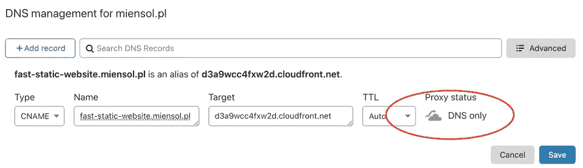
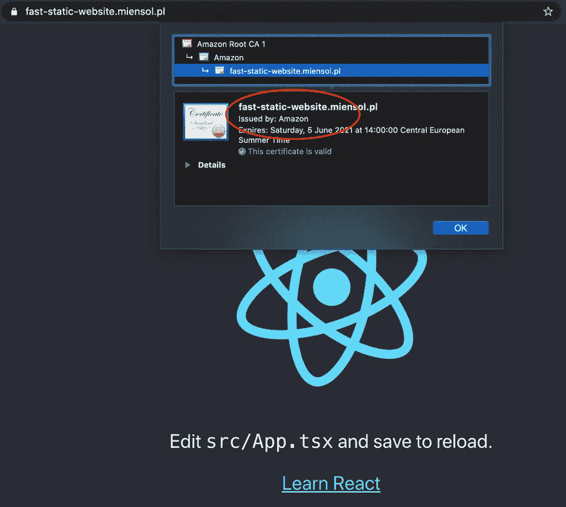

# 使用证书管理器和 aws-cdk 的 CloudFront 上的 HTTPs

> 原文：<https://levelup.gitconnected.com/https-on-cloudfront-using-certificate-manager-and-aws-cdk-5d61c676393c>

[用 aws-cdk 部署到 CloudFront 的静态网站帖子](https://miensol.pl/fast-static-website-with-aws-cdk)展示了如何用 aws-cdk 部署静态内容。我们仍然错过了我们的网站自定义域名配置虽然。以下示例显示了如何:

*   为 CloudFront 发行版设置自定义域名
*   使用 AWS 颁发的可信证书启用 https

# 使用 aws-cdk 从 AWS 证书管理器获取可信证书

使用前一篇文章中的[示例作为基础](https://github.com/miensol/miensol.github.io/tree/develop/content/posts/cloudfront-custom-domain-https)，在`infrastructure`目录中，让我们添加一个额外的包:

```
npm i --save @aws-cdk/aws-certificatemanager
```

CloudFront 只能在 us-east-1 地区(N. Virginia)内使用 AWS Certificate Manager 颁发的证书。我们可以在 us-east-1 地区创建我们的`FrontendStack`。或者，我们可以创建另一个仅包含证书的堆栈。下面我将展示如何使用第二个选项。

我们为美国东部地区的给定域名申请证书。在 AWS 证书管理器颁发受信任的 TLS 证书之前，它需要验证您是否拥有该域。使用以下任一方法进行验证:

*   电子邮件:AWS CM 向该域的*管理员*电子邮件地址发送消息
*   DNS: AWS CM 请求特定的 DNS 记录配置

在上面的例子中，我使用了`fast-static-website.miensol.pl`和 DNS 验证方法。因为我拥有这个域名，我可以向 AWS 证书管理器证明这一点。

我们还更新了`bin/infrastructure.ts`文件，以包含我们的新堆栈:

```
#!/usr/bin/env node
import "source-map-support/register";
import * as cdk from "@aws-cdk/core";
import { CertificateStack, FrontendStack } from "../lib/frontend-stack";

const app = new cdk.App();
new CertificateStack(app);
new FrontendStack(app);
```

让我们通过以下方式启动下一次部署:

```
npm run cdk deploy '*'
```

该过程将等待证书请求验证。请求的 DNS 记录将显示在部署命令输出中:

```
> npm run cdk deploy
...
1/5 | 6:03:37 PM | CREATE_IN_PROGRESS   | AWS::CertificateManager::Certificate
 | CustomDomainCertificate (CustomDomainCertificateXXXXX) Content of DNS Record is: {Name: XXXXXX.fast-static-website.miensol.pl.,Type: CNAME,Value: XXXXX.auiqqraehs.acm-validations.aws.}
1/5 Currently in progress: CustomDomainCertificateXXXXX
```

您也可以在 AWS Web 控制台内的[证书管理器](https://eu-central-1.console.aws.amazon.com/acm/home?region=eu-central-1#/)中找到该请求。配置 DNS 记录后，该过程将继续。在命令输出中，您应该会看到类似以下内容的消息:

```
CertificateStack.CertificateArn = arn:aws:acm:us-east-1:XXXXXXX:certificate/XXXXX-XXXXX-XXXX-XXXX-XXXXXXXX
```

请注意上面的值，我们将在下面的步骤中需要它。

# 使用 aws-cdk 将证书附加到 CloudFront 分发版

我们需要告诉 CloudFront 发行版使用新的证书。让我们修改`FrontendStack`来接受参数:

在`viewerCertificate`部分，我们指定了域名以及 CloudFront 发行版应该使用的证书。接下来我们通过证书考试。证书上述作为参数的值:

部署需要一段时间才能完成，因为 CF 发行版需要更新。我们可以使用这个时间来配置`fast-static-website.miensol.pl` DNS 记录。记录需要指向`FrontendStack.DistributionDomainName`。我使用 CloudFlare，因此在我的情况下，这意味着创建一个 CNAME 记录:



我们现在可以使用 HTTPS 加载我们的静态网站了！



遗憾的是，不能使用 aws-cdk 创建[跨区域参考:](https://github.com/aws/aws-cdk/issues/49#issuecomment-454800305)

> 不幸的是，没有。您将不得不跨区域手动执行 API URL。那意思是:
> 
> *首先部署 ApiStackIreland。记下 API URL(也许把它做成输出，这样就容易找到了)。部署 EdgeStack 并插入第一步中的 API URL 的值。有很多方法可以做到这一点，老实说，我不知道该推荐哪一种。*
> 
> *我想一个实用的方法是使用* `*this.node.getContext()*` *并在部署第二个堆栈时在命令行上传递值(使用* `*-c KEY=VALUE fflag*` *)，或者将它放入 cdk.json 的 context: {} section 下。*

完整的工作示例可以在 github 库中找到[。](https://github.com/miensol/miensol.github.io/tree/develop/content/posts/cloudfront-custom-domain-https)

*原载于*[*https://mien sol . pl*](https://miensol.pl/cloudfront-custom-domain-https/)*。*