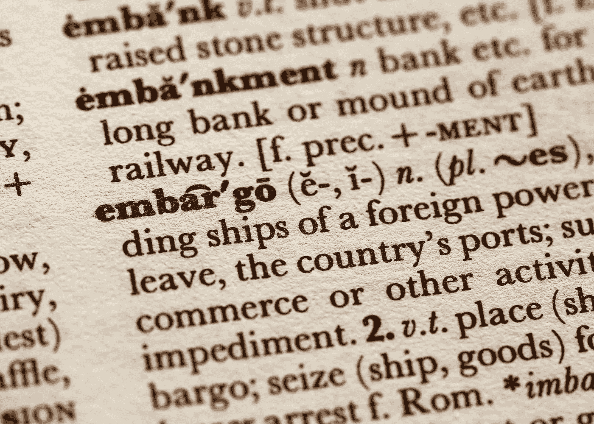
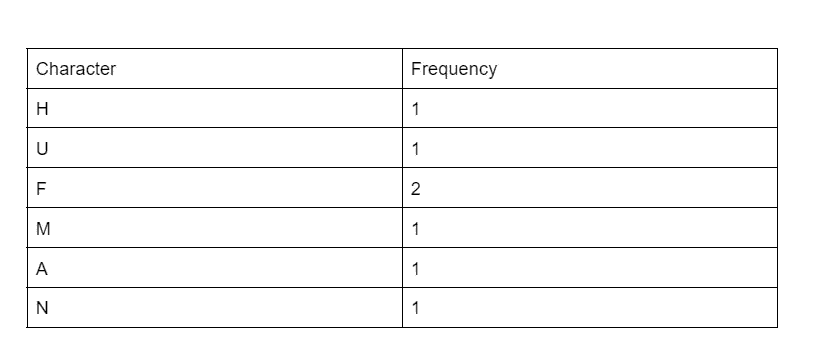
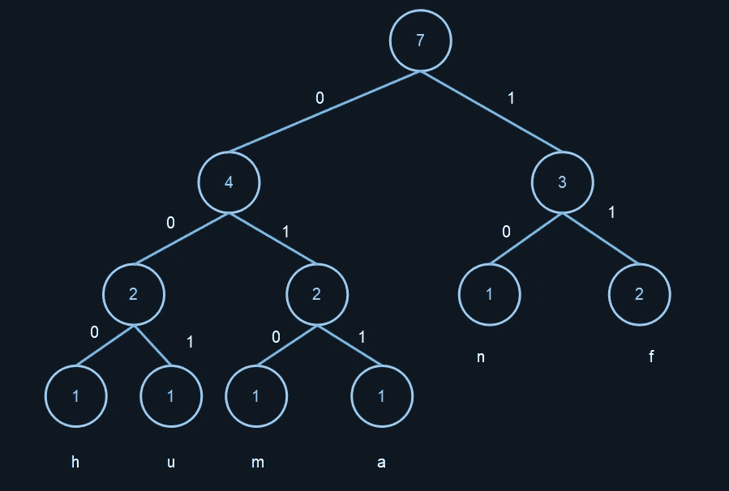

# 霍夫曼编码

> 原文：<https://levelup.gitconnected.com/huffman-encoding-424d40d92f70>

这是贪婪算法之一，也是我们作为计算机科学团体压缩文本的最初尝试之一。



来源:桑迪·米勒经由[Unsplash.com](https://unsplash.com/photos/Kl4LNdg6on4)

贪婪算法是在每个阶段都选择对自己最好的算法。

使用贪婪算法解决的常见问题有霍夫曼编码、背包问题和硬币兑换问题。让我们探索霍夫曼编码

# 霍夫曼编码

想知道文本是如何发送的吗？

嗯，这是一个非常复杂的问题，我们只关心尽可能高效地发送文本
。为了更快的传输，我们需要更小的比特。这意味着
我们需要压缩我们的文本，但是我们如何归档呢？

视频和图像使用有损压缩，我们可以在这里失去一点细节，而不是一个
列车粉碎。不幸的是，这不是文本的情况，我们不能失去任何东西，因为文本的上下文将被完全改变。

我们的压缩仅限于无损压缩。

多年来，更好的文本压缩算法已经被设计出来，但是
都是基于霍夫曼编码。

由数学家大卫·霍夫曼提出，霍夫曼编码是基于数据使用的
不等式。

我说的数据是指字符，有些字符比其他字符用得多。

我们更多地使用元音，而不是辅音，如“X”或“Q”，因此这种算法选择“在每个阶段什么是最好的”。

让我们使用霍夫曼编码算法压缩和解压缩单词 Huffman；

我们有说明霍夫曼的树和表。



H-出现一次

U-出现一次

f-出现了两次

m-出现一次

出现一次

n-出现一次

然后，我们按照以下简单的 5 个步骤，用表中的数据绘制树。

步骤 1:在我们的树中为每个字符创建一个节点，然后用频率标记它。

第二步:将这些节点按频率从低到高升序排列。

第 3 步:然后我们将前两个节点连接起来，并指定一个父节点。父节点的标签是两个频率的和。

步骤 4:刚刚形成的父节点和子节点一起被重新插入到列表中。

步骤 5:重复步骤 3 和 4，直到我们有 1 个父节点

见下图；



这翻译过来就是；

h: 000，

u: 001，

男:010，

答:011，

n:10，

女:11，

编码输出:00000111110100111011

让我们编码出这个问题的解决方案。

我们首先创建我们的树节点，它接受右边和左边的节点，我们将其初始化为零，也是符号和概率。

```
# A Huffman Tree Nodeclass Node:def __init__(self, prob, symbol, left=None, right=None):self.prob = probself.symbol = symbolself.left = leftself.right = rightself.code = ''
```

然后，我们传递一个助手函数来打印遍历树时的符号代码。

```
# A helper function to print the codes of symbols by traveling Huffman Treecodes = dict()
def Calculate_Codes(node, value=''):newValue = value + str(node.code)if (node.left):Calculate_Codes(node.left, newValue)if (node.right):Calculate_Codes(node.right, newValue)if (not node.left and not node.right):codes[node.symbol] = newValuereturn codes
```

然后，我们创建一个辅助函数来计算数据中符号的概率

```
# A helper function to calculate the probabilities of symbols in given datadef Calculate_Probability(data):symbols = dict()for element in data:if symbols.get(element) == None:symbols[element] = 1else:symbols[element] += 1return symbols
```

然后，我们有函数来计算压缩和非压缩数据之间的空间差异。

```
# A helper function to calculate the space difference between compressed and non compressed datadef Total_Gain(data, coding):before_compression = len(data) * 8after_compression = 0symbols = coding.keys()for symbol in symbols:count = data.count(symbol)after_compression += count * len(coding[symbol])print("Space usage before compression (in bits):", before_compression)print("Space usage after compression (in bits):", after_compression)def Huffman_Encoding(data):symbol_with_probs = Calculate_Probability(data)symbols = symbol_with_probs.keys()probabilities = symbol_with_probs.values()print("symbols: ", symbols)print("probabilities: ", probabilities)nodes = []
```

然后，我们将符号转换成概率，再转换成霍夫曼树。

```
# converting symbols and probabilities into huffman tree nodesfor symbol in symbols:nodes.append(Node(symbol_with_probs.get(symbol), symbol))while len(nodes) > 1:nodes = sorted(nodes, key=lambda x: x.prob)right = nodes[0]left = nodes[1]left.code = 0right.code = 1newNode = Node(left.prob + right.prob, left.symbol + right.symbol, left, right)nodes.remove(left)nodes.remove(right)nodes.append(newNode)huffman_encoding = Calculate_Codes(nodes[0])print("symbols with codes", huffman_encoding)Total_Gain(data, huffman_encoding)encoded_output = Output_Encoded(data, huffman_encoding)return encoded_output, nodes[0]def Huffman_Decoding(encoded_data, huffman_tree):tree_head = huffman_treedecoded_output = []for x in encoded_data:if x == '1':huffman_tree = huffman_tree.rightelif x == '0':huffman_tree = huffman_tree.lefttry:if huffman_tree.left.symbol == None and huffman_tree.right.symbol == None:passexcept AttributeError:decoded_output.append(huffman_tree.symbol)huffman_tree = tree_headstring = ''.join([str(item) for item in decoded_output])return stringdata = "huffman"print(data)encoding, tree = Huffman_Encoding(data)print("Encoded output", encoding)print("Decoded Output", Huffman_Decoding(encoding, tree))
```

代码由 [Gugu Sibanyoni](https://medium.com/u/483d2ec29b96?source=post_page-----424d40d92f70--------------------------------) 提供。