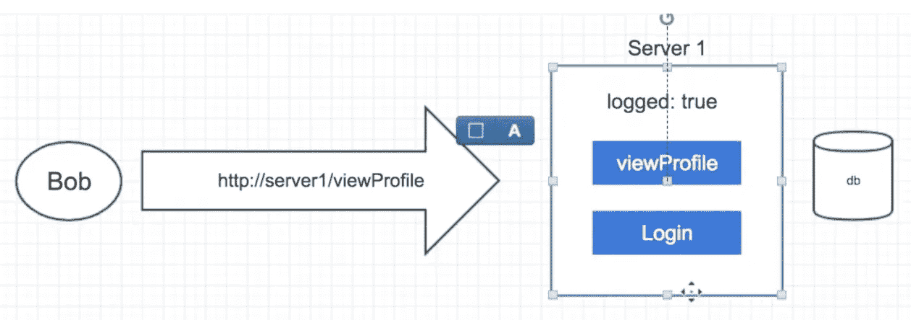

# 庞大的网络课程，网络和其间的一切

> 原文：<https://levelup.gitconnected.com/huge-course-about-networking-web-and-everything-in-between-d6f425ceea13>

哦，我亲爱的 learners✌️.你想了解更多关于网络和 web: OSI，ARP，MAC，DNS 等吗？然后阅读这篇文章，通过例子了解大量新信息。

我想对 [OSI 模型](https://medium.com/u/e4cbe924ccb#7424)和:
-[PDU](https://medium.com/p/d6f425ceea13#5347)
-[ARP](https://medium.com/p/d6f425ceea13#6ed1)
-[NAT](https://medium.com/p/d6f425ceea13#254c)
-[公有与私有 IP 地址](https://medium.com/p/d6f425ceea13#acb4)
- [TCP/IP 视频链接](https://medium.com/p/d6f425ceea13#24dd)

*   [域名系统](https://medium.com/p/d6f425ceea13#49fd)*   [TCP 和 UDP 协议](https://medium.com/p/d6f425ceea13#ba3f)*   [TCP 握手](https://medium.com/p/d6f425ceea13#4f67)*   [HTTP](https://medium.com/p/d6f425ceea13#1707) 同:
    -[HTTP 1.0](https://medium.com/p/d6f425ceea13#46fe)
    -[HTTP 1.1](https://medium.com/p/d6f425ceea13#b596)
    -[HTTP 2](https://medium.com/p/d6f425ceea13#5401)
    -[HTTP 3](https://medium.com/p/d6f425ceea13#1b46)
    -[GET VS POST](https://medium.com/p/d6f425ceea13#b61e)*   [带有电子标签的 HTTP 缓存](https://medium.com/p/d6f425ceea13#00b2)*   [TLS](https://medium.com/p/d6f425ceea13#891a) :
    - [ver。1.2](https://medium.com/p/d6f425ceea13#013d)-[版本 1.3](https://medium.com/p/d6f425ceea13#46c3)-[DNS over HTTPS 又名 DoH](https://medium.com/p/d6f425ceea13#8122)*   [证书和证书颁发机构](https://medium.com/p/d6f425ceea13#27f5)*   [SNI，埃斯尼](https://medium.com/p/d6f425ceea13#f252)*   [Web 服务器](https://medium.com/p/d6f425ceea13#f42d)和
    - [有状态与无状态应用](https://medium.com/p/d6f425ceea13#fa80)*   CORS +飞行前请求*   [HTTP cookie](https://medium.com/p/d6f425ceea13#fcca)*   [代理 vs 反向代理](https://medium.com/p/d6f425ceea13#92ed)和:
    - [L4 vs L7 负载平衡器](https://medium.com/p/d6f425ceea13#3728)
    - [TLS/SSL 终止](https://medium.com/p/d6f425ceea13#0c67)
    - [TLS 直通](https://medium.com/p/d6f425ceea13#d655)*   [HSTS](https://medium.com/p/d6f425ceea13#ccdb)*   [哑剧嗅探](https://medium.com/p/d6f425ceea13#74e5)

照片由[福蒂斯·福托普洛斯](https://unsplash.com/@ffstop?utm_source=medium&utm_medium=referral)在 [Unsplash](https://unsplash.com?utm_source=medium&utm_medium=referral) 拍摄

# 简介和免责声明

最近，作为一名软件工程师，我在当前的工作中遇到了一个问题:我需要为一个负责负载测试的系统进行设置。又名扮演 DevOps 工程师。然而，在开始之前，我的团队领导告诉我:排练/学习 OSI、L4 与 L7 负载平衡器、SNI 之类的东西。嗯，我想大概要花几天时间。但是 OSI 把我引到了 NAT，ARP 等等。总之，我每天花 2.5 周的时间学习网络和网络相关的东西。

虽然我花了几十个小时，但我只触及了表面，因为我现在不需要深入研究一些主题。这就是为什么我不会讨论“第二层的片段如何变形为第一层”的原因，因为我根本不需要它+我还有其他对 now‼️更重要的东西要学

但是，如果你在文章中发现任何错误或者想问任何问题，请随时在评论中给我留言或者通过文章末尾提供的来源给我写信📣

此外，我将在每个部分提供相应的资源。通常，这是侯赛因·纳赛尔的视频💻

# 1.带有 ARP、NAT、公有与私有 IP 地址的 OSI 模型

## 1.开放式系统互联参考模型(Open System Interconnect Reference Model)

视频 1:[T3【https://www.youtube.com/watch?v=7IS7gigunyI】T5](https://www.youtube.com/watch?v=7IS7gigunyI)

视频二:[**https://www.youtube.com/watch?v=eNF9z5JNl-A**](https://www.youtube.com/watch?v=eNF9z5JNl-A)

进一步阅读以更好地理解 **MAC 地址**:

 [## mac 地址

### 在计算机网络中，媒体访问控制(MAC)地址与 IP 地址一样重要。在…中学习

people.richland.edu](https://people.richland.edu/dkirby/141macaddress.htm#:~:text=The%20MAC%20address%20is%20an,like%20TCP%2FIP%20to%20function) 

**OSI** —开放系统互通模型。它是一个模型，负责定义数据如何从最高层(例如，当我们发出 GET 请求时)流向最底层(跨越全球的物理电缆)。

模型中有 7 层，其中 1 层是最低层(也称为物理层)，第 7 层是最高层(也称为应用层)。对于软件工程师来说，最重要的是第 7 层和第 4 层。我们可以说每一层都给数据添加了一些头。

让我们来看看所有的 order➿:


**OSI** 模型图像

7.第 7 层—应用层。这是我们在应用程序中发出 HTTP/HTTPS 协议请求的层。例如，我们发出 GET 请求(所有这些东西都来自不同的层，但它看起来就像你从你的应用程序发送一些请求):

*   GET/ —请求的类型
*   **HTTP 协议** +带有 cookies 的标题，内容类型

如果我们发送 POST/ request，那么我们也在这个级别上序列化数据。

6.第 6 层—表示层。这一层负责:

*   用 ASCII 编码
*   **加密/解密:SSL，TCL** (但这是灰色地带)
*   压缩

实际上，TLS 介于 4 层和 7 层之间:介于 TCP 和 HTTP 之间。因此，以上所有数据(最多 7 层)将被加密。

5.第 5 层—会话层。该层标记数据以进一步识别它。例如，当数据将来自第 1 层到第 7 层时，这一层检查它是否是该 TCP 连接的会话，因为可能有到单个服务器的多个 TCP 连接。

4.第 4 层—传输层。在这一层之前，所有的请求都是一个数据块。在这一层，它将被分割成**段**。此外，在这一层，所有的数据段都被*前置*和*分别附加*源端口和目的端口。看起来像是:**源端口段目的端口**。此外，该层添加序列，以便在接收到这些*段*时对其进行排序。为了添加这个序列，你需要**标题**

3.第 3 层—网络层(IP 协议)。这一层只是接收来自**传输层**的数据段(而且，它对端口一无所知)并添加更多的头:端口。所以，这一层之后的数据将会是这样的:

`**source IP Address — IP Packet — destination IP Address**`

在这一层，我们将数据称为 **IP 数据包**(在第 4 层，它是数据段)。

2.第 2 层—数据链路。在这一层，IP 数据包被分成更小的部分。在这一层上，我们形成所谓的**帧**，看起来像:

`**MAC Source — IP PACKET — MAC Destination**`

此外，这是唯一一层有一个拖车:它包含错误检测和错误纠正位。它也被称为帧校验序列(FCS)。

接下来，像`01100010`这样的比特被推到最低层。

*   像往常一样，如果 IP 包很大，很容易出现多个 T21 碎片
*   如果我们不知道 **MAC 的**地址，那么就让 [**ARP** **请求**](https://medium.com/@SleeplessChallenger/d6f425ceea13#684b) 找到目的地的网关
*   如果请求不发送到我们的子网，那么连接我们和外部世界的路由器的 MAC 地址。

1.  第 1 层—物理层。它接受来自第二层的**帧**,并将它们放入物理设备中:以太网也就是电缆，WiFi 也就是无线电波。

## **PDU**

协议数据单元。它描述了不同级别的数据:

*   7–5:*数据*
*   4 —如果是 UDP，那么*数据报*。如果是 TCP 那么*段*
*   3: *数据包*
*   2: *框架*

因此，这种**PDU**在一次连接中数量很大。然后，在第 3 层，我们将这些**PDU**分割成更小的部分——**片段**。对于每个被认为已传送的数据包，所有的**片段**都必须传送。

## 2.空袭预防措施

## 地址分辨协议

视频:[https://youtu.be/mqWEWye-8m8](https://youtu.be/mqWEWye-8m8)

还记得我说过要从 OSI 模型的第 3 层到第 2 层，我们需要得到目的地的 **MAC 地址**吗？但是，怎么可能得到那一个呢？ **ARP** 是为给定的 **IP 地址**找到 **MAC** 的东西。

每台机器都有 ARP 表，ARP 表有映射: **IP 地址— MAC 地址**。但是如果我们现在的 IP 没有 MAC 呢？没问题！

我想看看两个案例🔍：

1.  在我们的子网内


路由器的 ARP 示例

*   在上图中，你可以看到每台机器旁边的 ARP 表。
*   首先，机器向路由器请求所需的 **IP 地址**。
*   路由器通知子网中的所有机器，如果成功，其中一台机器用 **MAC 地址**进行响应。
*   路由器给我们这个 MAC 地址，我们将它缓存在 **ARP 表**中。
*   而我们的机器可以向给定的 **MAC 地址**发送数据(看 OSI 第二层和第一层)

2.在我们的子网之外:

**这里有点不同**

*   当我们向外部子网发送数据时(我们通过计算目的 IP 地址的掩码知道这一点)，我们需要通过路由器来完成。
*   首先向路由器发出 ARP 请求，接收路由器的 MAC 地址并缓存在表中。
*   使用这个 **MAC** 地址构建请求(又名来自 OSI 第 2 层的**片段**)并发送给路由器。
*   路由器在第 2 层解封装数据，然后移动到第 3 层。它查看 **IP 地址**。
*   路由器交换我们机器的 IP 地址并把它自己。因此，它代表自己向外部世界发出请求。为了匹配回来，它需要 [**NAT**](https://medium.com/p/d6f425ceea13#2d26) 。

所以，路由器不使用 **MAC** ，而是使用 **IP** 。它使用存储在其*路由表*中的每一个*子网掩码*，并开始计算寻找出站 IP 的匹配。

路由表包括:1 . **DNA** 2。**下一跳** 3。**公制**

因此，如果路由器没有找到与目的 IP 匹配的 **DNA** ，它将使用`0.0.0.0`的 DNA

PS: **MITM** (中间人攻击)可能发生在有人伪装成路由器的情况下。在下一节中阅读关于[的更多信息](https://medium.com/p/d6f425ceea13#27f5)

## 3.精灵

## 网络地址转换

视频:[**https://www.youtube.com/watch?v=RG97rvw1eUo**](https://www.youtube.com/watch?v=RG97rvw1eUo)

延伸阅读:

*   【https://serverfault.com/a/14587 
*   [https://networkengineering.stackexchange.com/a/3342](https://networkengineering.stackexchange.com/a/3342)

它是将一个 **IP 地址**映射到另一个 **IP 地址**的过程。事实上，这更困难，这就是为什么我们要深入研究。

首先，⚙️:国家公园的目的是什么

*   私有到公共 IP 转换(解决 IPV4 地址不足的问题)
*   端口转发
*   L4 负载平衡


**NAT** 示例

1.  子网中的机器向子网外的机器发出请求。它从计算掩码中知道。所以，我们不能向我们网络外的机器发出 **ARP 请求**。
2.  首先，我们的机器向路由器发出 **ARP 请求** ( [阅读上文](https://medium.com/p/d6f425ceea13#6ed1))。
3.  然后我们把数据发给路由器(也叫**默认网关**)。路由器将**源 IP 地址**换成自己的:

*   *来源***IP 地址:端口→路由器 IP 地址:端口(端口可以与第一个相同，也可以不同)*还有，路由器互换 **IP 地址**用于外网(路由器有 **IP 地址**用于内网，用于外网)，而不是子网。*
*   **路由器 IP 地址:端口→目的 IP 地址:端口**

*因此，路由器有这个表，它可以将响应匹配回子网中机器的 **IP** 。如果什么也没有找到，则表明这台机器实际上没有发送任何东西。*

## *4.公共与私有 IP 地址*

*视频:【https://www.youtube.com/watch?v=92b-jjBURkw *

*延伸阅读:*

*   *[https://superuser.com/a/801107](https://superuser.com/a/801107)*
*   *[https://superuser.com/a/801321](https://superuser.com/a/801321)*

***公共 IP 地址**如今相当昂贵，所以我们可以使一个诡计:购买一个**公共 IP 地址**并创建一堆**私有 IP 地址**，它们在内部网络/子网(LAN)中的公共 IP 地址之后。当然，路由器也有**私有 IP** 地址，供子网中的机器相互通信。*

**

*公有和私有 IP 地址示例*

*为了辨别来自外部世界的请求的内部机器，我们给每台机器分配唯一的端口。所以，叫做**端口转发**。引擎盖下使用 [**NAT**](https://medium.com/p/d6f425ceea13#254c) 。*

*管道:*路由器公网 IP 地址+ 8080* 从外界调用→ 192.168.x.x:8080(又名内部机)*

*顺便说一下，内部子网中的机器有不同的 **IP 地址**。*

## *5.传输控制协议*

*也许，你听说过 TCP/IP 模型，想了解更多。然后给这个酷哥一个手表:*

# *2.域名服务器(Domain Name Server)*

*视频:[https://www.youtube.com/watch?v=tgWx81_NGcg](https://www.youtube.com/watch?v=tgWx81_NGcg)*

*更多阅读:[**https://superuser.com/a/1075081**](https://superuser.com/a/1075081)*

***DNS** —域名系统。这是一个系统来寻找我们在浏览器中输入的域名的 IP 地址。为什么这样做？我们亲爱的机器不能阅读文本并将其转换成数据，所以它们需要一些数字来工作。回想一下 OSI 模型，我们也不处理文本，而是处理端口、IP、MAC 等。*

*DNS 作为一个数据库工作(实际上是一个数据库)，但是非常聪明和设计良好。如果不是这样，想象一下处理一个请求需要多长时间。*

> *“要处理数十亿行，你需要避免处理数十亿行”——作者 [TCP 握手](https://medium.com/u/e4cbe924ccb#4f67)的内容*
> 
> *   ***保证交付:**如果没有确认，那么它将重新发送信息(要么数据包没有到达，要么它们已损坏)**   ***基于连接:** *客户端-服务器*需要在它们之间建立唯一的连接**   ***拥塞控制:**在能够处理数据时发送数据，否则等待**   ***有序数据包:**数据将被分割成无序的数据包。也在 [TCP 握手](https://medium.com/p/d6f425ceea13#4f67)中讨论*
> 
> *缺点:*
> 
> *   *所有来自专业的东西都是小包*
> *   *更多带宽*
> *   *比 UDP 慢*
> *   ***有状态:**如果*客户端*已连接，并且您销毁了*服务器*——连接关闭。无状态意味着这样的操作不会破坏连接*
> *   ***服务器内存**(易受 **DOS** —拒绝服务攻击):*服务器*需要为每个连接分配内存= >限制连接数。什么？服务器和连接？阅读[网络服务器章节](https://medium.com/p/d6f425ceea13#f42d)*
> 
> ***UDP** —用户数据报协议*
> 
> ***缺点:***
> 
> *   *没有确认*
> *   ***没有保证交付:**只有一些校验和来判断数据包是坏还是好*
> *   ***无连接:**客户端和服务器之间没有物理连接*
> *   *无拥塞控制*
> *   *没有有序的数据包*
> *   ***安全性:**不信任连接，因为实际上没有连接*
> 
> ***优点:***
> 
> *   *较小的数据包*
> *   *更少的带宽*
> *   *无国籍的*
> 
> **关于 TCP 和 UDP 的注意事项:**
> 
> *   *在大多数情况下，数据库不能使用 **UDP***
> *   ***UDP** 是可扩展的(因为您可以在没有真实连接和 TCP 的情况下向服务器发送数据— **有状态的**)*
> 
> # *4.TCP 握手*
> 
> *视频:[https://www.youtube.com/watch?v=bW_BILl7n0Y](https://www.youtube.com/watch?v=bW_BILl7n0Y)*
> 
> *我们在上面讨论了 TCP 的一般情况。现在我想向您展示实际上是如何在 TCP 中建立连接的(记住，UDP 是无状态的)。回想一下 **TCP** 是 OSI 中的第 4 层。*
> 
> *快速概述🌪：*
> 
> 1.  **客户端*发送请求，例如，通过`CURL GET/`。*
> 2.  *数据将被分成**个包**
>     -每个**个包**都有一个 ***序列号*** 以便在它们被分割和网格化后对包进行排序，因为 web 不能保证它们的严格排序和交付
>     - *服务器*在收到每个**包**后对*客户端*做出响应— **确认**(回忆上一节)。如果没有收到—重新发送。喊出**保证送货上门。***
> 3.  *服务器将等待所有**数据包**到达*
> 
> *更深入的概述:*
> 
> **
> 
> *TCP 握手示例:前 3 步*
> 
> *但是*服务器*怎么理解这个序列是以 **x** 开始，以 **y** 结束？= > *服务器*和*客户端*需要就这些**序列号** — **同步**达成一致*
> 
> 1.  **客户端*想出了一个**序列**——随机性来保护免受攻击。即这个数字是 700*
> 2.  **客户端*发送 **syn 序列号:700***
> 3.  **服务器*响应:
>     - **syn 另一个序列号:即 200
>     -确认**:*客户端*的 **syn 序列号**+此第一个请求中为 1 的数据包长度= > 701*
> 4.  *现在*客户端*发送**确认** : *服务器* **syn 序列号** +数据包**的长度**，也是 1，因为它是来自*服务器= > 201* 的第一个请求*
> 
> ***重要提示:**第 3 步由 2 个请求组成 1 个请求。它被称为 **syn/ack** ，所以结果中有一个**包**。*
> 
> *= >在所有这些之后:第一个真正的 GET 请求(或者 POST，你得到了它)*
> 
> 1.  *GET(数据包长度为 10)和 **syn 序列号** 701*
> 2.  *服务器发送回一个确认:701 +数据包的长度，在我们的例子中是 10*
> 
> # *5.超文本传送协议*
> 
> *视频 1:[**https://www.youtube.com/watch?v=0OrmKCB0UrQ**](https://www.youtube.com/watch?v=0OrmKCB0UrQ)*
> 
> *视频 2(关于 HTTP 2 的模式):[**https://www.youtube.com/watch?v=fVKPrDrEwTI&list = WL&index = 10**](https://www.youtube.com/watch?v=fVKPrDrEwTI&list=WL&index=10)*
> 
> ## *1.一般关于 HTTP:*
> 
> ***HTTP** 代表超文本传输协议:*
> 
> *   ***HTTP** 请求属性:URL、方法类型、头(内容的种类、cookies、主机)、主体(对于某些方法类型)*
> *   ***HTTP** 响应:状态码、标题、正文*
> 
> *略谈 **HTTP** 聚会💨 **:***
> 
> *   **客户端*(例如 Java 应用)发出请求*
> *   **HTTP 服务器*(需要知道如何处理 HTTP 请求的服务器)接受请求*
> *   *HTTP 是 OSI 模型的第 7 层协议*
> *   ***TCP** 是一种为我们传输字符串(数据)的工具，也就是 **HTTP** ，因为 TCP 是第 4 层，HTTP 是第 7 层*
> 
> *简要介绍一下 **HTTP** 中的数据交换:*
> 
> 1.  *打开客户端与服务器的连接: **GET/some-step.com** 。回忆 [**TCP 握手**](https://medium.com/p/d6f425ceea13#4f67)*
> 2.  *该字符串将被转换为 101010 位*
> 3.  **服务器*处理请求并通过 **TCP** 连接发送响应:**头**、**。html** 文件。
>     -当 **TCP** 将数据分成**个数据包**时，可能会有多个数据包。回忆关于[的章节**TCP**](https://medium.com/p/d6f425ceea13#ba3f)*
> 4.  *如果没有更多的请求，请关闭连接*
> 
> *那么 **HTTPS** 呢？是怎么做到的？哦，孩子，这是一个相当沉重的东西，因此它是一个单独的部分，将在下面。但是如果你不耐烦，那么访问关于 [TLS](https://medium.com/p/d6f425ceea13#891a) 的部分*
> 
> **HTTP 版本:**
> 
> *   ***HTTP 1.0** :*
> 
> **请求/响应如何工作:*
> -请求: **GET /index.html.
> -** 响应
> -连接关闭。*
> 
> *= >每次请求/响应后，我们都会关闭连接。
> 但是想象一下在前面步骤中发送的**index.html**页面中有一个图像。你再做一个请求来得到它: **GET /image1.jpg** = >记住 **TCP** 默认情况下启动很慢，这里我们有这么多打开/关闭。*
> 
> *   ***HTTP 1.1***
> 
> **和 HTTP 1.0 相比有什么区别:*
> ——它发明了 **keep-alive 头**，这个头从*客户端*发送到*服务器* = >我们不会在每个请求/响应周期后关闭连接，而是保持连接打开。*
> 
> **请求/响应如何工作:*
> -请求: **GET /index.html
> -** 响应
> - **保持连接打开
> -** 最终完成后关闭连接*
> 
> **HTTP 1.1 中的更多内容:*
> -还引入了缓存、 [**电子标签**](https://medium.com/p/d6f425ceea13#00b2) **-带分块传输的流**:一旦 *html 页面*的一部分准备好，就开始分块发送**页面**:第 1 部分、第 2 部分等
> -现代浏览器允许每个请求 6 个 TCP 连接。为什么这么多？在对页面的一个请求中，它实际上有许多其他请求来检索页面的数据。看看一个简单的页面加载是什么样子的:*
> 
> **
> 
> *示例一个请求如何触发页面上的多个请求*
> 
> *   ***HTTP 2** (又名 **SPDY** )*
> 
> ***优点:***
> 
> *   ***复用:**多个请求被挤入一个通道= >结果一个请求(但是在 **TCP** 中照常有很多**包**)。即，您发出 6 个 GET 请求来获取不同的资源。每个 HTTP **数据包**将被标记为**流 id** (因为一个请求有多个**数据包**)，它允许*服务器*将响应映射回特定请求。和*客户端*来理解哪个响应映射到初始请求。*
> 
> **
> 
> *多路复用示例*
> 
> *   ***压缩:**协议缓冲区(又名二进制格式)允许这样做。由于**流 id** 在 ***复用*** 中，我们甚至可以压缩**头**(在 HTTP 1.1 中无法做到)*
> *   ***服务器推送**(默认禁用)——你不必等待响应，因为服务器会这么做。
>     *客户端*要求**index.html**:得到 index.html。如果*服务器*配置正确，它不仅可以推送该文件，还可以推送`main.js`、 `main.css`等。尽管如此，*客户端*必须支持 **HTTP 2** 来完成这个动作。*
> *   *默认安全: **HTTPS***
> *   *在 [**TLS**](https://medium.com/p/d6f425ceea13#891a) 期间的协议协商由于一些老服务器不支持**HTTP 2.0**(NPN/ALPN)
>     ——这个东西允许*服务器*在 [**TLS 握手**](https://medium.com/p/d6f425ceea13#891a) = >期间告诉*客户端*它支持 **HTTP 2** 不需要另外请求升级到 **HTTP 2***
> 
> ***缺点:***
> 
> *   **服务器*推送可能被滥用:如果*客户端*不需要额外数据，并且*服务器*配置不正确= >额外带宽*
> *   *在混合模式下可能会慢一些(后端是 **HTTP 2** ，但负载平衡器是 **HTTP 1** ，反之亦然)。快速解决方案是使用*第 4 层 HTTP 代理**
> 
> *哇，甚至 HTTP 3 也存在，而且它实际上是通过 UDP，而不是 TCP。是啊，太疯狂了。就几个词。*
> 
> *   ***HTTP 3(又名 HTTP 2 over QUIC):**
>     -用 QUIC(带拥塞控制的 UDP)替换 TCP
>     -所有 HTTP 2 特性*
> 
> ## *2.HTTP 中的 POST 与 GET 请求*
> 
> *视频:[https://www.youtube.com/watch?v=K8HJ6DN23zI](https://www.youtube.com/watch?v=K8HJ6DN23zI)*
> 
> *如果你对 HTTP 动词一无所知，那就去看看 MDN:[https://developer.mozilla.org/en-US/docs/Web/HTTP/Methods](https://developer.mozilla.org/en-US/docs/Web/HTTP/Methods)*
> 
> *现在，如果您想总结 GET 和 POST 之间的区别:*
> 
> **
> 
> *POST 与 GET 请求*
> 
> # *6.使用电子标签的 HTTP 缓存*
> 
> *视频:[https://www.youtube.com/watch?v=TgZnpp5wJWU](https://www.youtube.com/watch?v=TgZnpp5wJWU)*
> 
> ***电子标签** —验证网络缓存以提高性能的机制。*
> 
> *它是如何工作的🧐:*
> 
> 1.  **客户端*发出请求:**获取/用户/鲍勃***
> 2.  *[*网络服务器*](https://medium.com/p/d6f425ceea13#f42d) 在**电子标签**出现的地方用 JSON 响应*
> 
> *   ***电子标签**:“10c 32–434g-creg”(只是一个例子)*
> *   **客户端*责任(无论是我们编写的**浏览器**还是 **HTTP** 客户端)来坚持它*
> 
> *3.下次我们请求相同的*端点*时，添加**头****【If-None-Match:" 10c 32–434g-creg "】
> -示例:GET /user/bob** +头**【If-None-Match:" 10 vfv-34cd-23f "】***
> 
> *4.如果文件未更改，服务器将以响应代码: **304 未修改**进行响应*
> 
> ***优点:***
> 
> *   *快速响应*
> *   *更少的带宽*
> *   *数据库的一致性:如果多个事务不修改同一个资源，可以并行执行*
> 
> ***缺点:***
> 
> *   ***电子标签**由每台服务器生成，因此，如果您有:*
> 
> ```
> *client — load balancer
>           /          \
>       server 1      server 2*
> ```
> 
> *=> *客户端*从 ***服务器 1*** 获取**电子标签**。由于*负载平衡器*，具有相同**端点**和具有 **If-None-Match** 的下一个请求将被重定向到另一个*服务器*。而**服务器 2** 没有这个**电子标签** = >它会自己生成。
> 通过将服务器配置为跨服务器具有相似的电子标签，这是可以解决的*
> 
> *   ***电子标签**允许*服务器*通过总是发送未修改的**304**来跟踪*客户端*，因为**电子标签**存在于浏览器中*
> 
> # *7.坦克激光瞄准镜（Tank Laser-Sight 的缩写）🔑*
> 
> *视频 1:**[**https://www.youtube.com/watch?v=Z3FwixsBE94**](https://www.youtube.com/watch?v=Z3FwixsBE94)***
> 
> ***视频二:[https://www.youtube.com/watch?v=AlE5X1NlHgg](https://www.youtube.com/watch?v=AlE5X1NlHgg)***
> 
> ***视频三:[**https://www.youtube.com/watch?v=ntytZy3i-Jo**](https://www.youtube.com/watch?v=ntytZy3i-Jo)***
> 
> ***更多可供阅读的资源:***
> 
> *   ***甲骨文网站:[https://docs . Oracle . com/CD/e 19509-01/820-3503/gg bgc/index . html](https://docs.oracle.com/cd/E19509-01/820-3503/ggbgc/index.html)***
> 
> ## ***对称与非对称加密***
> 
> ***说白了，如果我们使用对称加密，那么客户端和服务器将使用相同的密钥→不安全，因为有人可以拦截密钥。***
> 
> ***然而，在非对称加密中:公钥用于加密消息，私钥用于解密消息。***
> 
> ***在 TLS 中，我们两者都有。阅读下面的[**【SNI】**](https://medium.com/u/d53dd768d047#f252)仍然是 ISP 屏蔽你的有效途径= > [**ESNI**](https://medium.com/p/d6f425ceea13#f252) 是一条路要走***
> 
> # ***8.**证书和证书颁发机构**📝***
> 
> ***视频 1:[**https://www.youtube.com/watch?v=x_I6Qc35PuQ**](https://www.youtube.com/watch?v=x_I6Qc35PuQ)***
> 
> ***视频二:[**https://www.youtube.com/watch?v=r1nJT63BFQ0**](https://www.youtube.com/watch?v=r1nJT63BFQ0)***
> 
> ***当*客户端 hello* 从*客户端*到*服务器*时，可以被拦截。这就是众所周知的中间人攻击，也就是 MITM。它发生在 OSI 模型的第 4 层。***
> 
> ******
> 
> ***MITM 的例子***
> 
> ***然后，反派用谷歌的 **IP 地址**来回应(代表谷歌)。现在，这个响应又多了一个 **TLS params** (用来冒充 Google)。
> ***而且，*** 反派会有双面交际:***
> 
> *   ***使用谷歌(使用键)***
> *   ***使用*客户端*(使用另一个键)***
> 
> ***= >所以，它充当了隐形代理***
> 
> ***我们需要一些第三方来验证服务器是合法的。它被称为**认证机构，又名 CA。*****
> 
> ***即谷歌，要启动*服务器*，需要某种**证书**。***
> 
> 1.  ***它说:“这是我的*公钥*和我的信息。给我一个**证书**。”***
> 2.  *****CA** 获取这些信息，用它的*私钥*加密(也就是签名)并反馈给 Google ( *服务器*)***
> 3.  *****用服务器的*公钥*签署证书**。***
> 
> ***继续之前，请阅读上面关于 [**TLS**](https://medium.com/p/d6f425ceea13#891a) 的章节***
> 
> ******
> 
> *****CA** 证书示例***
> 
> ***1.*客户端*接收到*服务器 hello* 带**证书**的*公钥*后，需要验证。
> 2。它需要服务器
> 3 的*公钥*。查看*证书*中的 **CA** ，转到 CA【CA 证书】4 的**证书**。使用 **CA** 的*公钥*，加密*服务器*的*公钥*:***
> 
> *   ***查看它是否与初始的*服务器证书*匹配***
> *   ***另一种方法:取 **CA** 的*公钥*，解密服务器的证书，看服务器的*公钥*是否与*服务器*给出的相匹配***
> *   ***与**根证书**的过程相同，根证书在 **CA 证书**之后。实际上，**根证书**安装在我们的机器上。***
> 
> ***为什么上面有 **CA** 的过程甚至是合格的:没有人能伪造签名，因为没有人有 **CA** 的*私钥*。***
> 
> # ***9.🗝***
> 
> *****SNI** —服务器名称指示***
> 
> ***视频 1:[**https://www.youtube.com/watch?v=t0zlO5-NWFU**](https://www.youtube.com/watch?v=t0zlO5-NWFU)***
> 
> ***视频二:[**https://www.youtube.com/watch?v=manTiXESYG0**](https://www.youtube.com/watch?v=manTiXESYG0)***
> 
> *****SNI** 是一个 **TLS 扩展**，它允许*客户端*在 **TLS 握手** = >期间指定它想要连接哪个*主机*多个网站/域被托管在单个*公共* **IP 地址**中。[回忆关于公共/私有 IP 地址的章节](https://medium.com/p/d6f425ceea13#acb4)。***
> 
> ****为什么是 SNI:****
> 
> *   *****公共 IP** 昂贵:多个网站合并成一个*公共 IP 地址*:
>     ——使 **TCP** 与*服务器*的*公共 IP 地址*连接***
> *   ********HTTP 1.1**中的*** 主机头被引入，现在你可以指定你想要连接的主机。这是一个普通的标题。***
> 
> ***= >不安全。我们需要 HTTPS。但是在 **TLS** 期间我们没有任何信息。***
> 
> ***流程:***
> 
> 1.  *****下面未加密**又名普通 HTTP:
>     -首先我们发送请求，即**GET/a.com
>     -**在 **DNS** 中我们找到服务器的*IP*+我们也发送*头:{HOST — site domain}* 。
>     -然后我们建立 **TCP** 。我们路由到*服务器*。
>     -想象一个 *IP 地址*有多个域:1.2.3.4/a.com; 1.2.3.4/b.com.，因此*报头*将导航我们到单个公共 *IP 地址*中的期望域。***
> 2.  *****加密**又名 HTTPS:
>     -建立 TLS(看上面这个)
>     - **但是:**不是简单的*客户端你好*，而是*客户端你好* +那个*公共 IP 地址*内的特定网站。即 TLS + SNI(a.com)
>     - *服务器*将从 **SNI** 发回*a.com*的**证书**。如果我们指定 b.com→b.com*的证书*。[**TLS 1.3**](https://medium.com/@SleeplessChallenger/d6f425ceea13#891a)**东西照常，但是有了那个特别的*服务器*。
>     - *客户端*除了 SNI 会告诉哪个**加密**它不支持*****
> 
> **********
> 
> *****HTTP/HTTPS 进程中的 SNI*****
> 
> *******SNI 问题:*******
> 
> *   *******SNI** 以明文发送主机名*****
> *   *****没有隐私(大家可以看看*客户端您好*)*****
> 
> *****遇见 **ESNI:*******
> 
> *   *****加密*客户端你好******
> *   *****从 **DNS** 接收*服务器*的*公钥*。*客户端你好*用它加密*****
> *   *******ESNI** 必须通过 **DoH/DoT** 完成，因为对 **DNS** 的请求是未加密的——UDP*****
> 
> # *****10.Web 服务器和应用程序的状态*****
> 
> ## *****1.网络服务器🗃*****
> 
> *****视频:[**https://www.youtube.com/watch?v=JhpUch6lWMw**](https://www.youtube.com/watch?v=JhpUch6lWMw)*****
> 
> *****什么是*网络服务器*:*****
> 
> *   *****提供网页内容的软件:html 页面、图像、音频、视频等。由知道如何处理特定内容的*客户端*使用*****
> *   *****使用 HTTP 协议— **第 7 层*******
> *   *****有 2 种类型的内容:
>     - *静态内容* : html、js 代码、pdf、css
>     - *动态内容*:博客帖子—查询到每个人都有不同内容的数据库。内容取决于很多因素:地点、用户等*****
> *   *****用于托管网页、博客、构建 API*****
> 
> ******网络服务器如何工作:******
> 
> **********
> 
> *****客户端-服务器通信*****
> 
> *   ******客户端*，例如在*公共 IP*44.1.1.1 上，发出请求: **GET /index.html** 。*****
> *   ******服务器*，例如具有域和端口 example.com:80，使用 *html 页面*和*标题*做出响应*****
> *   *****由于 **TCP** ，*服务器*在内存中为这个*连接/客户端* : **TCP 套接字**保留位置*****
> *   *****如果另一个*客户端*发出请求:为这个*客户端*建立新的 **TCP 连接**(现在有 2 个连接)并且*服务器*为这个第二个*客户端*保留第二个 **TCP 套接字**。*****
> *   *****在阻塞单线程*服务器*时，它一次只处理一个 TCP 套接字*****
> 
> ## *****2.有状态与无状态应用程序*****
> 
> *****视频:[**https://www.youtube.com/watch?v=nFPzI_Qg3FU&榜单=WL &指数=16**](https://www.youtube.com/watch?v=nFPzI_Qg3FU&list=WL&index=16)*****
> 
> *****有状态:*****
> 
> **********
> 
> *****有状态应用程序*****
> 
> 1.  ******客户端*发送登录请求*****
> 2.  ******服务器*在数据库的帮助下认证用户，并为该用户交换标志*****
> 3.  *****但是，如果我们有 **LB** 并且用户的下一个调用，即查看他的简档，将被重定向到第二个服务器，该怎么办呢？= > **失败*******
> 
> *****= >所以，当我们有一台机器时，**有状态的**是没问题的。它节省了一些对数据库的调用，因为你不需要进行额外的调用，只需要在服务器端保存一些数据。但是你不能扩展*****
> 
> *****无状态:*****
> 
> **********
> 
> *****无状态应用程序*****
> 
> 1.  ******客户端*发送登录请求*****
> 2.  *******LB** 认证并使用**令牌**响应用户*****
> 3.  *****下次*客户端*将发出请求时，他需要将**令牌**添加到调用中*****
> 4.  *******LB** → **服务器**，其中*服务器*查询数据库以检查**令牌**是否有效
>     ——一般来说，**令牌**有到期日期，而*客户端*必须获取新的
>     - **无状态**——在后端比**有状态**慢，但**更具可伸缩性。例如休息就是一个例子*******
> 
> # *****11.克-奥二氏分级量表*****
> 
> *****视频:[**https://www.youtube.com/watch?v=Ka8vG5miErk&榜单=WL &指数=15**](https://www.youtube.com/watch?v=Ka8vG5miErk&list=WL&index=15)*****
> 
> *****默认情况下，CORS 是关闭的。所以，我们来看看 CORS 是否开启*****
> 
> *****延伸阅读:*****
> 
> *   *****[**https://developer . Mozilla . org/en-US/docs/Glossary/Preflight _ request**](https://developer.mozilla.org/en-US/docs/Glossary/Preflight_request)*****
> *   *****[**https://stackoverflow.com/a/29954326/16543524**](https://stackoverflow.com/a/29954326/16543524)*****
> *   *****[https://stackoverflow.com/a/35850184/16543524**T4**](https://stackoverflow.com/a/35850184/16543524)*****
> 
> *******CORS** —跨产地资源共享。*****
> 
> *******CORS** —提供配置以配置对共享资源的访问的机制。 **CORS** 适用于当*网页*向另一个*服务器*而不是其*源服务器*发出请求时，这可能意味着**域**、**协议**或**端口**不同。*****
> 
> 1.  *****除非您设置了头:**“访问-控制-允许-来源”**，否则将禁止访问其他站点资源。这意味着请求方可以访问被请求方。*****
> 
> *****如果不指定，将出现错误:*****
> 
> **********
> 
> *****如果没有标题，则出现错误*****
> 
> *****2.如果发现类似于**" Access-Control-Allow-Origin "**的错误，并且没有当前域，这使得请求被指定，那么您需要或者写它或者甚至在头值中使用 **"*"** 来允许每个人。*****
> 
> **********
> 
> *****为**访问控制允许来源**指定域*****
> 
> *****3.如果你发送一些*复杂的请求*(有简单请求的列表)，那么浏览器首先会发出所谓的 ***预检请求*** — **CORS** 请求，看看该请求是否合格。在我们的简单例子中，我们可以做如下的事情(如果需要的话，你需要**Access-Control-Allow-Origin**和其他头):*****
> 
> **********
> 
> *****选项请求*****
> 
> *****简单的请求:*****
> 
> *****[](https://developer.mozilla.org/en-US/docs/Web/HTTP/CORS#simple_requests) [## 跨来源资源共享(CORS) - HTTP | MDN
> 
> ### 跨源资源共享(CORS)是一种基于 HTTP 头的机制，允许服务器指示任何源…
> 
> developer.mozilla.org](https://developer.mozilla.org/en-US/docs/Web/HTTP/CORS#simple_requests) 
> 
> # 12.HTTP cookies🍪
> 
> 视频:[https://www.youtube.com/watch?v=sovAIX4doOET42](https://www.youtube.com/watch?v=sovAIX4doOE)
> 
> 关于`samesite`饼干的视频:[**https://www.youtube.com/watch?v=aUF2QCEudPo&榜单=WL &指数=18**](https://www.youtube.com/watch?v=aUF2QCEudPo&list=WL&index=18)
> 
> 关于僵尸饼干的视频:[https://www.youtube.com/watch?v=lq6ZimHh-j4&榜单=WL &指数=17](https://www.youtube.com/watch?v=lq6ZimHh-j4&list=WL&index=17)
> 
> **Cookies** —作为存储介质的数据片段，随每个请求发送到服务器。用于会话管理。
> 
> 1.  创建 cookies:
> 
> 创建 cookies 有两种方法:
> 
> *   浏览器控制台中的 Javascript 方式:`document.cookie = “someName=76”`
> *   Web 服务器方式(cookie 头):
> 
> 2.Cookie 属性
> 
> *   cookie 范围:
>     1。域:**super.example.com**会有一个 ***桶*** 带 cookies。**example.com**会有**另一个斗会有**。[www.super.example.com](http://www.super.example.com)是另一个带有 cookies
>     - **的域，但是:**如果你使`document.cookie = “someName=76; domain = .example.com”`-将使它对 ***所有子域*** 可用。
>     -由于 HTTP 是无状态的**，所有的 cookies 都将与每个请求
>     一起发送*2。路径:/app1 将有特定的 cookie，/app2 将有另一个 cookie =>需要更少的带宽:`document.cookie = “someName = 76; **path** = /path1*”*`***
> *   **`Expires` *，* `Max-age`。如果不指定这些属性，浏览器关闭后 cookies 将被销毁。如果您指定，那么 cookie 就被称为**永久 cookie**(是的，很奇怪，但是 MDN 这样称呼它们)。然后，如果你**关闭浏览器**，cookies 仍然存在:`document.cookie = “someName = 76; max-age = 3min”`**
> *   **`samesite` cookies:
>     - `document.cookie = “someName=76; samesite=strict”`:如果你点击了某个可疑网站的链接，你的 **cookies** 也会被发送。但是如果您指定了 **samesite=strict** ，那么您将永远无法从该站点获得 cookies(它们不会被发送到服务器)，除非您在该站点上。也就是说，如果你直接从浏览器访问链接，你会得到 cookies。但是如果你点击了某个网站的链接，这个链接指向了这个网站——**没有 cookies。** **-** `document.cookie = “someName=76; samesite=lax”` : *这个 cookie 会发*。然而，即图像，不会出现在网站上，因为它是在另一个领域。**
> 
> ****
> 
> **使用`***samesite=lax***`时图像将会是什么样子**
> 
> **尽管如此，点击链接将导航到这个页面。因此，您不能从其他站点/域检索数据，但是您可以访问它们和那里的观察者数据。`samesite=lax` *==完全没有相同的地点*。如果`samesite=none` = >真的没有。所以，你在某个网站上，图像被加载到其中:**
> 
> ****
> 
> **没有相同的站点示例**
> 
> **3.Cookie 类型**
> 
> *   **会话 cookie
>     -没有`max-age`，`expires`-浏览器关闭= >随着会话结束而销毁**
> *   **永久饼干
>     -有`expires`、`max-age`**
> *   **Httponly 只能从服务器
>     设置-浏览器不能读取它们(安全问题)
>     -不能从浏览器端的`document.cookie`访问**
> 
> **= >如果你输入`document.cookie` = >这个 cookie 就看不到了。你可以在开发者工具的 cookies 部分看到它们，但是 **JS 无法读取它们**。令牌、会话 id 很酷**
> 
> *   **安全 cookie:仅适用于 HTTPS 网站。换句话说——普通饼干**
> *   **第三方 cookies:用于跟踪服务。他们来自其他网站，但坐在你的领域(例如，从一些添加页面)。他们不能访问你的领域，但他们知道他们在你的领域:跟踪你的 IP，网站。通常用于分析等**
> *   ****僵尸 cookies:** 如果你删除它们，它们会用相同的值重新创建自己。它们有很多实现方式，但其中之一是通过电子标签。[如果您错过了](https://medium.com/p/d6f425ceea13#00b2)，请阅读上面的部分。另一种方法是使用其他存储材料:本地存储、会话存储、索引数据库、Web SQL**
> 
> **4.安全性**
> 
> *   **窃取 cookies:读取`document.cookie`并发送到某处的应用程序**
> *   **跨站点请求伪造:`samesite` 就是为了安全起见而开发出来的。否则:你点击了一些可疑网站的链接。此链接导致，即银行网站，浏览器将召回您的 cookies，如果存在= >坏:((**
> 
> # **13.代理和反向 Proxy⛓**
> 
> ## **1.代理和反向代理**
> 
> **视频:[https://www.youtube.com/watch?v=SqqrOspasag](https://www.youtube.com/watch?v=SqqrOspasag)**
> 
> **视频大概只有反向代理:[**https://www.youtube.com/watch?v=ylkAc9wmKhc**](https://www.youtube.com/watch?v=ylkAc9wmKhc)**
> 
> **关于负载均衡器的视频:[**https://www.youtube.com/watch?v=aKMLgFVxZYk**](https://www.youtube.com/watch?v=aKMLgFVxZYk)**
> 
> **关于 TLS/SSL 终止的视频:【https://www.youtube.com/watch?v=H0bkLsUe3no】**
> 
> ****关于 TLS 穿越的视频:[**https://www.youtube.com/watch?v=iLHhL-vAPqo**](https://www.youtube.com/watch?v=iLHhL-vAPqo)****
> 
> ******代理** —代表客户端发出请求的软件。****
> 
> ******客户端→代理** → **服务器******
> 
> ********
> 
> ****代理的例子****
> 
> *   ****在一些组织中，代理服务器会阻止你访问某些网站****
> *   ****另一个客户端使用相同的代理并请求相同的信息。**代理**将从缓存中取出它，而不是再次发出请求。****
> *   ****用例:1。缓存 2。匿名 3。记录 4。阻止站点 5。微服务:即边车代理****
> 
> ******反向代理** —为*客户端*隐藏最终目的地的软件。因此，*客户端*不知道请求的确切位置。实际上，*客户端*认为他知道去哪里，但实际上请求被映射到另一个*服务器*。****
> 
> ********
> 
> ****反向代理示例****
> 
> *   ****用例:1。缓存(**反向** **代理**会回复客户端而不会实际访问后端)2 .负载平衡 3。入口:Kubernetes 的东西 4。金丝雀部署 5。微服务:代理和反向代理的 sidecar****
> *   ****服务网格(侧车代理)—代理和反向代理同时使用****
> 
> ## ****2.第 4 级与第 7 级负载平衡器****
> 
> ******负载平衡器(简称 LB)**—将负载(在我们的例子中是请求)分配给多个服务器以防止过载的软件。通常，**反向代理**也被用作负载平衡器(即 NGINX)。****
> 
> ****第二个定义: **LB** 通过各种技术将负载分成不同的*服务器*。即*循环赛*****
> 
> ****在本节开始之前，请务必查看关于 OSI 的[第一节。](https://medium.com/p/d6f425ceea13#29d5)****
> 
> ****下面将有 2 个关于 L4 和 L7 的相似组块，包含各种信息。看看吧。****
> 
> ****总而言之:****
> 
> 1.  ****TCP 端接:第 4 层(在第 7 层很明显)****
> 2.  ****TLS 终止:第 4 层—仅代理流量(加密或解密)。第 7 层—收集所有数据包，然后决定如何处理。****
> 3.  ****TCP 穿越:第 4 层****
> 4.  ****TLS 直通:第 4 层和第 7 层——仍然**解密**流量****
> 
> ******第一大块:******
> 
> ******第七层******
> 
> 1.  ****向**反向代理
>     -与**反向代理**建立的 TLS** 发送请求****
> 2.  **请求是一个包含**数据包**和
>     的复合物——只有在**反向代理**收到所有**数据包**后，请求才完成**
> 3.  **由于是第七层***反向代理**终止 **TLS** 📛 📛 📛 📛 📛
>     在这一层我们也可以做**穿越**📛 📛 📛 📛 📛***
> 4.  ***接下来，**反向代理**将发送新的**数据包**到服务器 N
>     ，与*客户端*使用**反向代理**做同样的事情***
> 
> *****第四层*****
> 
> ***📛 📛 📛 📛 📛***
> 
> *****更新:**但是，您可以执行 **TCP 终止**，因此您也将拥有 2 个 TCP 连接。但是没有智能平衡***
> 
> ***📛 📛 📛 📛 📛***
> 
> 1.  ***向**反向代理发送请求** : ***数据包
>     -*-**第 4 层称为**-*数据包级代理
>     -*-**它不查看数据，因为它是**加密的**在这一级***
> 2.  ***在第一个**数据包**被**反向代理**接收后，它将被发送到*服务器 N* ，而不等待第二个**数据包**。接下来，第二个**数据包**将做同样的事情，第三个
>     也是如此——当客户端 IP 地址相同时，**反向代理**将始终向同一服务器发送数据
>     ——响应以同样的方式完成:**数据包**将被发送到**反向代理**，然后发送到*客户端*。然后，下一个数据包等等***
> 3.  ***第 4 层不需要理解请求/响应。
>     当你不想/不需要**反向代理**理解协议时，这是好的:即 **gRPC** 是可以的***
> 
> *****第二块:*****
> 
> ***第 4 层**负载均衡器**:我们只知道 **IP 地址**和**端口**:***
> 
> *   ***将 **IP 地址**从其自身更改为其中一个服务器。它是通过**NAT**([read section above](https://medium.com/p/d6f425ceea13#254c)):源 IP(客户端的——图上是 44.1.1.1)到数据目的 IP(图上是 44 . 3 . 3 . 3)——一个 **TCP** 连接从*客户端*到*服务器****
> 
> ******
> 
> ***L4 负载平衡器示例***
> 
> *   ****客户端*不知道请求被转发到哪里，因为它是反向代理***
> 
> ***优点:***
> 
> *   ***更简单的**负载均衡**(不需要看数据)***
> *   ***高效(不需要看数据)***
> *   ***更安全，因为没有 **TLS 终止*****
> *   ***一个 TCP 连接***
> 
> ***缺点:***
> 
> *   ***没有智能**负载平衡**:没有 URL 重写，因为你只知道 IP 地址***
> *   ***不适用于微服务(即入口使用路径转发到各种服务)***
> *   ***多用户无缓存***
> 
> ***第七层**负载均衡器:*****
> 
> ******
> 
> ***从客户端到 LB 的 TCP 连接***
> 
> ******
> 
> ***从 LB 到服务器的 TCP 连接***
> 
> *   ****客户端*向**负载均衡器**发出请求:**IP _ address**_**source***GET/pictures***IP _ address _ destination**:一个到**负载均衡器**的 TCP 连接，另一个从**负载均衡器**到*服务器*的 TCP 连接(一条路径可能有多个，即 7 个服务器用于/image***
> *   ***所以， **2 个连接**看似为**一个连接*****
> 
> ***优点:***
> 
> *   ***智能**负载平衡**(基于一定的逻辑；即表头)***
> *   ***贮藏***
> *   ***非常适合微服务***
> 
> ***缺点:***
> 
> *   ***昂贵(将数据视为 TLS 终止)***
> *   ***解密(终止 TLS)***
> *   ***两个 TCP 连接***
> *   ***必须共享 TLS 证书:即客户端到负载平衡器***
> 
> ***在**中注意。cfg** 文件:如果第 4 层-由于 TCP 是连续的，所以不会循环调度，而在第 7 层-由于循环调度是活动的，所以会不断变化。***
> 
> ***下面你可以看到第 7 层 LB (HAProxy)的例子***
> 
> ***第 7 层配置***
> 
> ## ***3.TLS/SSL termination⚔️***
> 
> *****TLS 终止** —结束 TLS 连接并向主服务器发送未加密数据的过程。只有在**第 7 层**和**第 4 层**数据加密时才有可能。***
> 
> ***`Client <-> Load Balancer (Reverse Proxy) <-> Original Server`***
> 
> ****客户端*和**反向代理**之间有 TLS。
> 为了让*服务器*帮助*客户端*:缓存数据，选择更好的服务器(如果有多个)，需要**终止 TLS** 又名解密数据。***
> 
> *****TLS 转发代理**——解密来自*客户端*的数据，然后**再次加密**发送到*原服务器*的过程。这被认为是 **TLS 终止**的一种方式，但更安全，因为**反向代理**和**原始服务器**之间的数据是安全的。***
> 
> ***`*Client <-> Load Balancer (Reverse Proxy)*` —它们之间有 TLS 连接。***
> 
> ***`*Proxy <-> Original Server*` —也有安全连接，但不是第一种。***
> 
> ***我们可以在我们的**代理**中放入各种东西:入侵检测系统，http 加速器完成工作(像 Varnish)，Kafka 触发一些事件——因为数据是未加密的。***
> 
> *****TLS 终止/TLS 转发代理的优点**:***
> 
> *   ***将代理放在比真实服务器更靠近客户端的位置***
> *   ***作为解密数据的 HTTP 加速器(即 Varnish)***
> *   ***入侵检测系统:嗅探数据以检测此类问题***
> *   ***第 7 层/服务网格的负载平衡***
> 
> ***缺点:***
> 
> *   ***数据可能会受到危害***
> 
> ## ***4.TLS 直通***
> 
> ***同样，**第四层代理**只能查看 IP 地址和端口。***
> 
> *****预演上一节:** *客户端*向*服务器*发出请求。**反向代理**将:***
> 
> *   ***第一种变体:仅仅向后端之一发送请求(例如，通过循环法)——一个没有终止的 **TCP 连接*****
> *   ***第二种变体:建立与*客户端*及其自身的连接(因此，您将证书放在*反向代理*中)。然后建立与自身和其中一个*服务器*的另一个 **TCP 连接*****
> 
> *****TLS 直通:*****
> 
> *****在第 4 层和第 7 层可用*****
> 
> *   *****反向代理**将破解*客户端你好*查看 **SNI** 参数找到域名***
> *   ***传递到期望的域，但**被加密*****
> *   ***接收来自*服务器*之一的响应，但什么都不明白***
> *   ***现在，**反向代理**只是在*客户端*和*服务器*之间转发消息，而不理解内容***
> 
> ***= >第 4 层反向代理***
> 
> ***还有，我推荐看下面的视频，自己试着用 HAProxy 玩:[**https://www.youtube.com/watch?v=qYnA2DFEELw**](https://www.youtube.com/watch?v=qYnA2DFEELw)***
> 
> # ***14.HSTS🔩***
> 
> *****HSTS** — http 严格的运输安全***
> 
> *****SSL 剥离:*****
> 
> *   ***大多数*网络服务器*支持 HTTP 和 HTTPS***
> *   ***如果*客户端*与 HTTP 连接，他将被服务器重定向到 HTTPS***
> *   ***问题:在来自*客户端*的第一个 HTTP 请求期间，请求可能会被 **MITM** 处理，攻击者会将请求重定向到他的站点，看起来很像，也可能是 HTTPS***
> 
> ***= >解决方案是 **HSTS*****
> 
> *   ***浏览器保存着所有强迫用户在 HTTPS 工作的网站列表。它叫做 **HSTS 排行榜*****
> *   ***所以，如果你输入 *http site* ，浏览器会自动把你连接到 HTTPS 版本***
> *   ***你网站应该返回**严格传输安全**头，让浏览器更新 HSTS 列表***
> *   ***即使你的一些网页在 HTTP 上，其他网页在 HTTPS = >也要通过 HTTPS 与网站连接***
> 
> ***局限性:***
> 
> *   ***请求的速度较低***
> *   ***降级攻击(TLS)
>     不起作用——攻击者拦截**客户端 hello** 来降级*客户端*的加密算法，使*服务器*无法选择最新最好的加密算法***
> *   ***如果*客户端*第一次去站点，可以支持 HTTPS，但是*客户端*去 HTTP 版→浏览器在 **HSTS 列表中没有这个站点** = > **MITM** 可能性( **ARP 中毒**，准确的说。[阅读上一节](https://medium.com/p/d6f425ceea13#6ed1)中关于 ARP 的内容。这就是为什么要看证书(必须由我们进入的**非常站点**出具，即 google.com[T42](http://google.com)***
> 
> # ***15.哑剧嗅探🌫***
> 
> ***视频:[https://www.youtube.com/watch?v=eq6R6dxRuiU](https://www.youtube.com/watch?v=eq6R6dxRuiU)***
> 
> ***延伸阅读:[**https://www . coal fire . com/the-coal fire-blog/mime-snughing-in-browsers-and-the-security**](https://www.coalfire.com/the-coalfire-blog/mime-sniffing-in-browsers-and-the-security)***
> 
> *****MIME** —多用途互联网邮件交换***
> 
> *****MIME 嗅探**是浏览器用来识别所提供内容类型的一种方法。浏览器依靠这个*内容类型*来知道做什么。***
> 
> ***如果你不指定返回内容的**类型，那么浏览器不知道该做什么。因此，它试图嗅出内容的主体，并解析它以知道该做什么。*****
> 
> ***让我们看看下图:***
> 
> *   ***扩展是一个简单的路径，它不指定任何东西(我的意思是内容类型)***
> 
> ******
> 
> ***资源请求***
> 
> *****但是** : *客户端*请求资源，*服务器*响应 *html* 页面，其中没有指定**内容类型**。浏览器试图解析它，发现它是 *html* 。但是在那个 *html* 里面有一个糟糕的 javascript 代码。**你被黑了*****
> 
> ******
> 
> ***来自服务器的响应***
> 
> # ***结尾部分🙌***
> 
> ***如果你到了这一步，那么非常感谢你的耐心和对你好奇心的认可🎉。请随意写评论或通过提供的资源联系我📩：***
> 
> *   ***领英:[www.linkedin.com/in/sleeplesschallenger](http://www.linkedin.com/in/sleeplesschallenger)***
> *   ***GitHub:[https://github.com/SleeplessChallenger](https://github.com/SleeplessChallenger)***
> *   ***leet code:【https://leetcode.com/SleeplessChallenger/】T21***
> *   ***电报:@无眠挑战者********