# 拥抱脸:构建未来的人工智能社区

> 原文：<https://levelup.gitconnected.com/hugging-face-the-artificial-intelligence-community-building-the-future-cabde34ba7bb>

创业聚焦#5

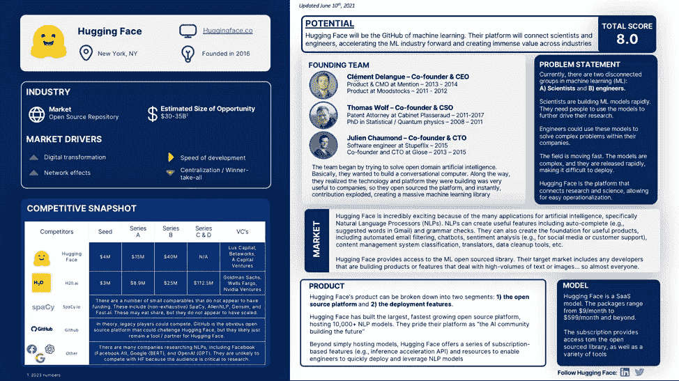

去年秋天， [OpenAI](https://openai.com/) [发布](https://www.wsj.com/articles/an-ai-breaks-the-writing-barrier-11598068862) [GPT-3](https://arxiv.org/abs/2005.14165) 震惊了世界。这些演示让人工智能感觉比以往任何时候都更加直接和切实。然而，该行业一直在悄悄地加速发展，潜在的应用正在迅速扩大。

自然语言处理(NLP)的重大进展，如 GPT-3，正在引发一波创新和机遇。在发布后的九个月内， [GPT-3 已经有超过 300 个应用利用了他们的 API。例子从开发营销文案的工具](https://openai.com/blog/gpt-3-apps/) [(Copy.ai)](https://www.copy.ai/) 到开发虚构的故事情节[(寓言工作室)](https://fable-studio.com/)。

然而，GPT-3 只是许多 NLP 模型中的一种，NLP 模型只是机器学习模型空间的一种类型。世界各地的研究人员正在开发具有各种有前途的应用的新模型。与此同时，世界各地的工程师正在寻找利用这些功能的新方法，但要跟上这一趋势可能会很困难…直到拥抱脸。

表面上，抱抱脸🤗谦逊、有趣、简单……就像表情符号标志暗示的那样。

尽管筹集了约 6000 万美元，但围绕该公司的宣传却很少……但这是不应该的。超过 [10，000+模型，1，000+数据集，](https://twitter.com/clementdelangue/status/1385349868428869636?s=21)和 5，000+公司使用他们的产品，拥抱脸已经悄悄地成为历史上增长最快的开源平台之一。

他们通过给极其复杂的技术领域(机器学习模型)带来乐趣和简单性来做到这一点。从自然语言处理模型开始，拥抱脸使用他们有趣的品牌，干净的 UX，以客户为中心的功能，使自然语言处理模型简单。然而，现在，拥抱脸正在扩展到 NLP 之外，因此他们可以让成千上万的工程师使用任何类别的任何机器学习模型。

在未来，拥抱脸将成为“机器学习的 GitHub”，只需点击几下鼠标，就能为工程师提供世界上最强大的工具。

总之，不要让有趣的表情符号愚弄了你。抱脸是有力量的。让我们来看看为什么。

# 什么是自然语言处理(NLP)？

机器学习是一个巨大的概念，所以为了最好地理解这个行业的潜力(特别是拥抱脸)，让我们从检查拥抱脸的类型开始:NLP 模型。

IBM [将 NLP](https://www.ibm.com/cloud/learn/natural-language-processing) 定义为“*计算机科学的一个分支——更具体地说，* [*人工智能或 AI*](https://www.ibm.com/cloud/learn/what-is-artificial-intelligence) *的分支——致力于赋予计算机理解文本和口语的能力，就像人类一样。”*

那么，这到底意味着什么呢？

在最简单的形式中，NLP 是一种模型，它可以将文本或口语作为输入，并以类似于人的方式提供输出。这看起来很简单，但是想想语言可以有多复杂。

对于英语，有类似的词，如:

当你考虑到上下文、情感、习惯用语等时，事情就变得更复杂了。

对于机器来说，像“摔断一条腿”、“坚持住”和“身体不适”这样的评论通常很难理解。

然而，NLP 模型是计算机模型，当训练有素时，可以开始提取上下文和情感，因此它可以像人类一样理解甚至预测文本。

# NLP 是如何工作的？

如果你是人工智能领域的科学家，这种解释可能会让你畏缩，但在高层次上，我将尝试解释 NLP 模型背后的机制。

在最基本的层面上，NLP 模型研究大量的文本或口语单词，并开始理解不同的单词和字符是如何连接的。

这实际上有三个主要步骤:

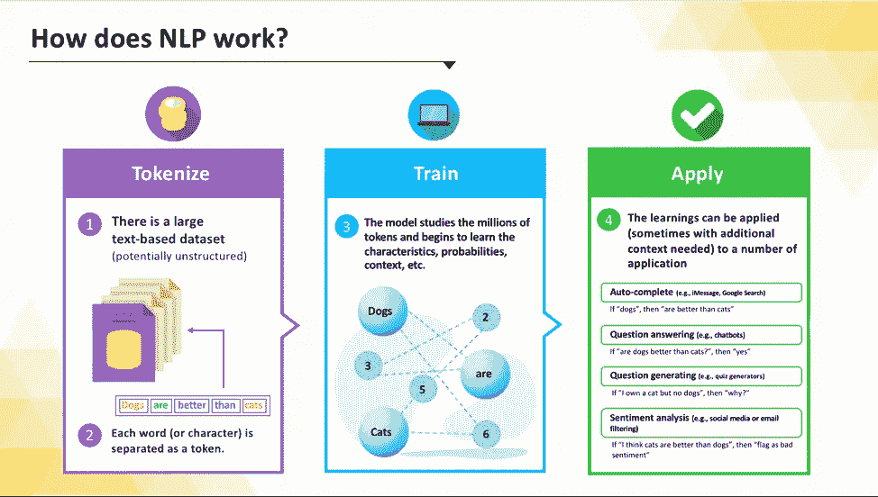

**图表 NLP 是如何工作的？**

首先，NLP 模型将数据集标记化。每个单词(或潜在的字符)都被分解成“记号”在**展品 1** 中，有一句例句:“狗比猫好。”该模型将把[狗][是]、[更好]、[比]和[猫]分成单独的记号。它会在整个数据集上这样做。

一旦所有的单词都被标记化，模型就开始训练。这是一个广泛的过程。考虑一下这个: [GPT-3 有 1750 亿个参数。](https://developer.nvidia.com/blog/openai-presents-gpt-3-a-175-billion-parameters-language-model/)这些数据集可能非常庞大。

在整个训练过程中，该模型分析每个令牌，并开始分配预测概率。这将允许模型识别模式。在上面的例子中，它最终会开始认识到，当[狗]、[是]和[更好]时，它可以预测[比]和[猫]依次跟随。

一旦模型被完全训练，它就可以开始应用学习来完全理解文本。

现在，重要的是要注意 NLP 模型的能力范围很广。显然，如果数据集只包含上面的句子，那么如果遇到“大猩猩”这个词，模型就会丢失。

这就是 NLP 模型中复杂程度极高的地方。有成千上万比我聪明得多的科学家在不断地研究这些。科学家必须在模型设计方面具有惊人的战略眼光，并确定高质量的大型数据集来训练模型。所有这些都是在考虑模型的最终应用的情况下完成的。

这三个步骤给出了对 NLP 模型非常基本的理解，在更宏观的层面上，这些是所有 ML 模型背后的基本概念。拿一个庞大的数据集来说。分割成可消化的成分。训练模型以建立预测特征。应用于设计的用例。

所有这些对于理解这个行业的未来都至关重要。

# 为什么 NLP 很重要？

如果一个模型可以准确地理解和预测文本或口语，那么自动化的机会是无限的。很可能，你已经遇到了许多 NLP 模型。

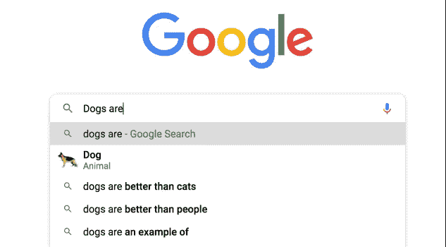

**图表 2:谷歌搜索自动完成示例**

当你在谷歌上键入一个搜索，它会提供建议的完成。

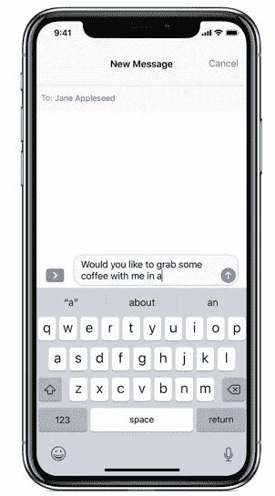

**证物三:苹果 iMessage 自动完成** [**(来源)**](https://support.apple.com/en-us/HT207525)

如果你有苹果设备，你会注意到你输入的每个单词后的建议文本。

NLP 的使用仍处于初期阶段，但其应用范围在不断扩大。 [OpenAI 列出了 40 个应用程序的当前示例](https://beta.openai.com/examples)在生成、转换、翻译、回答、分类和对话中使用它们的 API。

拥抱脸为 [18 种不同的任务](https://huggingface.co/models)提供模型(参见**附录中的展示 13** )。为了简化，我认为当前的拥抱人脸模型可以应用于三个主要功能: **1)生成，2)分类**，以及 **3)其他。**

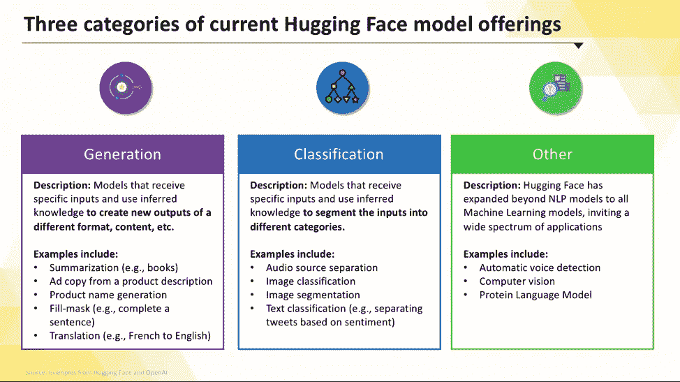

**图表 4:当前的人脸机器学习类别**

在生成过程中，模型可以接受您提供的输入，并创建一组新的输出。例子包括:

*   你给 NLP 模型一本电子书，它会生成一个摘要
*   您提供产品描述，NLP 模型生成广告文案
*   您提供英文文本，NLP 模型生成外语文本

在分类中，模型接受输入(例如，数据、文本)，并根据参数将内容分成不同的类别。在这个应用程序中，该模型不生成任何新内容，而是利用其知识来自动分离内容。

拥抱脸扩展到了单独的 NLP 模型分类之外，它们已经开始支持计算机视觉(例如，图像分类)。例子包括:

*   你提供一个有许多声音的音频剪辑，等等。，NLP 模型将其分离
*   你提供 100 万条不同的推文，NLP 模型识别所有积极和消极情绪的推文
*   点击并拖动图像，让计算机对图像进行分类/标记[(图像分类)](https://twitter.com/huggingface/status/1392503426978881536)

最近，拥抱脸已经成功地超越了简单的 NLP 模型。现在，我把这些归类为“其他”早期的例子包括:

电子邮件、社交媒体、娱乐、工作等。我们所做的 90%都涉及某种形式的语言，其中大部分都集中在理解语言(对语言进行分类)或对语言做出反应(生成)上。由于这个原因，ML 模型(特别是 NLP 模型)将会在我们生活的每个方面带来显著的应用，正如创始人[克莱门特·德兰格](https://twitter.com/ClementDelangue)所说，[“NLP 将会是十年中最具变革性的技术！”](https://twitter.com/ClementDelangue/status/1283411618395815936?s=20)

# 问题:弥合科学和工程之间的鸿沟

虽然 NLP 研究和创新继续加速，但一直存在行业逆风:科学和工程之间的脱节。

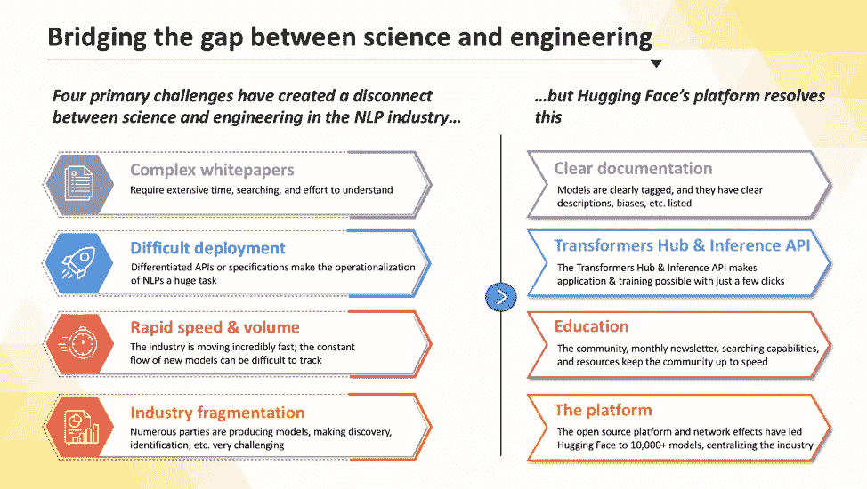

**展示 5:弥合科学与工程之间的鸿沟**

NLP 模型主要由人工智能科学家(或研究人员)开发。有许多不同的 NLP 研究组织，从公司到学术机构到非营利组织，它们都在生产不同的模型

然而，工程师是在他们的组织(例如，公司)中实际利用这些模型的利益相关者。

科学家需要工程师来使用他们的模型，这样他们就可以收集数据并加速学习。然而，科学家没有时间、能力或资源来营销、销售和部署他们的模型给组织。

工程师们需要这些模型来解决他们业务中的关键问题，但是复杂的白皮书和部署的困难使得模型在其业务中的可操作性极具挑战性。

双方都将从对方那里受益，但双方之间存在摩擦，这不仅效率低下，而且阻碍了创新的速度。虽然这在 NLP 模型空间中非常明显，但它将在许多不同的机器学习领域中继续存在。

# 解决方法:拥抱脸

抱脸正在解决这个问题。拥抱脸平台将科学家和工程师聚集在一起，创造了一个加速整个行业发展的飞轮**(展示 6)**

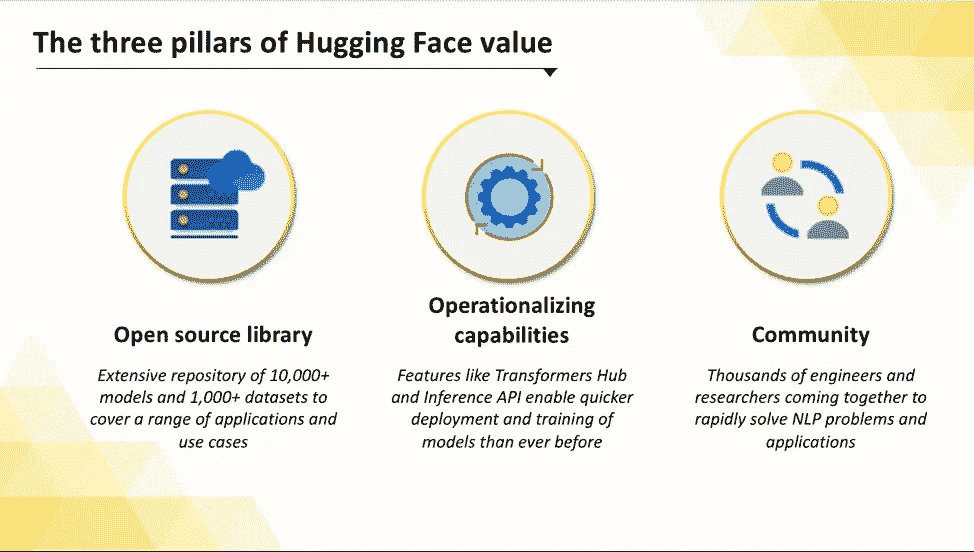

**展品六:拥抱脸的三根柱子**

拥抱脸有三个主要支柱:

1.  模型和数据集的开源库
2.  运作能力
3.  社区

首先，拥抱脸功能[在其名为变形金刚的开源模型库中拥有 1 万多个模型](https://twitter.com/clementdelangue/status/1385349868428869636?s=21)。结合[1000+数据集](https://twitter.com/clementdelangue/status/1385349868428869636?s=21)，世界上没有更大的 ML 模型(特别是 NLP 模型)资源集。

第二，拥抱脸消除了工程师部署和操作 ML 模型的摩擦。拥抱脸根据你想要的任务提供建议，而不是在大量的白皮书中搜寻完美的模型。

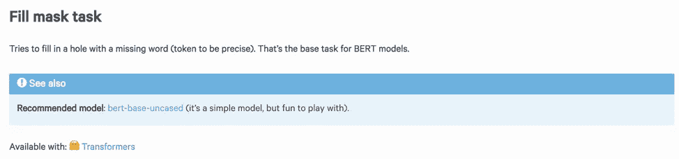

**附件 7:任务推荐**示例([来源](https://api-inference.huggingface.co/docs/python/html/detailed_parameters.html#text2text-generation-task))

对于在 Transformers 上发布的每个模型，它们都提供了描述、限制、用途、使用细节以及当前使用信息(下载)。广泛的信息教育了工程师，并提供了搜索、比较和选择 ML 模型的单一来源。

选择后，Hugging Face 支持使用 1-2 行代码或简单的[复制和粘贴进行部署。](https://twitter.com/julien_c/status/1390967581318819840?s=21)

[https://twitter.com/julien_c/status/1390967581318819840?s=20](https://twitter.com/julien_c/status/1390967581318819840?s=20)

**附表 8:复制&粘贴能力**

一旦部署，[推理 API](https://huggingface.co/inference-api) 可以在几毫秒内服务于 ML 模型，[加速训练和优化准确性](https://huggingface.co/blog/accelerated-inference)

最后，拥抱脸与一个庞大的工程师社区配对。该论坛创建了一个专门针对 ML 的社区，致力于加速行业进步和创建这些模型的新应用。无尽的资源和公共话语完成了科学家的反馈循环，并加速了工程师的采用和学习。

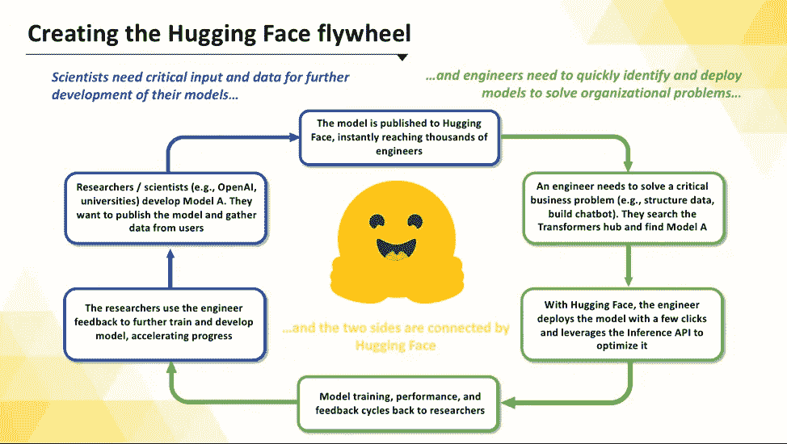

**展品 9:抱面飞轮**

# 结论

总之，NLP 空间是未来十年最激动人心的创新基础之一。

然而，NLP 模型仅仅是个开始。拥抱脸将继续扩大当前的模型库，成为“机器学习的 GitHub”。随着市场的发展，拥抱脸将自己定位为创新的核心，促进和推动 ML 模型的全面采用和发展。

拥抱脸将是一个平台，战略性地定位在一个最大的创新浪潮的中间。

随着越来越多的人拥抱(拥抱双关语…懂了吗？)NLP 的模特，抱脸会越来越成为一个公司来观看，学习，欣赏。

# 附录

## 投资得分

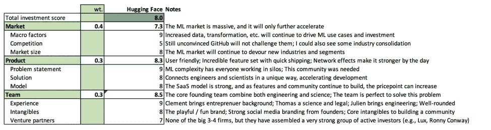

**附表 10:投资得分**

## 问题陈述

目前，机器学习(ML)中有两个不相连的群体: **A)科学家**和 **B)工程师。**

科学家正在快速构建 ML 模型。他们需要人们使用这些模型来进一步推动他们的研究。工程师可以使用这些模型来解决他们公司内部的复杂问题。这个领域发展迅速。模型很复杂，而且发布很快，很难部署。拥抱脸是连接研究和科学的平台，便于操作。

## 市场驱动因素

**成长**

*   **数字化转型—** [塞特亚·纳德拉表示，Covid 在两个月内推动了为期两年的数字化转型。](https://www.microsoft.com/en-us/microsoft-365/blog/2020/04/30/2-years-digital-transformation-2-months/)我们的生活方式变得越数字化，我们就可以在越多的领域应用 NLP 模型来提高效率
*   **网络效应—** 从市场角度来看，随着越来越多的人利用这些模型，NLP 的价值将继续增长。从拥抱脸的角度来看，进入平台的科学家、工程师、模型和数据集越多，它们的价值就越大。

**不确定因素**

*   **发展速度—** 目前还不清楚该行业的两个领域会发展多快: **1)车型**和 **2)普遍采用。第一个会带动第二个。随着模型的改进，它们变得更加适用**

**挑战**

*   **集中化/赢家通吃—** 拥抱脸面临的最大挑战将是，最终是否有少数车型(如 GPT-3)开始赢得全部份额。总的来说，NLP 空间变得越细分和复杂，像拥抱脸这样的开源平台就越有价值。如果没有，那么人们可能会选择直接去找少数赢家

## 市场规模

*   **2870 万**2024 年软件开发者[(来源)](https://huggingface.co/pricing)
*   分层计划每月定价[(来源)](https://huggingface.co/pricing)
*   假设企业每席位约 700 美元/月
*   假设呈递减分布
*   估计的 2024 年全球市场规模为**~ 318 亿美元**

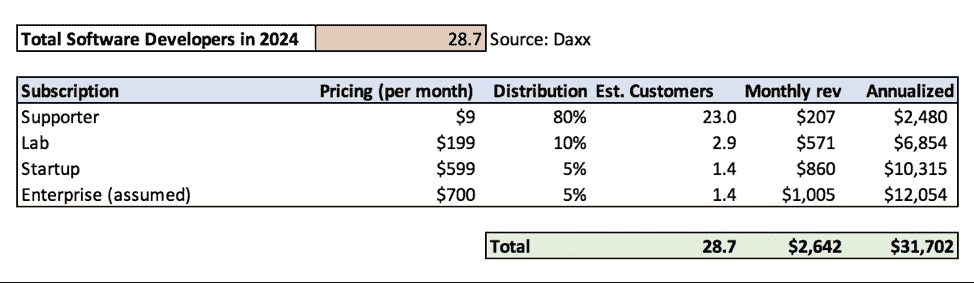

**附件 11:市场规模**

## 竞争

有三个主要的竞争领域:

*   **直接——**公司比如 [H20.ai](https://www.h2o.ai/) 、 [spaCy](https://spacy.io/) 、 [AllenNLP](https://allennlp.org/) 、 [Gensim](https://radimrehurek.com/gensim/) 、 [Fast.ai](https://www.fast.ai/) (非穷举)。H20.ai 拥有 1.5 亿美元的资金，它自称是“头号机器学习平台”H20.ai 是一个更传统的企业设置(销售产品)，而拥抱脸是一个双面平台(科学家和工程师)销售社区。其余的竞争对手资金较少，似乎更有优势。最终，许多人会成功，因为空间正在迅速扩大，但网络效应，资源和社区方面的主要拥抱面临胜利。
*   **平台** —这里值得注意的竞争对手是 [GitHub](https://github.com/) 。GitHub 肯定可以挑战拥抱脸，但目前，他们的合作非常密切。随着拥抱脸网络效应的建立，GitHub 直接竞争将变得越来越具有挑战性。我相信他们仍将是合作伙伴，如果 GitHub(微软)试图收购拥抱脸，我不会感到惊讶。
*   科学家——最后一组包括研究人员。这些可能是其他组织的模型开发团队。对于 NLP 模型，这些将包括[脸书](https://www.facebook.com/)、[谷歌](https://www.google.com/)和 [OpenAI](https://openai.com/) 。虽然他们可以限制自己的模式，并通过直接挑战拥抱脸，但拥抱脸社区已经达到了一个规模水平，阻止它是昂贵的。我认为这种竞争威胁很低。

## 附加展品

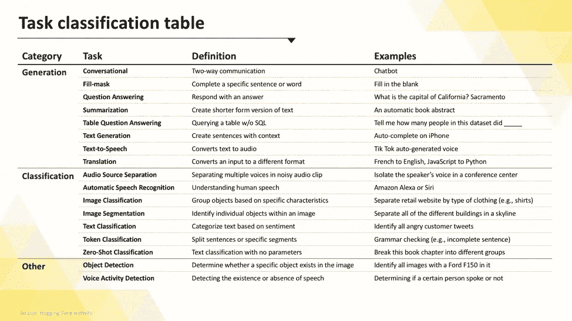

**图表 12: 18 抱脸任务**

*原载于*[*https://jeffburke.substack.com*](https://jeffburke.substack.com/p/hugging-face-the-artificial-intelligence)*。*