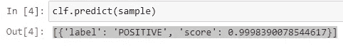
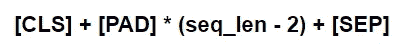
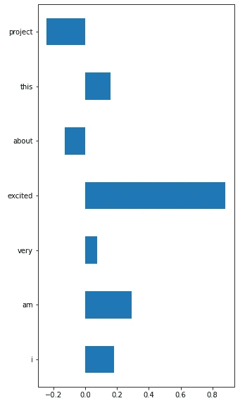

# 使用 Captum 的 Huggingface Transformers 解释性

> 原文：<https://levelup.gitconnected.com/huggingface-transformers-interpretability-with-captum-28e4ff4df234>

审查由 Meta(脸书)开发的一个有前途的框架


布雷特·乔丹在 [Unsplash](https://unsplash.com?utm_source=medium&utm_medium=referral) 上的照片

复杂的 NLP 模型的可解释性仍然是一项困难的、经常是主观的任务，但肯定是市场所需要的。Captum 是由 Meta(脸书)工程师开发的一个软件包，封装了几十种广泛接受的解释技术。在本帖中，我将为您提供一个围绕 Hugginface 情感分类器构建的活生生的例子

# 环境准备

要完成本教程，您需要安装几个软件包。像往常一样，我将为您提供一组终端命令来使它自动发生:

```
$ python3 -m virtualenv venv
$ source ./venv/bin/activate
$ pip install -r requirements.txt
```

# 模型准备

在本教程中，我想跳过模型开发的忙乱，更多地关注可解释性。出于这个原因，我决定使用 Huggingface 情绪分析管道，因为它为您提供了只有两行代码的 SOTA 模型:

```
from transformers import pipelineclf = pipeline(“sentiment-analysis”)
```

该模型能够分析文本的积极或消极情绪，并返回如下预测:



图片#1。拥抱表面管道执行

经典的 ML 任务！

# 该算法

在这一部分中，我将解释一下用于生成要素重要性的算法——图层集成梯度。首先，我不打算向你解释它背后所有沉重的数学，因为它已经由 Mukund Sundararajan 等人在名为[“深度网络的公理化属性”](https://arxiv.org/abs/1703.01365)的论文中完美地实现了。我在这篇文章的这一部分的目标是向你解释编程逻辑，因为我们将使用一个高级框架，在那里这个算法已经被实现了。

1.  生成基线输入。对于图像，基线代表全黑图片或随机像素矩阵。对于文本，采用一系列填充标记。例如，当使用基于 BERT 的分类器时，在 Image #2 上传递类似伪代码的东西是很方便的。请注意，序列的中间部分等于填充标记列表乘以 seq_len-2。基线应该与输入的大小相同，所以这个技巧允许我们实现它。



图片#2。伪代码

2.生成从基线到输入序列的线性变换。这一步可以通过以下一组图像很好地可视化:


原图取自[本帖](https://towardsdatascience.com/understanding-deep-learning-models-with-integrated-gradients-24ddce643dbf)

在文本用例中，您将逐渐用输入向量中的标记替换填充标记。

3.计算一组梯度以测量每一步的变化，其中一步是引入关于基线输入的越来越多的信息的过程。

4.通过将每个步长向量除以其步长总和来归一化梯度。在文本的情况下，您将拥有一个多维数组，其形状类似于 **[1，seq_len，emb_len]** ，并且您将通过列*(伪代码:np.sum(-1))* 进行求和

# 在 Captum 中实现

在这一节中，让我为您提供一个久经考验的类，它包含了 Captum 解释所需的所有主要步骤的功能。请通读方法描述，以便更详细地理解这段代码的作用。

使用包装器也很简单，只需几行代码:

```
 device = ‘cpu’
sample = “I am very excited about this project”exp_model = ExplainableTransformerPipeline(‘distilbert’, clf, device)
exp_model.explain(sample)
```

输出应该如下所示:



请注意,“兴奋”一词是模型总体结果的最大“驱动因素”,因为 pipeline 预测了该样本的“阳性”标签，而 Captum 正在计算关于目标类别的梯度。

# 结论

虽然 Captum 仍处于测试版，但它似乎已经相当稳固了。这个框架不是一个“开箱即用”的解决方案，所以您需要一点耐心来浏览文档和教程。我自己的目标是更深入地探索它，开发一个 python 包来涵盖大多数常见场景，这样最终用户就可以用几行代码调用 Captum 算法。

如果你对这个包感兴趣，请在评论区告诉我！