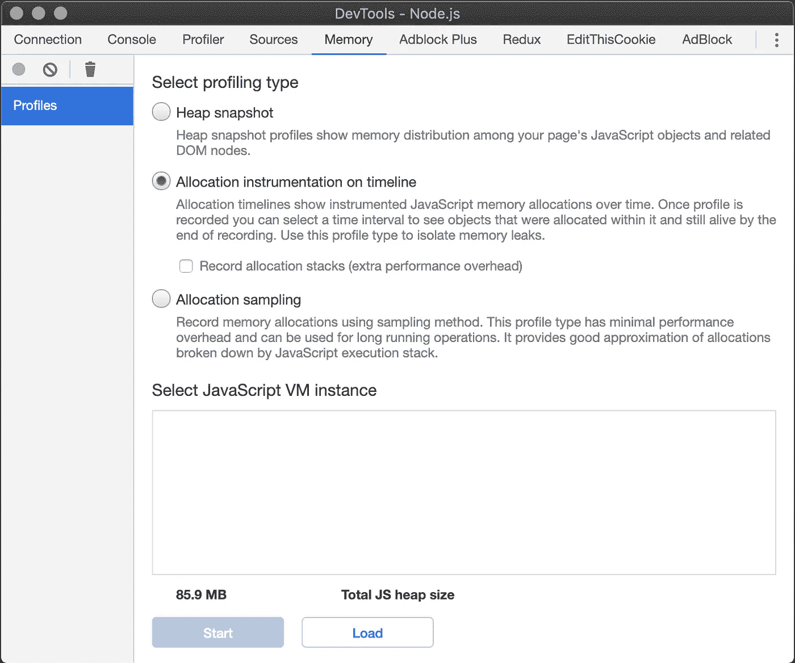

# 在服务器端渲染的 React 应用程序中寻找内存泄漏

> 原文：<https://levelup.gitconnected.com/hunting-memory-leaks-in-server-side-rendered-react-application-311c6306d552>

如果您在 React 应用程序中使用服务器端呈现(SSR ),那么您肯定有时会遇到一些问题。即使你选择像 Next.js 这样有大公司支持的工具，当你遇到问题时，总会有特定的情况。

# TL；dr；

1.  做你的编译只是用巴别塔针对 NodeJS 环境
2.  使用度量标准，例如 Prometheus with Grafana，来确定是否发生了任何内存泄漏
3.  如果出现问题，使用`kill -USR1 PID`开始检查正在运行的 NodeJS 进程
4.  就在开始使用 Chromes DevTools 进行分析之后
5.  我们的内存泄漏是由*重选*和*样式组件使用不当引起的，*两个问题都是使用Chrome DevTools 发现的

# 背景

我们正在处理一个环境，在这个环境中，我们应该在 NodeJS 服务器端渲染应用程序(称之为 Renderer)的一个 pod 上每秒处理 5 次渲染。使用我们的渲染器的 26 个 pod，它每分钟发出 7800 个请求。

在我的例子中，当我完成一个大的整体应用程序(称之为 APP)的重构时，出现了内存泄漏，这个应用程序也包括我们的渲染器，并在生产中对它进行了测试，比如请求加载。

重构包括构建流程更新、过时库的升级，以及将一些包从应用中分离出来。

*当我使用* ***库*** *时，我指的是 npm 包/库，当我使用* ***包*** *时，我指的是 monorepo 中的包/库。*

## 为什么要重构？

该应用程序使用了一个 yarn workspaces 设置，这往往是一个 monorepo 设置，但问题是该应用程序的包有如此深的耦合，实际上它是一个整体。作为蛋糕上的樱桃，有很多过时的库，所以开始重构已经足够了。

# 我们的旧渲染器

我们的 NodeJS 应用程序— Renderer 是用 Typescript 编写的。这就是为什么**有**一个 Webpack + Babel 设置来生成针对节点和浏览器环境的包。

这意味着在创建包之后，我们最终会有两个代码库。一个包括 NodeJS 服务器的代码和服务器端呈现的客户端应用程序的代码。第二个仅包括加载到浏览器中的客户端应用程序的代码。

客户端 React 应用程序是在 ASP.NET 编写的一个更大的应用程序(称之为包装应用程序)的一部分，因此服务器端呈现的代码由包装应用程序处理。此外，我们的渲染器仅用于渲染特定的 React 组件，而不是整个应用程序。因为这个原因，我们**使用`react-dom/server`的`renderToString()`和`react-apollo`的`getDataFromTree()`。我还提到，对于支持服务器端渲染的代码分割，我们使用了`react-loadable`。**

# 监控工具

除了以下工具，我们没有任何用于内存泄漏检测的工具。

在我们的渲染器中，我们使用 **Prometheus** 来收集监控数据，使用 **Grafana** 来可视化它们。此外，还有记录到 **Elasticsearch** 和由 **Kibana** 可视化。

我们在 **Grafana** 的帮助下注意到了内存泄漏，其中我们可视化了以下指标:

*   垃圾收集器暂停(nodejs_gc_pause_seconds_total)
*   垃圾收集器每秒运行次数(nodejs_gc_runs_total)
*   垃圾收集器回收的字节数(nodejs _ GC _ recreated _ bytes _ total)
*   堆大小(节点堆大小总计字节)
*   旧的和新的堆空间大小—(节点 _ 堆 _ 空间 _ 大小 _ 总字节数)
*   大对象堆空间大小—(nodejs _ heap _ space _ size _ total _ bytes)
*   外部存储器使用(nodejs_external_memory_bytes)
*   进程驻留内存使用量(进程驻留内存字节)
*   cpu 使用率(进程 _ cpu _ 秒数 _ 总数)
*   活动请求总数(nodejs_active_requests_total)
*   活动处理程序总数(nodejs_active_handles_total)
*   事件循环滞后持续时间(nodejs_eventloop_lag_seconds)

# NodeJS 应用程序中什么会导致内存泄漏？

## 全局变量

它们会一直留在内存中，直到应用程序停止。这就是为什么在它们中设置大量数据是危险的。

## 多重引用

这也是很危险的，因为你最终会有很多对同一个对象的引用，而这些引用不能被垃圾收集，并且会增加你的堆的大小。

## 关闭

它也有类似的问题，比如多重引用。您正在使用闭包来保存一些对象上的引用，以便以后使用。

# 意识到


绿色:新的堆空间大小；黄色:旧堆空间大小；


renderToString()持续时间的 95%

一切都很好，直到重构的应用程序用类似生产的请求负载进行了测试。

正如您在上面的图表中看到的，过了一会儿，大对象堆被填满了，因此应用程序重新启动。NodeJS 应用程序的内存限制是 1,4 GB。只不过 ***renderToString()*** 方法持续时间从 ***react-dom/server*** 从几十/几百 ms 增加到几秒。此外，GC 运行/秒增加，通常 Scavange 低于 5 次/秒。

认识到这一点后，我们开始思考可能的解决方案。过去，我们在库升级后会面临类似的问题，所以这是一个起点。不幸的是，当时没有空间来解决这些问题，所以我们只是降级那些库。

除了库升级，我们还增加了一些新的库，并开始在一些场景中使用 React Context API。

以下是获得升级的重要软件包列表:

*   graphql
*   反应-阿波罗
*   阿波罗客户端
*   阿波罗缓存内存
*   样式组件
*   反应
*   nodejs
*   网络包
*   巴别塔
*   以打字打的文件

另外，我们添加了 [**重新选择**](https://github.com/reduxjs/reselect) 来记忆[*graph QL()*](https://www.apollographql.com/docs/react/api/react-apollo/#graphqlquery-configcomponent)*HOC。Reselect 是一个通用的记忆库，所以它似乎是一个不错的选择，因为每当组件树中更高的某个组件被重新渲染时，[*grapqhl()*](https://www.apollographql.com/docs/react/api/react-apollo/#graphqlquery-configcomponent)HOC 会返回一个新的对 props 的引用，所以即使使用 *React。我们无法消除不必要的重新渲染。**

*对了，这个问题用 reselect 与 [react-apollo](https://github.com/apollographql/react-apollo) 之间也出现了 reselect 的 github 问题[https://github.com/reduxjs/reselect/issues/334 问题](https://github.com/reduxjs/reselect/issues/334)。*

*现在有趣的部分:)*

# *如何发现内存泄漏？*

## *1.模拟请求负载*

*作为开始，我用*t shark*([https://www.wireshark.org/docs/man-pages/tshark.html](https://www.wireshark.org/docs/man-pages/tshark.html))从生产服务器收集了一些网络流量，并将其保存为 CSV 友好格式(逗号分隔值)。*

*`tshark -T fields -E separator=,`*

> *TShark 是一个网络协议分析器。它允许您从实时网络中捕获数据包数据。*

*稍加编辑后，我在 *tshark.csv* 中得到如下格式:*

```
*http.request.uri,http.accept_language
/our/specific/url,en-GB
/our/other/specific/url,it-IT*
```

*最后，我获得了在我们的测试环境中模拟类似生产的请求负载的所有数据。为此，我使用了*超级基准测试器*([https://github.com/aliostad/SuperBenchmarker](https://github.com/aliostad/SuperBenchmarker))。*

*超级基准标记的设置使用了 *sbtemplate.txt* 文件:*

```
*Accept-Language: {{{http.accept_language}}}*
```

*最后一个命令是:*

```
*sb -u "https://our-test-url-adress.tst{{{http.request.uri}}}" -c 50 -t sbtemplate.txt -f tshark1.csv -U -n 10000000 -y 10*
```

*至此，我在地址[*https://our-test-URL-adress . tst { { { http . request . uri } } }*](https://our-test-url-adress.tst{{{http.request.uri}}})*上启动了 50 个并发请求 10000000 次，其中 *{{{http.request.uri}}}* 表示来自我们的 *tshark.csv* 的第一列，第二列用于发送**

## ***2.删除 Webpack***

***Webpack 在生产模式下做什么？捆绑模块并缩减代码。如果我喜欢有用的数据，这不是一个选项。这就是为什么我只能用*巴别塔*进行编译。***

**在此期间，我面临三个问题:**

****Yarn 工作空间 monorepo 中的符号链接****

**在不同的包被编译后，模块导入到我们的符号链接包中，并保持不变。**

**这些路径指向我们未编译的代码库(在 *node_modules* 中的符号链接)，因为 webpack 加载器加载了这些文件并从它们创建了一个包，所以不需要做任何进一步的设置。**

**我想用“最简单”的方式解决这个问题，所以我创建了一个简单的 babel 插件，它根据输入数据将导入模块的路径更改为绝对路径。**

****导入图像****

**虽然 *Webpack* 有用于导入图像或从中创建 base64 格式的加载器，但不幸的是我们的默认 babel 设置什么也没有。有几个巴别塔插件可以帮助你，但是我已经在创建插件了，所以我又创建了一个。这会根据输入数据将图像导入更改为值为空字符串的常量，在本例中为扩展名:**

****导入*。graphql* 文件****

**我面临的最后一个问题是导入 *graphql* 文件。我认为我已经创建了足够多的巴别塔插件，所以我简单地使用了*graph QL-import-node*([https://www.npmjs.com/package/graphql-import-node](https://www.npmjs.com/package/graphql-import-node))库。**

****定稿****

**为了编译，我使用*@ babel/CLI*([https://www.npmjs.com/package/@babel/cli](https://www.npmjs.com/package/@babel/cli))在 *package.json* 中创建了一些脚本。**

```
**rimraf babel-build/myPackage && babel ./packages/myPackage --out-dir ./babel-build/myPackage --config-file ./babel.js --copy-files**
```

**`--copy-files`参数用于复制所有未编译的文件(如*)。json* 等。)[https://babeljs.io/docs/en/babel-cli#copy-files](https://babeljs.io/docs/en/babel-cli#copy-files)。**

**然后我就可以启动服务器了:**

```
**node babel-build/myPackage**
```

## **3.谷歌 chrome 开发工具**

**我们的环境在 Kubernetes 上，所以我为命令行(bash)准备了一些方便的别名。**

```
**kube ()
{
  if [ "$1" == "cc" ]
  then
      kubectl config current-context "${@:2}"
  elif [ "$1" == "gc" ]
  then
      kubectl config get-contexts "${@:2}"
  elif [ "$1" == "uc" ]
  then
      kubectl config use-context "${@:2}"
  elif [ "$1" == "sn" ]
  then
      kubectl config set-context --current --namespace="${@:2}"
  elif [ "$1" == "pf" ]
  then
      kubectl port-forward "$2" 9229 9229
  elif [ "$1" == "bash" ]
  then
      kubectl exec -i -t "$2" -- ash
  elif [ "$1" == "gp" ]
  then
      kubectl get pods -o wide | grep "${@:2}"
  else
      kubectl "${@:1}"
  fi
}**
```

***你可以注意到，在* `*bash*` *别名中我们使用的是* `*ash*` *，其原因是主 Docker 镜像是建立在 Alpine Linux 之上的。***

**`kube` bash 函数是 *kubectl 的别名。*如果在任何一个 *if 子句*中没有匹配，它将使用给定的参数执行 *kubectl* 。**

**那么用法是:**

```
**kube cc|gc|uc|sn|pf|bash|gp [...args]**
```

****如何检查正在运行的 NodeJS 进程****

**因为我不想改变 Docker 映像，也不想重启 Kubernetes 中的任何 pod，所以我能做的就是连接到一个特定的 pod，找到我正在运行的节点进程的 PID，并向它发送一个信号。*在我们的例子中，PID 是 1。***

**使用以下方式列出我的 pod:**

```
**kube gp myPodsName**
```

**现在我有了自己的 pod 名称，比如说`mySpecificPodName`，所以我可以连接到它:**

```
**kube bash mySpecificPodName**
```

**我终于可以施展魔法了:**

```
**kill -s SIGUSR1 1**
```

****我做了什么？****

**从文档[https://nodejs . org/en/docs/guides/debugging-getting-started/](https://nodejs.org/en/docs/guides/debugging-getting-started/)**

> **如果 Node.js 收到一个`SIGUSR1`信号，它也将开始监听调试消息。(`SIGUSR1`在 Windows 上不可用。)在 Node.js 7 和更早版本中，这将激活遗留调试器 API。在 Node.js 8 及更高版本中，它将激活检查器 API。**

**因此，对于类似 Unix 的环境，我可以做到以下几点:**

```
**kill -s SIGUSR1 PID
# or
kill -USR1 PID**
```

**对于 Windows 用户，您需要在新的命令行中使用以下命令启动另一个进程:**

```
**node -e "process._debugProcess(PID)"**
```

**在这两种环境中，这将向 NodeJS 进程发出信号，开始检查。**

****如何将开发工具连接到正在运行的 NodeJS 进程****

**目前，我有一个正在运行的 NodeJS 进程，它处于 inspect 模式。接下来呢？**

**从 NodeJS 文档中，我知道在 inspect 模式下，NodeJS 进程监听端口 **9229** 上的调试客户端。因此，我需要使用以下命令将该端口转发到我的本地计算机:**

```
**kube pf mySpecificPodName**
```

**现在我可以在本地机器上打开我的 Chrome 并输入`chrome://inspect`:**

****

**在此页面上，我需要单击以打开节点的专用 DecTools:**

****

**这样，我的 DevTools for NodeJS 应该会打开。**

****

**现在我已经拥有了检测内存泄漏所需的一切。**

# **我们内存泄漏的原因是什么？**

**T2 将引用保存在一个全局变量中，所以我移除了整个库。这个漏洞是由时间线上*内存*标签下的*分配工具发现的。*很遗憾，我没有保存个人资料。****

**

*无论如何，我们遇到的最大问题是**风格的组件 v5** *(撰写本文时是 beta 8)*。*当时我还不知道是 styled-components 使用不良导致的，而不是包本身。**

***大对象堆**增加了很多，所以我在时间线上使用了*分配工具。*使用这种仪器，我得到了以下结果:*

**

*展开*样式表*后，我明确知道它连接到了**样式组件**。*

**

*可以看到问题是由于 ***Uint32Array*** 使用的一个 ***ArrayBuffer*** 分配内存过多造成的。所以我钻研了*样式组件*源代码，找到了*组大小的代码。*它位于*styled-components/src/sheet/grouped tag . js 中，*具体在****insert rules****方法****defaultgrouped tag**类*中。********

**重要的部分如下:**

**这里我们可以看到**uint 32 阵列的用法。**如果您正在从旧的**uint 32 阵列**设置新的**uint 32 阵列**，内部**阵列缓冲器**在它们之间共享。*你可以在*[*MDN web docs*](https://developer.mozilla.org/en-US/docs/Web/JavaScript/Reference/Global_Objects/TypedArray/set#Parameters)*上找到这个信息。***

**我认为这是导致问题的原因，因为在 SSR 期间多次调用了 *insertRule()* 方法，所以在高请求负载下，它会非常快地分配所有内存。**

**所以我提出了以下解决方案:**

**我在这里所做的神奇之处在于，我将元素从 *groupSizes* 复制到一个新的空数组中，因此原始类型化数组中的内部 *ArrayBuffer* 不再共享。太好了，我可以继续用高请求负载测试我的解决方案。**

**不幸的是，这还不够。在**大对象空间**中高分配的问题消失了，但是**进程 RSS** (常驻集大小)和**外部存储器**的使用开始增加。为了揭示原因，我使用了 CPU profiler:**

****

**首先，我记录了应用程序启动时的 CPU 配置文件。我们可以看到在 *ServerStyleSheet 内部调用了 *toString* 方法。_emitSheetCSS* 耗时 3.4 毫秒完成。**

**

*过了一会儿(可能 15 分钟)在生产负载下，我注意到同样的方法用了 1.97 秒。在分离舱死亡前大约 6 秒钟。搞什么鬼？！*

**

*所以我再次挖掘源代码。在文件*styled-components/src/sheet/groupid allocator . js*中，我发现他们正在创建**全局变量** *groupIDRegister* 和 *reverseRegister:**

*它们在源代码中也有这些变量的复位功能:*

*问题是这个函数只在测试工具中使用。这意味着在最后一个包中它被弹出，所以我们不能使用它。*

*您可能认为这可以通过在公共 API 中重新导出该函数来轻松解决，或者在 *ServerStyleSheet* 类中使用它来重置这些全局变量，但是这一步只会导致另一个问题。*

*想象一下，你有一个全局变量，在每次 SSR 之后，你将重置这个变量。除非有并发请求，否则这不是问题。*

*对于并发请求，当另一个请求使用这些全局变量时，您可以重置这些全局变量。在这种情况下，您只是生成了部分样式，所以您最终在浏览器中没有样式。*

*可能的解决方案是为每个请求确保这些变量的一个新实例。您可以通过用类包装这些变量并在 SSR 完成后重置它们来实现这一点。*

*在理论解决方案之后，我创建了两个 Github 问题，以真正了解发生了什么并寻求帮助:*

*   *[https://github . com/styled-components/styled-components/issues/2753](https://github.com/styled-components/styled-components/issues/2753)*
*   *[https://github . com/styled-components/styled-components/issues/2754](https://github.com/styled-components/styled-components/issues/2754)*

*我得到的回答指出，问题可能出在我们的代码中，尤其是动态创建样式化组件的时候。在下一次迭代中，我和我的队友深入我们的代码来检测这些用例。*

*在从版本 3.2.3 迁移到版本 5 beta 8 的过程中，我们的团队成员将 **css** 组件添加到了样式化组件内部使用的几乎每个回调中。*

*像下面这样:*

*这是因为 *styled-components* 文档中的以下句子:*

> *如果您将样式规则作为一个部分来编写，请确保使用 css 帮助器。*

*不幸的是，我们忽略了这个指令与新的**关键帧** API 的联系。哎呀:)。*

*我们还发现，在某些地方，我们在 React 组件的渲染中动态创建样式化的组件，如下所示:*

*是的，所以在我们修改了样式组件的用法并降级到稳定版本(v4)后，所有的问题都消失了。*

**

*[https://imgflip.com/i/3bjm5c](https://imgflip.com/i/3bjm5c)*

*非常感谢你的阅读！*