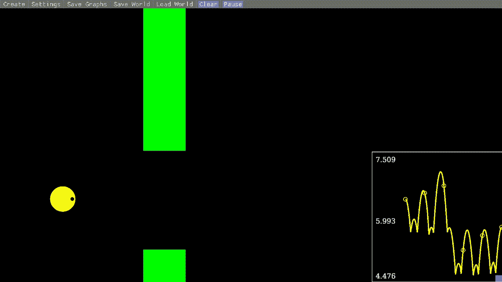

# 我不小心写了一个 Lua 游戏引擎

> 原文：<https://levelup.gitconnected.com/i-accidentally-wrote-a-lua-game-engine-a45bd5f74b30>



简单的机制允许用户用图形表示一个对象的属性；右图显示了 y 轴位置

最近我一直在研究[简单物理](https://github.com/mkhan45/SIMple-Mechanics)，这是一套教育物理模拟器，旨在帮助直观地教和学物理，而无需昂贵的实验室设备或亲自上课。每个模拟器都允许用户导入和导出场景，并可能通过 Lua 添加一些更高级的功能。

直到最近，Lua 脚本还相当有限。它可以用来添加/删除对象和改变变量，例如但重要的是，一旦对象被创建，它就不能影响它们。

```
-- this example instantiates a multicolored grid of circles
for row = 1,HEIGHT do
    for col = 1,WIDTH do
        color = {
            r = (row * col) / (WIDTH * HEIGHT) * 255,
            g = col / WIDTH * 255,
            b = row / HEIGHT * 255
        }
        add_shape{
            shape = "circle", 
            x = col * OFFSET + START_X_OFFSET, 
            y = row * OFFSET, 
            r = RAD, 
            mass = 1, 
            color = color
        }
    end
end
```

重要的是，一旦实例化，就没有办法直接影响单个对象。到现在为止，你可能已经明白这是怎么回事了。

关于这个项目，我已经和我的物理学教授联系过了，他告诉我，他希望学生们能够对我们在课堂上学到的方程进行编码。例如，通过欧拉方法或碰撞方程的基本位置积分。因此，我决定为 Lua 接口实现一种能够更新单个对象的方法。

我得到的是特定于对象的更新函数。通过指定每一帧在对象上调用的函数，用户现在可以修改对象的特征，包括位置、速度、颜色等。这是集成实验室的 MVP，让学生编写自己的集成方法:

```
-- the student should edit this function
local function integrate(x, y, v_x, v_y, dt)
    return {
        new_x = x + v_x * dt,
        new_y = y + v_y * dt,
    }
endX_VEL = 1
Y_VEL = -1-- this function is called on the circle every frame
function update_fn(obj)
    local old_x, old_y = obj.x, obj.y
    data = integrate(old_x, old_y, X_VEL, Y_VEL, DT / 100)
    obj.x, obj.y = data.new_x, data.new_y
    return obj
endadd_shape {
    shape="circle",
    x=SCREEN_X/2,
    y=SCREEN_Y/2,
    r=1,
    mass=1,
    update_function="update_fn"
}GRAVITY = 0
```

这个想法是，学生将编写他们自己的`integrate()`函数。理想情况下，应该有另一个圆使用模拟器的物理引擎，通过比较两个形状的行为，可以看出欧拉积分中的错误。

在我编写示例时，我意识到特定于对象的更新功能与 Unity 的 ECS 的工作方式非常相似。更新功能本质上是一个脚本组件。虽然只能给每个对象添加一个更新函数，但这是一个很容易绕过的限制。

基于这种认识，我决定写 Flappy Bird。我承认这个标题有点 clickbaity:仍然没有办法处理来自 Lua 脚本的用户输入，所以这个程序仍然不能真正被称为游戏引擎。用户可以用鼠标拖动物体，因此可以在场景中设置物理按钮，并且还有全局的`MOUSE_X`和`MOUSE_Y` Lua 变量，但是 Lua 看不到键盘或鼠标点击。正因为如此，我写了一个超级简单的 AI 来玩 Flappy Bird。

我的 Lua 代码有点业余，对于一个代码片段来说太长了，所以如果你想看的话，我鼓励你去 GitHub 上查看一下。

像这样在物理引擎上建造 Flappy Bird 非常有趣。我没有费心去写一个结束游戏的条件，但是如果小鸟撞上了其中一个管道，它们都会飞走。我没有手动更新管道的 x 位置，而是将它们的速度初始化为负。我假设这和它在 Unity 或 Godot 中的工作方式相似。然而，虽然使用这个引擎来编写游戏是完全可能的，但它并不太符合人体工程学。不过，我不介意。

我感到惊讶的另一件事是与 Rust 的 Lua 接口的速度。每一帧，程序都将 Lua 对象的许多字段拉进物理引擎，并将它们传递回 Lua。在 Flappy Bird 的例子中，物理引擎几乎是不活动的，所以我期望 Lua 系统比物理引擎更密集，但是如果我正确地读取我的分析器，它使用了大约十分之一的性能。我很想把简单物理学的[万有引力部分改写成 Lua 脚本。](https://github.com/mkhan45/SIMple-Gravity)