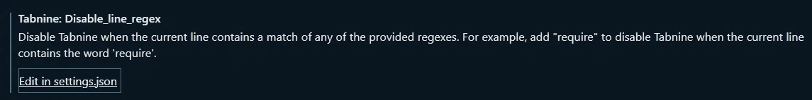
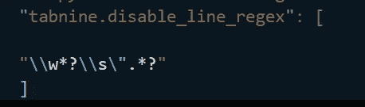

# 我几乎卸载了节省我数小时时间的编码插件

> 原文：<https://levelup.gitconnected.com/i-almost-uninstalled-the-coding-plugin-that-saves-me-hours-of-time-690e5daad033>

## 只有在我了解到一个隐藏的配置选项后，它才得以保留


[Unsplash](https://unsplash.com?utm_source=medium&utm_medium=referral) 上 [AltumCode](https://unsplash.com/@altumcode?utm_source=medium&utm_medium=referral) 拍摄的照片

欢迎光临！

今天的帖子有双重目的:向你展示一个你可能没有意识到的伟大的生产力插件，并且谈论给你的(高级)用户配置你的产品的选项的重要性。

我说的这个工具叫 TabNine，很神奇。如果你对 GitHub 的副驾驶没有印象，那么你真的需要看看 TabNine，因为它以前就在这里，而且工作得非常好。

你可以得到非常有效的代码自动建议，而我个人的杀手锏是它可以在你的整个工作空间中工作。这允许你引用在其他文件中定义的变量，这为我在编写 RenPy 游戏时节省了时间。

这是一个很棒的工具，可以免费安装——我差点卸载了它，原因只有一个:

> 我不想让它的牛逼挡了我的路。

让我进一步解释一下，我会再给你一个在《伦比》中困扰我无数次的确切例子:

在编写实际的逻辑时，TabNine 可以节省大量的时间，特别是因为它可以检查我以前编写的代码，并且非常清楚我将要做什么。我在我写的每一行代码中输入两到三个字母，还有像场景或图像声明、人物说话之类的东西——这些都是自动为我插入的。

这是去除常规部分的真正动力——但是男孩，当涉及到创造性写作时，tabn 是令人讨厌的。

这个问题对您来说可能很明显，也可能不明显，但让我给你看一个例子:

```
protagonist "This is a sentence that the writer is making me say."
```

这些引用之外的一切都归结为我按下“p-r-tab”，一切都很好。但是在引号内，建议看起来像这样:

```
this (function needs to be) esc space is a (workaround until)
```

你明白了。TabNine 平均跨越数百万行代码，尽管它可以组成语法正确的句子，但它并不适合创造性工作。

此外，即使它在一定程度上起了作用——当我键入的每个单词都触发智能感知窗口时，它真的会让我脱离写作流程。你不能这样写故事内容，它真的会碍事。

因此，除了该工具可以处理 90%的重复性任务之外，我几乎还是卸载了它，以摆脱持续的烦恼。我讨厌有好事挡我的路，以至于我宁愿没有它也要工作。

但是，在我第三次尝试找出这个缺陷的解决方案时，我不知何故开始挖掘设置，并偶然发现了修复这个缺陷的方法。

TabNine 的某个人提前考虑并预料到了这个问题，因为有一种支持正则表达式的方法告诉插件当一行匹配某个模式时不要触发。



讨论中的正则表达式非常简单，正如您从我之前的例子中所料:



为了节省您理解它的时间:该语句在任何“包含一个数字字母，后跟一个空格和一个双引号”的行上触发。

现在，经过大约五分钟的思考，我终于拥有了我渴望的安静独处，同时还能在任何地方获得 AI 自动完成的全部功能。

# 要点:如果你能预见用户的问题，让你的产品可配置

现在，作为一个普通用户，TabNine 对我来说是完全免费的，但我可能会成为一个付费用户，即使它不是。如果不是最后一次尝试找到解决这个问题的方法，他们甚至会失去我这个免费用户。

诚然，我本可以更早发现这一点，但它要么不总是在那里，要么我只是错过了它。我知道“排除文件类型”已经有一段时间了，但上次我看我找不到这个其他设置来排除行匹配。

我现在还禁用了//todo 或#todo 的所有匹配的扩展，这是另一个我并不总是觉得有用的地方。