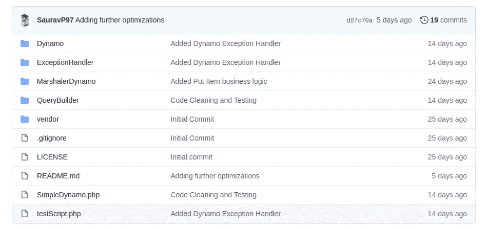
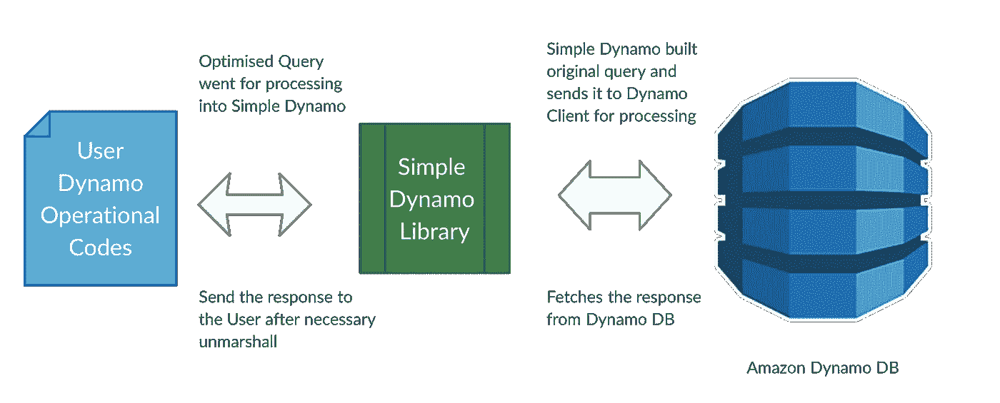
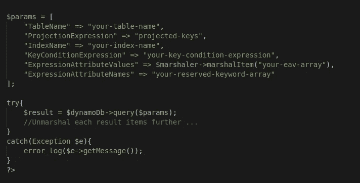
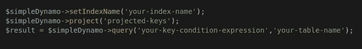
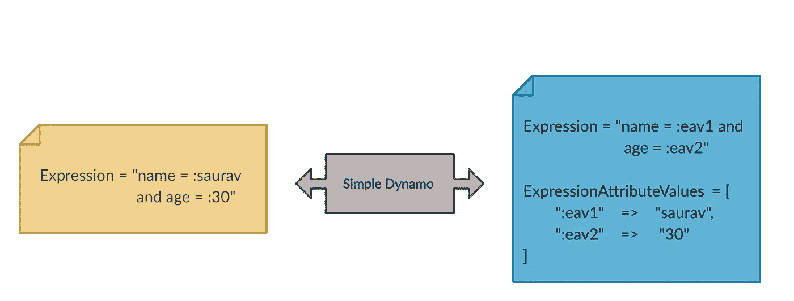
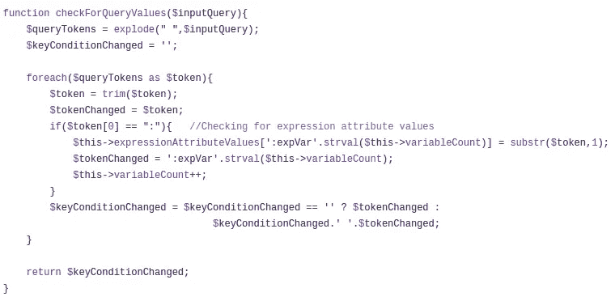
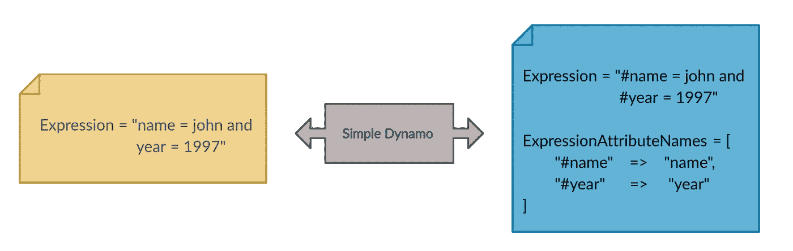
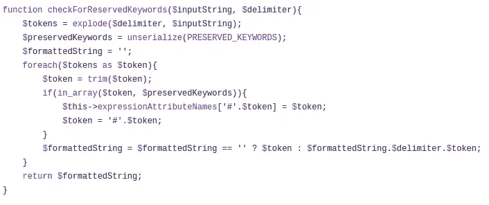

# 我正在用 Dynamo DB 编写一个查询简化库

> 原文：<https://levelup.gitconnected.com/i-am-writing-a-library-for-query-simplification-in-dynamo-db-6e75f6de2594>

我在日常工作中使用亚马逊迪纳摩 DB 大约有 1 年了。在用 Dynamo DB 编写查询和操作代码时，我多次体验到工作中的重复感。这就像，有一些东西可以自动化，可以节省多行额外的代码。所以我决定写一个库，作为 AWS Dynamo 客户端和用户操作代码之间的一个层。

Dynamo DB 是由 Amazon 提供的完全托管的 NoSQL 数据库服务。如果你以前使用过 AWS，你可以在他们的服务中找到它。它非常容易使用，因为大多数事情都由 AWS 在引擎盖下处理。它的伸缩性也非常好！你可以在这里阅读更多关于[迪纳摩 DB](https://docs.aws.amazon.com/amazondynamodb/latest/developerguide/Introduction.html) 的内容。

现在谈谈我的库 **Simple Dynamo** ，我正在以一种允许开发者以更简单的方式和更少的代码行与 Dynamo 一起工作的方式来设计它。一般来说，如果您必须与 dynamo 交互，您需要将所有属性键及其值放在一个关联数组(params)中，同时还需要编组一些值，然后将该数组传递给 dynamo 客户端。然后 dynamo 客户机返回结果，还需要对该结果进行解组。我们这边有很多工作要做，对吗？记住这一点，我正在设计这个库，它可能会被证明对开发人员是有效的。

# 易于交互

在这里，我将做一个小的代码比较，展示当您使用 Simple Dynamo 进行调用时，与 Dynamo DB 交互所需的代码量如何变化。

下面是使用通用 dynamo db 客户端在 Dynamo Db 中进行查询操作的示例代码片段。我们查询 dynamo 数据库的标准方式。

Dynamo 客户端中的查询操作

现在，当我们在 Simple Dynamo 中进行相同的查询操作时，代码片段看起来像这样。

使用简单的 Dynamo 库进行查询操作

在这里，我们可以看到为实现相同的结果而编写的代码量有所不同。有区别对吗？当您大量执行这些操作时，这种代码优化也很重要。如果你更仔细地看这两段代码，你会问为什么我没有在第二段代码中使用**表达式属性值**和**表达式属性名称**。他们在哪里？实际上，我们在使用 Simple Dynamo 时并不需要它们，库为我们弥补了这一点。没有额外的工作。！接下来，我将在本文中讨论它是如何实现的。

# 消除表达式属性值

我们之前说过，在使用简单的 Dynamo 与 Dynamo DB 交互时，我们不需要使用表达式属性值。首先，表达式属性值是一个关联数组，列出了在与 dynamo db 交互时作为多个表达式的一部分使用的所有值。一般来说，我们传递一个数组告诉 dynamo 客户机我们的表达式属性值。但是在 simple dynamo 中，我们可以将这些值放在表达式本身中，并在值前面加上前缀“ **:** ”。这有助于图书馆将它们视为一种价值，其余的由图书馆自己处理。

下面的例子显示了当我们用上面讨论的格式将一个表达式传递到简单的 dynamo 库中时，以及它如何将它转换成 Dynamo 客户端接受的代码时，会发生什么。

在这里，我们可以清楚地看到，simple dynamo 是如何读取表达式并查找其中的值，然后将它们放入表达式属性值数组中的。

让这一切成为可能的代码片段如下所示。

用于设置表达式属性值数组的代码段

# 消除表达式属性名

我们之前也讨论过，在使用简单的 Dynamo 库与 Dynamo Db 交互时，我们将不需要表达式属性名。当我们与 dynamo db 交互时，我们不允许使用一些关键字作为我们的属性或表达式的一部分，因为它们已经被保留了。这些关键词有的是 **id** 、**键**、**值**、**年**等等。因此，当我们需要在操作中使用保留关键字时，我们在**表达式属性名**数组中提到它们，告诉 dynamo 客户端这不是保留关键字。

在制作 Simple Dynamo 时，我维护了一个 Dynamo Db 使用的保留关键字列表。它并没有包含所有的关键词，但是我已经确保包含了我将来可能会用到的大部分关键词。如果任何其他保留关键字弹出后，我会简单地把它放在我的保留关键字列表。现在我有了保留关键字的列表，我只需在用户代码中检查它们。如果找到任何保留的关键字，那么它将被移动到下面的表达式属性名称数组中。所以现在你也不需要担心他们了。

在上图中，我们可以看到 Dynamo 是如何简单地为我们做到这一点的。

帮助从表达式和属性中去除保留关键字的代码片段如下所示。

用于检查保留关键字的代码段

# 消除编组器

在 Simple Dynamo 中与 Dynamo DB 进行交互时，我曾试图消除对 Marshaler 的使用。迪纳摩以不同的格式保存项目。为了将我们的常规关联数组和列表转换成 Dynamo 支持的条目格式，我们使用了**编组器**和在已知的**编组**中执行的操作。它的另一个用途是将 dynamo 支持的条目格式转换回我们原来的关联数组或列表格式。这个过程被称为**解组**。

Simple Dynamo 寻找需要整理的属性值，并为我们完成这项工作。此外，在将响应返回给我们之前，它还执行解组过程。

现在，编组和解组过程可以交给库自己处理了！

# 支持的操作和属性

我在简单的 Dynamo 库中实现了对各种主要属性和操作的支持。实现了**查询、getItem、putItem、updateItem、scan** 和 **deleteItem** 等操作。我将在这个库上实现更多的操作和属性。你可以在这里找到这个库[的全部文档。](https://github.com/SauravP97/SimpleDynamo)

# 读者注意

如果你是 Dynamo Db 的新手，那么我不建议你使用这个库。因为你可能无法真正学会如何与迪纳摩客户端互动。所以要求初学者先从[这里](https://docs.aws.amazon.com/amazondynamodb/latest/developerguide/Introduction.html)开始学习与迪纳摩 Db 交互。

它面向的是那些知道如何与 dynamo db 交互，并且正在进一步寻找通过自动化一些操作来减少代码和复杂性的方法的开发人员。

而且我已经用 **PHP** 写了这个库。您也可以用其他语言扩展这个库。我在本文中提到了构建这个库可能需要的所有关键特性的算法。继续用其他语言构建它，比如 Java、Node JS 等等。

如果你想使用它或者做出一些贡献，你可以随时查看我的库[简单发电机](https://github.com/SauravP97/SimpleDynamo)。是开源的！

如果你觉得这篇文章有任何帮助，请鼓掌，谢谢！