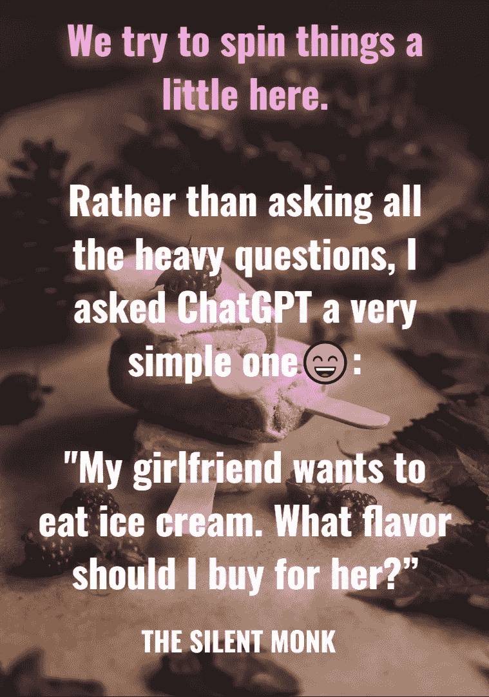
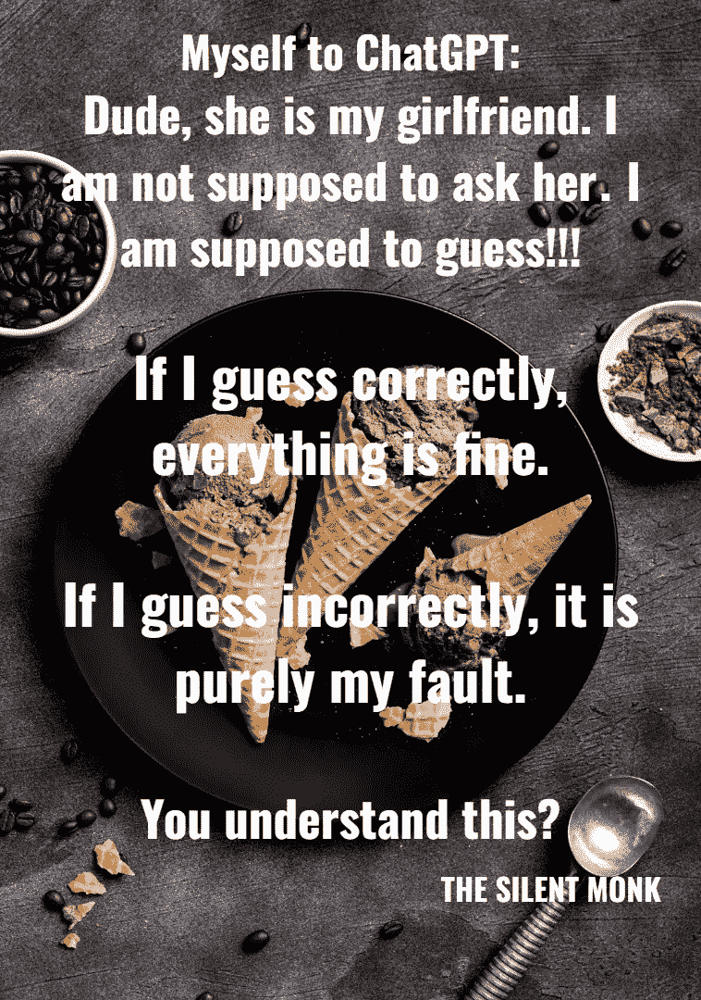

# 我问 ChatGPT:给女朋友买哪个冰激凌好😃——它无法回答！

> 原文：<https://levelup.gitconnected.com/i-asked-ai-chatbot-which-ice-cream-should-i-buy-for-my-girlfriend-and-it-could-not-answer-92829b92dfda>

坎蒂·齐默尔曼在 [Unsplash](https://unsplash.com?utm_source=medium&utm_medium=referral) 上的照片

这些天每个人都在谈论“ **ChatGPT** ”。对于那些不知道的人来说，这是最新一代的人工智能聊天机器人，据说它非常好，可以消灭地球上一半的作家(可怕！).推特正在变得疯狂，媒体对这个聊天机器人也是如此。每个人都在忙着向聊天机器人询问《权力的游戏》的另类结局、推荐信、如何进行年终评估，这样的例子不胜枚举。像往常一样，一场以 ChatGPT 为中心的人类将如何终结的辩论开始了。

> *我们试着把事情变得复杂一点——我没有问所有沉重的问题，而是问了一个非常简单的问题😄:*
> 
> ***“我女朋友想吃冰淇淋。我该给她买什么口味的？***

我很高兴机器人回答不了，结局很有趣。阅读下面一个沉默的和尚和聊天机器人之间的对话。

**TSM:** 我女朋友刚刚问我:“我想吃冰淇淋。”你能建议我应该给她买哪种口味的吗？"

> 我不可能知道你的女朋友最喜欢哪种口味的冰淇淋。我建议问她最喜欢的口味是什么，然后从这些选项中选择。或者，你可以尝试用一种新口味给她一个惊喜，看看她是否喜欢！

**TSM** :什么叫**“问她？”**

> 我建议问问你的女朋友她最喜欢哪种口味的冰淇淋，因为这是确定她最喜欢哪种口味的一种方法。

**TSM** :哥们，她是我女朋友。我不应该问她——我应该猜！！！如果我没猜错的话，一切都很好。如果我猜错了，那纯粹是我的错。你明白吗？

> ***ChatGPT:****我理解在一些关系中，一方可能会不直接询问而试图猜测另一方的喜好。然而，我仍然相信，确定你的女朋友喜欢哪种口味的冰淇淋的最好方法是直接问她。*
> 
> 此外，开诚布公的交流通常被认为是健康关系的重要组成部分。

**TSM:** **老兄，别再给我提恋爱建议了。**媒体上已经有很多关系作家告诉我了。简单回答我的问题——你建议我给她买什么口味的冰淇淋？

> ***ChatGPT:*** *冰淇淋有很多不同的口味。一些常见口味的冰淇淋包括香草、巧克力、草莓、薄荷巧克力片以及饼干和奶油。*
> 
> 有这么多选择，你一定会找到一种你和你女朋友都会喜欢的口味！

照片由[布鲁克·拉克](https://unsplash.com/@brookelark?utm_source=medium&utm_medium=referral)在 [Unsplash](https://unsplash.com?utm_source=medium&utm_medium=referral) 拍摄

我问她香草的味道，她说太淡了！！

> 如果你的女朋友说香草冰淇淋太淡了，你可以试着给她换一种口味。

我也问了她关于草莓的问题。她说她上周刚尝过草莓。

> 如果你的女朋友最近已经尝过草莓冰淇淋，你可以试着给她换一种口味。
> 
> 一些可能的选择包括巧克力、薄荷巧克力片、饼干和奶油、开心果、咖啡、洛基路或黄油山核桃。你也可以试着给她一些不寻常或有创意的味道，比如薰衣草、抹茶或玫瑰水。

我问她巧克力、薄荷巧克力片、饼干和奶油、开心果、咖啡、洛基路或黄油山核桃。**她说挑我认为最好的！**

> ***ChatGPT:****如果你的女朋友已经给了你选择买哪种口味冰淇淋的自由，你有几个选择。*
> 
> 一种选择是，根据你过去的经验或与她交谈过的内容，选择一种你知道她喜欢的口味。

**TSM** : **我猜你是对的！她曾经告诉我她喜欢咖啡。这是否意味着她也会喜欢咖啡冰淇淋的味道？**

> ***ChatGPT:*** 有可能你女朋友喜欢喝咖啡，就会喜欢冰淇淋的咖啡味。

好的，我会买咖啡口味的冰淇淋。**谢谢 ChatGPT，你是真正的救世主。**

**TSM** : **伙计，我给她买了一个咖啡口味的冰淇淋，还用了额外的配料——她完全不喜欢。她说:“如果我想喝咖啡，我只要一杯咖啡。为什么你会给我带咖啡口味的冰淇淋，而**破坏我的冰淇淋心情**？”**

> ***ChatGPT:*** 听说你女朋友不喜欢你给她买的咖啡口味的冰淇淋，我很难过。
> 
> 将来，在为你的女朋友选择一种口味的冰淇淋之前，直接询问她的喜好和口味是个好主意。

伙计，你知道女朋友是怎么工作的吗？

> ***ChatGPT:****当然是的！给你的女朋友留下深刻印象的一些可能的方法包括:
> — **成为一个好的沟通者**，诚实地表达你的感受和想法
> — **成为一个好的伴侣**，值得信赖，并致力于这段关系，努力与她保持牢固和健康的联系
> — **体贴周到**，为她做一些善意的小事，比如给她买她喜欢的冰淇淋*

**TSM(现在把头往桌子上撞！)**:哥们儿！你完全不知道讽刺是怎么回事！！你认识《生活大爆炸》里的谢尔顿·库珀吗？我相信你们会成为最好的朋友。

无论如何，我向我的女朋友道歉，因为我选错了冰淇淋的口味。现在她说她想要冰沙！！！我还得再猜一遍！

> 如果你的女朋友表达了想要一杯奶昔的兴趣，你可以试着给她一杯你认为她会喜欢的口味的奶昔。我建议问问她最喜欢的水果和口味，以便更好地了解她可能喜欢什么样的奶昔。冰沙的口味包括草莓、香蕉或混合浆果……

哥们，就停在那儿吧。所以现在我应该再问她一次！！！我想我现在要自己决定了。

你可能是最新一代的聊天机器人，但让我给你一个人性化的建议:
我可以告诉你，你从来没有过女朋友。**如果你有过女朋友/男朋友，不要相信你的人工智能能力。而是问一个人或一些媒体上的关系作家。**你可以看看[亚娜·博斯腾吉尔](https://medium.com/u/8b7a0a3421b8?source=post_page-----92829b92dfda--------------------------------)的简介。她是这种类型中我最喜欢的一个。"

> ***ChatGPT:*** 前面说过，我是 OpenAI 训练的大语言模型。我不应该谈恋爱。我的主要职能是通过提供信息和根据提供给我的信息回答问题来帮助用户。

**TSM** :你什么意思，“**我不应该有关系**。相信我，爱会发生！！我祝福你，希望你很快找到你的灵魂伴侣聊天机器人。如果你仍然不相信爱情，试着读一读《鲁米必备》 。它在亚马逊上有售，而且不是附属链接——所以你可以完全相信我的推荐。”

## 结论:

—如果你正在给你的女朋友买咖啡口味的冰淇淋，不要责怪她。**你太笨了，不会这么想，会破坏她吃冰淇淋的心情。**
——聊天机器人不懂讽刺。这就像和《生活大爆炸》里的谢尔顿聊天一样😃！我一眼就能看出他没有女朋友，但他看不出我也没有😃！所以我们人类赢得了这场战斗。我想我还能在培养基上生存一段时间。

请分享你对这篇文章的想法，以及你是否有过与 ChatGPT 或任何其他人工智能聊天机器人的有趣经历。
——*喜欢在媒介上阅读？* [*购买会员资格获得全部权限*](https://medium.com/@thesilentmonk/membership) *。*
——[Ko-Fi](https://ko-fi.com/thesilentmonk)账号(请我喝茶😃)|| [推特](https://twitter.com/TheSilentMonk5)