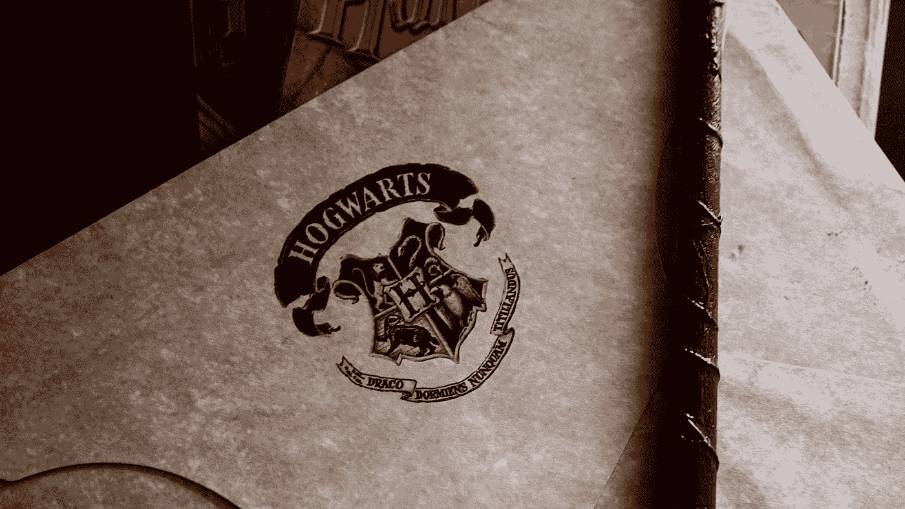

# 我请 ChatGPT 写一部哈利波特迷小说，结果会让你大吃一惊。

> 原文：<https://levelup.gitconnected.com/i-asked-chatgpt-ai-to-write-a-harry-potter-fan-fiction-the-result-will-blow-your-mind-2d4f25cc705d>

# 我请 ChatGPT 写一部哈利波特迷小说，结果会让你大吃一惊。

作为一个哈利波特迷和写作爱好者，我很好奇如果我让 ChatGPT(生成式预训练变形金刚)写一部哈利波特粉丝小说会发生什么。所以，我给 ChatGPT 输入了一些提示，让它发挥自己的魔力。

[Tuyen Vo](https://unsplash.com/@bitu2104?utm_source=medium&utm_medium=referral) 在 [Unsplash](https://unsplash.com?utm_source=medium&utm_medium=referral) 上拍摄的照片

结果是一部同人小说，名为“**拉文克劳失落的王冠**”，讲述了哈利、罗恩和赫敏开始寻找拉文克劳失落的王冠的故事。据说能增强佩戴者智力的王冠已经失踪了几个世纪，据信藏在禁林中。

照片由 [Rosie Sun](https://unsplash.com/@rosiesun?utm_source=medium&utm_medium=referral) 在 [Unsplash](https://unsplash.com?utm_source=medium&utm_medium=referral) 上拍摄

当他们穿越森林时，三人组遇到了许多障碍和挑战，包括遭遇一群狼人和与臭名昭著的食死徒贝拉特里克斯·莱斯特兰奇摊牌。

尽管面临挑战，哈利、罗恩和赫敏坚持不懈，最终找到了丢失的王冠。然而，他们很快发现皇冠被诅咒，必须被摧毁，以防止它落入坏人手中。

> 这是同人小说的全文:
> 
> 哈利、罗恩和赫敏站在禁林的边缘，凝视着黑暗纠结的树木。
> 
> “你确定这条路对吗？”罗恩紧张地问。
> 
> “根据地图，丢失的拉文克劳王冠藏在森林的某个地方，”赫敏回答。
> 
> “但是我们怎么才能找到它呢？”罗恩问。
> 
> “我们只能继续找，”哈利坚决地说。
> 
> 三人组开始进入森林，小心翼翼地避开茂密的灌木丛和锋利的树枝。他们一边走，一边能听到远处狼人的嚎叫声。
> 
> “我希望我们不会碰到这些，”罗恩紧张地说。
> 
> 就在他说完的时候，一群狼人从树上出现，对着三人组咆哮。
> 
> “退后！”哈利喊着，拔出了他的魔杖。
> 
> 狼人向前猛冲，但是哈利、罗恩和赫敏已经准备好了。通过一些巧妙的咒语，他们成功地将狼人赶回了森林。
> 
> “哇，好险，”罗恩擦着额头的汗水说。
> 
> “我们必须继续前进，”赫敏说，再次查看地图。
> 
> 经过几个小时的搜寻，三人组终于在森林深处找到了一个隐藏的洞穴。
> 
> “一定是这里，”哈利兴奋地说。
> 
> 他们进入洞穴，很快发现自己站在一个基座前，上面放着拉文克劳遗失的王冠。
> 
> “我们做到了！”赫敏惊叫道。
> 
> 但是他们的快乐是短暂的，因为洞穴开始在他们周围摇晃和崩溃。
> 
> “发生什么事了？”罗恩惊慌地问。
> 
> “王冠被诅咒了！”赫敏在噪音中大叫。"我们必须在它落入坏人之手之前摧毁它！"
> 
> 哈利、罗恩和赫敏迅速合作，用他们的魔杖施展强大的魔法，摧毁了王冠。
> 
> 最后，王冠变成了瓦砾，洞穴也停止了活动。
> 
> “我们成功了，”哈利松了一口气，说道。"我们从拉文克劳失落的王冠的诅咒中拯救了魔法世界."
> 
> 三人一起回到了霍格沃茨，感激他们的友谊以及爱和忠诚的力量。

这部同人小说是一部扣人心弦、引人入胜的读物，它抓住了哈利波特世界的精髓，展示了 ChatGPT 令人难以置信的能力。这个故事写得很好，结构严谨，人物引人入胜，情节引人入胜。

想到一个语言模型能够写出如此引人入胜、文笔优美的故事，真是令人兴奋不已。

 [## 5 个让你大吃一惊的疯狂 ChatGPT 结果！

### 你看过 OpenAI 的新聊天机器人吗？太棒了。

levelup.gitconnected.com](/5-crazy-chatgpt-results-that-will-blow-your-mind-a9dabeba78eb) 

ChatGPT 有可能永远改变写作的世界。凭借其基于给定提示生成高质量文本的能力， **ChatGPT 有可能彻底改变我们创建和消费内容的方式**。它有可能使写作过程更加高效和有效，并为作家和创作者开辟新的可能性。

作为一个哈利波特迷和写作爱好者，我很高兴看到 ChatGPT 的未来以及它永远改变写作世界的潜力。

> **你对人工智能和机器学习有热情吗？**您想要**了解该领域的最新进展和见解吗？**
> 
> 然后**订阅介质是必须的**。只需每月 5 美元，你就可以从该领域的专家那里获得丰富的知识和见解。
> 
> 另外，你的订阅有助于支持独立作家和像我一样的研究人员。随着**人工智能世界的快速变化，保持消息灵通至关重要。** 不要错过——今天就加入 Medium，成为人工智能革命的一份子。这是你做过的最好的决定。
> **今日订阅中** **使用本** [**链接**](https://medium.com/@arjungullbadhar/membership) **。**