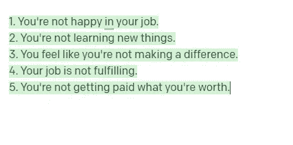
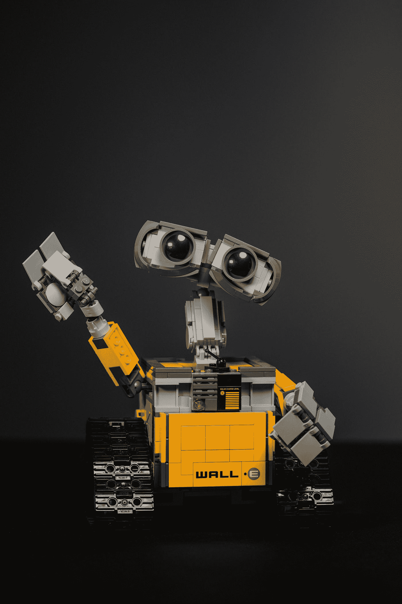
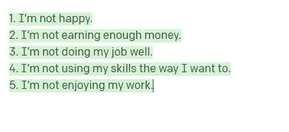
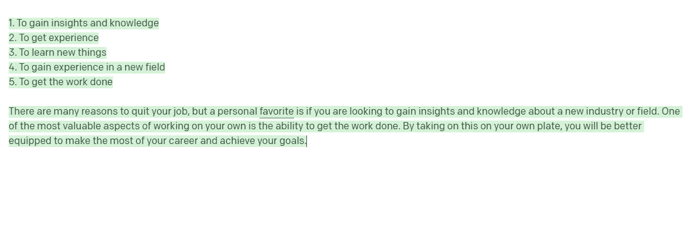
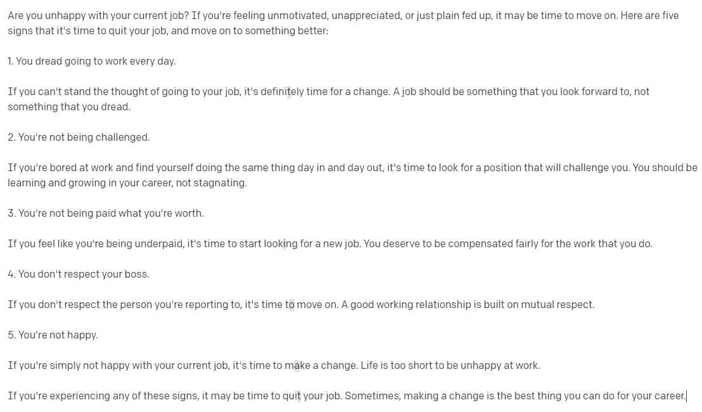

# 我问 OpenAI 的人工智能辞职的原因，它是这样说的！

> 原文：<https://levelup.gitconnected.com/i-asked-openais-ai-the-reasons-to-quit-my-job-here-s-what-it-said-e6d5f37f80af>

老实说，里面有些合理的建议！

克里斯蒂安·埃尔富特在 [Unsplash](https://unsplash.com?utm_source=medium&utm_medium=referral) 上拍摄的照片

人类可以试着帮你解决这个问题。但是如果我们问一个人工智能模型呢？我就是这么做的！

我使用了由 [OpenAI](https://beta.openai.com/docs/introduction) 开发的不同人工智能模型来得到答案，这些是我得到的回应。

照片由[欧文比尔德](https://unsplash.com/@owenbeard?utm_source=medium&utm_medium=referral)在 [Unsplash](https://unsplash.com?utm_source=medium&utm_medium=referral) 拍摄

# 我对人工智能模型的指导

> 写一篇文章告诉我现在辞职的 5 个理由。

# 反应

## 人工智能模型 1: text-curie-001

非常简短和甜蜜的理由列表！

5 个立即辞职的理由

由 [Jason Leung](https://unsplash.com/@ninjason?utm_source=medium&utm_medium=referral) 在 [Unsplash](https://unsplash.com?utm_source=medium&utm_medium=referral) 上拍摄的照片

## 人工智能模型 2: text-babbage-001

这件事太私人了。

5 个立即辞职的理由

[摇滚猴子](https://unsplash.com/@rocknrollmonkey?utm_source=medium&utm_medium=referral)在 [Unsplash](https://unsplash.com?utm_source=medium&utm_medium=referral) 上拍照

## 人工智能模型 3: text-ada-001

这个模型给了我一个个人最喜欢的选择，这是非常令人印象深刻的！

5 个立即辞职的理由

由[附身摄影](https://unsplash.com/@possessedphotography?utm_source=medium&utm_medium=referral)在 [Unsplash](https://unsplash.com?utm_source=medium&utm_medium=referral) 上拍摄

## 人工智能模型 4:文本-达芬奇-002

这是 OpenAI API 上可用的**最强大的 GPT-3 型号**。

我完全被这种人性化的反应惊呆了！

它好到可以作为一篇文章在 Medium 上发表！

阿曼达·达尔比约恩在 [Unsplash](https://unsplash.com?utm_source=medium&utm_medium=referral) 上拍摄的照片

这是人工智能模型所说的:

5 个立刻辞职的理由

我希望这些人工智能能帮助你做决定。

*感谢你阅读这篇文章！*

*如果你是 Python 或编程的新手，可以看看我的新书，书名是'* [**【没有公牛**t 学习 Python 指南**](https://bamaniaashish.gumroad.com/l/python-book)**'***:*

 [## 学习 Python 的无牛指南

### 你是一个正在考虑学习编程却不知道从哪里开始的人吗？我有适合你的解决方案…

bamaniaashish.gumroad.com](https://bamaniaashish.gumroad.com/l/python-book)  [## 通过我的推荐链接加入 Medium——Ashish Bama nia 博士

### 阅读 Ashish Bamania 博士(以及 Medium 上成千上万的其他作家)的每一个故事。您的会员费直接…

bamania-ashish.medium.com](https://bamania-ashish.medium.com/membership)