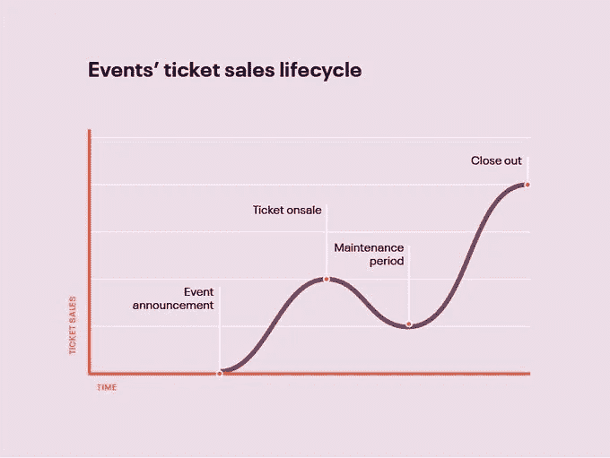

# 我用 4 个 NFT 借了 25 个 ETH，差点被 Rekt。

> 原文：<https://levelup.gitconnected.com/i-borrowed-25eth-against-4-nfts-and-nearly-got-rekt-7e80a67689f3>

蒂姆·丹宁最近在博客中写道，如果你要擅长写作，你需要“过有趣的生活”。

今天，在和虚拟朋友在 discord 聊了 5 个小时后，我逆时针绕着当地公园走了一圈，把事情搞混了。

过这种“有趣的生活”将会是一项相当高的要求。

我唯一值得庆幸的是，我正处于重塑自我的第七轮。作为一个在创业中挣扎、不情愿的员工，Web3 似乎是我的解决之道。

创始人做所有的工作，你分享他们项目的经济价值。前提是它做得好。

你所要做的就是在挑选最佳项目和创始人方面出类拔萃。

真是他妈的没脑子。

当我开始我的 Web3 之旅时，我向自己承诺，我会继续挠我的好奇心。不要做“不”的事情。

因此，当我发现一种抵押贷款的方法时，我全力以赴地学习。

NFTfi 是一个点对点的借贷平台。你可以得到 7 天到 90 天的贷款，利率由你和贷方商定。

通常的贷款金额大约是 50%到 60%的“贷款价值比”，这取决于市场状况和你所利用的非金融资产。

我绝不是使用杠杆的专业人士，但我需要这方面的经验来知道未来该怎么做。

虽然市场被月鸟，VeeFriends 系列二和 Bored Ape 土地销售分散了注意力，但 Veecon 门票以 0.35 ETH 的底价购买是非常划算的。至少我是这么认为的。

在一头扎进去破坏我投资组合的一部分之前，我查看了大量深入的数据。

Veecon Opensea 系列只有 6.5%的门票上市销售。每天仍有约 40 至 70 辆的巨大购买压力。一些脚蹼，我肯定。

为了感受市场情绪，我在 Twitter 上搜索，看看人们是否在谈论 Veecon，我可以看到，人们不仅仅是在谈论它，他们对去和得到一张票的前景感到兴奋。

我在 Veefriends discord 的 Veecon 频道也是这么做的。

人们的意见和他们在网上说的不足以让我参与这样的事情，所以我研究了一家名为 Eventbrite 的“现实生活”活动公司的票务数据，并发现了深入的分析。

信息显示，大多数赛事的大部分门票销售都是在最初发售门票后和结束时进行的。

好吧，谢谢你，明显队长。

销售之旅看起来有点像图表上的半管。

来自 Eventbrite 的信息

数据还显示，30%至 40%的供应发生在活动前的最后一周。

Veecon 门票收藏只有 6.5%上市。我在做生意。

在数据列车上，我找到了一个名为 Semrush 的免费网站，它允许你搜索竞争对手的网站，以窥视他们的流量。Veecon.co 的网站访问量出现缓慢上升，每天大约有 2800 人有组织地持续访问该网站。

美国人占了 92%的流量，可以说使得
更有可能购买来参加会议。然后我搜索了谷歌趋势，它通常与市场情绪步调一致。图表显示上升趋势。

我已经考虑了所有可能的角度，并对抵押贷款平台进行了深入研究，我已经准备好了。

我从 4 个 VeeFriends 那里拿到了 4 笔抵押贷款，贷款总额为 25ETH，然后我就去扫了 Veecon 的票。我支持我的信念和研究，但如果我说我没有悄悄地拉屎，那我就是在撒谎。

被利用可能是我第一次不完全享受 Web3 空间。

自助餐说的最好。“聪明人失败的最快方法是利用杠杆。你只要错一次就会被消灭。这就像是在舞会上扮演灰姑娘，你在享受美酒佳肴，但有时你会忘记你必须在午夜离开。”

不管怎样，这句话对我来说太他妈的了。为了降低风险，我将前两笔贷款错开 30 天，后两笔贷款错开 90 天，这样万一票卖不出去，可能会给我一些喘息的机会。

或者，如果联邦理工学院破产，我可以用少量的菲亚特来弥补任何不足。

幸运的是，联邦理工学院现在已经破产了。

具有讽刺意味的是，就在会议召开之前，NFT 市场开始放松。

整个市场都在调整。“坚持住，等一下。有些不对劲。”

我的屁股开始脱落。

人们突然意识到，他们购买的 Jpegs 文件相对于他们所收到的效用来说价格过高。

显然，它正在“成熟”。

郑重声明，我认为 Veecon 的价格被严重低估了。但是，门票再也没有涨价。它们继续下降。

在发布会之前和发布会期间，我以 0.25ETH 的均价出售。扣除费用后，它是 0.23ETH。

我的 65 张票中，有 4 张送给了社区里的人。善良是强盗，尤其是当你变得“贪婪”的时候

我估计总共损失了大约 12ETH。这还不是最糟糕的。

在 Veecon 的最后一天，Gary Vee 在沙发上放松，Snoop 在舞台上，就像他坐在他的前屋一样。

漫不经心地宣布，如果你持有 Veecon 门票，这将是你与 Snoop Dog 合作的通行证。

当他说“这就是我们要用 Veecon 门票做的事”时，我的心一沉。

我的抵押贷款表现现在变得有点混乱。

Veecon 门票上涨到 Snoop Dog 新闻的 0.6ETH，我希望地面将我吞没，彻底消失。

体育场里的每个人都欢呼雀跃，就像赢得了超级碗一样。

我的英国朋友站在我旁边，喊着，“我们他妈的走吧。”用我听过的最浓重的美国口音。

他在明尼苏达州呆了 4 天。

# 我学到的最大的教训。

*   当你在控制的时候，你短线交易的 99%都不是
*   杠杆操我的头
*   我做得比买入和持有好得多
*   我本可以测试一下水，然后借少量的、更容易控制的 ETH。
*   如果加里看到这个博客，这一切可能都是值得的。

***以上都不是理财建议。我不是一个合格的财务顾问，尽管我尽了最大努力，我也无法预测未来。***

***NFT 空间有风险。***

***专家说，目前 99%的项目都在走向 0。***