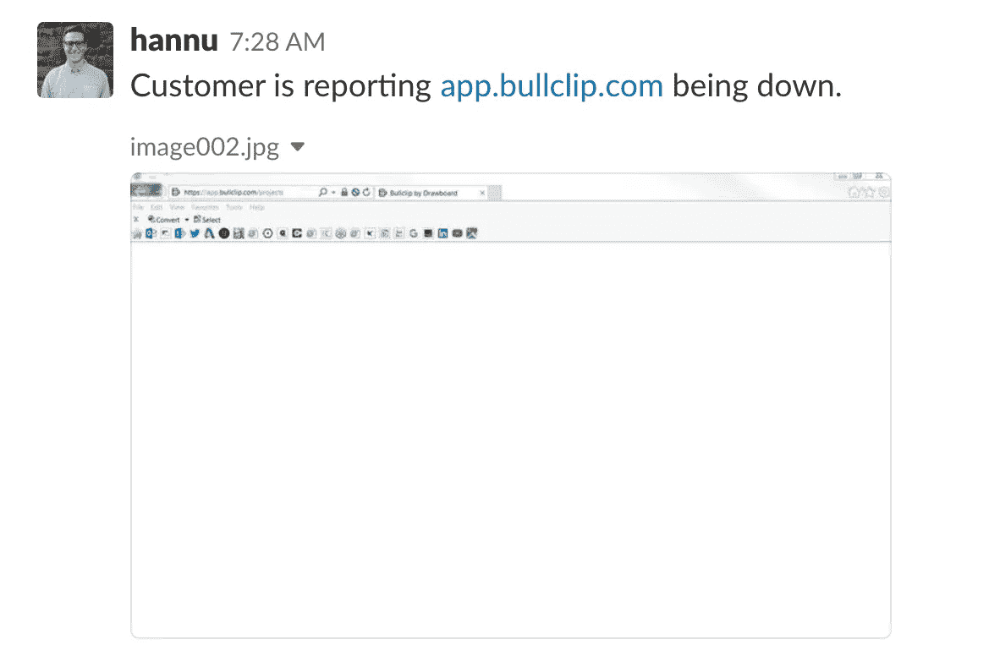
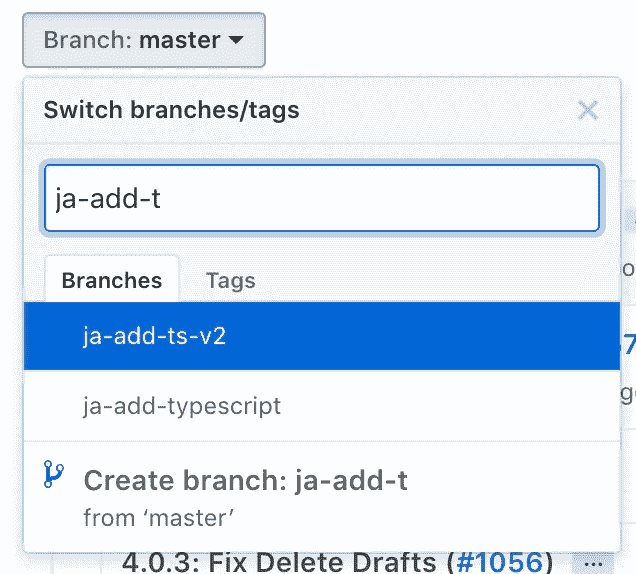
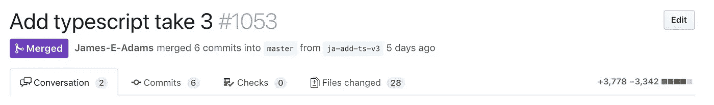
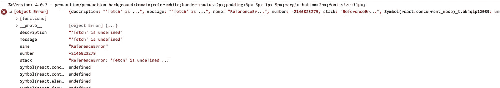
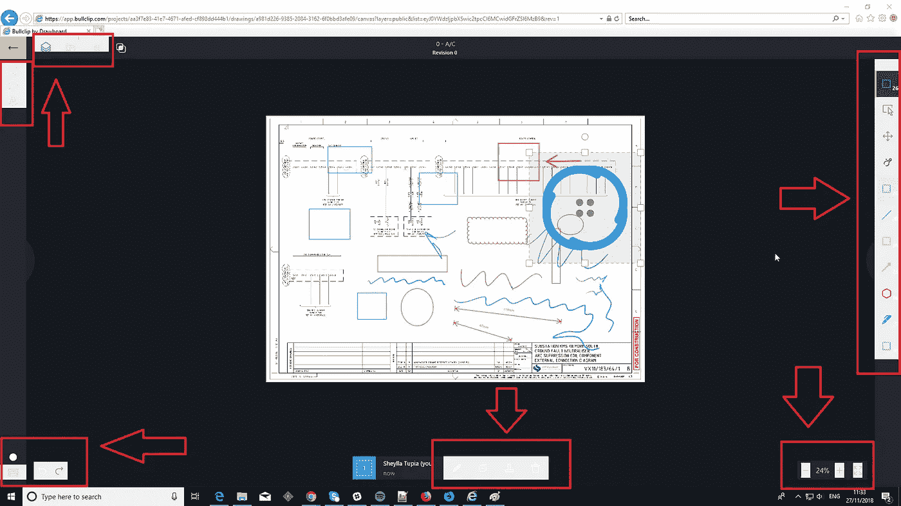
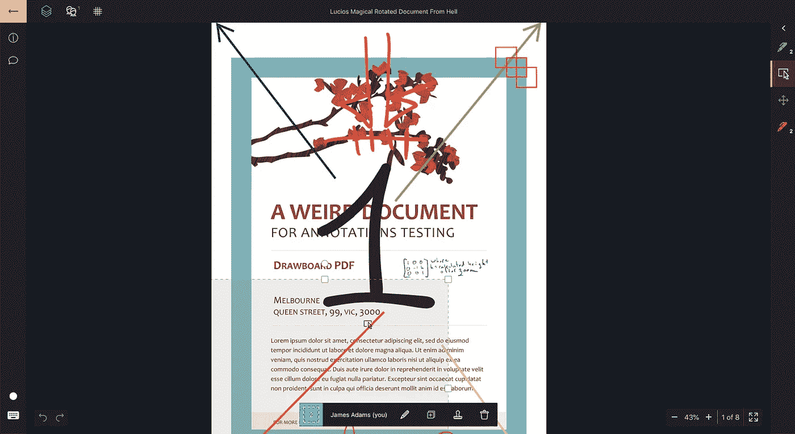
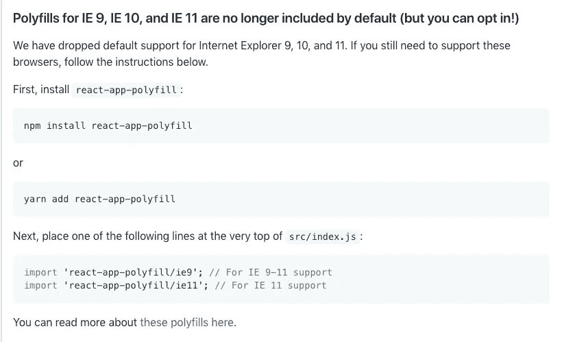
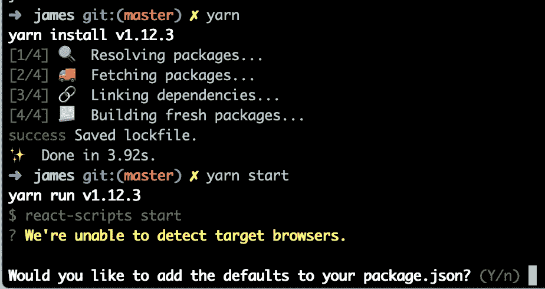
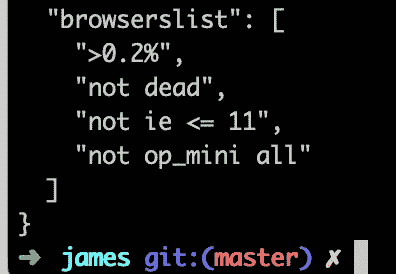

# 我打破了 IE:验尸

> 原文：<https://levelup.gitconnected.com/i-broke-ie-a-post-mortem-6201c4861d64>

这就是我一天的开始..

# TL；DR:阅读发行说明。并在 Internet Explorer 中检查您的 create-react-app！

那天我起床的时候，一切看起来都很好。天气像墨尔本一样——太阳不见了——但是我睡得很好，没有任何明显的抱怨。和大多数早晨一样，我煮了些咖啡，然后跳上了 Slack。我漫无目的地浏览我的未读信息——新闻文章，一些玩笑，也许还有一些书籍推荐。直到这一天:

看看这张截图的左上角，你会看到这个:

> 实话实说吧。每个 web 开发人员在他们的职业生涯中都至少破坏过一次 IE。

然而，你对产品中的应用程序完全崩溃负责的情况并不常见。我想探索导致这种情况发生的一连串事件，并可能深入研究我们可以做些什么来防止这种事情在未来再次发生。

在过去的几个月里，我一直在推动我们在前端使用 TypeScript。

> TypeScript 是 JavaScript 的强类型超集，可以编译成普通 JavaScript。[https://www.typescriptlang.org/](https://www.typescriptlang.org/)

没有任何阻力(这很好)。每个人都在船上——虽然只有我们两个人在前端，所以我已经有了 50%的选票。准独裁万岁！

但是每个应用程序都有自己的美丽之处，所以它需要一点点改动才能工作。

我被刮伤的树枝…

正如你在上面看到的——我花了几次时间才把它整合完成，没有被更紧迫的事情分心。总共 3 次尝试。

假设我们是一个 CRA——[Create React App](https://github.com/facebook/create-react-app)——它最初意味着使用[Create-React-App-typescript](https://github.com/wmonk/create-react-app-typescript)。然而，在该尝试被合并和生产就绪之前，CRA v2 发布，增加了 TS 支持。🎉

我想大概是这样。

无论如何，上周我对我用 CRA v2 在我们的代码库中配置 TypeScript 的设置感到非常满意。我添加了一些例子，确保所有的构建/测试阶段都能正常工作，我甚至在之前支持 TS 的 PR 中添加了一本[故事书](https://github.com/storybooks/storybook)！

添加类型脚本 take #3: PR

差异并不太大，大约一半的变化来自于`yarn.lock`文件。

在这次公关中，我把`react-scripts`推到了`^2.0.0`来获得对 TS 的支持。似乎没有什么东西坏了，所以我没有花太多时间去调查那些“如果”。

# 危险信号#1。🚩

这是合并的，但是我没有发布任何东西，因为它在生产中不会有任何可见的效果。

最终，我们将一些东西合并到`master`中，保证了发货。

这个版本在 Hannu 在 slack 上发送那个消息的大约 24 小时前被删除。IE 在生产中被破坏的时间相当长。有人可能会说，还不够好。

这是我们在初步诊断中发现的:

提取未定义

什么？！？我们怎么会遗漏了`fetch`的**聚合填充** *！？！

> * poly fill 或 polyfiller 是一段代码(或插件),它提供了您(开发人员)期望浏览器本身提供的技术。如果你愿意，可以把 API 的前景变平。来源:[https://remysharp.com/2010/10/08/what-is-a-polyfill](https://remysharp.com/2010/10/08/what-is-a-polyfill)

快速浏览一下 git 树，就会发现提交合并 TS 支持是一个令人讨厌的小精灵。

为了尽快在生产中解决这个问题，我很快添加了最流行的跨浏览器 polyfill for fetch， [whatwg-fetch](https://github.com/github/fetch) ，确认它解决了**所有的问题**，并且发货了。

它并没有解决所有的问题。

# 表情符号中的故事:🚢 ->🎉 -> ⏲️ ->😭

2 小时后，这是下一个问题报告。幸运的是，这只是由我们超级棒的 QA 团队内部报告的。

哇哦——坏掉的 CSS。

哇哦。狂野。这些是一些时髦的设计决定。是不拘一格。很前卫。

真的真的**丑**。

这是它在现代浏览器中的外观。

时尚，统一…华丽。

那么是什么导致了 CSS 在 IE 中崩溃呢？为什么我在发货前运行应用程序时没有注意到这一点？

开发工具中的一个小细节显示，一个应该是`background-color: transparent`的 CSS 属性不知何故被转移到了`background-color: initial`中。搞什么鬼，造工具？你应该爱我，而不是恨我！

在违规提交之前对编译的 CSS 进行差异处理会导致以下结果:

啊哦。

显然从`react-scripts``1.x`—>`2.x`发生了一些变化。

但这只存在于编译后的 CSS 中。当从开发服务器提供服务时，CSS 是 **100%没问题的。**

我将为你节省 20 分钟的谷歌搜索，并告诉你我应该从一开始就做什么。在我甚至可以考虑撞击之前——在这个想法即将进入我的脑海之前——我应该已经阅读了发行说明。毕竟，这是一个突破性的变化。SemVer 存在是有原因的。他们可以在重大版本更新中为所欲为，而*发布警察* —🚓-什么都做不了。

# 危险信号#2🚩。

下面是`react-scripts`的第一个官方 v2 版本的发行说明片段:

嗯……

所以这解释了为什么我们的*丢失了*获取多填充。我赶紧把之前加的`whatwg-fetch`去掉，换成了推荐的`react-app-polyfill`(其中包括`whatwg-fetch`)。

但是我仍然不知道 CSS 工具到底发生了什么。再说一遍，我会为你节省 20 分钟的手动抓取网页的时间。`react-scripts 2.x`增加了 PostCSS 和 AutoPrefixer。相关链接:[https://Facebook . github . io/create-react-app/docs/post-processing-CSS](https://facebook.github.io/create-react-app/docs/post-processing-css#docsNav)。

这依赖于你的`package.json`中的一个`browersList`键。

相关文件:[https://github.com/browserslist/browserslist#readme](https://github.com/browserslist/browserslist#readme)

要是我第一次跑 yarn start 的时候不那么粗心就好了:

Y

# 危险信号#3🚩

但是有人可能会问，默认的浏览器是什么？🎩

啊哦…

哇哦。

这很容易通过拆下管路`not ie<= 11`来纠正。经过这一修改，编译后的 CSS 现在对于 IE11(以及所有其他现代浏览器)来说都是正确且有效的。再来一次公关，再来一次合并。CI 和 IE 的另一次运行现在正在尽可能好地运行。

# 走向

我们将来可以做些什么来防止类似的事情发生？

*   在升级主要版本之前阅读发行说明。见鬼，读本该死的字典，去打乒乓球，吃个三明治。在合并那些可能 100%破坏你的应用程序的东西之前，需要更多的深思熟虑和表现。
*   跨浏览器测试。[即将来到赛普拉斯(woot)。](https://github.com/cypress-io/cypress/issues/310#issuecomment-434150624)如果我们在 IE 的 CI 中运行一个单独的测试，那么这本来是可以避免的。但是目前的选择有点渺茫，所以建立起来会有很高的成本。
*   切线:[https://github.com/greenkeeperio/greenkeeper](https://github.com/greenkeeperio/greenkeeper)我想知道这是否会让我们失败得更快…
*   有没有什么方法可以让某些依赖自动化/变得更加困难？作为一名 CI 守卫，您可以解析`package.json`并确认对特定依赖项的更新是经过深思熟虑的。不确定这是否会有太多的繁文缛节。
*   有其他建议吗？下面评论！

总结一下——这是一个主要的 bug。幸运的是，从我惊讶地差点吐出我的咖啡，到我们的应用程序再次可用，解决过程不到 4 个小时。

我怀疑这是否是 create-react-app 维护者做出的正确决定。我知道移除对 IE11 和非现代浏览器的支持会减少捆绑的 CSS 和 JS 的大小。但这种行为可以很容易地选择加入，而不是在以前的现状是支持 IE11 时被迫自动退出。

**我是詹姆斯——我白天的活动包括为** [**做*很酷的网络素材*，画板**](https://drawboard.com) **，攀岩，喝咖啡。当行星以正确的速度和温度运行时，我会写关于网络/JS/React/我的*感受*。关注我的**[**Twitter**](https://twitter.com/@jamesadams0)**，了解以前限制在 140 个字符以内的简短形式的演讲！**