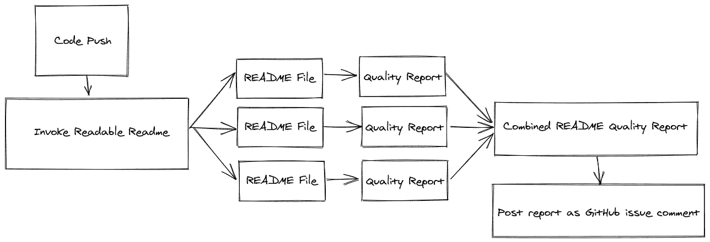
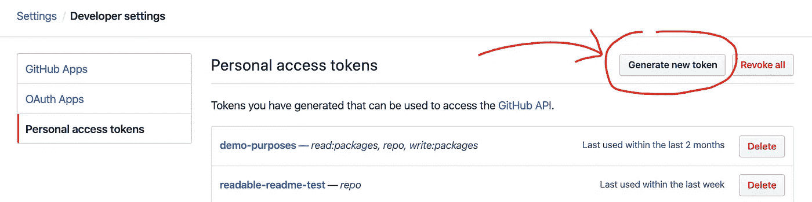
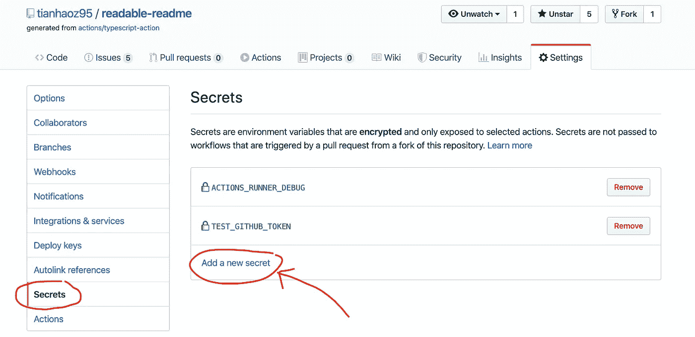
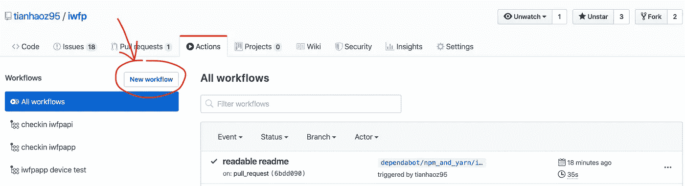
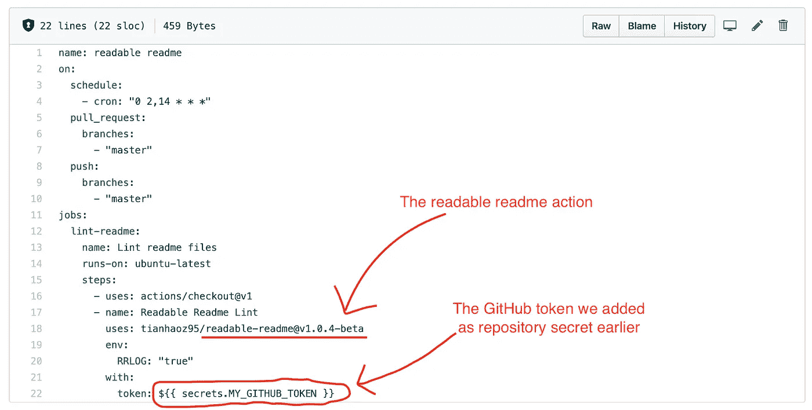
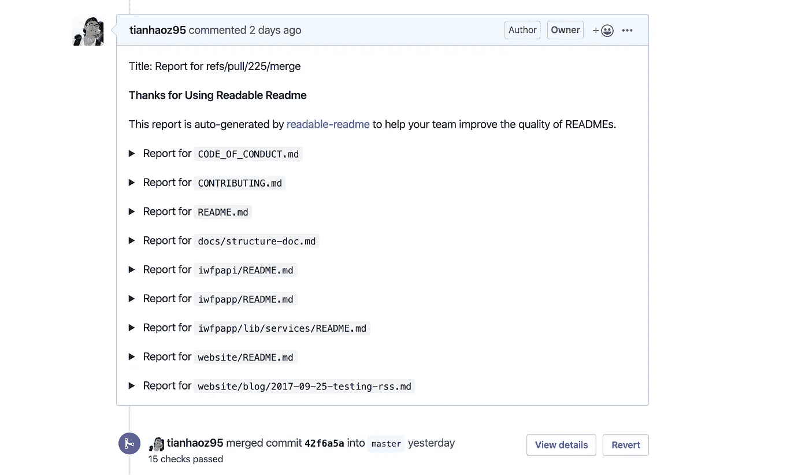
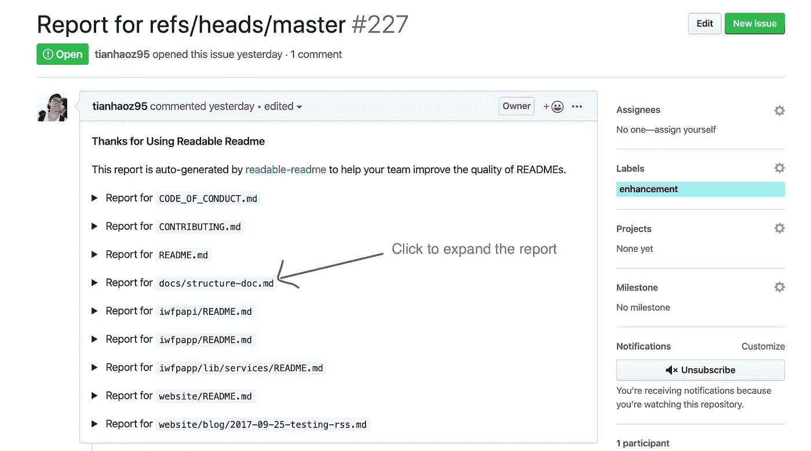
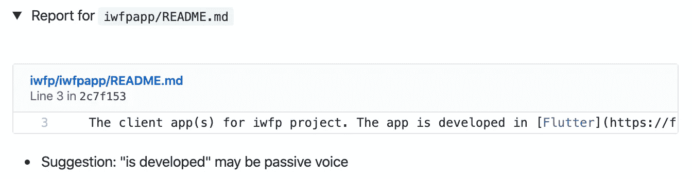

# 我为 READMEs 构建了一个 CI 和工具——Lint、回归测试和 NLP 校对

> 原文：<https://levelup.gitconnected.com/i-built-a-ci-and-tooling-for-readmes-lint-regression-test-and-proofread-with-nlp-81eabb271186>

## 让 README 重新变得可读！

威廉·艾文在 [Unsplash](https://unsplash.com/s/photos/programmer?utm_source=unsplash&utm_medium=referral&utm_content=creditCopyText) 上的照片

自述文件有助于用户理解项目并促进贡献者之间的协作。

关于 README 最佳实践的更多细节，请参考[我之前的帖子](https://medium.com/better-programming/how-to-write-a-readable-readme-590ae6124f69)。

## 由于缺乏工具支持，还没有对自述文件的质量进行大量的关注/努力。

几乎所有的编程语言都有与 CI 平台集成的 linters 和静态分析器。然而，README/Markdown 作为一种“编程语言”却没有同样的工具支持。

> [CI/CD](https://www.infoworld.com/article/3271126/what-is-cicd-continuous-integration-and-continuous-delivery-explained.html) 管道是 DevOps 团队实现的最佳实践之一，用于更频繁、更可靠地交付代码变更— [Isaac Sacolick](https://www.infoworld.com/author/Isaac-Sacolick/)

代码的质量由 CI 来保护，CI 不断寻找缺陷(反模式/错误/风格问题),并在每次代码推送时向开发人员提供建议的修复，以防止代码推送中的质量退化。

就像代码可能有缺陷一样，自述文件也可能有缺陷。

例如，自述文件可能包含损坏的 URL 链接、拼写错误的单词和不清楚的表达式，使其令人困惑。

为了避免这样的问题，我们希望每次修改时都有人来校对自述文件，但是人工校对是膨胀的、不可靠的(因为标准可能因人而异、因时而异)，并且不是全天候可用的。

一个潜在的解决方案是，让我们有一个软件校对，而不是人工校对。根据定义，这将是 READMEs 的 CI 管道。

## 我已经为 READMEs 构建了一个 CI 管道: [readable-readme](https://github.com/marketplace/actions/readable-readme)

可读-自述文件为:

*   易于设置(几乎零配置)
*   轻松使用(开发者无需本地操作。它向 GitHub 存储库发布信息报告)
*   与平台无关(使用 GitHub Action、NLP 和 Node.js 构建)

[Readable-readme](https://github.com/marketplace/actions/readable-readme) 是一个预建的 GitHub 动作，由特定的事件(例如 push、pull 请求和标签等)触发，它 lints(校对)readme 文件。

具体来说，一旦被触发， [readable-readme](https://github.com/marketplace/actions/readable-readme) 将遍历 lint 库中的所有 markdown 文件，并撰写一份质量报告(包含建议的修复)，作为 GitHub 问题发布。

下图显示了“它是如何工作的”的简化版本:

科技栈来自[天昊 95/readable-readme](https://github.com/tianhaoz95/readable-readme)

可读自述文件可在[**GitHub market place**](https://github.com/marketplace/actions/readable-readme)上获得:

 [## 可读自述文件- GitHub Marketplace

### v1.0.4-beta 最新版如果 README 不可读，其他都不可读。太多时候，我们发现一个伟大的项目，但给…

github.com](https://github.com/marketplace/actions/readable-readme) 

源代码可以在这里找到(欢迎投稿):

 [## 天昊 95/可读-自述

### 如果 README 不可读，那么其他任何东西都不可读。我们经常发现一个伟大的项目，但仅仅 5 分钟后就放弃了…

github.com](https://github.com/tianhaoz95/readable-readme) 

# 如何在存储库中使用 readable-readme

## 步骤 1:生成个人 GitHub 令牌

readable-readme 要将报告作为 GitHub 问题发布，需要 GitHub 身份。

GitHub 可以生成一个令牌，用于以编程方式标识您自己(通常由 CI/CD 使用):

## 步骤 2:将 GitHub 令牌作为秘密保存在存储库中

GitHub 令牌是应该保密的敏感信息。

幸运的是，GitHub 在几个月前发布了 GitHub secrets，允许存储库安全地存储敏感信息。

然后，我们可以将上一步中的 GitHub 令牌保存为存储库机密。

## 步骤 3:创建工作流配置

一个[工作流](https://help.github.com/en/actions/automating-your-workflow-with-github-actions/configuring-a-workflow)定义了一组在特定触发事件发生时采取的动作。

在我们的例子中，我们希望在向主分支(或自定义主分支)发送推/拉请求时运行可读自述文件分析:

来自[天昊 95/iwfp](https://github.com/tianhaoz95/iwfp) 的示例

## 步骤 4:将 readable-readme 添加到[工作流配置](https://help.github.com/en/actions/automating-your-workflow-with-github-actions/configuring-a-workflow)

然后，我们可以将 readable-readme 作为一个动作添加到工作流中，并将 GitHub token 作为必需的参数。

工作流配置示例:

来自[天昊 95/iwfp](https://github.com/tianhaoz95/iwfp) 的示例

有几个问题:

*   记得添加结帐步骤。否则，存储库将不会出现。
*   指定要进行 lint 的分支。否则，将会有许多令人讨厌的报告。

## 步骤 5:将工作流配置登记到主服务器中

创建并填充工作流配置文件后，您可以向主分支(或您定制的主分支)打开一个拉请求。

Readable-readme 将在针对“拉”请求(与“推”请求相比)时发表评论，而不是提出单独的问题。

它更清晰，信息量更大(因为它显示了改进的历史)。

以下是 readable-readme 在 pull 请求中的注释(您可以使用它来验证 readable-readme 是否已成功添加到您的项目中):

来自[天豪 95/iwfp](https://github.com/tianhaoz95/iwfp) 的例子

## 第六步:坐下来，喝点咖啡；)

成功安装 readable-readme 后，您将在“问题”选项卡中找到如下所示的 readme 质量报告:

来自[天豪 95/iwfp](https://github.com/tianhaoz95/iwfp) 的例子

您可以单击某个文件来展开详细报告，其中显示了问题片段和建议的修复方法:

来自[天昊 95/iwfp](https://github.com/tianhaoz95/iwfp) 的示例

一如既往，快乐编码，让 README 再次可读；)