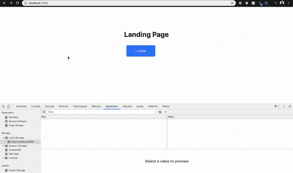

# 我在一小时内建立了一个 M.E.R.N 代码库

> 原文：<https://levelup.gitconnected.com/i-built-a-m-e-r-n-codebase-in-an-hour-742acd71ed7e>

## 构建 React 应用程序的终极指南。

## 在 **React 和 Node.js** 中启动一个想法或构建一个三层架构需要多长时间？如果它花费你**超过一天，那么停止！**休息 5 分钟。然后，用接下来的一个小时(如果你已经知道的话可能会少一点)来构建你自己的创业代码库。

# **作者注**

问候读者，

本文是“ ***我与创业公司一起成长”***系列文章的一部分，该系列文章由各种软件开发的*技术教程、新闻和技巧*组成:

1.  [用 Node.js(第一部分)— ES6 构建一个结构良好的三层架构](https://medium.com/swlh/a-complete-guide-build-a-scalable-3-tier-architecture-with-mern-stack-es6-ca129d7df805)
2.  [提高团队代码质量的两个简单技巧](https://medium.com/swlh/2-simple-tips-to-increase-your-team-code-quality-143b879ae2f7)
3.  [完美的认证结构&用 Node.js 授权你的 API](https://medium.com/swlh/perfect-structure-to-authenticate-authorize-api-with-node-js-and-passport-jwt-d529b1a618ba)
4.  **我在一个小时内构建了一个 M.E.R.N 代码库(第 2 部分)**
5.  [如何用 Java 构建 REST API&MySQL 使用 Tomcat](https://medium.com/@calvinqc/build-a-simple-rest-apis-with-java-8-tomcat-jsp-mysql-intellij-on-mac-3308f4e59a03)
6.  [使用 Nodemailer、Gmail & Google OAuth2](https://medium.com/swlh/multi-purposes-mailing-api-using-nodemailer-gmail-google-oauth-28de49118d77) 构建自己的邮件 API
7.  [WebRTC——支持 Google Meet、Facebook Messenger 的技术](https://medium.com/swlh/webrtc-the-technology-that-powers-google-meet-hangout-facebook-messenger-and-discord-cb926973d786)
8.  [向新的 Github CLIs 问好](https://medium.com/@calvinqc/say-hello-to-the-new-github-clis-7e2612fb3918)
9.  [使用 Java、Springboot、Kafka 进行简单设置](/easy-java-springboot-apache-kafka-setup-on-macos-ceb481e167f8)
10.  [成功的团队合作需要什么](/what-it-takes-to-have-a-successful-team-cooperation-bc21b82e9f3)
11.  [如何使用 Docker、EC2、ECS 和 ECR 将应用部署到 AWS](https://medium.com/swlh/how-to-deploy-an-application-to-aws-using-docker-ecs-and-ecr-aa7785fc9667)
12.  [通过将我们的客户端托管到云存储，我们节省了 45%的总成本](https://medium.com/@calvinqc/we-cut-down-45-of-our-budget-by-switching-to-google-cloud-storage-7e5a6a10542)

感谢访问这个系列，并享受阅读！


为每样东西找到一个完美的构造是很难的，这只是需要时间！(图片来源:马文·迈耶)

在一个帖子中展示所有内容将会让人不知所措。所以我分成两部分。这是 M.E.R.N 全栈系列的**第二篇文章**，在第 1 部分中，我们将重点构建与 Node.js 服务器协同工作的 React 客户端。

1.  构建具有身份验证/授权的服务器。如果您还没有构建自己的服务器，请查看关于如何构建 Node.js 服务器的第 1 部分[。](https://medium.com/swlh/a-complete-guide-build-a-scalable-3-tier-architecture-with-mern-stack-es6-ca129d7df805) 否则，可以随意克隆下面的示例服务器。
2.  **构建实时更新的客户端应用并与服务器协同工作**

# 你将学到什么

1.  前端: [React.js](https://reactjs.org/) ， [Redux-thunk](https://github.com/reduxjs/redux-thunk) ， [React-router](https://www.axios.com/) ， [LocalStorage](https://developer.mozilla.org/en-US/docs/Web/API/Window/localStorage) ， [Axios](https://www.axios.com/)
2.  后端: [Node.js](https://nodejs.org/en/) ， [Express.js](https://expressjs.com/) ， [MongoDB](https://www.mongodb.com/) ， [Postman](https://www.postman.com/)

## 预期结果


**最终代码** [**此处**](https://github.com/calvinqc/trivin/tree/master/templates/mern) **！**

# 要求

## 开发工具

1.  [npm](https://www.npmjs.com/)
2.  [***Redux Dev Tools 扩展***](https://chrome.google.com/webstore/detail/redux-devtools/lmhkpmbekcpmknklioeibfkpmmfibljd?hl=en) ***—这个对你以后调试*** 很有帮助
3.  文本编辑器: [VSCode](https://code.visualstudio.com/) 或者……任何你喜欢的东西。

## 服务器设置

1.  创建`MyProject/` : `$ mkdir MyProject/ && cd MyProject/`。该项目将包含服务器和客户端文件夹
2.  全球安装[trivin](https://github.com/calvinqc/trivin):`$ npm i trivin -g`
3.  用 passport-jwt 认证设置[一个节点项目，用 Trivin 添加`-i`安装项目的所有依赖项](https://medium.com/swlh/perfect-structure-to-authenticate-authorize-api-with-node-js-and-passport-jwt-d529b1a618ba)

```
$ trivin server node-passport-jwt -i
```

# 设置您的项目

1.  在你喜欢的编辑器中打开`MyProject/`
2.  在`Ctrl ``前打开终端，在`cd server/ && npm start`前启动服务器
3.  打开另一个终端，输入`cd client/`。我们将主要在这个客户端文件夹中工作
4.  此时，您的 VSCode 将如下所示


# 让我们来构建您的客户端

1.  首先，创建一个`package.json` : `**$ touch package.json**`并添加这段代码:

2.通过`$ npm i`安装所有软件包

3.设置客户端结构:

```
$ mkdir public && touch public/index.html
$ mkdir src && cd src
$ mkdir api components pages router store store/reducers store/actions
$ touch constants.js index.js utils.js store/store.js App.js router/RouterComponent.js router/RoutesComponent.js
```

5.将此代码添加到`public/index.html`中。在这里，我给了[物化](https://materializecss.com/)一个尝试。

6.添加 3 个文件到你的客户端文件夹:

```
$ touch .eslintrc .gitignore .prettierrc
```

**。prettierrc**

**。eslintrc**

**。gitignore**

现在，您的项目的结构将看起来像这样(在左边):


# 构建您的第一个组件

# 什么是反应？

> React 是一个声明式的、高效的、灵活的 JavaScript 库，用于构建用户界面。它可以让你用称为“组件”的小而孤立的代码片段组成复杂的 ui。

*   简单来说，React 可以通过将类似的 HTML 代码分解成许多**组件**来帮助你降低前端代码的复杂性，这样你就可以在许多页面中重用它。
*   它让你前端的所有东西，不是全部，而是几乎所有**里的东西都是实时的**。
*   在您的**组件**文件夹中创建一个文件名`**Landing.js**`和`**Home.js**`。

## Landing.js

## Home.js

## 半铸钢ˌ钢性铸铁(Cast Semi-Steel)

在客户端`**/public/index.html**`输入第 14~21 行

# 起始文件

`**index.js**`是运行 react 项目的主文件。添加此代码:

```
import React from 'react';
import ReactDOM from 'react-dom';
import App from './App';ReactDOM.render(<App />, document.getElementById('root'));
```

# 您的主应用程序

在 index.js 里面可以看到 ReactDOM.render 里面，我在启动项目的时候调用`<App />`来渲染 App。去你的`**App.js**`然后导入这个:

```
import React, { Component } from 'react';import Landing from './components/Landing';class App extends Component {
  render() {
    return (
      <div>
        <Landing />
      </div>
    );
  }
}export default App;
```

# 常数

*   对于您将在程序的不同地方使用的值，我强烈建议创建`**CONSTANTS**`变量来提高代码的可重用性和可读性。
*   这也将允许您的文本编辑器为我自动完成，减少字符串中的打字错误，并节省我决定更改这些变量的时间。

将这些添加到`**constants.js**`文件中:

# 实用工具

该文件用于添加您想要全局使用的任何函数。例如，我使用**本地存储**来保存 JWT 令牌，以避免在用户关闭浏览器时再次调用登录 API。

# 什么是 LocalStorage？

**问题:**想象你坐在书桌前，正在阅读一本书。然后，你去远处角落的书架把书放回去。5 分钟后，你必须回到书架上拿起书，再读一遍。如果 10 分钟内一直来回 5 次，那就是浪费时间。

**解决方法:**看完书，你没有把它放回书架，而是放到了桌子上的小书架上。下一次，你可以不离开椅子抓住书。

**本地存储:**你桌子上的小架子可以被认为是本地存储**，**你在那里存储任何东西，比如 USER_TOKEN，所以下次当你打开网站的时候，你不需要进行 API 调用来节省时间&成本。

**现实生活中的例子:**类似于你重新打开脸书浏览器，你不需要重新登录，因为你的客户端已经有一个令牌了。

**优势:**使用本地存储将避免用户向您的服务器发出许多请求，从而**节省时间和费用**

# 反应类

*   React 类将包含特定页面的所有内容，其中包括触发按钮的功能、该页面中的组件。
*   现在，创建`HomePage.js`来渲染着陆组件:`**$ touch src/pages/HomePage.js**`

```
import React, { Component } from 'react';
import Landing from '../components/Landing';class HomePage extends Component {
  render() {
    return <Landing />;
  }
}export default HomePage;
```

通过`**npm start**` **运行你的 App。这将在您的浏览器中打开`localhost:3000/`。**

# 还原-thunk

***注意:*** *如果您无法运行 React app，请确保您安装了*[***Redux Dev Tools 扩展***](https://chrome.google.com/webstore/detail/redux-devtools/lmhkpmbekcpmknklioeibfkpmmfibljd?hl=en)

在这个项目中，我决定使用 redux-thunk，因为我认为使用 [**react-redux**](https://github.com/reduxjs/redux-thunk) 会更容易上手。

1.  将它安装到您的客户端文件夹:`$ npm i react-redux redux redux-thunk react-router-dom`
2.  在`store/`文件夹中创建 3 个文件:`**$ touch src/store/reducers/index.js src/store/reducers/userReducer.js src/store/actions/auth.action.js**`

## 1.初始化 Redux 存储

将此添加到`store/store.js`:

## 2.初始化减速器

*   `**index.js**`是将所有减速器组合成一个文件的地方，添加以下内容:

```
import { combineReducers } from 'redux';
import userReducer from './userReducer';export default combineReducers({
  user: userReducer,
});
```

*   在`**userReducer.js**`中，初始化所有状态:

# 反应路由器

现在，我们需要一种更好、更有效的方法，在我们转到`locahost:3000/home`或`localhost:3000/login`时，将我们重新路由到特定页面

## 1.主路由器类别

将此添加到`**RouterComponent.js**`

```
import React, { Component } from 'react';
import { connect } from 'react-redux';import { BrowserRouter as Router } from 'react-router-dom';import RoutesComponent from './RoutesComponent';class RouterComponent extends Component {
  render() {
    const { user } = this.props || {};return (
      <Router basename="/">
        <div>
          <RoutesComponent user={user} />
        </div>
      </Router>
    );
  }
}export default connect()(RouterComponent);
```

## 2.初始化所有路线

接下来，添加`**RoutesComponent.js**`，这是您将为 React 应用程序定义所有路线的地方

```
import React, { Component } from 'react';
import { Route } from 'react-router-dom';// Page
import HomePage from '../pages/HomePage';class RoutesComponent extends Component {
  render() {
    return (
      <div>
        <Route exact path="/" component={HomePage} />
      </div>
    );
  }
}export default RoutesComponent;
```

## 3.将路由器和应用程序连接在一起

修改你的`**App.js**`:

```
import React, { Component } from 'react';
**import RouterComponent from './router/RouterComponent';**class App extends Component {
  render() {
    return (
      <div>
 **<RouterComponent />**
      </div>
    );
  }
}export default App;
```

# 组合路由器+ Redux-thunk + App

*   修改你的`**App.js**`

*   修改`**index.js**` **:**

*   将此添加到`auth.action.js`:

打开你的浏览器，你仍然会看到同一个登陆页面，使用 React-router，Redux-thunk 也能很好地工作


现在，让我们学习如何使用您的后端项目。

# 构建登录页面

1.  初始化组件和类:`**$ touch src/pages/LoginPage.js src/components/Login.js**`

**登录组件**

**登录页面类**

## 登录路线

*   在`RoutesComponent`中添加登录路径:

# 使用 Axios 进行 API 调用

1.  安装 Axios: `$ npm i axios`
2.  创建文件进行 API 调用:`**$ touch src/api/login.api.js**`
3.  将此添加到`login.api.js`:

# 测试

1.  使用样本邮箱和密码登录:`user@testing.com` & `12345678`
2.  在浏览器上点击右键，“Inspect”，“Application”，“Local Storage”，“localhost:3000/”。
3.  你会注意到网站有一个**用户令牌**。



# 注销

成功登录后，我们希望:

1.  重定向到登录用户的主页
2.  添加**注销功能**

修改 **HomePage.js**

现在，再次测试你的应用程序，你会看到上面的结果！

# **跟进**

*   如果你喜欢阅读 ***《我与创业公司一起成长*** 》，并希望在未来阅读更多。请在此订阅[。](http://eepurl.com/g5qIBf)
*   在 [Github](https://github.com/calvinqc) 、 [LinkedIn](https://www.linkedin.com/in/calvinqc/) 上和我联系