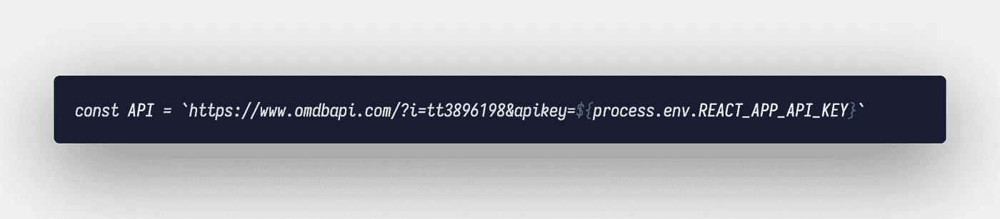
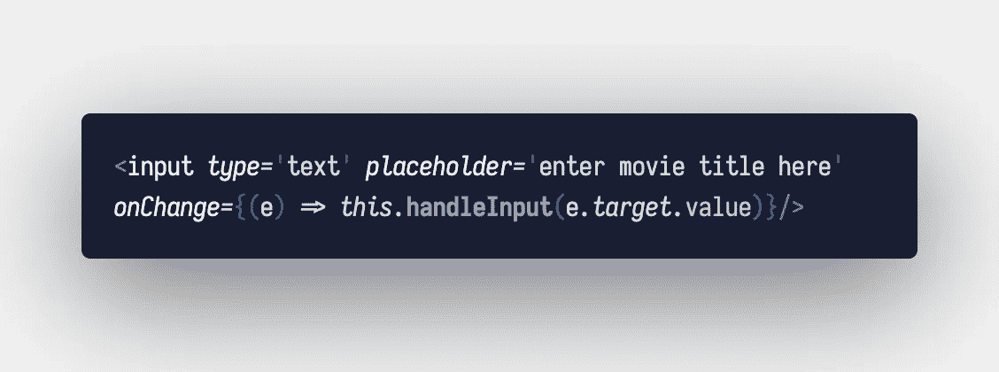
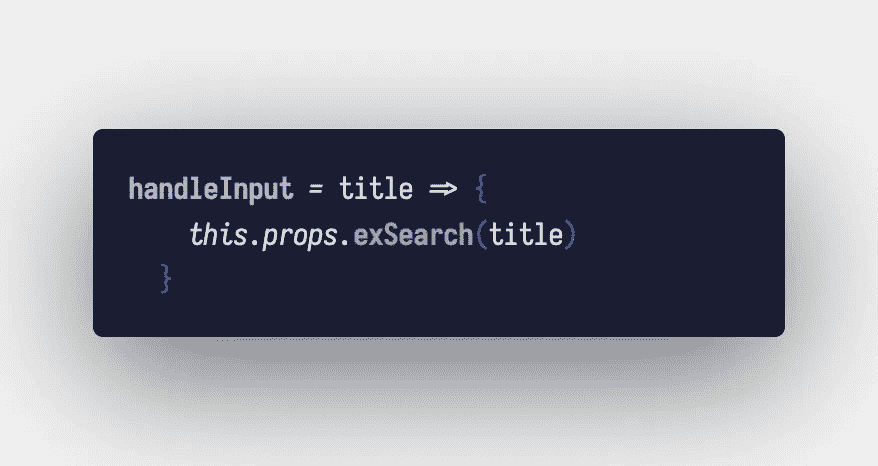
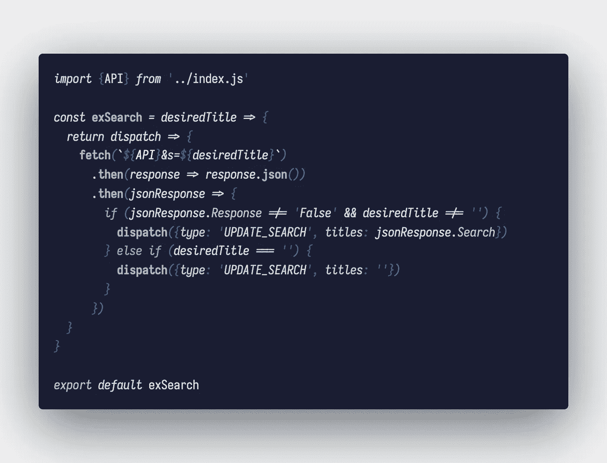
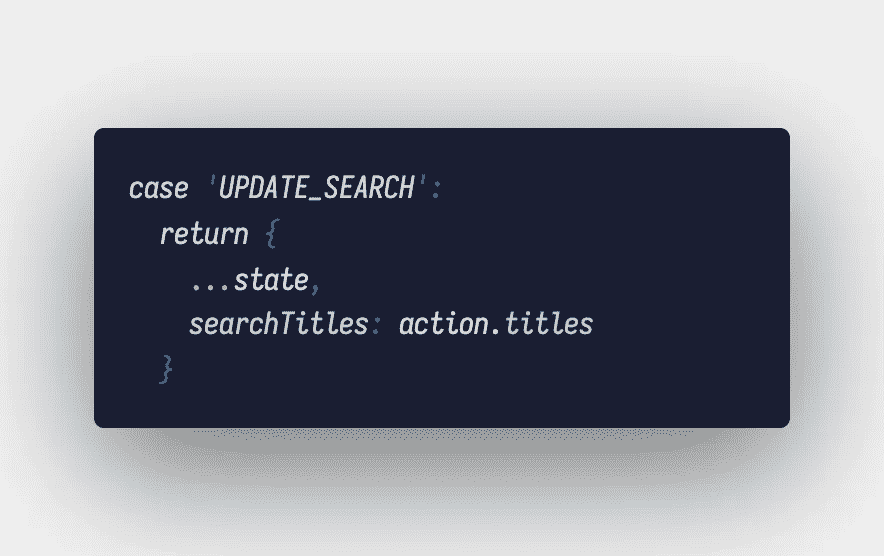
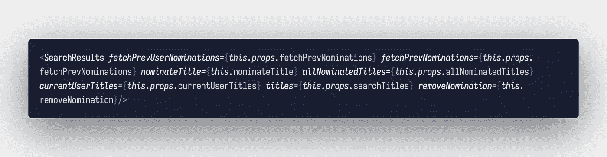
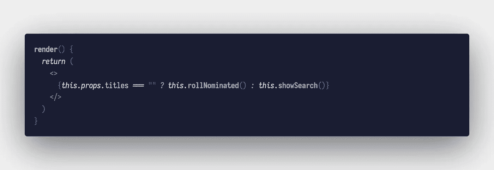
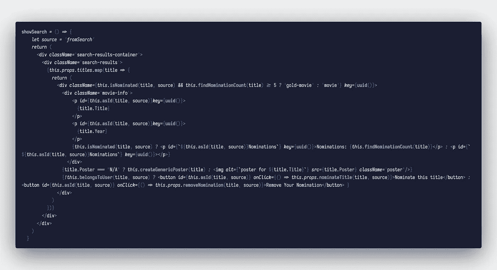
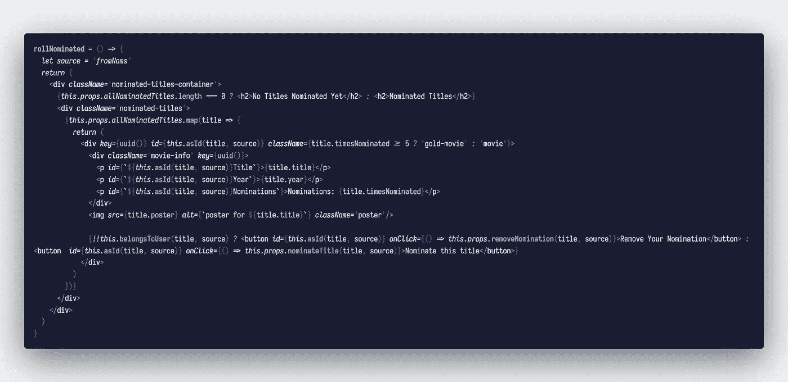
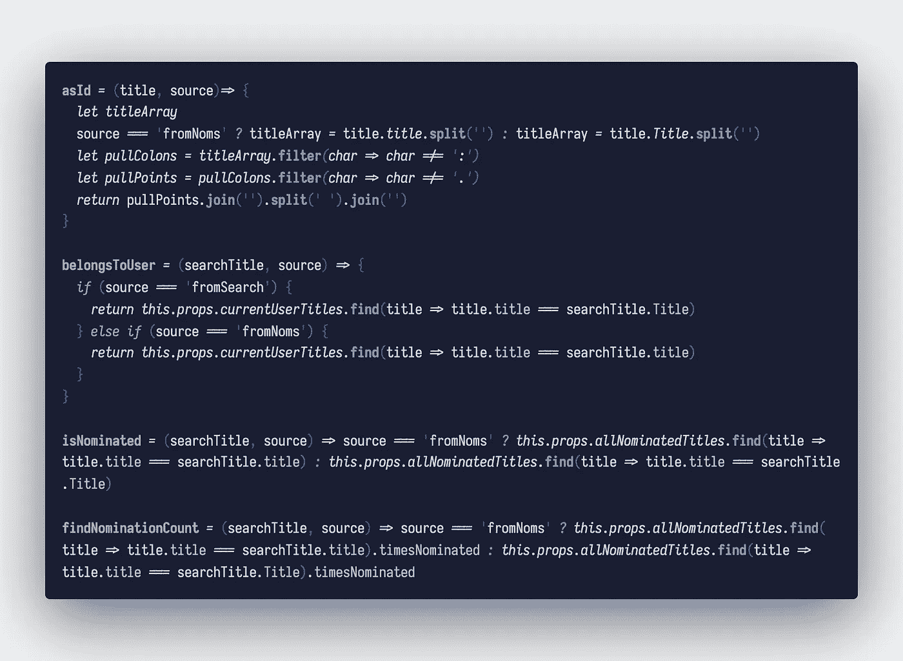

# 我用 React 创建了一个搜索 API 的应用程序

> 原文：<https://levelup.gitconnected.com/i-built-an-app-that-searches-an-api-with-react-f1428222bcb3>

## 一个不知名的加拿大电子商务平台(*是的，就是那个*)正在招聘实习生，而*我*就是那个实习生。

照片由[梅森·金巴罗夫斯基](https://unsplash.com/@masonkimbar?utm_source=medium&utm_medium=referral)在 [Unsplash](https://unsplash.com?utm_source=medium&utm_medium=referral) 上拍摄

他们的申请过程不同于我以前经历过的任何过程。我的任务是创建一个利用 OMDB 电影应用程序接口的网络应用程序，它可以免费获取电影数据，也可以付费获取电影海报。在 [*Patreon*](https://www.patreon.com/omdb) 上查看)，显示搜索结果，并能够添加和删除任何显示的标题的提名，以及完成这些任务的按钮(*或 div 的*)的预期功能。这个构建必须完成，并与要考虑的应用程序一起发送。

我在这篇文章中的重点是回顾我的思维模式和我在构建这个搜索应用程序时遇到的一些问题，以及未来将它作为我作品集中的一个项目来完善的目标。你可以在我的 Github 上看到我的应用库:[前端](https://github.com/jvckmo/challenge)，[后端](https://github.com/jvckmo/challenge-backend)。我的代码将定期更新，文章中的代码截至 5/11/21 是准确的，并且处于提交该工作的状态。

关于构建，我想谈的第一件事是我与一位朋友的对话，话题是:

> 为了一份你可能得不到的工作，这样做值得吗？在完成后没有就业保障的情况下，这种构建值得花费时间吗？

在真正开始之前，我在内心为这个问题挣扎了几天，在我看来，提出的问题是有道理的。我最终得出的结论是，是的，这是值得的。即使我没有得到这个职位，我的投资组合中也有了一个新项目，并且我以一种我以前没有的方式用我选择的技术进行了大量的实践，回想起来，这被证明是正确的。我能够巩固我对 React & Redux + thunk 到 Rails 后端、到数据库、再回到前端之间的数据流的理解。我也能够对 CSS(我喜欢使用它，但它是我目前最弱的一点)和媒体查询进行更多的练习。

就构建而言，我选择使用 React 和 Redux 作为前端，Ruby on Rails 作为后端。最初，我将所有东西都构建为前端，只包含需要跨应用程序状态处理的组件持久化的任何数据。大约进行到一半时，这变得不切实际，也不是我想要的。我的前端组件结构相当简单，一个`Search`组件，一个`SearchResults`组件绑定到 redux 的状态，一个`Signup` & `Login` +一个`Loading`组件绑定到它们各自的状态。所有这些组件都嵌套在 React 路由器中，并有自己的路由。这种简单的设置是我觉得足够有效地执行了要求我完成的任务。

在这篇文章中，我的重点是分解`Search`和`SearchResults`组件以及它们是如何构建的。首先，我需要谈谈我应该使用的 API，以及我是如何设法保证 API 密匙安全的。这很容易实现，但第一次有点棘手。我在我的前端文件夹的根目录下创建了一个名为`.env`的文件。在这个文件中，我创建了一个名为`REACT_APP_API_KEY`的变量，并将其设置为从 API 站点生成的密钥。出于显而易见的原因，我不会在这里描绘这一行代码，但实际上它就像听起来一样简单。这里最重要的一步无疑是**将** `.env` **文件添加到您的** `.gitignore` **文件**中。如果你不这么做，API 密匙会被上传到 GitHub 让任何窥探的眼睛看到。

对于这个特定的 API，如果发生这种情况，也不是世界末日；如果发生这种情况，比如说， ***你的 AWS 账户然而*** ，你的信用卡可能会出现你意想不到的巨额费用(更不用说可能发生的任何数据丢失)。尽你所能保护你的 API 密匙是非常重要的。

最后，在正确存储 API 密钥之后，我需要一种方法来访问它。我是在`index.js`里面做的这个。我创建了一个名为`API`的导出变量，将它设置为 API 的 URL，并使用字符串插值将我的键附加到 URL 上。这很容易通过 React 中的`process`对象和存放我的`REACT_APP_API_KEY`的`.env`属性来实现。

index.js 中的 const API

在 API 中访问数据的下一步是用 React 实际调用一个 fetch 请求。

> 为了简洁起见，我不会解释我的所有文件之间的整个数据流，但会描绘出它们的代码。关于 React/Redux 中数据流的解释，请查看这篇[文章](https://www.tutorialspoint.com/redux/redux_data_flow.htm)。我还将我的调度和应用程序状态映射到我的一个组件的 props。关于这个 look [的更多信息请点击](https://react-redux.js.org/using-react-redux/connect-mapdispatch)。这些都是重要的概念，但它们不是我这篇文章的重点，所以我将继续假设对这些概念有一个基本的理解。

获取请求最初是从我的搜索栏触发的。

输入标签使用了搜索栏；包含 onChange 函数

一个简单的带有`onChange`功能的`input`标签；每次输入一个字符，都会调用一个函数来触发一个函数，这个函数(目前)只调用一个映射到叫做`exSearch`的组件道具的动作。

触发 exSearch 操作的 handleInput 函数

搜索栏中的输入被传递到这个函数和动作中。在当前的形式下，这个函数可以完全省略，`onChange`函数可以直接调用动作，但是我想在获取 API 的次数上留有改进的空间。这可以减少 API 本身的负载，并通过减少连续快速调用的异步函数来提高我的应用程序的速度。

文件`exSearch.js`导入我之前定义的`API`变量，并在获取请求中使用它。在 OMDB 的文档中，列出了要搜索 API，我们需要在 URL 的关键字后面加上`&s=`，以及要搜索的标题。这在使用字符串插值的开发中相当简单。在第二个`.then`语句中，我需要首先检查来自 API 的响应是否是一个实际的标题数组(在字符的前三个或四个变体中，它响应匹配的标题太多而无法显示)，以及被搜索的标题是否是一个有效的标题。我的动作中的最后一个条件是专门修复一个问题，在输入标题并删除所有字符后，我的应用程序会中断。删除的最后一个字符将发送一个对标题`‘’`的请求，并在数据路径的更深处尝试映射一个空字符串，这将抛出一个错误。根据满足的条件，该操作将向我的商店发送一个派单来更新状态。

提取 API 的 exSearch 函数

为了简单起见，我选择在应用程序中只使用一个减速器。我的状态实际上是在这个缩减器内部设置的。就状态而言，应用程序非常简单，只有四个属性；`currentUser`:用于后端请求的字符串`id`，`searchTitles`:被搜索的字符串，`currentUserTitles`:包含与当前用户相关联的所有标题的对象数组，`allNominatedTitles`:包含所有用户提名的所有标题的对象数组。减速器的`UPDATE_SEARCH`箱体较短，只需将状态中的`searchTitles`属性设置为`exSearch`函数内的`desiredTitle`即可。

我的减速器中的案例“更新 _ 搜索”

真正的魔力始于`SearchResults`组件内部，嵌套在`Search`组件内部。这里我有一大堆`Search`传下来的道具，最重要的是`titles`(即`this.props.searchTitles`)，也就是我们上面更新的`searchTitles`。

SearchResults 组件在搜索的呈现函数中的位置

在我的`SearchResults`函数的`render`中，我有一个一行三进制语句来检查状态中的`searchTitles`。

在搜索结果中呈现函数

如果没有标题(即没有进行搜索)，它将触发函数`rollNominated`，返回所有已被提名的标题。如果有标题并且已经进行了搜索，`showSearch`函数将从 API 返回匹配输入的标题。

在搜索结果中显示搜索函数

由于影响应用程序状态的`searchTitles`属性的动作的设置方式，当您在搜索栏中键入时，`showSearch`功能会被实时触发。只要输入返回这些标题，这些显示的标题就只存在于状态中；例如，如果用户删除了一个字符，顶部的结果将根据 API 找到的匹配而改变。如前图所示，如果输入返回到一个空字符串，那么`searchTitles`也将返回到一个空字符串。

搜索结果中的 rollNominated 函数

在这两个函数中，您会注意到有一个名为`source`的`const`。这个`const`就在那里，并被传递给所有处理状态的函数，无论是`allNominatedTitles`还是`currentUserTitles`，并直接处理来自 API 的任何返回。这对于当前版本的应用程序来说是必需的，因为从 API 返回的单个对象(*由于某种原因*)是用大写字母作为属性名构造的，而我的数据库是用小写字母构造的(*你知道，* *就像一个正常人*)。之所以这样做，是因为我在构建后期遇到的错误有时会出现，有时不会，当我发现如何修复这些问题时，我只剩下大约 6 个小时了，而且手头上还有比重构数据库迁移和种子文件更紧迫的问题。我在下面画出了使用这些源变量的函数。

使用源常量的其他函数

设置基于这些源变量的条件是因为 state 的`currentUserTitles`和`allNominatedTitles`属性从发送到我的后端的获取请求中提取。那么每当提名一个标题时，在数据库中创建一个条目。每个标题只有一个条目，它收到的每个提名的匹配条目都有一个简单的`user_id`和`title_id`作为数据。一个用户只能提名一个标题一次。

我一直在纠结如何包装这些东西，所以，谢谢你们来听我的 ted 演讲。

应用程序运行的 gif

如果你想亲自体验这款应用，[请便](https://shopifychallengejvckmo.netlify.app)。我知道我打算修复几个 bug，但是如果你自己发现了任何 bug 并且想告诉我，请随时直接回复这个帖子或者发电子邮件给我，地址是***jvckmo@gmail.com***。

附言

未命名的加拿大电商平台(没错就是那个)，请录用我。