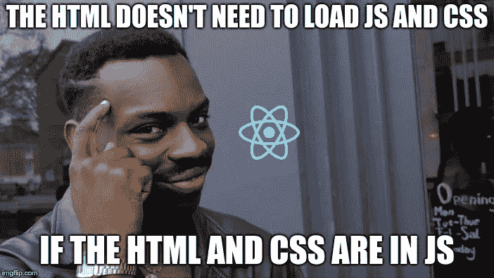

# 我改变主意了。射流研究…

> 原文：<https://levelup.gitconnected.com/i-changed-my-mind-on-react-js-4ecf4b73e14>


照片由[鲤鱼詹妮弗](https://unsplash.com/@jenjen005?utm_source=medium&utm_medium=referral)在 [Unsplash](https://unsplash.com?utm_source=medium&utm_medium=referral) 拍摄

我不喜欢 React，我以前从来没用过。仅仅是从外部看，我觉得它没有其他 JavaScript 框架强大。

> 现在我在尝试，我的看法变了。

我一直使用和喜爱棱角分明，一切都是如此结构化。

*   一个逻辑文件。
*   一个模板文件(html)
*   一个样式文件。

该框架为您提供了实现最佳实践和一致写作所需的所有工具。依赖注入，类型，双向绑定，表单，接收…

另一方面，**做出反应的方式却更加灵活。**

开箱即用，它可以帮助你做最少的事情。React 被宣传为用于构建用户界面的 JavaScript 库，这正是它所做的，不多也不少。

React 的强大之处在于它还具有难以置信的可扩展性；社区在它上面疯狂地建造。

所以你可以像一个“javascript 库”或者一个全功能的框架一样使用它。

## **不一致**

如何编写一个组件？你可以有一个组件类，或者一个函数，或者使用 typescript。

> 没有一种“标准”的方式来编写对每个人都一样的组件。

就拿状态管理来说吧，可以用两种方式创建和更新状态，setState()或者 useState()。

我更喜欢用标准的方式做事。

就像 Android 开发一样，有一个建议的和支持的构建应用程序的方法，我希望 React 至少鼓励使用一个单一的架构。

## **熔炉**



将所有内容写入一个文件非常容易。以“结尾是很常见的。tsx”文件，包括 TypeScript、HTML 模板和 CSS(用 JS 编写)中的逻辑。

> 这是多种语言的混合，不应该出现在同一个地方。

组合语言也意味着组合应用程序的不同方面。

您最终将得到难以阅读的组件文件。你需要理解逻辑是怎么写的，同时又被 JS 和 HTML 中的 CSS 分心。

可能只是习惯问题，但对我的注意力广度不好:)

## **是还是不是？**

这两点是 React 最好和最差的地方。

有经验的用户可能会觉得不一致和混乱。同时，新手可能会发现它使用起来简单明了，组件非常容易编写，React 的学习曲线非常浅。

作为一个例子，下面是如何用一行代码编写一个非常基本的组件。

```
export const Title = ({ props }) => <h1> { props.title } </h1>
```

我没有任何数据支持这一点，但我认为 React 的“即插即用”特性是许多公司选择它的真正原因。

> 更容易找到知道这件事的人。

## **总之**

我改变主意了吗？——**是的。**

从另一个角度来看，React 是构建现代 web 应用程序的伟大基础。当然也有一些不好的地方，但是大部分都是纯主观的。

现在我觉得只是习惯问题，挑自己喜欢的框架就好！

# 分级编码

感谢您成为我们社区的一员！更多内容请参见[升级编码出版物](https://levelup.gitconnected.com/)。
跟随:[推特](https://twitter.com/gitconnected)，[领英](https://www.linkedin.com/company/gitconnected)，[通迅](https://newsletter.levelup.dev/)
**升一级正在转型的理工大招聘➡️** [**加入我们的人才集体**](https://jobs.levelup.dev/talent/welcome?referral=true)