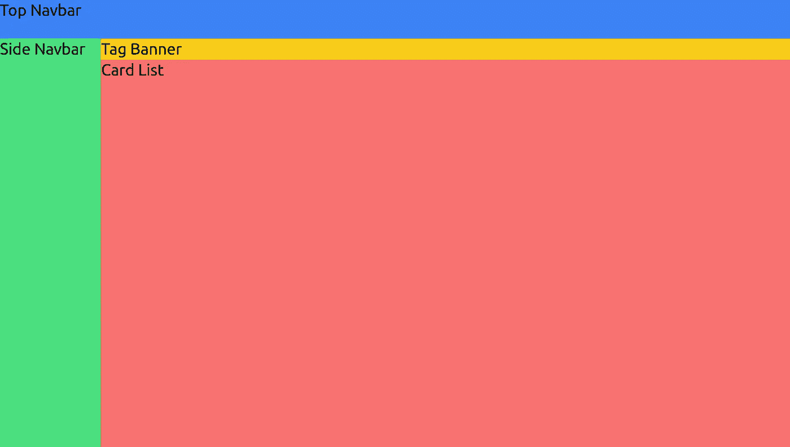
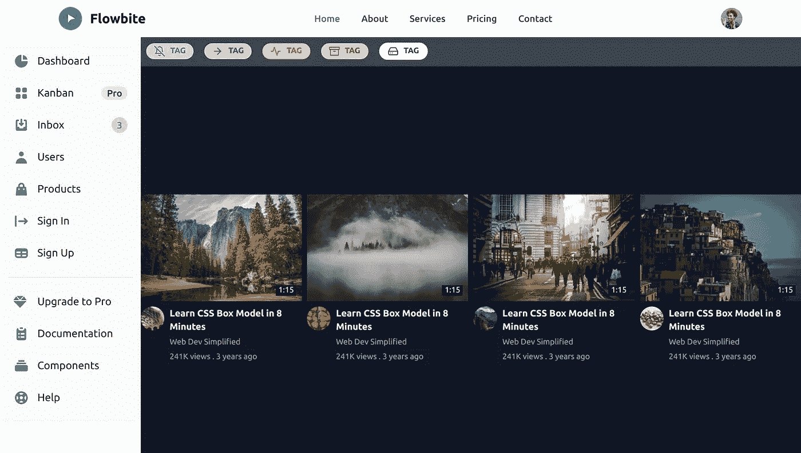
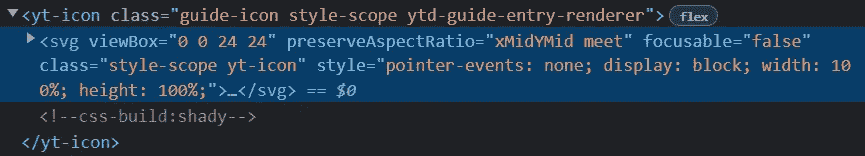
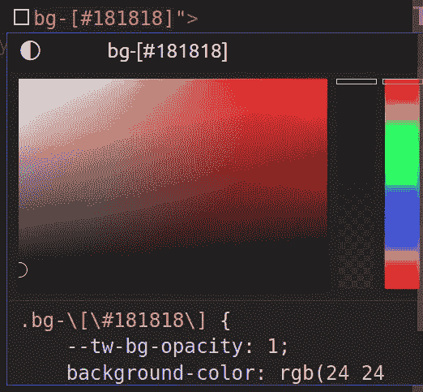
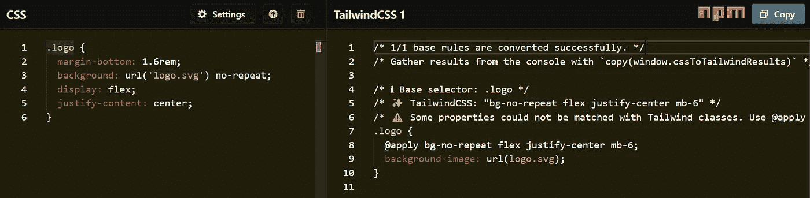
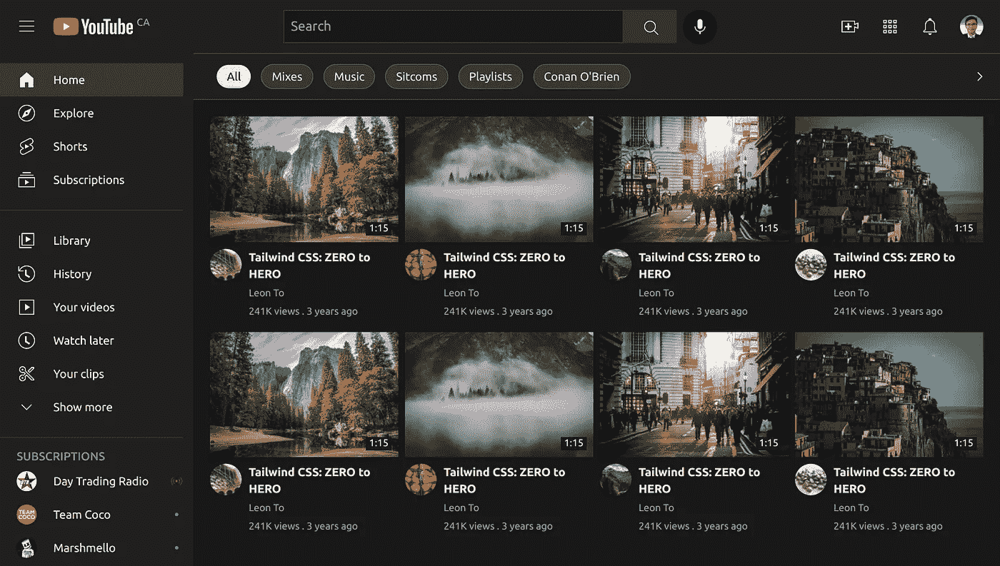

# 我用 Tailwind CSS 用 3 天克隆了 Youtube，你 3 分钟就学会了！

> 原文：<https://levelup.gitconnected.com/i-cloned-youtube-with-tailwind-css-in-3-days-and-you-will-learn-it-in-3-minutes-a612334f21ff>

L ast 时间，说到 [**是时候告别 Bootstra**](https://leon101.medium.com/its-time-to-say-goodbye-to-bootstrap-11ed5fc9f3f1) **p** ， [**Nuxt 3 来了！“下一个”是什么！**](https://leon101.medium.com/nuxt-3-is-here-whats-next-2d92aeb34660) 。为了继续这个对话，我挑战自己用顺风 CSS 在 **3 天**内建立 [Youtube，现在你将看到我是如何在 **3 分钟**内完成的。你可以在这里找到我的源代码。](https://github.com/leon-to/youtube.nuxt3.tailwindcss)

将 Tailwind CSS 和 **Nuxt 3** 结合起来，我能够实现我一生中见过的荒谬的 web 开发速度。通常，使用 Tailwind CSS，我节省了大量编写纯 CSS 的时间。使用 Nuxt 3，我可以跳过大量带有自动导入/导出、动态路由和环境/开发配置的样板代码。

现在，让我介绍一个由我的数字绘画爱好激发的 UI 系统:

1.  初始化**布局**
2.  生成**组件**
3.  抛光**细节**

# 初始化**布局**

我可以通过使用“flex”类来完成所有这些定位。

# **生成**组件

这一步基本就是拖拽了。与 Bootstrap 和 Material Design 等任何其他 UI 库相比，这是 Tailwind 真正闪耀的地方。有许多 Tailwind CSS 库可以满足我的大多数用例，比如 Flowbite、DaisyUI 和 TailwindElement。

这个想法是为了对最终产品有一个大致的感觉。因此，我在第一次搜索中抓住了我能找到的任何组件。

# 抛光细节

由于 80%的时间都花在了打磨细节上，我使用了 3 种技术来显著提高这一步的速度:

1.  从 Youtube 复制预建图标
2.  顺风 CSS 颜色选择器
3.  CSS 到顺风 CSS

为了从 Youtube 复制图标，我检查了想要的图标并复制了 SVG 部分。

SCode Tailwind Intellisense 支持颜色选择器来帮助我使用十六进制颜色进行样式设计。

有时候，我想知道 Youtube 的 CSS 特性在 Tailwind CSS 中是否可行。然后，我可以去 https://transform.tools/css-to-tailwind 的，解析代码，并在顺风 CSS 中获取代码。

现在，请允许我介绍经过 3 天汗水的最终产品。:)

如果你喜欢我的故事，请通过[订阅我的博客](https://leon101.medium.com/subscribe)来支持我，给我的故事一些爱。这对我的编码之旅意义重大。此外，请考虑通过以下方式支持我:

*   [我的全新 Patreon(简历/自由职业服务)](https://www.patreon.com/leonto101)
*   [中等会员](https://leon101.medium.com/membership)

下一篇文章再见。:)