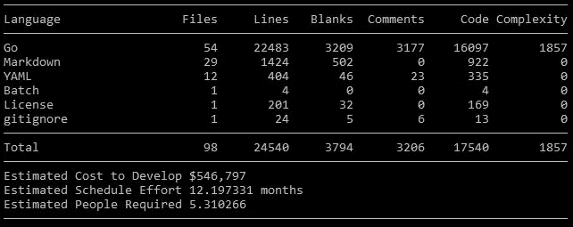
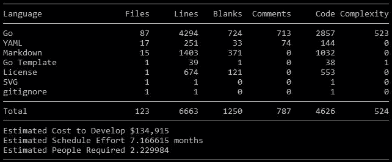

# 我创建了一个 25000 行的概念证明。

> 原文：<https://levelup.gitconnected.com/i-created-a-25000-line-proof-of-concept-4c33bec919f5>

## 只需要 7000 行代码。

基于 scc 的 Disgo 代码分析

由于古德哈特定律，使用代码行数作为进度的衡量标准是不被推荐的,**。然而，任何有头脑的人都会明白，事实上，拥有 100 行代码的软件和拥有 1000 行代码的软件(1 KLOC)在功能上是有区别的。抛开 Python 的“机器学习一行程序”这样的笑话不谈，跨越 1000 多行代码的代码不可能“在周末”以稳定的方式完成。25000 行的概念验证也不行。**那么它是什么，为什么被创造出来？****

# 什么是 Copygen？

Copygen 是一个命令行代码生成器，它可以生成类型到类型和字段到字段的结构代码，而不会给你的项目添加任何反射或依赖。根据文章《[什么是 Copygen](https://switchupcb.com/blog/what-is-copygen/#project_timeline) 》介绍，Copygen v0.1.0 于 2021 年 9 月 29 日**发布。在这篇文章创作的时候，Copygen 在 GitHub 上已经接近 200 颗星了:这与它最初的受欢迎程度形成了巨大的反差。**

基于 scc 的 Copygen 代码分析

当 Copygen 首次发布时，评论家们会毫不犹豫地指出它的缺陷。虽然这导致了它的用户界面*(在 v0.2.0 版本中)*的改进，但是仍然有大量的程序员不理解为什么有人会使用这个工具。使用 Copygen 的理由总是列在它的自述文件中，但是行动胜于语言:这些程序员不想被告知为什么 Copygen 有用。他们需要被展示出来。虽然这不是决定创建概念证明的唯一因素，但这确实是一个非常好的因素。

由于 Kubernetes 和 Docker，人们认真对待围棋。

# 概念证明

没有方向的创作根本不是创作。概念验证也不例外。不言而喻，一个人应该有理由去做他们正在做的任何事情。你学数学不是为了理解 2 + 2 = 4。你这样做是为了在现实世界中应用技能*(通过金融、科学或其他方式)*。由此可见，一个“为了编程而编程”的程序员是一个谬误:编程是一个用来实现其他手段*(比如解决问题)*的动作。

我想创建一个不和谐机器人，这是一个服务器端软件*(使用面向服务器的语言)*。围棋是最完美的选择。问题是，我一直在 Go 的 Discord API 包装器的现有决策上遇到问题。现在，我并不是“不在此发明”(NIH)态度的大力支持者，这种态度导致一个人从零开始创建一个完整的操作系统。然而，很明显，现有的 Discord API 包装解决方案在 6 年多的时间里遭受了向后兼容性膨胀……[这就是我如何浪费了 6 个月时间来创建 Disgo](https://switchupcb.com/blog/how-i-wasted-6-months-creating-disgo/) 。

[Disgo](https://github.com/switchupcb/disgo) 是一个 Discord API 包装器，被设计成灵活、高性能、安全和线程安全的。Disgo 的目标是在 Discord API 中提供每一个特性以及… *是的。是啊。是啊。*如果你还没有听说过 *it* ，那就去看看 *it* out。否则，Disgo *就是*copy gen 需要的概念证明；尤其是成为一个生产就绪的软件。我只是还不知道……几个月过去了，我才意识到已经使用 Copygen 在 Disgo 中生成了 10，000 行人类可读的代码。有关更多信息，请阅读关于[Disgo 如何使用 Copygen](https://github.com/switchupcb/copygen/discussions/32) 的内容。

 [## 我释放了蒸汽。

### Vaporware 是已经做了广告但还不能使用的软件或硬件。显然，释放…

levelup.gitconnected.com](/i-released-vaporware-c1850e6a9c5d)