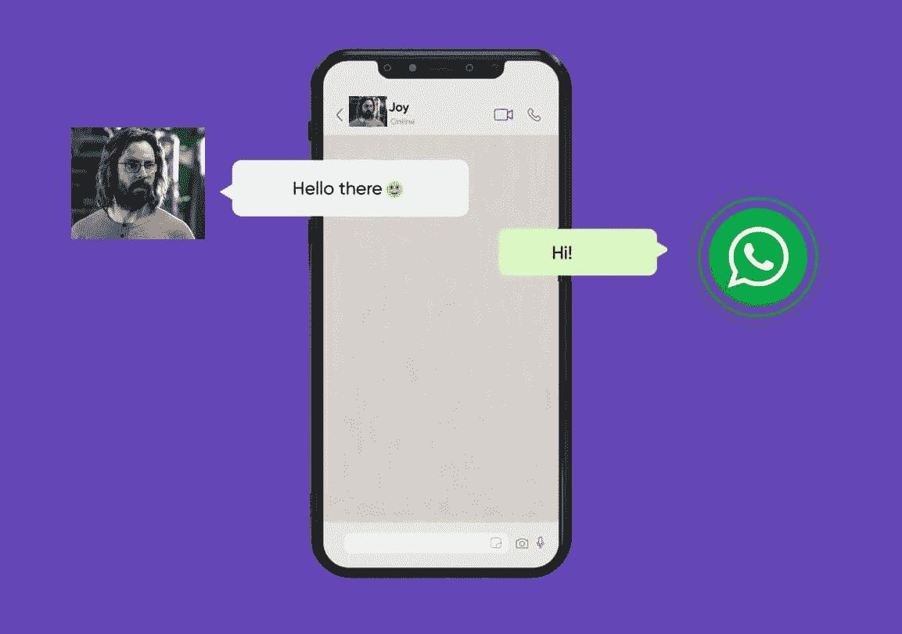
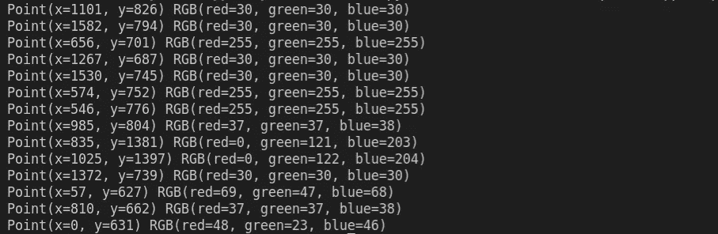
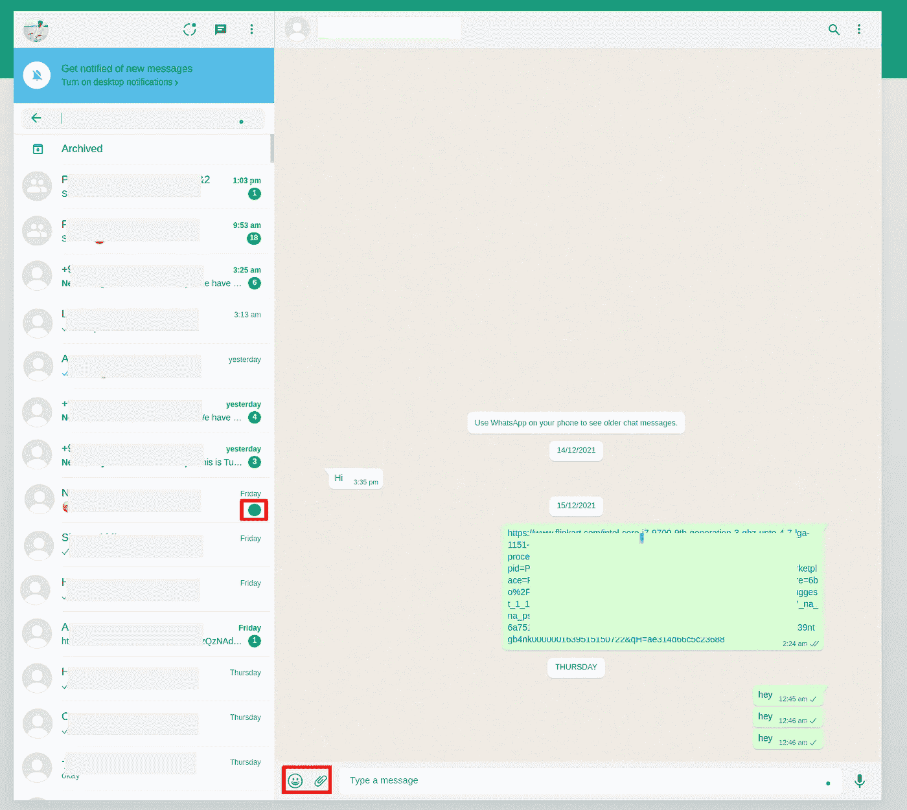
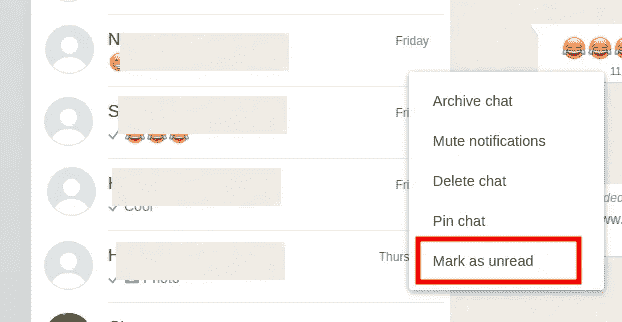
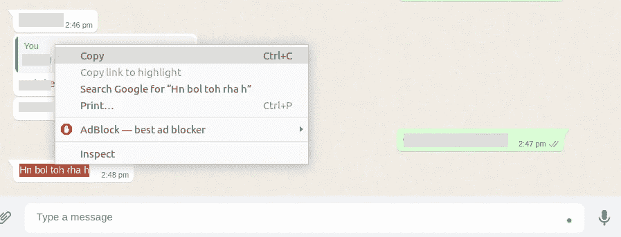

# 我创造了一个自动化的 WhatsApp 回复机器人！

> 原文：<https://levelup.gitconnected.com/i-created-an-automated-whatsapp-reply-bot-7ed91c15bee0>

> 创建一个程序来回复 WhatsApp 信息



每天打开 WhatsApp 的消息，回复“**早安”**短信或者“**谢谢”**在一个特殊的场合给这么多人发消息，真的是一件很单调又费时的任务。你一定曾经想知道是否有办法自动回复某些人的消息。

到本博客结束时，你的程序将能够在收到 Whatsapp 消息时进行回复，如下视频所示:

**我将创建一个 python 机器人，它将检查 WhatsApp 中的未读消息，并根据响应条件集对它们进行响应。**这样就不会再有单调的短信了。你也可以让一个 AI(人工智能)机器人与你不想被打扰的朋友聊天。

> 还记得在**硅谷，**吉尔福伊尔创造了一个自动回复机器人与迪内什聊天！*😂*


# 创建 WhatsApp 响应机器人

为此，我将使用 python。步骤如下:

*   阅读 WhatsApp GUI 的上下文
*   以编程方式点击未读邮件并提取邮件
*   处理消息并以编程方式回复它
*   以编程方式打开未读聊天

在开始之前，我们需要安装`open-cv`、`pyautogui`和`pyperclip`。打开您的终端并键入以下命令来安装软件包:

```
$ pip install opencv-python
$ pip install pyautogui
$ pip install pyperclip
```

如果您使用的是 Ubuntu (Linux ),则必须额外安装以下软件包:

```
$ sudo apt-get install scrot
$ sudo apt install xclip
```

## 1.阅读 WhatsApp GUI 的上下文

**提取屏幕信息**

创建一个名为`whatsapp`的文件夹，并在其中创建一个文件`gui_info.py`。这个程序将收集关于屏幕上某些元素的颜色和位置的信息。添加以下代码:

```
import pyautogui as pt
from time import sleepwhile True:
    posXY = pt.position()
    print(posXY, pt.pixel(posXY[0], posXY[1]))
    sleep(1)
    if posXY[0] == 0:
        break
```

上面的代码将打印鼠标指针的坐标和它所悬停的颜色。当鼠标指针接触 x 轴时，程序将终止。输出应该是这样的:



**教育程序关于 WhatsApp UI**

接下来，我们必须拍摄一些快照来告诉程序应该将鼠标拖动到哪里，以及单击哪里。对标有红色矩形的图像进行截图。



要获得绿色圆圈，右键单击联系人，然后单击标记为未读。现在我们有了一个 smilie 和未读消息截图，将其保存在项目目录中。

在`whatsapp`文件夹中创建一个新文件`main.py`，并编写以下代码:

```
import pyautogui as pt
from time import sleep
import pyperclip
import randomsleep(3)def move_pointer():
    global x, y
    position = pt.locateOnScreen("whatsapp/smilie.png", confidence=.6)
    x = position[0]
    y = position[1]
    pt.moveTo(x, y, duration=0.5)move_pointer()
```

这段代码会将鼠标指针移动到 WhatsApp 上的 smilie 图标上。运行这段 python 代码来验证代码是否真的有效。方法是运行 python 程序，然后快速切换到 WhatsApp web 运行的屏幕。(如果程序不动，尝试使用`confidence`参数，并尝试使用`0.6`到`0.9`之间的值)

一旦您确认代码正在运行，我们将继续读取最后发送的消息。这里需要一些校准来将鼠标指针移动到最后接收到的消息。`pt.moveTo(x, y, duration=0.5)`将鼠标指针实际移动到 smilie 图像。收到的消息略高于它，所以我们将编辑它以悬停在该消息上。对我来说是`pt.moveTo(x+100, y-45, duration=0.5)`。您可以使用试错法来找出屏幕的像素差异。

## 2.以编程方式点击未读邮件并提取邮件

下一步是以编程方式选择最后收到的消息，复制它，并从剪贴板中读取文本。添加下面几行代码就可以了

```
pt.tripleClick()
pt.rightClick()
pt.moveRel(12, 15)
pt.click()
```

`pt.tripleClick()`选择文本。

`pt.rightClick()`点击右键

`pt.moveRel(12, 15)`将光标移动到复制图标

`pr.click()`选择复制



光标应该复制文本，如上图所示


运行它，看看一切正常。

## 3.处理消息并以编程方式回复它

接下来，我将在`main.py`中添加一个函数`send_message`。函数定义如下所示。

```
def send_message(message):
    position = pt.locateOnScreen("whatsapp/smilie.png", confidence=.6)
    x = position[0]
    y = position[1]
    pt.move(x+100, y+20, duration=0.5)
    pt.click()
    pt.typewrite(message, interval = 0.01)
    pt.typewrite("\n", interval = 0.01)
```

`pt.move(x+200, y+20, duration=0.5)`将光标移动到回复区域

`pt.typewrite(message, interval = 0.01)`将在文本框中键入消息。

`pt.typewrite(“\n”, interval = 0.01)`类似于点击键盘上的回车键，会发送消息。

上面的代码将把消息返回给那个人。如果我们想要处理消息，并根据特定条件发送响应，我们将添加以下函数`process_response`:

```
def process_response(message):
    mes = str(message).lower()
    if "happy hirthday" in str(mes):
        return "Thank You!"
    elif "?" in str(mes):
        return "Not Interested"
    elif "good morning" in str(mes):
        return "Good Morning"
    elif "Hi" in str(message):
        return "Hi"
    else:
        return "Wassup! How you doin"
```

上面的代码根据一定的标准返回响应，例如，如果有人发送包含**生日快乐**的消息，程序将返回“谢谢”等等。这是你可以添加人工智能模型(如果你有的话)与人聊天的地方。

## 4.以编程方式打开未读聊天

现在，我们必须编写一个函数来持续检查新消息。基本上就是搜索我之前截图的绿点。我将创建一个函数`check_for_unread_messages`:

```
def check_for_unread_messages():
    while True:
        try:
            position = pt.locateOnScreen("whatsapp/unread.png", confidence = 0.7)
            if position is not None:
                pt.moveTo(position)
                pt.moveRel(-100,0)
                sleep(1)
        except(Exception):
            print("No new messages")
```

上面的代码将悬停在未读的聊天上。

我们还会添加一个条件来检查是否有对方发送的最后一条消息。这更像是一种故障安全机制，以防我们陷入无限循环。我选择最后一次聊天的地方，我将添加一个条件来检查光标悬停的像素的颜色是否为白色，然后只进行步骤。

`main.py`的最终代码是这样的:

```
import pyautogui as pt
from time import sleep
import pyperclipsleep(1)global x, yposition = pt.locateOnScreen("whatsapp/smilie.png", confidence=.6)x = position[0]
y = position[1]def get_received_message():
  position = pt.locateOnScreen("whatsapp/smilie.png", confidence=.6) x = position[0]
  y = position[1] pt.moveTo(x+100, y-45, duration=0.5)
  pt.tripleClick()
  pt.rightClick()
  pt.moveRel(100, -170)
  pt.click() received_message = pyperclip.paste()
  print("Received Message: "+received_message) return received_messagedef send_message(message):
  position = pt.locateOnScreen("whatsapp/smilie.png", confidence=.6) x = position[0]
  y = position[1] pt.moveTo(x+100, y+50, duration=0.5)
  pt.click()
  pt.typewrite(message, interval = 0.01)
  pt.typewrite("\n", interval = 0.01)def process_response(message):
  mes = str(message).lower()
  if "happy hirthday" in str(mes):
     return "Thank You!"
  elif "?" in str(mes):
     return "Not Interested"
  elif "good morning" in str(mes):
     return "Good Morning"
  elif "Hi" in str(message):
     return "Hi"
  else:
     return "Wassup! How you doin"def check_for_unread_messages():
  while True:
    try:
      position = pt.locateOnScreen("whatsapp/unread.png", confidence = 0.7)
      if position is not None:
        pt.moveTo(position)
        pt.moveRel(-100,0)
        pt.click()
        sleep(1) except(Exception):
      print("No new messages") if pt.pixelMatchesColor(int(x+100), int (y-35), (255, 255, 255), tolerance = 10):
      print("is_white - new message")
      received_message = get_received_message()
      message_to_send = process_response(received_message)
      send_message(message_to_send)
   else:
      print("no new message")check_for_unread_messages()
```

**真了不起！你的 Whatsapp 自动回复机器人准备好了！**

你可以在这里找到项目链接:【https://github.com/gouravdhar/automatic-whatsapp-response 

> 这是一份探索我们博客平台 [**极客头脑**](https://www.thegeekyminds.com/) 的邀请。一个让您了解软件开发和技术领域最新发展的一站式平台。我们在 [**的极客头脑**](https://www.thegeekyminds.com/) 旨在写一些你实际上可以用来提高工作效率和充实你的职业生活的内容。
> 
> 邀请您在[**https://thegeekyminds.com**](https://thegeekyminds.com/)通过我们的平台。并订阅我们的时事通讯，以便在我们每次发布新帖子时收到电子邮件。我们承诺不会向您的收件箱发送垃圾邮件。点击下面的按钮订阅我们的时事通讯

[](https://forms.wix.com/4444cf13-7653-460d-9b32-f2e4e65544d1:c2184260-1ab5-4c6a-a37d-53de0778afa0)