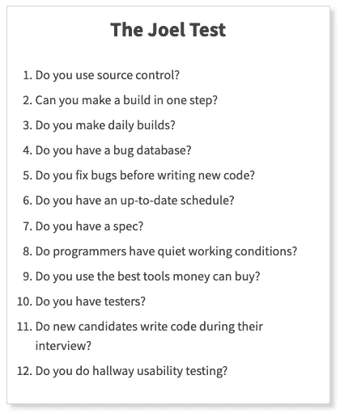
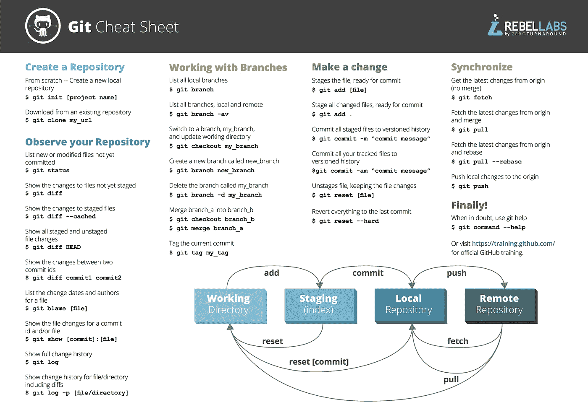

# 今天做了(20 岁)乔尔测试。以下是我学到的。

> 原文：<https://levelup.gitconnected.com/i-did-the-20-years-old-joel-test-today-2531c2678df2>

## 乔尔测试:更好编码的 12 个步骤，20 年后

乔尔·斯波尔斯基

谁是[乔尔](https://www.joelonsoftware.com/about-me/)？一个软件开发者创造了我们所知道的 StackOverflow。我们现在都知道网站是怎么运作的了。

乔尔在 20 年前发明了一个[测试](https://www.joelonsoftware.com/2000/08/09/the-joel-test-12-steps-to-better-code/)并发表了它。这个测试包括 12 个步骤来更好地编码。

我以为这是一个古老的测试。我错了。脚步常青，即使在今天你也可以考验自己。

测试步骤有哪些？有什么变化吗？我们还需要这些步骤来编写更好的代码吗？

[乔尔测试的步骤](https://www.joelonsoftware.com/2000/08/09/the-joel-test-12-steps-to-better-code/)

满分是 12 个“是”的回答。乔尔说，微软一直都是完美的。在 2000 年代的所有时间里，我不认为这在今天仍然有效。

> 事实是，大多数软件组织都是以 2 或 3 的分数运行的，他们需要*认真的*帮助，因为像微软这样的公司是以 12 全职运行的。—乔尔·斯波尔斯基

我会用是或否来回答试题。这个测试如何帮助我创建更好的软件？

# 1.你使用源代码控制吗？

## 是的。

如今，没有源代码管理，我们就无法工作。该项目依赖于 Git 操作。Jenkins 每天都拉和构建项目，没有 Git 这是不可能的。

在 2000 年代，他们有一些版本控制。2000s 版本控制类似于微软的 TFS。我们现在被赐予了 [Git](https://git-scm.com/) 。

了解 Git 可以有所帮助。学 Git，不然你会吃亏的。由于一些未知因素，我曾经丢失过我的项目。

每个优秀的开发者都知道 Git。你应该学习基础知识，然后再扩展。

[Git 备忘单](https://www.reddit.com/r/git/comments/5m5fdz/git_cheat_sheet/)

# 2.你能一步到位吗？

## 是的。

詹金斯每天都在构建我们的项目。有 CI/CD 管道，帮助我们轻松地测试和迭代 sprint。

我们以前遇到过这个问题。独立于前端应用构建 Spring Boot 应用。

乔尔说得很好，建造时间越长，你损失的时间就越多。

这个问题已经接近我们的截止日期，我们需要很多补丁。最终，我们没能修复 bug。再加上我们的无知。这个项目充满了错误。

# 3.你每天都进行构建吗？

## 是的。

正如 Joel 所说，运行每日构建有助于项目的稳定性。我们每天都有一个稳定的项目。测试运行是构建过程的一部分，您可以放心一切都是正确的。

这对任何软件项目都是至关重要的。

我做过一个项目，没有 CI/CD 结构。我们基于信任编码，希望一切都好。直到我们得到一个失败的项目，错误的代码在那里，你在半夜接到一个电话。

世事难料。总是心存疑虑。永远不要相信任何人，构建项目，并不断进行部署。如果你喜欢 Java 世界，请了解更多关于[詹金斯](https://www.jenkins.io/)的信息。

# **4。你有 bug 数据库吗？**

## 是的。

我们有 [JIRA](https://www.atlassian.com/software/jira) 来做这个错误跟踪。没有它，开发者的日子会很难过。乔尔做了一个很好的观察，我们都需要跟踪 bug。

Joel 为每个 bug 编辑了一个我们需要的属性列表。这就像一张 JIRA 的票。

*   完成重现错误的步骤
*   预期行为
*   观察到的(错误的)行为
*   分配给谁
*   不管它是否已被修复

# **5。你在写新代码之前会修正 bug 吗？**

## 是的。

我们在每次发布之前都会修复所有的错误。修补程序得到应用，但很少。

> 一般来说，在修复一个 bug 之前等待的时间越长，修复的成本(时间和金钱)就越高。—乔尔·斯波尔斯基

# **6。你有最新的时间表吗？**

## 是的。

我们实践敏捷开发。Scrum 或看板。票估计和预定交付。范围蔓延总是存在的，但是我们试图将其推回去。

# **7。你有说明书吗？**

## 是的。

任何集成或耗时的功能都有一个融合页面。你可以参考这份文件，把它弄明白。

乔尔在规格部分写了更多。我们可以在这里读到它[。](https://www.joelonsoftware.com/2000/10/02/painless-functional-specifications-part-1-why-bother/)

# **8。程序员有安静的工作环境吗？**

## 算是吧。是的。

至少对我来说，远程工作可以创造安静的工作环境。我有自己的房间，在那里工作。在办公室里，总是有人打扰。你必须出去吃东西，或者在休息室玩一会儿，或者进行令人恐惧的饮水机谈话。

[说话](https://axerosolutions.com/blogs/timeisenhauer/pulse/370/water-cooler-chat-11-smart-reasons-to-encourage-it)

# 9。你使用金钱能买到的最好的工具吗？

## 是的。

机器是好的，软件发展到我们只需要编码的阶段。在 21 世纪初，GUI 是一个突破，我们现在认为这是理所当然的。

# 10。你有测试员吗？

## 是的。

我们有手动和自动测试。所有这些都有助于我们创建稳定可靠的软件。乔尔甚至计算了为什么你需要测试员。

> 让 100 美元/小时的程序员做 30 美元/小时的测试员能做的工作是在浪费钱

# **11。新应聘者在面试的时候会写代码吗？**

## 是的。

我有试用期，我们创造了两个项目。从零开始。我展示了我的技能，公司看到了我的潜力。

# **12。你做走廊可用性测试吗？**

## 是的。有时候。

我们的团队现在分散了很多。在疫情发布之前，我们确实讨论过可怕的错误或伟大的特性。

# 结论

我确实有 116 分。请务必在这里阅读 Joel 的博客[。他一直坚持到 2000 年。他的博客就像一个软件工程博物馆。你可以看看他年轻时的发展情况。](https://www.joelonsoftware.com/)

 [## 关于乔尔·斯波尔斯基

### 我是你们的主持人，乔尔·斯波尔斯基，负责这个网站上的一切。这是乔尔的软件，我已经…

www.joelonsoftware.com](https://www.joelonsoftware.com/about-me/)