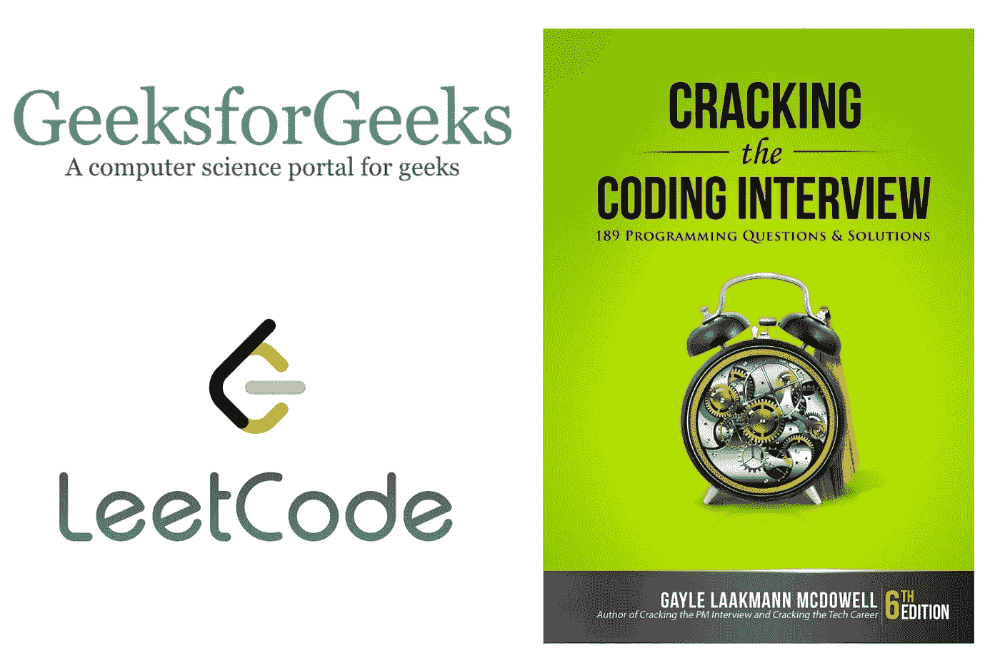

# 我被谷歌拒绝了！

> 原文：<https://levelup.gitconnected.com/i-got-rejected-by-google-1ab8f7a4908e>

## 我在世界顶尖科技公司面试的经历。还有一些提示和技巧，这样你就不会被拒绝。

***为谷歌工作几乎是每个软件工程师的梦想。*** 当我在 LinkedIn 上收到通知说谷歌在印度班加罗尔有一个新的本科生职位 2020 空缺时，我无法阻止自己申请。我想都没想就立即申请了这个职位。接下来的两周，我没有听到招聘团队的任何消息。

图片来自 Unsplash.com

有一天，我在 LinkedIn 上看到一个来自谷歌的 SWE III 的帖子，正在寻找优秀的候选人。我给他发了信息，给他发了我的简历。3-4 天后，我收到了他的推荐，以及很多准备的技巧和诀窍。那天我意识到了推荐的力量，我觉得我的申请好像走上了一条超级快车道。

几天后，我收到了招聘人员发来的安排电话的电子邮件。我回复了我的可用日期和时间。几天后，我和招聘人员进行了一次 15-20 分钟的谈话，内容是招聘流程以及我能从中得到什么。

之后，我收到了关于我应该准备的重要话题和一些其他学习技巧的邮件。我还被问到安排电话面试的最佳日期。不幸的是，结果是，我没有给自己足够的时间学习。

> 不过还好！不后悔！

# 来自谷歌和招聘人员的提示

招聘人员建议做以下事情:

*   熟练掌握基本和高级的 ***数据结构。***
*   修行从 [***极客 forgeeks***](https://www.geeksforgeeks.org/)***。***
*   从**[***leet code***](https://leetcode.com)***练习 100–150 道中、难题。*****
*   **练习使用 ***破解编码面试书。*****
*   **练习 ***不用 IDE 写代码*** 。电话面试将使用共享的谷歌文档进行。此外，你的现场面试需要你在纸上或 Chromebook 上写代码，但也需要在 Google Doc 上写。所以有一个不用 ide 写代码的习惯是非常重要的。**

****

**我还收到了一份详细的*谷歌面试准备文件*。它列出了以下要点**

## **一般面试技巧**

*   *****解释*** —面试官不仅在测试你的技术知识，也在观察你解决问题的能力。所以向面试官清楚地解释你的方法和假设。**
*   *****明晰度*** —有些问题会有意留有开放式或模糊性。模拟现实生活中的情况。所以要保持警惕，澄清你所有的疑虑，掩盖边缘案例。**
*   *****改进*** —尝试改进你目前的解决方案。总有这样或那样的机会变得更好。从蛮力开始，然后进一步优化是可以的，但是无论你做什么都要让面试官知道。**
*   *****练习*** —练习在纸笔和 Google Docs 上写代码。不要过分强调某些函数的精确语法。假设一种方法，并让面试官了解它。**

## **重要话题**

*   **排序算法**
*   **哈希表**
*   **面向对象编程(C++，Java)**
*   **算法分析**
*   **搜索算法**
*   **图形和树算法**
*   **数据结构(数组、链表、栈、队列、哈希集、哈希映射、哈希表、字典、树和二叉树、堆和图)**
*   **数学(离散数学问题，第 n 和第 k 类问题)**
*   **递归**
*   **操作系统**
*   **系统设计**
*   **开发实践**

# **我的准备**

**我没想到会接到谷歌的面试电话，这对我来说真是一个惊喜。我已经有 3 个月没有接触过竞争性编程了。很难获得动力。**

**我从 GeeksforGeeks 开始，但是问题和文章都不是最新的。所以我主要使用 Geeksforgeeks 来寻找研究课题。**

**后来我开始用 Leetcode**

*   **最初，我通过解决简单的关卡问题来获得一点自信。**
*   **然后我从中等水平的问题开始。我解决了大约 40-50 个中等水平的问题。**
*   **偶尔我会解决一些带有谷歌标签的难题。**
*   **在我准备的后期阶段，我主要解决了谷歌标签的问题。**

**但是，在我准备的过程中，我意识到 Leetcode 的高级帐户可以带来真正的变化。**

*   **编译时间快得多**
*   **许多新问题被解开了**
*   **公司专门提供模拟电话面试**

**但是我发现了*偏黑*这个问题！**

 **[## leet free——谷歌脸书亚马逊微软 LinkedIn 泄露的面试问题

### 泄露的面试问题。所有高级 LeetCode 问题免费。LeetCode 解锁。

leetfree.com](https://leetfree.com)** 

**这是一个包含 Leetcode 所有高级问题以及难度和公司标签的网站。**

**你不会得到 IDEs 来验证你的答案，问题的频率标签也不是最新的。但是除了这些问题之外，你还可以从这个网站获益匪浅。**

**我练习了来自 leetfree 的大约 25-30 个问题。**

*****《破解编码面试》(CTCI)*** 也有一些不错的问题，我建议从中练习。有些问题*很可能会在你的面试中被问到*。我练习了大约 30-40 个来自 CTCI 的问题。**

# **d 日电话面试**

**采访是由纽约的 YouTube AdSense 软件工程师进行的。它被安排在 IST 时间晚上 10 点 15 分，分配了 45 分钟。**

**面试从基本的问候开始，面试官把问题贴在了共同分享的谷歌文档上。**

## **问题:**

**给定具有整数单元值的 NxN 个单元的网格，我们可以将从源(0，0)到目的地(N-1，N-1)的路径的路径努力定义为相邻单元值的绝对差的最大值。遍历时，您可以从网格中的当前单元格向上、向下、向左和向右移动 4 次。对于给定的阈值，找出是否可能在这样的矩阵中有一条从源到目的地的努力不大于阈值的路径。**

## **示例:**

**如果我们有一个如下的 3x3 矩阵-
[[1，2，3]，
[4，5，6]，
[7，8，9]]
假设阈值为 3。
结果:真
其中一条路径为:1 - > 2 - > 5 - > 8 - > 9。该路径中 adj 单元的 abs 差是— [1，3，3，1]，它们的最大值是 3 =>，因此该路径的努力为 3。**

## **方法**

**我意识到这个问题可以用图遍历算法来解决。我首先想到的是广度优先搜索算法。我马上和面试官讨论这个问题，我被提问: ***“为什么不是 DFS？”*** 。在这个问题上，我无法区分 BFS 和 DFS。**

## ****我使用广度优先搜索的方法:****

*   **保存一个访问过的矩阵或访问过的集合，以跟踪访问过的单元**
*   **使用 BFS 遍历并将成本差小于阈值且尚未访问过的像元推入队列。更新访问过的矩阵。**
*   **如果我们到达 n-1，n-1 细胞，我们有一条路。**还真。****
*   **如果队列在到达终点坐标之前变空，我们中断并返回 False。**

**没有浪费一分钟，我被要求编码我的方法。**

*   **最初，我没有考虑访问矩阵，一旦我开始编码，我意识到我的错误，并立即告诉面试官，并作出所有必要的改变。**
*   **另外，我在最初的实现中没有定义一个合适的退出条件，但是我发现了我的错误并改正了它。**

**我还犯了一些其他的小错误，但是我能够自己改正它们。**

**大约 40 分钟后，我完成了我的代码。**

**面试官和我简单讨论了一下面试的事情。面试官很感激我能够发现并改正我的错误。**

**我问了面试官面试的第一个问题。***BFS 和 DFS 的区别？*****

**面试官解释道:**

> **BFS 和 DFS 都会给出这个问题的正确答案。在一般情况下，这两种方法几乎是等价的。但是，在最糟糕的情况下，与 BFS 相比，DFS 会更快地拿出解决方案。BFS 将尝试在一个层面上探索所有的可能性，而 DFS 将尝试深入，因此在最坏的情况下，这将是一个更好的方法。**

***我觉得自己犯了一个巨大而愚蠢的错误***

# **结果和反馈**

**5-6 天后，我收到一封电子邮件，询问与招聘人员通话的时间。**

**招聘人员给我打电话，问了我一般的面试体验。然后炸弹落下，招聘人员开始反馈。**

*   **我善于沟通，非常清楚地表达了我的想法。**
*   **我能够发现并纠正错误。**
*   **我找到并报道了边缘案件。**
*   **但是，我需要更多的数据结构和算法的练习。**

> **我们现在不能进一步考虑你的申请。但是，你的申请真是千钧一发！**

**那一刻我意识到，如果我使用 DFS 解决了问题，这通电话可能是为了现场采访。**

> **但是，不后悔！**

**就这样，我的谷歌面试体验真的很好。即使被拒绝了，我也学到了很多东西。**

**希望你能从我的错误中吸取教训，破解面试！**

**万事如意！**

**感谢阅读:)**

**谢谢大家！**