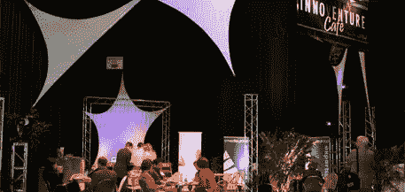

# 我非常兴奋，环顾四周，看看还有谁在记笔记

> 原文：<https://levelup.gitconnected.com/i-got-so-excited-i-looked-around-to-see-who-else-was-taking-notes-27839242b179>

## 为什么在筒仓中操作是危险的

创新创业 2008 —图片:约翰·华纳

意外之喜在发现新市场的过程中发挥着巨大的作用。许多成功人士都有一个关于他们旅途中意外好运的故事。意外之喜是无法预测谁将是最大赢家的原因，因为再多的尽职调查也无法确定意外之喜会是什么。

InnoVenture 会议和论坛举办了十多年，目的是在行业创新者、学术研究人员和企业家之间寻找创新。Irix Pharmaceuticals 的高管迈克尔·博利克(Michael Bolick)参加了一次 InnoVenture 会议，因为他对发现一个新的商机感兴趣，尽管他不确定自己会发现什么。克莱姆森大学研究基金会的马特·格沃特做了一个电梯推销，介绍克莱姆森研究员亚·孙平开发的碳点技术。如果克莱姆森让 InnoVenture 让一屋子可能对他们的技术感兴趣的企业家坐在一起，迈克尔就不会出现在被邀请的“企业家”名单上。把迈克尔和克莱姆森联系起来需要有人召集一次公开会议，在会上迈克尔可以通过露面来表明自己的兴趣。

迈克尔说，当听到马特的演示时，“我非常兴奋，我环顾四周，看看还有谁在做笔记。”这是迈克尔明智的直觉在起作用。当 Matt 说话时，Michael 将他所听到的与他独特的经历和关系联系起来。关于迈克尔的焦虑，有趣的是，虽然其他听众可能已经在想象其他机会，但没有人想象只有迈克尔可以看到的未来，所以他不需要担心。迈克尔的洞察力不可能通过网络搜索或传统的市场研究发现。你只能通过与迈克尔的对话来了解他的洞察力。事实上，进行这样的对话可能有助于迈克尔充实他非正式的、个人的、尚未完全成型的见解。

当 Matt 的公开演示结束时，Michael 走近他，从随后的私人谈话中，Selah Technologies 围绕 Clemson 的碳点技术展开了讨论。迈克尔不是一个人成功的。迈克尔的洞察力的火花落在了一个资源生态系统的干燥火种上，该生态系统已准备好帮助培养西拉科技的想法。该公司成立于克莱姆森孵化器。南卡罗来纳州风险投资局投资了 Nexus Medical Partners，以吸引他们来到南卡罗来纳州。Nexus 投资了 Lab21，然后把他们介绍给了 Selah。Lab21 和 Selah 都获得了种子资本计划 SC Launch 的资助，以及来自北卡罗来纳州天使网络和其他投资者的额外资助。除了克莱姆森，迈克尔还与南卡罗来纳大学的纳米中心和格林维尔医院系统的转化肿瘤研究所密切合作，进一步开发这项技术。格林维尔商会创建了一个创业组织 NEXT，并与 Hughes Development 一起为科技公司开设了一个联合办公场所。

Lab21 的新美国总部和个人医学实验室位于南卡罗来纳州的格林维尔，这是一个不太可能的地方。当 Michael 有了最初的洞察力时，他不可能知道机会会以这种方式发展。InnoVenture 社区的成员通过 Michael 多年来在 InnoVenture 年度会议上所做的几次演讲，观察了他的机会随着时间的推移而发展。迈克尔斯早期的报告中没有关于个性化医疗的内容。找到答案的唯一方法是跟随迈克尔，通过他与那些能接触到客户、资本、人才和技术的人的一系列偶然的对话。