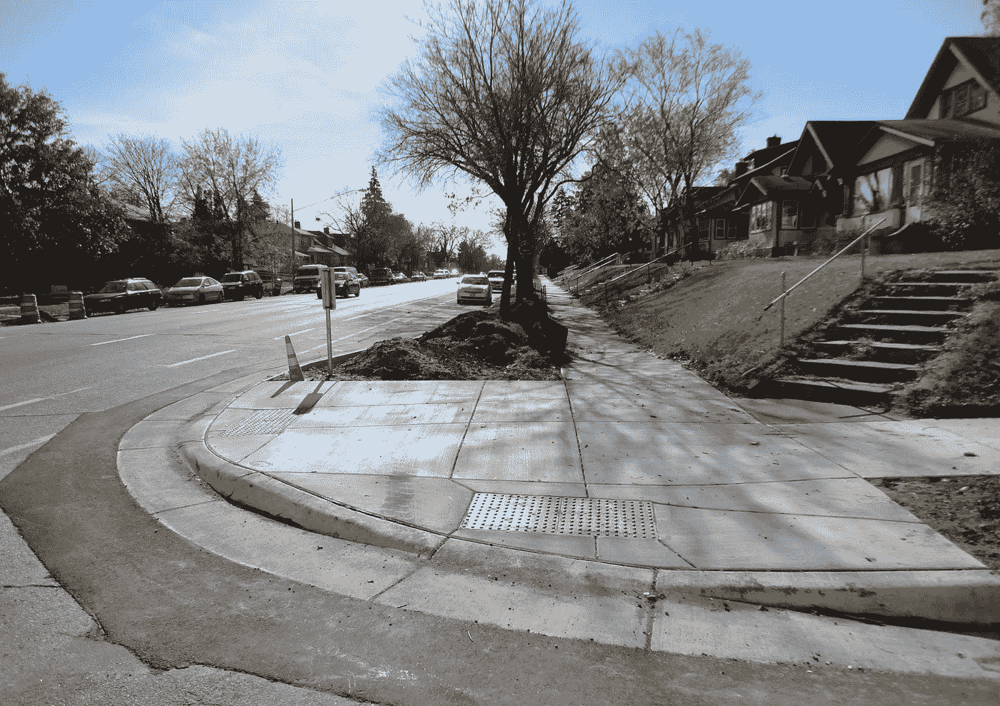
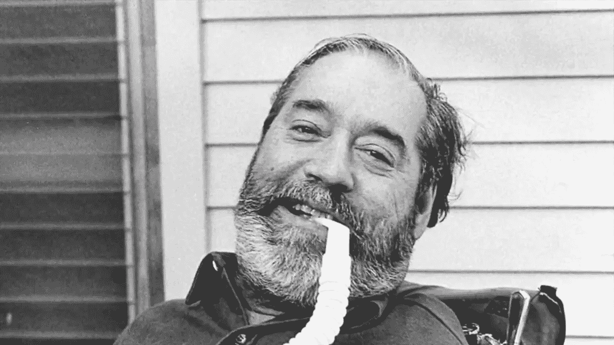
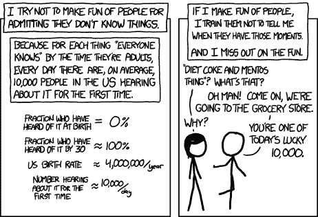

# “我想我从来没有真正考虑过可访问性”

> 原文：<https://levelup.gitconnected.com/i-guess-ive-never-really-thought-about-accessibility-d857894cecec>

直到最近，我才意识到我对可访问性知之甚少。

我一直以理解可访问性为荣，但是现在我发现我还需要学习更多。在真正分解之后，我想我从来没有真正地，像*真正地*那样，考虑过可访问性。

这个思考过程花了两年多时间，都是从一些限制削减开始的。

遏制削减似乎是一件让人充满激情——不，情绪化——的奇怪事情。就像门、交通灯或铺砌的小路一样，我们可能会不时地注意到它们，或者更具体地说，它们的缺失，但人们有意识地思考我们日常使用的建筑设计并不常见。当然不会让人夜不能寐。

人行道的路缘切口。通往房子的楼梯。

一开始他们也没有让我晚上睡不着觉。当我还是个婴儿的时候，在我能自己移动之前，他们允许我妈妈随心所欲地用婴儿车推我。后来当我还是个孩子的时候，他们允许我去任何我想去的地方骑自行车。七年前，我身患残疾，一瘸一拐，拄着拐杖，然后他们允许我毫无痛苦地在街上行走。但即使在花了数年时间规划我的住房、交通和日常生活之后，包括路缘切割的存在是必不可少的，直到 2018 年，当我听罗曼·马尔斯讨论路缘切割的历史时，我才意识到它们甚至有一个名称。我立刻想到*“啊，当然！”*，他们不是在深渊里发明的。

埃德·罗伯茨(1939 年至 1995 年)

像大多数物质社会系统一样，它们是由个人需求创造的。遏制削减的试点项目始于 20 世纪 40 年代，最初是为了帮助退伍军人。然而，该系统并没有被广泛采用，直到埃德罗伯茨和滚动四轴。埃德·罗伯茨是第一个上大学的残疾人，他的这一壮举得益于更多的残疾人可以使用电动轮椅。虽然看似现代设计的轮椅已经存在了几百年，但第一把电动轮椅直到 20 世纪 30 年代才被发明出来。

这并不是说有了辅助技术，生活就变得简单了。不幸的是，在 20 世纪 60 年代上大学的时候，Roberts 经常发现他的社交时刻，以及*咳咳*与他人更亲密的时刻，很难在人类医疗援助的持续存在下享受。虽然他能够独立地在大学的小区域内活动，但要穿过许多街道是不可能的，因为像今天一样，几乎一英尺高的障碍物会碰到他。这不仅仅是一个不方便的问题，这是不人性化的，也是对残疾人即使在进入系统后仍然面临障碍的另一个提醒。他和其他残疾倡导者对此感到愤怒，他们带着大锤走上校园街道，创建了他们需要的系统。

我给很多人讲过这个故事，他们的第一反应都很熟悉——“啊，当然！”。首先，这让我充满了喜悦，我是分享知识的忠实信徒，而且越深奥越好。人们经常会回来告诉我，他们现在是如何情不自禁地注意到他们，或者更具体地说，他们的缺席。

***“啊当然！”***

楼梯对即使是有能力的人来说也是一个相对较大的障碍。不管我们的能力如何，在可怕的搬家日，我们都被认为太陡、太多或太窄的楼梯打败过，以至于不能放一张沙发。当然，解决方案已经存在——电梯和坡道。

当我了解了多层建筑的历史以及电梯如何带来更广泛的用途时，我惊讶地听到了另一个事实。曾经有一段时间，可达性是由领主来控制的。酒店、旅馆和客栈的一楼住宅主要是为富人保留的。这使得他们可以方便地运输行李，并避免在用餐或使用其他服务时耗尽许多楼梯。升降机当然改变了这一趋势，但直到 1854 年安全电梯的使用，当然还有 19 世纪末的自动电梯，我们才看到精英高层住宅的崛起。

坡道不是什么了不起的工程技术。自 6 世纪晚期以来，我们就已经将它们用于手动轮椅了(是的，我们已经为这个系统发明和奋斗了那么久了！).许多国家甚至对无障碍轮椅坡道的构成做出了规定，包括长度、宽度、角度、高度和表面材料。见鬼，如果不是通往人行道的轮椅坡道，路缘切割是什么？

当分享这些事实时，我对无障碍设计的信念很快就破灭了。这种反应，用词相似，却在几英里之外。哦，我想我从来没有真正想过这个问题。我想我永远都不需要。”

“我想我从来不需要这么做。”

但是，楼梯不是每个人都用过吗？肯定比遏制削减更有意识？人们不会回来找我，讨论他们如何突然注意到他们最喜欢的酒吧实际上在四层楼上；因为如果电梯是艺术品的话会更时髦。作为一个残疾人，当我和一个朋友刚刚描述为*的山搏斗时，我做鬼脸并假装我很好一点也不罕见，“哦，是的，我想只有几个。但几乎没有。”*

***“但几乎没有。”***

起初，我很惭愧花了这么长时间才明白其中的区别。把方便的快乐等同于难以接近的痛苦。我个人停止了自己在网页可访问性方面的公共参与、指导和教育，并发现自己很愤怒，因为让别人理解的责任又一次落在了我身上。我感到愤怒的是，我的存在还不够，我必须让人们理解路边停车的便利，而不是难以接近的家的痛苦。我很生气人们不关心与他们无关的事情。在我心中，我已经定义了大恶。

这种情况持续了很长时间。直到我开始阅读以前的残疾倡导者的作品，不仅仅是我以前用过的网页可访问性和 ADA 规则，而是残疾倡导者的真实经历。我开始明白残疾是多么的动态，反过来，我知道的又是多么的少。我在阅读 Jane Wong 的《残疾能见度》时受到了很大的冲击——对于那些没有读过的人来说，它涵盖了如此广泛的真实的残疾人问题、希望和现实——特别是 Harriet Johnson 的文章*的编辑版本【不可描述的对话】*。在书中，约翰逊描述了他们与彼得·辛格的互动，后者是一位哲学家和学者，对纯素食主义有坚定的看法，并坚信如果我生来就有这种状况，我应该已经死了。约翰逊描述了如果我们希望让我们能够在身体上和情感上驾驭这个世界，对未来充满希望，那么我们就不能定义大恶——即使他们主张我们死亡。相反，抓住这种不理解并帮助他们理解。

常识是需要时间的！

我现在已经残疾七年了。从那以后的每一天，我都在思考可及性，不管我是否愿意。但是我每天都做错事。我每天都在学习新的东西。其他每个人都有自己的苦恼、问题和整个人生需要驾驭。如果我刚刚开始我的无障碍之旅，我怎么能指望他们知道一切呢？

现在我开始了自己的实用主义之旅，情感实用主义。这不是一个让我变得完美的旅程，而是一个我允许自己和他人犯错的旅程。这个过程将记住像我这样的残疾人，以我们为中心，允许我们以一种有益于每个人的方式说话和做事。