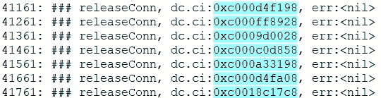
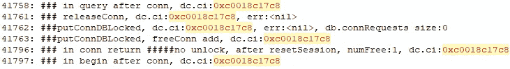

# 我的代码中有一个黑洞

> 原文：<https://levelup.gitconnected.com/i-have-a-black-hole-in-my-code-dd0cac235fef>


照片由 [Unsplash](https://unsplash.com?utm_source=medium&utm_medium=referral) 上的 [Haythem Gataa](https://unsplash.com/@haythemgataa?utm_source=medium&utm_medium=referral) 拍摄

最近我遇到了一个奇怪的问题，所有进入程序的信息都消失了，就像被黑洞吞噬了一样。

# **1。问题描述**

最近发现一个批处理程序会失败。这个程序有很长的历史，很少使用。而且我还有其他高优先级的任务，所以一开始没注意。

在过去的几天里，我有时间处理这个问题。

结果在处理了一些简单的问题，添加了一些错误的判断之后，批处理进程在第 50 个任务之后就卡住了，好像被挂起了一样，没有任何后续的日志打印。但是查了一下代码，并没有什么渠道堵塞之类的可疑点。

而且其他后续的任务调用也全部卡死。查了系统信息，没有高占用率。

所有的请求似乎都掉进了黑洞，消失了。

# **2。开始故障排除**

**2.1。添加日志**

在最后一行代码后开始添加日志。对于每个分支，在函数调用之前和之后，尽可能详细地记录参数信息。

然后我发现代码停在了一个 SQL 查询上。打印了查询前的日志，但是没有后续操作，没有报告错误，也没有打印正确的日志。

结果

```
…### before search sameObject,name:tom
```

**2.2。检查数据库状态**

从目前情况来看，数据库调用受阻。

首先，检查数据库的连接状态

总共 30 个连接

因为我将程序中的最大连接数设置为 30，所以它显示所有连接都被占用了。

```
db.DB().SetMaxIdleConns(10)
db.DB().SetMaxOpenConns(30)
```

起初，我怀疑是查询速度慢导致所有连接都被占用。

于是我打开慢查询日志搜索了一下，没有关于对象表的。

事情变得有点奇怪。

我没有一点头绪，所以我要看一下 gorm 调用，看看它是否有阻塞。

**2.3。检查 gorm 源代码**

这个项目是很久以前创建的，现在仍在使用

```
“github.com/jinzhu/gorm”
```

让我们看看这到底是什么发现()

我在 NewScope()、inlineCondition()和 callCallbacks()这三个函数中添加了日志，但是有些回调函数也是在 callCallbacks()中调用的。

所以我写信给 UT，看看有什么样的试镜

结果:


从测试结果可以看出，回调函数具有

```
queryCallback
preloadCallback
afterQueryCallback
```

直觉告诉我，实际调用查询的函数是 queryCallback。

查了一下源代码，发现是这样的

```
if rows, err := scope.SQLDB().Query(scope.SQL, scope.SQLVars...); scope.Err(err) == nil {
    ....
}
```

先添加一些日志。

**2.4。调查 queryCallback**

再次触发批量，发现查询后的日志没有打印出来。

再去查询源代码，发现里面确实有连接池的信息。看来我没有看错方向。

查了一下代码，发现 conn 函数会涉及到连接池的分配。

```
// conn returns a newly-opened or cached *driverConn.
func (db *DB) conn(ctx context.Context, strategy connReuseStrategy) (*driverConn, error)
```

我想在连接被分配和释放的地方添加一些日志，看看哪个查询持有连接而没有释放它。

幸运的是，获得连接池时有一个查询语句。当我们发现一个未释放的连接时，我们可以直接看到哪个查询使用了这个连接。

我再次触发批处理任务，并告诉我的同事在运行时停止访问这个服务，以减少对其他数据库的操作，并减少日志的数量。

在我漫长而乏味地挖掘了数以千计的过滤日志后，我惊奇地发现所有的连接都被释放了！

我不敢相信我的眼睛。找的方向应该没问题。而且为了不遗漏信息，我已经高亮显示了每一个查询过没有问题的日志。



**2.5。回顾**

整个过程是环环相扣的，大方向应该是对的，中间可能会有所遗漏。

我喝了一杯咖啡，然后出去散步。

啊，灯亮了。

占用连接池的不仅仅是我的查询。不，应该说不是我的查询。否则 30 个连接早就用完了，直到处理完 50 个任务才可能。

我需要检查其他查询的连接池使用情况。

总共有 9 个地方调用了 conn 函数。全部添加日志并检查一遍。

**2.6。再次检查连接池**

这次我很快发现了问题



0xc0018c17c8 该连接在 begin()函数中获取后不会被释放。

果然不出我所料，连接池是在别处泄露的。

对 begin 的调用是在事务启动时，这很可能是没有提交或回滚的事务导致的泄漏。

检查代码后，发现确实如此。有一个比较长的事务，中间有很多操作和异常处理。随着需求的变化，代码变得越来越长。有人加了错误检查后，忘记回滚，直接返回。

# 3.错误修复

过了两天，问题终于找到了。添加回滚后，重新运行批处理可以成功完成。

现在，我要看看到底是谁写代码如此粗心，我想我应该教他如何优雅地编码。

看一下提交日志:


# 分级编码

感谢您成为我们社区的一员！在你离开之前:

*   👏为故事鼓掌，跟着作者走👉
*   📰查看[级编码出版物](https://levelup.gitconnected.com/?utm_source=pub&utm_medium=post)中的更多内容
*   🔔关注我们:[推特](https://twitter.com/gitconnected) | [LinkedIn](https://www.linkedin.com/company/gitconnected) | [时事通讯](https://newsletter.levelup.dev)

🚀👉 [**加入升级人才集体，找到一份惊艳的工作**](https://jobs.levelup.dev/talent/welcome?referral=true)