# 我已经测试 Github CoPilot 两个月了——太不可思议了！

> 原文：<https://levelup.gitconnected.com/i-have-tested-github-copilot-for-two-months-now-i-am-in-a-dilemma-3701bfcfac43>

## 两个月来，我定期截图和大家分享我使用 GitHub CoPilot 的经验。

本·怀特在 [Unsplash](https://unsplash.com?utm_source=medium&utm_medium=referral) 上的照片

我接受了 Github 的邀请，测试了 Copilot 两个月。这篇文章分享了我和我的新“AI 结对程序员”伙伴的经历，这些经历一再让我感到敬畏和惊讶。

我一直很喜欢 GitHub 副驾驶。它确实做了你想要它做的事情:让你的编码工作变得更容易。然而，也有几点批评。我的简历可以归纳为三个要点:

*   Copilot 作为一个非常先进的自动完成
*   许多建议是不可思议的，但它们需要被审查
*   无用的提议会中断编程流程

# 什么是 GitHub Copilot？

GitHub Copilot 是 GitHub 和 OpenAI 开发的基于云的人工智能工具，用于辅助开发者的日常工作。该工具被描述为“你的 AI 对程序员”，并根据当前上下文自动生成代码。

它可以在许多集成开发环境(IDE)中使用，如 Visual Studio 代码、Visual Studio、Neovim 和 JetBrains。

GitHub 于 2021 年 6 月 29 日首次发布了这款工具，它可以很好地与 **Python、JavaScript、TypeScript、Ruby 和 Go** 一起工作，但也可以与许多其他语言一起工作(来源:[zdnet.com](https://www.zdnet.com/article/github-copilot-microsofts-ai-pair-programming-service-is-generally-available/))。)

# 介绍

***“我可以自己写代码；我不需要 AI 来帮我。”***

***“AI 永远不会取代开发者。”***

人们很容易陷入其中一种信念。如果你已经做了几年甚至几十年的开发人员，你可能会对人工智能可以帮助你编写代码的想法感到不快。大家都在担心 AI 最终会取代开发者。

> 人们经常拒绝技术，因为它给他们的周围世界带来了或大或小的变化，一个他们努力适应的世界。—乔安娜·豪沃思

不管 AI 会不会取代开发者，我们永远不应该因为一贯拒绝新技术而进入过度自信的循环。这种观点会让你很快在瞬息万变的技术世界中落后。比你看得更快，你就落后了，而其他人工作得更快更有效率。

> 神经网络或人工智能将有助于改善数字工作，但在可预见的未来，它们几乎不会取代开发人员。—[analyticsinsight.net](https://www.analyticsinsight.net/will-artificial-intelligence-replace-programmers-in-the-future/)

# 初次体验 Copilot

当你第一次和 Copilot 一起工作的时候，感觉就像魔术一样。Github 网站上的例子看起来很有希望，但却不真实。

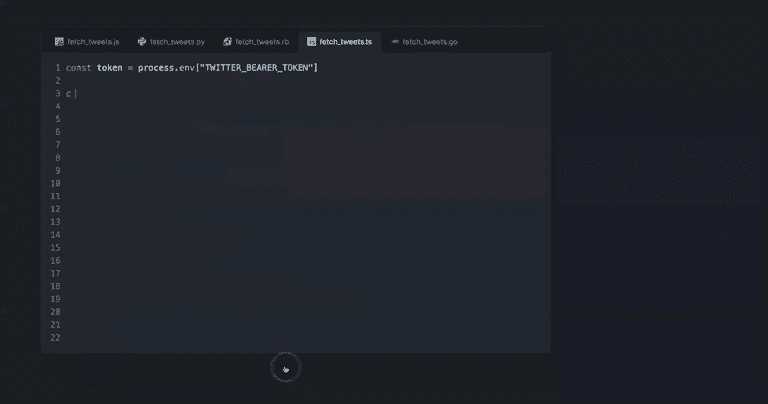

科普特演示:[https://github.com/features/copilot](https://github.com/features/copilot)

事实上，就是这么简单。将 GitHub Copilot 包含到您的 IDE 中，并开始键入。你可以写你的常规代码，等待 CoPilot 的建议。

你也可以通过以声明的方式写评论来获得建议。当您想要解决一个重复出现的问题时，这非常有帮助，因为您脑子里没有确切的语法，或者只是为了节省时间。

假设您是 JavaScript 新手，不知道如何以毫秒为单位获取当前时间。您可以写`// Current time in millis`，CoPilot 会为您提供一个建议，您可以使用 ENTER:

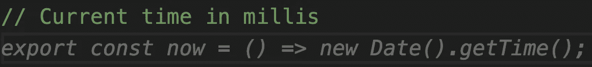

副驾驶在行动(VSCode)

如果使用自说自话的变量名，也会得到相同的结果:

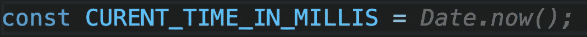

副驾驶在行动(VSCode)

现在，我想分享一些我在使用 Copilot 时最令人震惊、有时也令人烦恼的经历。大多数时候，我是用 Typescript 编程的。因此，所有的例子都是打字稿，也有一些 SCSS，但我认为 Copilot 通常与所有支持的语言类似。

# 使用 Copilot 的工作经验

在我用截图给你看一些例子之前，我想提一下，你迫切需要和你的雇主或客户确认是否可以使用 Github CoPilot。毕竟，代码是跨网络共享的，以交付最佳结果。

下面的例子来自我的副业项目——[网络集锦](https://web-highlights.com/)。Web Highlights 是一个 Chrome 扩展，允许您高亮显示任何网页或 PDF 上的文本，创建标签和做笔记。客户端和服务器都是使用 Typescript 构建的。这就是为什么这些例子会包括打字稿代码和一些 SCSS。

 [## 网络亮点- PDF 和网络荧光笔

### 在任何网页或 PDF 上高亮显示，创建标签并做笔记。分享您的研究，并将其导出为 HTML、Markdown 和…

chrome.google.com。](https://chrome.google.com/webstore/detail/web-highlights-pdf-web-hi/hldjnlbobkdkghfidgoecgmklcemanhm) 

如果您是 Typescript 新手，我推荐阅读我的系列文章**[**【高级 Typescript 与代码挑战**](https://javascript.plainenglish.io/advanced-typescript-with-code-challenges-mapped-types-6825c7fc984a)**，其中涵盖了基本的 Typescript 特性。****

## ****强大的自动完成功能🔥****

****如开头所述，Github 给我留下了深刻的印象，并为我节省了大量键入重复出现的语法语句的工作。这里有几个例子，它们给我留下了深刻的印象，我可以为本文截图😄****

****让我们从一个印象比较深刻的开始。****

******打字稿示例******

****对于我的 Chrome 扩展，用户可以定义一个黑名单，上面的扩展应该被禁用。这个列表只是一串 URL。****

****为了更新这个列表，我需要一个函数处理程序，它接收更新后的值和要更新的数组的索引。所以，我开始创建这样一个函数，它弹出来了:****

****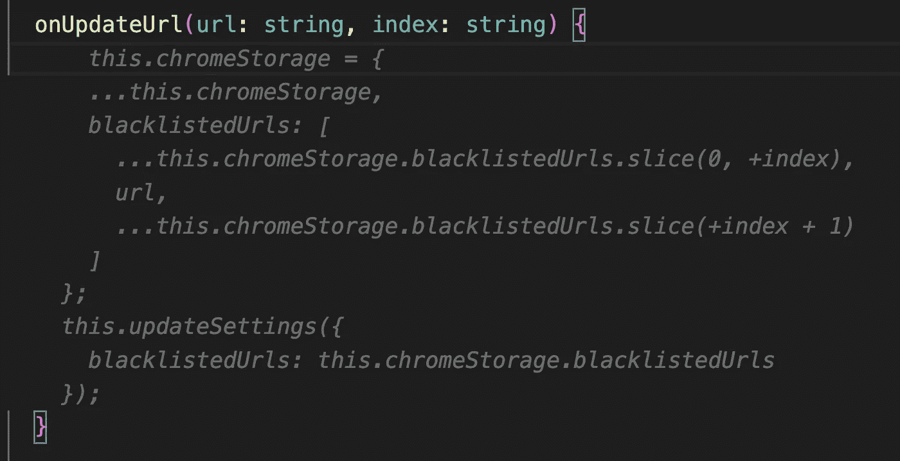****

****副驾驶打字稿建议****

****那正是我所需要的。很可能，我会用稍微不同的方式来做，但是我应用了它，而且效果很好。****

****我的应用程序的另一个用例是，用户可以将折扣代码应用于年度订阅费。折扣代码可以分为两种类型:****

*   ******相对**折扣代码- >例如， ***八折*******
*   ******绝对**折扣代码——例如>、**、*、*、**五元折扣****

****界面看起来是这样的:****

****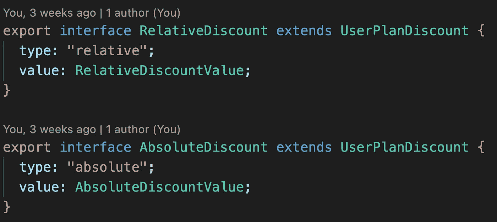****

****现在，我想创建两个**类型的防护** ( `isRelativeDiscount`和`isAbsoluteDiscount`)来确保我的应用程序中的类型安全。****

****似乎副驾驶也很擅长打字。以下是两个完全正确的建议:****

****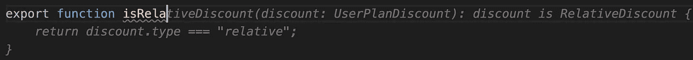****

****使用副驾驶的类型保护建议****

****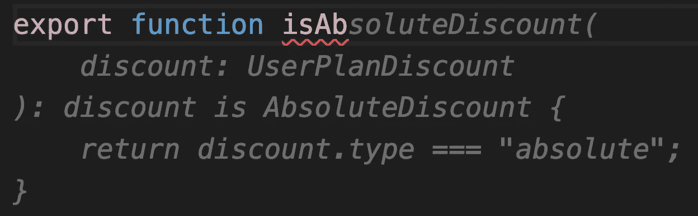****

****使用副驾驶的类型保护建议****

****如果你想了解更多关于类型守卫的知识，这里有一篇关于它的文章:****

**** [## 具有代码挑战的高级类型脚本:类型保护

### 学习高级的 TypeScript 特性，并将它们应用到实际的代码练习中。

medium.com](https://medium.com/@mariusbongarts/advanced-typescript-with-code-challenges-type-guards-a5b24bb6d46b)**** 

******SCSS 的例子******

****CoPilot 不仅擅长真正的代码建议，它还可以很好地处理 CSS 和 SCSS 风格的建议。下面是一个按钮的建议，它应该只在其父级被悬停时才可见:****

****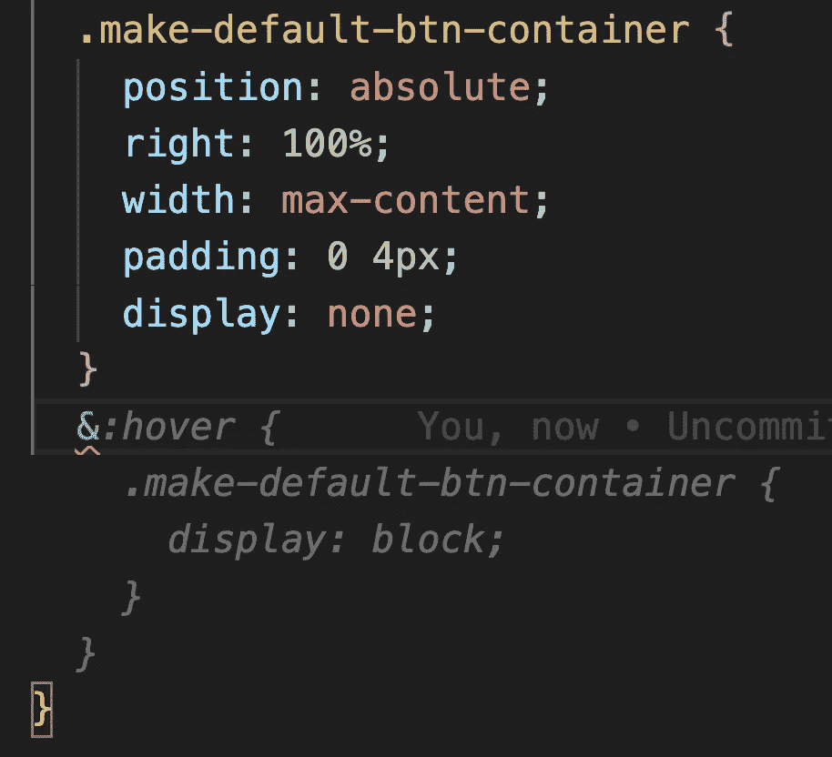****

****副驾驶 SCSS 建议****

****通常它们只是一些小的建议，但是它们仍然节省了工作。例如，在这里，我想用红色显示折扣价，并删除原价:****

****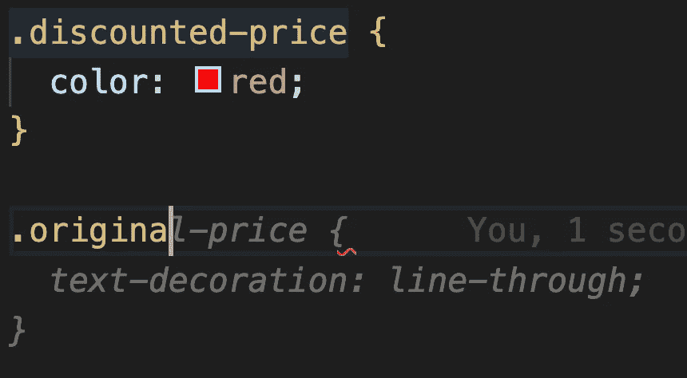****

****副驾驶 SCSS 建议****

******文字生成******

****CoPilot 似乎不仅与代码一起工作，而且还充当人工智能内容的创造者。****

****对于我的应用程序，我有时会发送简讯电子邮件和欢迎电子邮件。为此，我会告知用户最新的特性，并参考相关文章。****

****我很惊讶副驾驶竟然能在这里帮我。它给了我一些建议，正是我想写的:****

****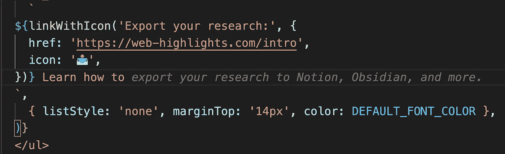****

****副驾驶内容建议****

****它甚至建议匹配表情符号😄****

****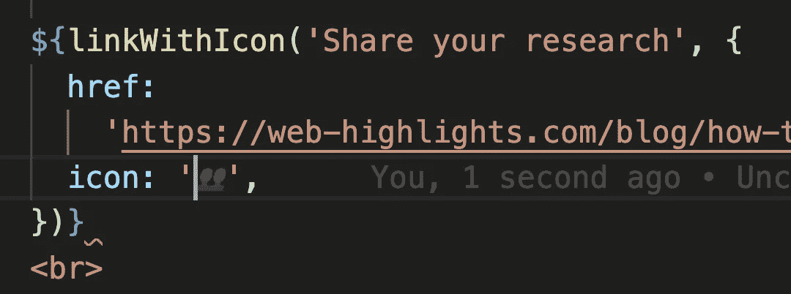****

****副驾驶表情符号建议****

****在接下来的部分中，我将深入探讨在使用 CoPilot 时您应该牢记的几个难点。****

## ******需要审核的建议**👀****

****虽然来自 CoPilot 的建议非常有用，但您必须仔细检查这些建议。****

****简单地确认十行以上的建议是很有诱惑力的。但是对建议的人工检查是强制性的。****

****当然，一个选择是先接受一个建议，然后理解并编辑它。对于我的应用程序中更复杂或更关键的领域，我发现了一种替代方法，那就是**测试驱动开发(TDD)** 。****

****TDD 是一种软件开发实践，在开发实际代码之前，首先为应用程序的逻辑创建单元测试用例。****

****让我们使用我的 [Web Highlights Chrome 扩展](https://chrome.google.com/webstore/detail/web-highlights-pdf-web-hi/hldjnlbobkdkghfidgoecgmklcemanhm)中的另一个用例。如前所述，用户可以应用折扣代码。因此，需要计算折扣价。****

****为此，我首先创建了一些测试场景来测试尚未开发的**`calculateDiscountedPrice(price, discount)`函数的预期行为:******

******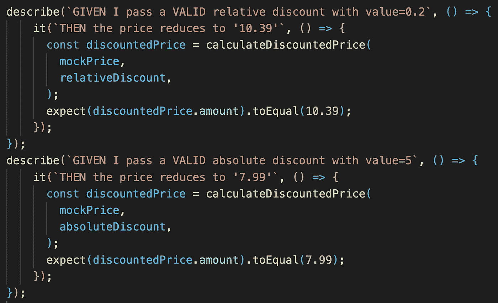******

******TDD:折扣代码单元测试******

******还有更多的测试，但是这两个例子应该阐明函数应该返回什么。现在，我们可以开发功能，也可以放松地接受 CoPilot 的建议:******

******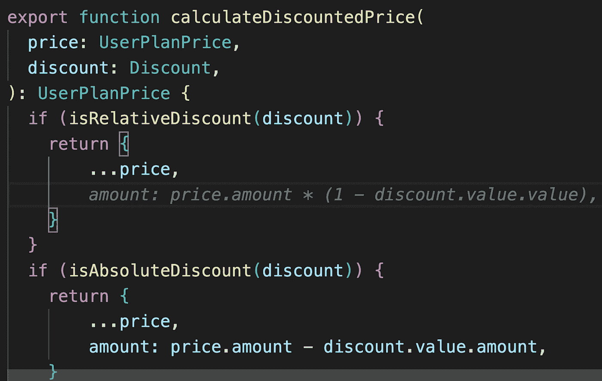******

******TDD:副驾驶建议******

******现在我们运行我们的测试，如果它们成功了，那么建议就会正确地工作。******

## ******有些建议很烦人，也是错误的👎******

******尽管许多建议都很棒，但有时你并不需要建议，弹出窗口可能会很烦人。碰巧你想去掉这些建议，因为它打断了你的心流。******

******举个例子，这个建议占据了我的 IDE 的整个屏幕:******

******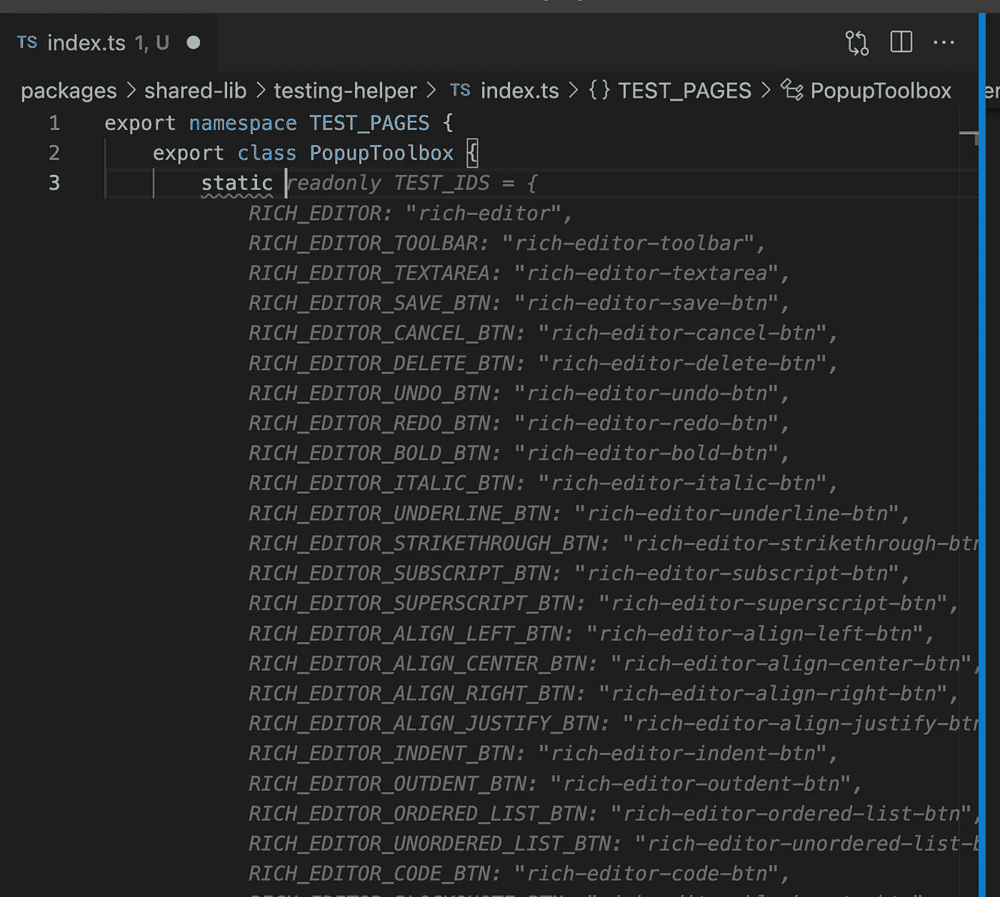******

******恼人的建议******

******这个名称空间的目的是用不同的页面对象创建一个共享的测试助手，包括测试 id。所以，总的来说，目的得到了正确的认识，但是建议根本没有意义。******

******另一个例子是当我想在服务器上验证一个给定的价格时，但是这个建议没有帮助:******

******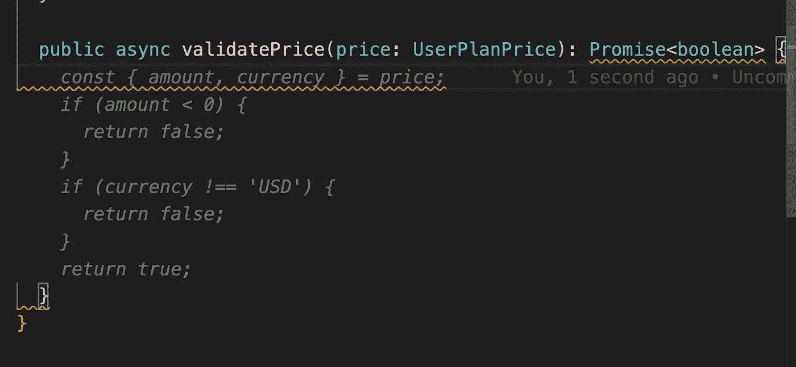******

******不正确的建议******

******当然，你不能指望只得到正确的建议。尤其是因为这个工具刚刚发布，并且会随着更多人使用它而不断得到更好的训练。******

******尽管如此，得到错误的建议会在某种程度上打断你的流程，因为你必须阅读它，决定它是好是坏，然后继续你创建这个函数的最初想法。******

# ******最后的想法******

******两个月前，我确定只免费考副驾驶。现在，我进退两难。一方面，我不愿意每月支付 10 美元。但另一方面，我不想再错过它了，因为它太棒了，而且在大量编码时绝对是一项不错的投资！******

******当然还有改进的空间，但考虑到 CoPilot 刚刚发布，你可以期待它会很快变得更好。然后，即使是最后的批评家也会意识到，副驾驶当然仍然不是绝对必要的，但肯定是有帮助的。******

******我希望你喜欢阅读这篇文章。我写的是关于辅助项目、Web 组件、Chrome 扩展、Typescript 和更多的主题。**关注** **me** 或 [**订阅**](https://medium.com/subscribe/@mariusbongarts) 通过电子邮件获取我的故事，不要错过我的下一篇文章。******

****我总是乐于回答问题，并乐于接受批评。欢迎随时留言或联系我！通过**[**LinkedIn**](https://www.linkedin.com/in/marius-bongarts-6b3638171/)**或 [**Twitter**](https://twitter.com/MariusBongarts) **与我联系。**********

****还有，如果你还没有，看看我的 [**在线荧光笔 Chrome 扩展**](https://chrome.google.com/webstore/detail/web-highlights-pdf-web-hi/hldjnlbobkdkghfidgoecgmklcemanhm?hl=de) 。使用 [Web Highlights](https://web-highlights.com/) ，您可以在任何网页或 PDF 上高亮显示，创建标签并做笔记。看看吧！😊****

**** [## Web 亮点— PDF 和 Web 荧光笔

### 最佳网络荧光笔。就像你在书上做的那样，在任何网页或 PDF 上高亮显示，并做笔记。组织…

web-highlights.com](https://web-highlights.com/)**** 

****[**这里是无限制访问介质**](https://medium.com/@mariusbongarts/membership) 上每一个内容的链接。如果你注册使用这个链接，我会赚一小笔钱，不需要你额外付费。****

**** [## 通过我的推荐链接加入 Medium-Marius bong arts

### 作为一个媒体会员，你的会员费的一部分会给你阅读的作家，你可以完全接触到每一个故事…

medium.com](https://medium.com/@mariusbongarts/membership)****