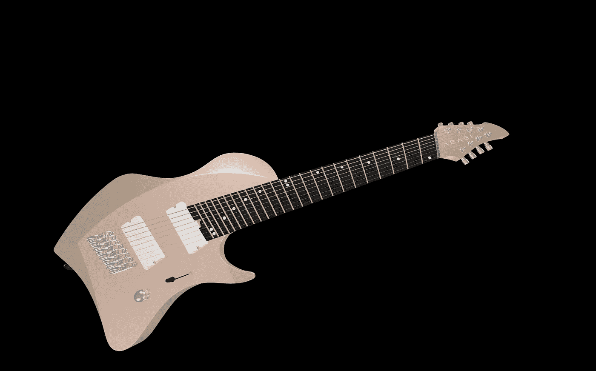
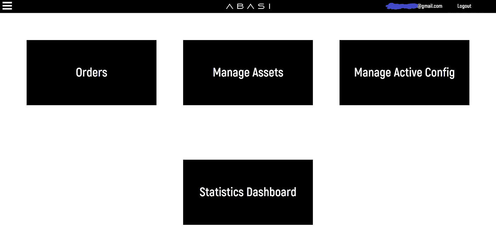
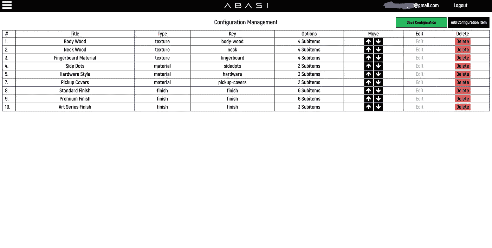
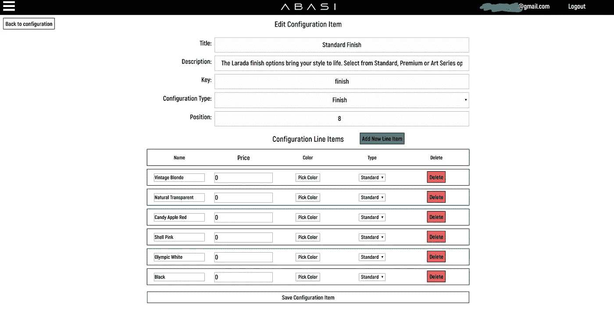

# 我如何为我最喜欢的吉他手制作软件

> 原文：<https://levelup.gitconnected.com/i-made-software-for-my-favorite-guitarist-e9684ebd2269>

如果你在过去十年的任何时候都清醒地出现在吉他和进步音乐的世界里，那么你可能已经知道谁是托辛·阿巴希。他是一个了不起的演奏家，被许多吉他手认为是他二十多岁时接触乐器最好的人之一。托辛最出名的是他的[令人难以置信的技巧](https://www.youtube.com/watch?v=0IdzrjIInpU)，弹奏八弦吉他，将弦乐器的一切提升到一个新的水平。事实上，他深深地打破了乐器的模式，以至于他不得不开始与各种公司/制琴师一起设计新的吉他，以便他的硬件能够跟上他的技术。

你可能不知道的是，2017 年托辛推出了自己的定制吉他公司 [Abasi Guitars](https://abasiguitars.com/) 。作为 Tosin 和他的乐队 [Animals As Leaders](https://www.youtube.com/watch?v=lfKrjZWG09c) 的超级粉丝，我很早就发现了这一点。我在他们的网站上线的那天访问了它，我发现它只是一个占位符页面，有一个简单的登录页面和一个联系表单。作为一名白天的软件工程师和晚上的吉他手，我决定使用这种联系方式。我最近看到了一些工具，它们让吉他定制超越了简单的形式，但是我知道它们仍然没有利用现代网络的全部力量。出于某种原因，他们又回来了。

真的就这么简单。我找到了一张联系表，并使用了它。第二天，我与托辛新公司的首席财务官进行了电话交谈，我向他解释了我对现代网络上吉他定制的设想。我提议使用 WebGL 为用户提供交互式体验，用户可以在吉他上选择他们想要的选项，并实时接收反馈，让他们能够在 3D 中旋转吉他。

在我的想法得到一些令人兴奋的反馈后，我马上开始着手工作。我在空闲时间不停地工作，为有机会向公众、自己和我最喜欢的吉他手证明自己而兴奋。不久我就有了一个使用 React 和三个 js 的工作原型。它并不完美，甚至没有使用正确的模型(在这一点上，他们甚至没有一个艺术家)。不幸的是，当我有任何有形的东西时，这家公司已经消失了。所以我放下了这个项目，继续过了大约一年的生活。

一天，我打开我的 Gmail 收件箱，发现首席财务官又来找我了。他说，他们做出了一些糟糕的商业决策，投资错了人。他们被骗了，这对他们来说是一条艰难的道路。但更重要的是，他们重新站了起来，并准备好回到他们的产品、营销和网站上工作。所以我重新使用了旧的 React 应用程序，继续工作。不过，在 React 世界里的一年时间太长了，所以核心 API 发生了很大的变化，我不得不重写一些东西。没什么大不了的。这次他们船上还有一位艺术家！出色的亚历山大·马克斯(Alexander Marks)为吉他设计了所有的模型和纹理。请前往他的方式为您所有的三维建模需求。

当然，这次我获得了一份付款协议，因为我不想在一个毫无进展的项目上浪费更多的时间。报酬低得惊人，但我认为对我来说，最大的价值来自对场景的接触，我将在这个过程中学习到的各种东西，以及我保留代码的所有权利以便我可以在未来的项目中重用它的事实。所以在软件上。

我知道最终的结果是客户在设计他们的吉他时会有一个愉快的用户体验。我也知道客户会对提供给客户的各种功能、这些功能的定价以及其他变化有不断变化的需求。所以我知道我需要通过配置来做到这一点，允许客户随心所欲地为吉他配置选项/价格/等等。

最初的原型实际上使用了 Shopify API 来执行订单，我在 Shopify 中利用了一个有用的组织技巧，让客户只需通过操纵他们的 Shopify 帐户中的东西就可以完成所有的定制。因此，实际上，吉他的可用选项是通过访问 Shopify API 动态构建的，获得产品列表，并对这些数据做一些奇怪的事情。第一步是创建这个新的配置仪表板，它将用于配置可用选项、设置价格、查看/管理订单，以及查看关于客户如何使用该应用程序的各种统计数据。最后，这些都没有生产出来，但是你可以在下面的截图中看到我努力的结果。

这是作为一个独立的 React 应用程序构建的，它具有快速创建且无需设计者的应用程序的特征。也就是说，它的功能非常强大。我使用 Firebase 作为后端，主要是为了能够快速启动和运行。我计划在某个时候退出，这样我就可以做资产/图形管道，处理/缩小模型，生成用户内容/截图，以及所有其他种类的花哨东西。然而，随着项目的进行，我的精力水平下降了，在某个时候，我意识到我与客户的融合水平永远不会达到我所希望的水平。到项目结束时，我们甚至不再使用 firestore 进行配置，我基本上把我的整个 API 变成了一个嵌入在客户端应用程序中的. json 文件。

你们中的大多数人一定已经准备好了最终应用的演示。这就是它，以及它所有的缺点:Abasi 定制吉他配置器。这个应用程序也嵌入在 Abasi 吉他网站上。

总的来说，我对这个项目的结果相当满意。坐下来挑出任何应用程序的缺陷都很容易，移动体验绝对是糟糕的*，但从多个层面来看，这对我来说都不是一个容易的项目。这是我第一次领导前端应用程序的设计和 UX。我职业生涯的大部分时间都是后端工程师，虽然这些年来我已经为我的全职雇主和客户创建了多个前端应用程序，但我几乎总是有一个有才华的设计师与我一起工作。让我们花一点时间来欣赏我们不同团队中的设计师，以及他们在创建漂亮的软件方面的惊人影响。*

*这也是我第一次与一家小企业合作，他们主要关心的是营销，他们的软件预算基本上是不存在的。在构建应用程序时，我做了一些普通的时间跟踪，在各种迭代之间，我记录了超过 300 个小时。这听起来可能不像一吨，但在我的典型签约率，使这个应用程序远远超过任何其他客户 25，000 美元。这么说吧，预算是…不是那个。我在全职工作的同时也做这个，和我的乐队一起写作和练习音乐，还有一个家庭和其他各种各样的责任。*

*展望未来，我希望将这个平台带得更远。我计划使用 svelte 重写所有组件，构建一个完整的后端，提供最终配置器 UI 的定制，并使用 Rust/WASM 为 WebGL 部分构建一个更好的图形 API。最后，我希望以一种强大的方式进入这个领域，提供可能是 SketchFab 的配置工具集的第一个有竞争力的替代品，重点是移动体验。*

*如果你对此有兴趣，或者有任何问题，请发邮件至 ty@tytr.dev 联系我*

*感谢阅读！*

*使用的技术*

1.  *反应堆*
2.  *三个 j*
3.  *重火力点*
4.  *锈*