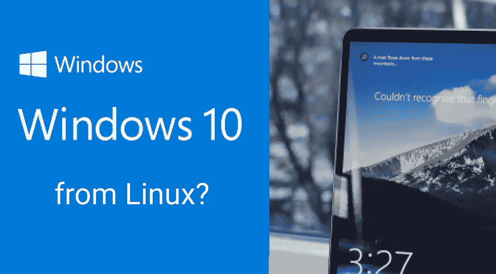
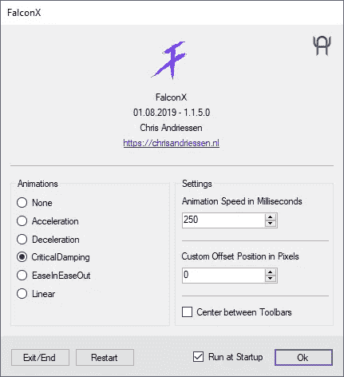
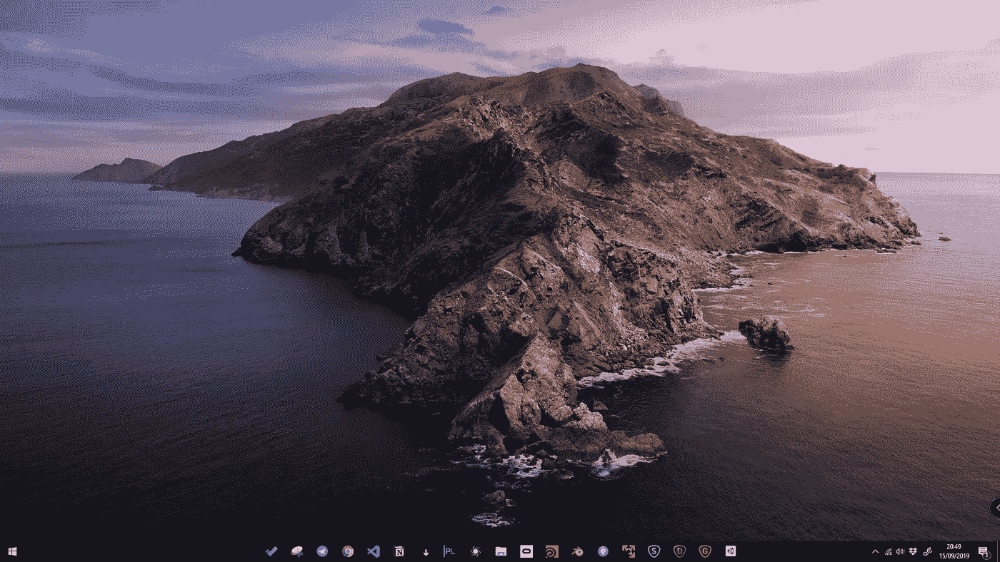

# 我从 Linux 换到了 Windows。以下是我一路走来学到的经验。

> 原文：<https://levelup.gitconnected.com/i-never-thought-of-switching-from-linux-to-windows-3c8767ed878e>

## 如果您有一台功能强大的 PC，并且不想浪费时间配置 Linux 设备，您也应该尝试一下。

你可能已经看过或读过很多文章，比如“**我从 Windows 转到了 Linux** ”，但是今天我们要做相反的事情。

在过去，我得到了类似的效果，但后来由于我必须使用非常 GPU 密集型的软件，这使我开始研究不同的解决方案，以便在 Windows 10 或 Windows 8.1 上给我的日常体验带来一些 Linux 的味道。

# **1。Windows 没有 apt-get，我不会用！一点都不酷！**

[Chocolatey](https://chocolatey.org/install) 是一个很棒的社区项目，为你可能想要使用的大多数 windows 应用程序提供了成千上万的预构建包，它几乎就像 Debian 发行版中的 apt。

我总是按照[这些简单的步骤](https://chocolatey.org/install)在我的新 Windows 系统上安装这个。安装完成后，我在 PowerShell 终端中输入这些[命令](https://gist.github.com/Giorat/818345ebeddd9d2e47d6ec6498b9ba61):

[https://gist . github . com/Giorat/818345 ebeddd 9 D2 e 47 D6 EC 6498 B9 ba 61](https://gist.github.com/Giorat/818345ebeddd9d2e47d6ec6498b9ba61)

你可以在这里:[https://chocolatey.org/packages](https://chocolatey.org/packages)通过搜索找到更多的包裹

然后像用**“apt-get update&&apt-get upgrade”**你只需要键入:

*   **乔科升级全部**

# **2。Windows 里面全是你不想要的应用！**

你完全正确，新的 windows 安装总是充满了预装的应用程序或游戏，但你可以通过在 PowerShell 中键入以下命令来删除它们:

*   get-appx package-all users | Remove-appx package

## **警告！**

通过使用以下命令删除所有 metro 预安装的应用程序，您也将删除 Microsoft store，并且您必须使用以下命令或建议的应用程序将其添加回您的系统。

替代的[应用](https://www.thewindowsclub.com/10appsmanager-windows-10)带有一个用户界面[来重新安装特定的应用](https://www.thewindowsclub.com/10appsmanager-windows-10)。

用于重新安装存储的 Powershell 命令:

1.  [从微软下载这个 PowerShell 脚本](https://www.youtube.com/redirect?redir_token=hz6mpMxT95r-A6xrUaMKvuce8JJ8MTU2ODY1NzQwOEAxNTY4NTcxMDA4&v=l9id9QOa1wc&q=http%3A%2F%2Fdownload.microsoft.com%2Fdownload%2F5%2FF%2F0%2F5F04003A-035E-4A0F-9662-43E32C546F6C%2Freinstall-preinstalledApps.zip&event=video_description)
2.  打开一个 PowerShell 终端，您已经在其中提取了以前的 zip 文件
3.  从[这里](https://gist.github.com/Giorat/ffc37b4807bab35693798abf139de006)输入下面的[命令](https://gist.github.com/Giorat/ffc37b4807bab35693798abf139de006):

[https://gist . github . com/Giorat/ffc 37 b 4807 Bab 35693798 abf 139 de 006](https://gist.github.com/Giorat/ffc37b4807bab35693798abf139de006)

# 3.微软在监视你！

微软有许多方法来跟踪你正在做的事情，以改善你对 Cortana 或其他应用程序的体验，但如果你喜欢禁用所有这些，请前往这个 [repo](https://github.com/jc97/Privacy-for-Windows-10) 和[下载带有各种修复的 zip 文件](https://github.com/jc97/Privacy-for-Windows-10)，[你可以在这里阅读所有将做出的改变](https://github.com/jc97/Privacy-for-Windows-10/blob/master/README.md)。← **警告:**在运行每一个文件**之前，阅读** [**自述**](https://github.com/jc97/Privacy-for-Windows-10/blob/master/README.md) **。**

在这里，您可以下载包含所有 reg 脚本的 [zip 文件。](https://github.com/jc97/Privacy-for-Windows-10/archive/master.zip)

我更喜欢只执行这两个文件:

*   隐私 _ 组 _ 策略 _ 机器.注册
*   隐私 _ 组 _ 策略 _ 用户.注册

# **4。用主机阻止垃圾邮件和广告**

将恶意网站和其他不需要的网站添加到您的 hosts 文件将会阻止您的系统访问网络上的这些位置。这也适用于 MacOS 或 Linux。

您可以在[这里](https://github.com/StevenBlack/hosts/blob/master/readme.md)选择您喜欢的[组合](https://github.com/StevenBlack/hosts/blob/master/readme.md):

*   [https://github.com/StevenBlack/hosts/blob/master/readme.md](https://github.com/StevenBlack/hosts/blob/master/readme.md)

然后将下载主机文件移动到:

*   c:\ Windows \ System32 \ Drivers \ etc \ hosts

[有 UI 的替代应用](http://www.abelhadigital.com/hostsman/)自动替换你的 hosts 文件: [Hostman](http://www.abelhadigital.com/hostsman/) 。

# 5.应用程序栏像在 MacOS 中一样居中！

我不喜欢左边应用程序栏上的图标。

其他人感觉到了这个“问题”，Chris 制作了这个[免费应用](https://chrisandriessen.nl/web/FalconX.html](https://chrisandriessen.nl/web/FalconX.html))来解决这个问题。 [FalconX](https://chrisandriessen.nl/web/FalconX.html) 是正确的应用程序，而且是免费的！

# 纯粹的虚荣:马科斯卡特琳娜壁纸

从这里下载:[https://hd.tudocdn.net/853846](https://hd.tudocdn.net/853846)

# 结论:

Windows 是一个伟大的操作系统。许多应用程序只能使用它，许多 GPU 或驱动程序不能在 Linux 上运行，所以尝试引入 Linux 的一些好东西将有助于您享受更多使用它的体验。

在我个人看来，Chocolatey 是我所拥有的最好的发现，它能够从基于 Linux 或 Debian 的系统中用一个简单的命令如 apt-get 自动更新或安装新软件。此外，从 Cortana 中删除侵入性遥测或不想要的搜索结果将有助于您在日常工作中减少 Windows 噪音！

我希望这些简单的提示对你有所帮助，如果你有更多的提示或需要帮助，请告诉我，我一定会把它们添加到文章的结尾，这样每个人都可以享受你的个人发现。

# **参考资料和资源:**

*   [https://chocolatey.org/install](https://chocolatey.org/install)
*   [https://chocolatey.org/packages](https://chocolatey.org/packages)
*   [https://github.com/jc97/Privacy-for-Windows-10](https://github.com/jc97/Privacy-for-Windows-10)
*   [https://github.com/StevenBlack/hosts/blob/master/readme.md](https://github.com/StevenBlack/hosts/blob/master/readme.md)
*   [http://www.abelhadigital.com/hostsman/](http://www.abelhadigital.com/hostsman/)
*   【https://chrisandriessen.nl/web/FalconX.html 号
*   【https://hd.tudocdn.net/853846 