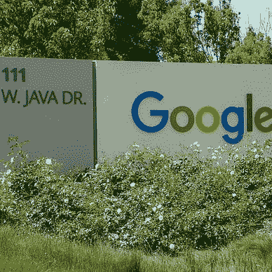

# 我在我的带回家采访项目中放置了 GPL 许可证。

> 原文：<https://levelup.gitconnected.com/i-placed-a-gpl-license-in-my-take-home-interview-project-4946d3ff87bb>

## 现在我有钱了。

Pixabay 在[像素上拍摄的照片](https://www.pexels.com/photo/sign-pen-business-document-48148/)

我申请了这家公司，结果却是个烂摊子。首先，从电话面试到技术面试花了 2 周时间。在那次会议中，“首席开发人员”希望我做这个“20 小时的全栈带回家作业”。整个九英寸……“20 小时”项目最终花了 3 个小时，因为我使用了一个名为 [Copygen](https://github.com/switchupcb/copygen) 的库。这个库允许我基于类型生成一堆代码。Copygen 受 GPL 许可，但它生成的代码不受 GPL 许可。我一解释，他们的脸就亮了:我的劳动是免费游戏。

*除了我把另一个 GPL 许可证放在了家里……*

接下来的采访对象是首席执行官的儿子蒂姆。他是一个刚从大学毕业的人，“因为他有学位，所以什么都知道”，但也会冲我大喊:“你什么意思，'*你的技术是什么？”然后，他继续让我解答 LeetCode 问题，直到我答错了一个。我们经历了整个*盲眼 75* 和更多，直到他意识到我不会失败。*

*第二天我收到了我的拒绝信……*

整整一个月过去了，我才检查我的“带回家的作业”做得怎么样。该公司刚刚经历了一轮融资，这意味着是时候实施我的计划了:我给我能找到的最近的知识产权律师打了电话，解释了我的情况。他在听我讲话时简直是口吐白沫。

> “我们要发财了！”
> 
> *—律师*

律师在一周内准备了这个案子。我发出了停止令。

> “公司，
> 
> 你以为我是来面试加入你们公司的吗？
> 
> 现在是我的公司了。见附件。"

公司和我在民事法庭上达成和解，我拥有 67%多一点的股份，以使 GPL 无效；因为它被用于核心产品。有太多的钱可以赚，因此这将是一个更好的选择相比，使整个产品免费使用。接下来发生了什么？我们生活在其中……我解雇了蒂姆，还让他爸爸每周加班。8 天 PTO。没有育儿假。我赚了很多钱。蒂姆正在努力找工作。

“现在谁是 wagie，嗯？”

[开关 CB](https://switchupcb.medium.com/?source=post_page-----4946d3ff87bb--------------------------------)

## Wagie 灾难

[View list](https://switchupcb.medium.com/list/wagie-woes-878d9af658dc?source=post_page-----4946d3ff87bb--------------------------------)7 stories